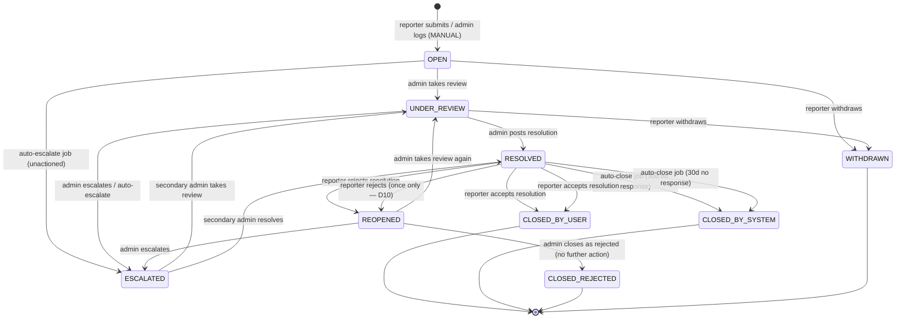
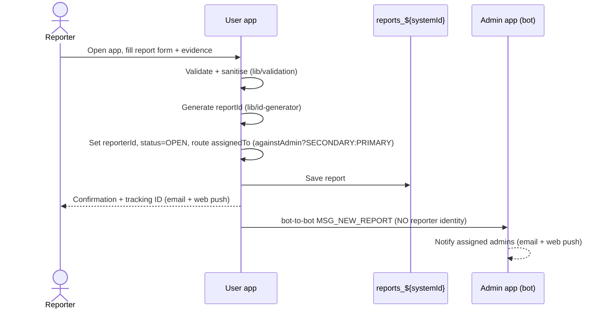
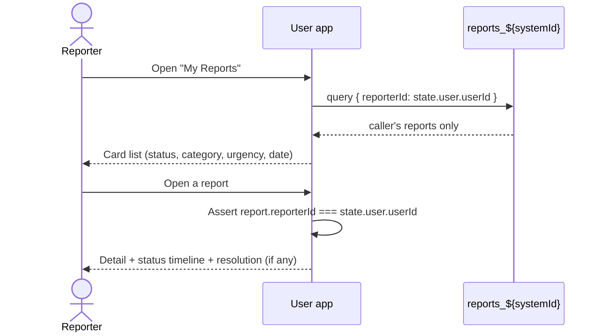
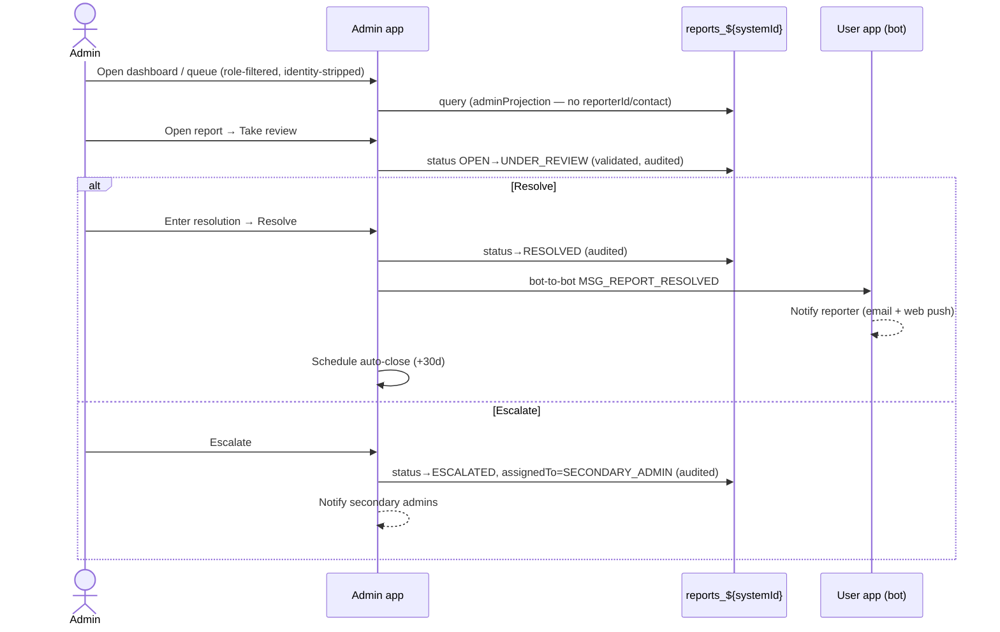
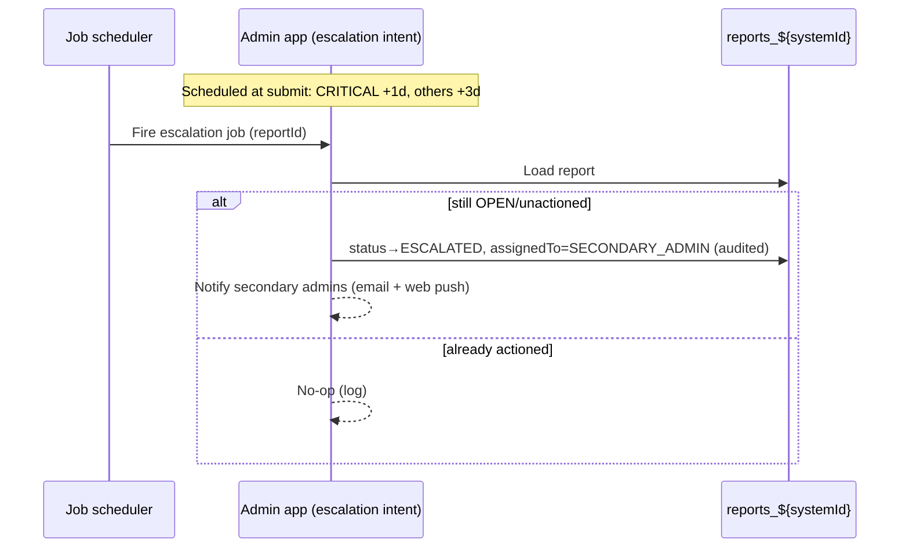
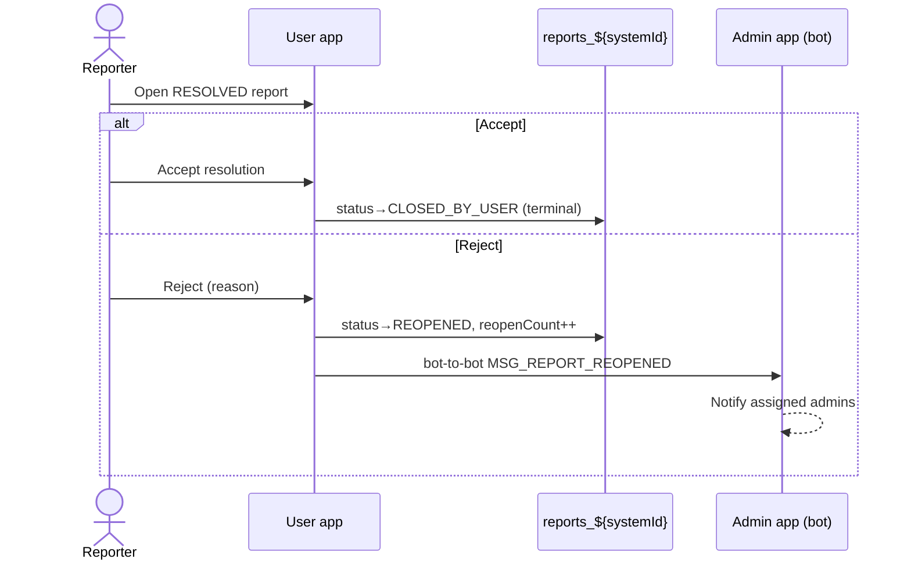
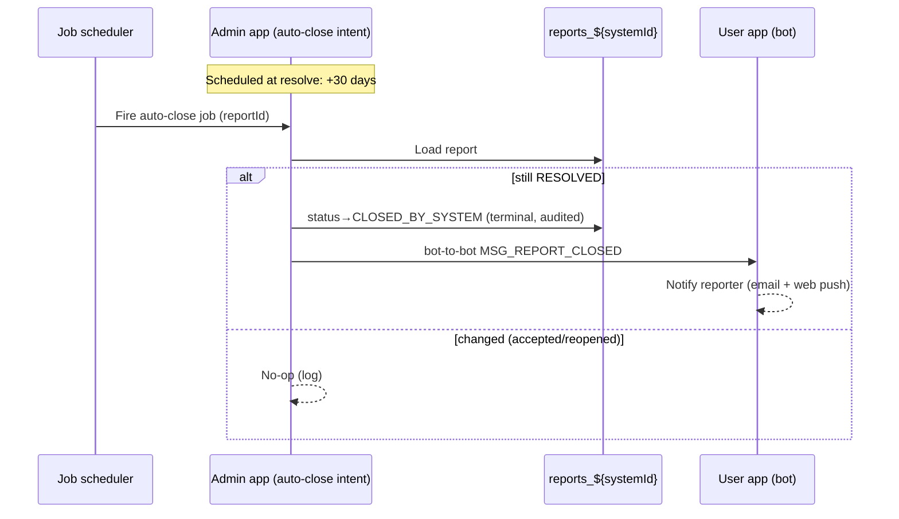
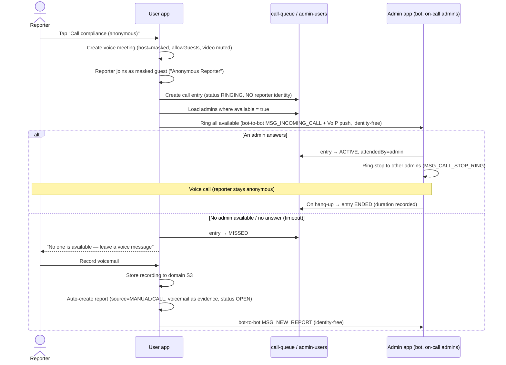

# Anonymous Reporting System — Requirements

> **Status:** Draft v1 (for review) · **Owner:** satya@frontm.com · **Date:** 2026-06-05
> **Platform:** FrontM.ai 5.0 (`@frontmltd/frontmjs#5.0.b9`) · **Shape:** one repo, 2 microapps + shared `/lib`

This document defines **what we are building and why**, before any feature code. The detailed
data schema lives in [`specs/SPEC.md`](specs/SPEC.md); the architecture/skeleton plan lives in
the approved plan file. Read this top-to-bottom — it is the single source of truth for scope.

---

## 1. Problem statement

Organisations (here: a maritime operator with crew across vessels and shore offices) need a
**safe, trusted channel for people to report misconduct** — harassment, safety violations,
fraud/ethics breaches, bullying/retaliation — **without fear of being identified or retaliated
against**. Phone/email/word-of-mouth channels fail because they expose the reporter, lose
reports, and give no visibility into what happened next.

We are building an **Anonymous Reporting System** as two FrontM microapps:

- **User app** — a crew member/employee submits a report **anonymously**, attaches evidence,
  and **tracks its progress** to resolution.
- **Admin app** — authorised compliance staff **triage, investigate, resolve, and escalate**
  reports, with automation (escalation/auto-close) and analytics — **never seeing who reported**.

### Why rebuild (background)
A first version (codename **QuietLine**) exists as **two separate repos** under `AnyonymousApp/`.
It is feature-rich but has first-project problems: **no shared library** (status constants, ID
generator, validators copy-pasted and able to drift), hardcoded magic strings, **client-only
file validation and no input sanitisation** (HTML-injection risk in emails), **anonymity that
relies on the platform rather than code**, inconsistent error handling, and **no tests or
specs**. This rebuild keeps the proven feature set and fixes all of the above, modelled on the
`sailors-cart` 3-microapp monorepo architecture.

> **Clean slate — no code is ported from the old repos.** The QuietLine apps are reference *only
> for understanding the problem and the desired feature set*. We design **new screens, new data
> flow, and new frames**, surfacing issues during the spec phase (below) before writing any code.

> **Spec process — LoG.ai.** This document is the **business brief / intake** for FrontM's LoG.ai
> pipeline (`/log-ai-story` → `/log-ai-process` → `/log-ai-detail` → `/log-ai-tasks`). LoG.ai reads
> this brief and produces the **canonical** engineering specs under `specs/` (`1.story-card.md`,
> `2.brd.md` + `2.frame-graphs/`, `3.field-spec.md` + `3.input-schema.yaml`,
> `4.task-dependency-graph.md`), which the `/frontm-*` generators build from. `specs/SPEC.md` here
> is a supporting data-model appendix to this brief; the LoG.ai Layer-3 field-spec is authoritative.

### Goals
- **G1** — Reporters can submit and track reports with **strong, code-enforced anonymity** from admins.
- **G2** — Admins can triage → investigate → resolve/escalate efficiently with full **auditability**.
- **G3** — **Zero duplication**: all shared logic (statuses, IDs, validation, notifications, the
  reports collection) lives once in `/lib`.
- **G4** — **Security & privacy by default**: validation + sanitisation enforced server-side,
  least-privilege access, no PII leaks.
- **G5** — A clean, **custom UI** (dashboards, tracking, card lists) like `sailors-cart`.
- **G6** — **Verifiable** (via the live FrontM runtime + `mock-data` toggle + `/frontm-review` /
  `/verify`; FrontM does not support unit-test files) and documented.

### Success criteria
- A reporter submits a report, receives a tracking ID + confirmation, and can see status changes
  through to resolution.
- An admin can action the full lifecycle; **no admin-facing surface ever exposes reporter identity**.
- Escalation and auto-close jobs fire correctly; analytics reflect live data.
- Both apps build and lint cleanly from the shared monorepo with no duplicated logic, and pass
  runtime verification of the key flows.

---

## 2. Personas & roles

| Role | Who | Capabilities |
|------|-----|--------------|
| **Reporter** | Internal authenticated crew/employee (has a FrontM account) | Submit a report, attach evidence, track *their own* reports, accept/reject a resolution. |
| **Primary admin** (`PRIMARY_ADMIN`) | Front-line compliance officer | Triage queue, take/resolve/escalate reports, log manual reports, view analytics. |
| **Secondary admin** (`SECONDARY_ADMIN`) | Escalation/senior compliance | Everything Primary does **plus** handles **escalated** reports and **reports made against an admin**. |

**Access rules**
- The **User app** is open to any authenticated user; it only ever shows **the caller's own** reports.
- The **Admin app** is **role-gated** (platform license/role + an in-code access gate). Non-admins
  are refused with a clear message.
- **Reporters** are crew (on any vessel) **and** shore-based staff — any internal authenticated
  employee. **Admins are a central shore-based compliance team**, deliberately *not* on the
  reporter's vessel (anonymity): `PRIMARY_ADMIN` = compliance officer(s), `SECONDARY_ADMIN` =
  senior/escalation (e.g. the Designated Person Ashore). `shipName`/`location` are incident
  **metadata**, not routing keys.
- **Role routing:** a report flagged *against an admin* routes to `SECONDARY_ADMIN`; all others
  start with `PRIMARY_ADMIN`. Escalation moves a report to `SECONDARY_ADMIN`.
- **Routing seam (future-proofing, D17):** routing is resolved in **one** function
  `resolveAssignees(report)` (`lib/access.js`). **v1 = single central team** — it returns the
  role pool (all admins of the target role, `scope = GLOBAL`). It is designed so **scoped routing**
  (per fleet/region/vessel-group) can be added later *additively*: give `admin-users` a populated
  `scope`, add a structured vessel→scope mapping, and extend the resolver — the queue, notifications,
  and report schema stay as-is. The queue + bot-to-bot notifications always call the resolver, never
  a hardcoded role query.

---

## 3. Anonymity & privacy model (core design decision)

**Decision:** **Pseudonymous, with reporter identity code-enforced-hidden from admins.**
Reporters are authenticated internal users; this is *not* a public/external portal.

- Each report stores the reporter's FrontM `userId` in a single field (`reporterId`) **solely**
  to (a) scope "My Reports" to its owner and (b) deliver reporter notifications. Contact details
  the reporter *optionally* provides are stored separately.
- **`reporterId` and any reporter contact info are NEVER exposed to the Admin app** — enforced in
  code, not assumed from the platform:
  - Admin queries/projections **exclude** `reporterId`/contact fields (a shared `adminProjection`
    in `/lib` defines exactly which fields admins may read).
  - Bot-to-bot messages to the admin bot and admin notification emails **omit** reporter identity.
  - Admin display/sections have **no field bound** to `reporterId`/contact.
- **Reporter-side ownership is code-enforced:** the User app verifies, on every load/action, that
  a report's `reporterId === state.user.userId` before showing or mutating it. Lookup-by-ID does
  **not** bypass this (no cross-user data exposure).
- **Single admin-read gateway (enforcement, not convention):** `adminProjection` must be applied
  at **one chokepoint** — all admin reads (queue, detail/manage `loadDocument`, dashboard/analytics
  aggregation, jobs) go through a shared `loadReportsForAdmin()` / `loadReportForAdmin()` helper in
  `/lib` that *always* applies the projection. No admin code path queries the collection directly.
  (See edge-case ER-A3.)
- **Audit must not leak the reporter.** `audit: true` / `addAuditFields()` can stamp
  `createdBy`/`modifiedBy` with the **submitting reporter** on the create path. We MUST verify
  FrontM's behaviour and ensure `createdBy`/`modifiedBy` for the reporter-create path are either
  not populated with reporter identity or are excluded from `adminProjection` and every admin
  surface. Audit otherwise records only **admin** actions. (See ER-A2.)
- **Self-identification guard (content, not just keys).** On small crews, free-text + ship +
  date + accused can de-anonymise even with `reporterId` stripped. The User app shows a
  **pre-submit anonymity warning** and a **"what the admin will see"** preview, and guidance not
  to include self-identifying detail. (See ER-A1.)
- **Conflict-of-interest recusal.** A report made about a specific admin must be **invisible to
  that admin** and routed away from them — including when the accused is the secondary/escalation
  admin. Exact recusal rules are an open question (OQ-9). (See ER-A4.)
- **Evidence files** are stored in domain-scoped S3 with metadata limited to report ID + time —
  **never reporter email/userId** — served to admins via short-lived signed URLs.
- **Anonymous calling (see §8 "Calling"):** when a reporter places a voice call, the reporter
  joins the call as a **masked guest** (display name "Anonymous Reporter", a throwaway guest
  email), the meeting **host is a masked/system account** (never `state.user.userEmail`), and the
  ring/VoIP/bot-to-bot payloads carry **no `callerName`/`callerId`/email** — only an opaque call
  reference. Admins hear/handle the caller without any identifying information. (This explicitly
  fixes the default behaviour seen in the reference call-centre app, which exposes caller identity.)

**Accepted residual risk (documented):** because `reporterId` exists in the DB, a privileged
direct-DB actor could in principle de-anonymize. This is acceptable for an *internal* tool and is
the cost of enabling tracking + proactive notifications. (A future "fully anonymous tracking-code"
mode is noted in §13 Out of scope.)

---

## 4. Architecture overview

```
anonymous-reporting-system/            # one repo
├── lib/                               # shared building blocks (single source of truth)
│   ├── constants.js                   # statuses, categories, urgency, roles, MSG_* types, regexes, keys
│   ├── ticket-status.js               # status enum + metadata + allowed-transition map
│   ├── id-generator.js                # report-ID generation
│   ├── validation.js                  # email/phone/file validators + HTML sanitiser
│   ├── notifications.js               # email + web-push + bot-to-bot helpers
│   ├── access.js                      # role resolution + adminProjection (identity stripping)
│   ├── calling.js                     # anonymous voice-call helpers (VideoCall + VoIP, masked)
│   ├── utils/
│   │   ├── format.js                  #   HTML escaping + generic card/HTML builders
│   │   ├── platform.js                #   state.client detection + per-screen renderer dispatch
│   │   └── theme.js                   #   shared theme tokens (used by web + mobile renderers)
│   └── collections/                   # shared Docs + Collections (shared: true)
│       ├── reports.js                 #   reports collection (audit: true)
│       ├── call-queue.js              #   anonymous call entries (identity-free)
│       └── admin-users.js             #   admin registry: role + availability (D3)
├── anonymous-user/                    # User microapp  (its own bot)
└── anonymous-admin/                   # Admin microapp (its own bot)
```

- **Shared data:** one MongoDB collection `reports_${systemId}` (`shared: true`), read/written by
  both apps. Defined **once** in `lib/collections/reports.js`; both apps side-effect-import it.
- **Cross-app comms:** **bot-to-bot messaging** (`state.notification.sendMessageToUserInBot`) for
  events (new report → admins; status/resolution change → reporter), using `MSG_*` types from
  `lib/constants.js`. Identity is never in these payloads.
- **Automation:** `state.jobScheduler` schedules **auto-escalation** (unactioned reports) and
  **auto-close** (resolved-but-unacknowledged) jobs, handled by intents in the Admin app.
- **Notifications:** `state.notification.sendEmail` + `sendWebPush` to admins (new/escalated) and
  reporters (received/status/resolved).
- **Custom UI:** Display Docs + Sections + `CardsSet` HTML cards (`section.onResponse` assembles
  HTML from a `state.setField` stash), mirroring `sailors-cart/src/sections/display/`. Forms use
  Form Docs + Fields. Shared card/HTML helpers live in `lib/utils/format.js`. Screens are
  **mobile + web** with **separate per-platform renderers** dispatched once via `state.client`
  (`lib/utils/platform.js`), sharing theme tokens (`lib/utils/theme.js`) — see §9.1.
- **Anonymous calling:** the FrontM **`VideoCall`** class (Daily.co WebRTC, **voice-only**) +
  **VoIP push** + bot-to-bot ring messages. Modelled on the existing call-centre apps
  (`frontm apps/healthMarinerCommonLib` queue routing + `Vikand-Clinician-Portal`). Two shared
  collections support it: **`call-queue`** (call entries + lifecycle) and **`admin-users`**
  (the admin registry — role + on-call availability, D3). Calling helpers live in `lib/calling.js`.

> **Note on framework idioms:** code follows the **actual `sailors-cart` conventions** (e.g.
> `new Intent(...)`, `new Doc(...)`, side-effect imports in `main.js`, `loadCollectionWithQuery`,
> `section.onResponse` HTML stashing). Where doc summaries differ from sailors-cart, sailors-cart
> (the working reference) wins.

---

## 5. Data model (summary)

Primary entity: **Report** (collection `reports_${systemId}`, `shared: true`). Full field list,
types, and constraints are in [`specs/SPEC.md`](specs/SPEC.md). Key groups:

- **Identity & system:** `reportId` (PK, e.g. `RPT-AB12CD34XY`), `status`, `severity`, `source`
  (`REPORTER` | `MANUAL` | `CALL`), `assignedTo` (`PRIMARY_ADMIN` | `SECONDARY_ADMIN`),
  `createdOn`, `reopenCount`.

Two further shared collections support **anonymous calling** (full detail in `specs/SPEC.md`):
`call-queue` (call entries: `callRef` PK, `status` `RINGING|ACTIVE|ENDED|MISSED`, `meetingId`,
`attendedBy`, timestamps, duration — **identity-free**) and `admin-users` (admin registry:
`userId`, `email`, `role`, `available|busy|unavailable` availability — D3).
- **Reporter-private (never shown to admin):** `reporterId`, `contactMethod`, `contactValue`.
- **Reporter-entered content:** `category`, `urgency`, `shipName`, `location`, `incidentDate`,
  `description`, `accusedParty`, `againstAdmin` (routes to Secondary).
- **Evidence:** up to N file references (domain-scoped S3 keys) + `evidenceNotes`.
- **Admin-entered:** `resolution`, status transitions; plus platform **audit fields**
  (`createdBy`/`modifiedBy`/timestamps via `audit: true`) tracking **admin** actions only.

**Enumerations** (defined once in `lib/constants.js`):
- **Categories:** Harassment/abuse · Safety violation · Fraud/ethics breach · Bullying/retaliation · Other.
- **Urgency:** Immediate risk · High · Medium · Low.
- **Severity (admin/system):** LOW · MEDIUM · HIGH · CRITICAL.
- **Location:** Onboard vessel · Office/shore base · Remote/digital · Other.
- **Contact method:** None · Email · Phone · Cabin number.

---

## 6. Status state machine

Every transition has an actor and is validated against an allowed-transition map in
`lib/ticket-status.js` (no free-form status writes).



**Terminal states:** `CLOSED_BY_USER`, `CLOSED_BY_SYSTEM`, `CLOSED_REJECTED`, `WITHDRAWN`.
Each status carries display **metadata** (label, tone/colour, allowed actions per role) in
`lib/ticket-status.js` so both apps render and gate consistently.

**State-machine resilience (worst-flow handling):**
- **Optimistic concurrency** — every transition re-reads the report and validates the move against
  its **current** DB status before writing; a stale write (status already changed by another admin
  or a job) is rejected and surfaced, not silently overwritten. A `version`/`updatedOn` guard backs
  this (ER-B5).
- **Reopen cap** — `RESOLVED → REOPENED` is allowed **once** (`reopenCount` 0→1, D10); after that
  the reporter can no longer reject and the admin may force-close to `CLOSED_REJECTED` (prevents an
  un-closeable report / reject-loop griefing, ER-B6).
- **Escalation is not a dead-end** — if an `ESCALATED` report is unactioned within an SLA, it raises
  an alert/digest rather than rotting (ER-B7, OQ-11). `REOPENED` reports can also be escalated.
- **Withdraw** — the reporter may withdraw a non-terminal report (`OPEN`/`UNDER_REVIEW`) → terminal
  `WITHDRAWN` (ER-C11). **Amend** (adding info after submit) is a separate capability (ER-C11), not
  a status.
- **Manual reports** (`source=MANUAL`/`CALL`, no `reporterId`) skip reporter-driven transitions
  (accept/reject/withdraw) and reporter notifications.

---

## 7. End-to-end flows

### 7.1 Report submission


### 7.2 Tracking ("My Reports" + detail)


### 7.3 Admin triage → resolve / escalate


### 7.4 Auto-escalation job (unactioned reports)


### 7.5 Resolution accept / reject + reopen loop


### 7.6 Auto-close job (resolved, unacknowledged)


### 7.7 Manual logging (phone/in-person)
Admin records a report received off-platform via a Form Doc → saved with `source=MANUAL`,
`reporterId` empty (no notifications/tracking owner), status `OPEN`, routed normally. Appears in
the queue like any report.

### 7.8 Anonymous voice call (with voicemail fallback)


---

## 8. Functional requirements

Built **end-to-end**; the "Build order" tags (B1/B2/B3) are sequencing only, not separate releases.

### Shared `/lib` (B1 — foundation)
- **FR-L1** Single status module: enum + metadata + allowed-transition map; both apps gate on it.
- **FR-L2** Single report-ID generator (collision-resistant, prefixed `RPT-`).
- **FR-L3** Validators (email, phone, cabin) + **file validator** (extension **and** type + size
  limits) + **HTML sanitiser** for all user text used in emails/cards.
- **FR-L4** Notification helpers: `sendReporterEmail/WebPush`, `sendAdminEmail/WebPush`, and
  bot-to-bot `send(MSG_TYPE, payload, ...)` — payloads identity-free.
- **FR-L5** Access helpers: role resolution + `adminProjection` (the only field set admins read).
- **FR-L6** Shared `reports` Doc + Collection (`shared: true`, `audit: true`).
- **FR-L7** Custom-UI helpers in `utils/format.js` (HTML escape + card builders).

### User app (B2)
- **FR-U1 Submit report** — Form Doc: category, urgency, shipName, location, incidentDate
  (not future), description, accusedParty (optional), `againstAdmin` toggle, optional contact
  method+value (validated per method). Server-side validate + sanitise on save.
- **FR-U2 Evidence upload** — up to N files; validated by type + size; stored to domain S3; notes field.
- **FR-U3 Confirmation** — on submit: show tracking ID; email + web push to reporter; bot-to-bot
  `MSG_NEW_REPORT` to admins.
- **FR-U4 My Reports** — custom card list of the caller's reports (status, category, urgency,
  date), scoped strictly to `reporterId === userId`; search/filter by status/category.
- **FR-U5 Report detail + status timeline** — custom view with status timeline and resolution;
  ownership asserted on load.
- **FR-U6 Accept/Reject resolution** — on `RESOLVED`: accept → `CLOSED_BY_USER`; reject (reason)
  → `REOPENED`, notify admins.
- **FR-U7 Home/landing** — custom intro/landing explaining anonymity + entry actions.
- **FR-U8 Reporter notifications** — email + web push on received, status change, resolved, closed.

### Admin app (B2/B3)
- **FR-A1 Access gate** — license/role check + in-code gate driven by the seeded `admin-users`
  registry (D3); refuse non-admins clearly.
- **FR-A2 Dashboard** — custom stat cards (counts by status/severity/age) from live aggregation.
- **FR-A3 Report queue** — custom card list, **role-filtered** (Primary: OPEN/UNDER_REVIEW;
  Secondary: ESCALATED + against-admin), **identity-stripped** via `adminProjection`; search/filter/paginate.
- **FR-A4 Report detail / manage** — read-only reporter content + evidence (signed URLs) +
  editable resolution + status actions (transition-validated, audited). **No reporter-identity field.**
- **FR-A5 Status transitions** — take review, resolve, escalate, close-rejected; each validated +
  audited; fires the right bot-to-bot event + notifications + (on resolve) auto-close scheduling.
- **FR-A6 Manual logging** — Form Doc to log phone/in-person reports (`source=MANUAL`).
- **FR-A7 Auto-escalation job** — scheduled at submit (CRITICAL +1d, others +3d); escalates if unactioned.
- **FR-A8 Auto-close job** — scheduled at resolve (+30d); closes if still unacknowledged; notifies reporter.
- **FR-A9 Analytics** — **custom-built HTML** stat cards (counts by status/severity/age) derived
  from the reports collection, with small-cell suppression. **No MongoDB Atlas Charts embed** (D4).
- **FR-A10 Admin notifications** — email + web push on new report (assigned) and on escalation.

### Anonymous calling (B3) — shared across both apps
- **FR-C1 Initiate anonymous call** — User app action "Call compliance (anonymous)": creates a
  **voice-only** Daily.co meeting (`instantJoin`, `allowGuests`, video muted, **masked host**),
  the reporter joins as a **masked guest**, and a `call-queue` entry is created with **no reporter
  identity** (status `RINGING`).
- **FR-C2 Admin availability** — Admin app toggle to set on-call status
  (`available`/`busy`/`unavailable`) stored in `admin-users`. Only `available` admins are rung.
- **FR-C3 Ring available admins** — ring every `available` admin via bot-to-bot
  `MSG_INCOMING_CALL` + **VoIP push**, all payloads **identity-free** (opaque call ref only).
- **FR-C4 Answer / ring-stop** — first admin to answer sets the entry `ACTIVE` (`attendedBy`),
  and a `MSG_CALL_STOP_RING` is sent to the other admins to stop ringing.
- **FR-C5 No-answer → voicemail** — on no available admin / timeout, entry → `MISSED`; prompt the
  reporter to **record a voice message**, store it to domain S3, and **auto-create a report**
  (`source=CALL`) with the voicemail attached as evidence (status `OPEN`, routed normally) →
  `MSG_NEW_REPORT` to admins. Nothing is lost.
- **FR-C6 Call lifecycle recording** — record call entry states (`RINGING → ACTIVE → ENDED |
  MISSED`) with timestamps + duration; identity-free. Hang-up sets `ENDED`.
- **FR-C7 Identity masking (enforced)** — masked `hostUserEmail`, masked `guestEmail`, generic
  ring message, and stripped `callerName`/`callerId`/email in every call payload (per §3).

---

## 9. Custom UI screens (sailors-cart style)

Read-only/presentational screens = **Display Doc + Section + `CardsSet` (HTML cards)**, assembled
in `section.onResponse` from a `state.setField` stash. Editable screens = **Form Doc + Fields**.
Shared HTML/card builders + escaping in `lib/utils/format.js`.

| App | Screen | Type |
|-----|--------|------|
| User | Home/landing | Display (cards + action buttons → intents) |
| User | Submit report | Form Doc (fields + evidence upload) |
| User | My Reports | Display (card list) + search/filter |
| User | Report detail + status timeline | Display (cards; timeline as HTML) |
| User | Call compliance (anonymous) + voicemail fallback | Action button → VideoCall; voicemail record UI |
| Admin | Dashboard (stat cards) | Display (cards from aggregation) |
| Admin | Report queue | Display (card list) + filters/pagination, identity-stripped |
| Admin | Report detail / manage | Form Doc (admin fields) + read-only content + evidence links |
| Admin | Manual log | Form Doc |
| Admin | On-call availability toggle + incoming-call ring | Buttons/Display + VideoCall ring UI |
| Admin | Analytics | Display (custom HTML stat cards; no Atlas Charts — D4) |

Card action buttons use `data-action="intent"` on `readOnly` HTML cards; intents reload their own
data (independent execution context).

### 9.1 Platform-adaptive UI (mobile **and** web — separate screen UIs, not inline conditionals)
Both apps run on **mobile and web**. Same functionality, flows, and **theme**, but **distinct,
purpose-built UI/UX per platform** — we do **not** scatter `isMobile() ? … : …` ternaries through
each screen (the sailors-buyer approach). Instead:

- **Detect once** via `state.client` against `ALL_CONSTANTS.CLIENTS.MOBILECLIENT|WEBCLIENT`
  (constants, never magic strings), wrapped in `lib/utils/platform.js`
  (`isMobile()`, `isWeb()`, `renderForPlatform(data, { web, mobile })`).
- **One dispatch point per screen.** Each custom screen is a folder under `src/sections/display/<screen>/`:
  - `index.js` — the `Section` + `CardsSet`; its `onResponse` reads the **shared prepared data**
    from the `state.setField` stash and calls `renderForPlatform(data, { web: renderWeb, mobile: renderMobile })`. **No layout branching here beyond the single dispatch.**
  - `web.js` — `renderWeb(data)` → full web markup (multi-column, hover, denser tables).
  - `mobile.js` — `renderMobile(data)` → full mobile markup (single-column, large tap targets, stacked).
- **Shared, not duplicated:** data loading + business logic live in the **frame** (one code path
  for both platforms); **theme tokens** (colours, spacing, fonts, status tones) live once in
  `lib/utils/theme.js` and are consumed by *both* renderers, so the look stays consistent while
  the layout differs. `escapeHtml` + generic builders stay in `lib/utils/format.js`.
- Platform may also tune non-UI config (collection page size, columns) via the same `platform.js`
  helpers — but **screen markup is always two explicit renderers**, never a tangled conditional.

> Rationale: separate renderers keep each platform's UX clean and independently evolvable, avoid
> the "dual-mode HTML in one function" tangle, and still guarantee shared flows + theme.

---

## 10. Non-functional requirements

- **NFR-1 Anonymity (code-enforced)** — per §3: `reporterId`/contact never reach any admin
  surface; reporter ownership asserted on every read/mutate; identity-free bot-to-bot + email.
- **NFR-2 Security** — **all** user input sanitised before use in emails/HTML cards (no
  injection); file validation by **type + size** server-side; least-privilege admin access;
  short-lived signed URLs for evidence; no secrets/PII in logs or error messages.
- **NFR-3 Auditability** — `audit: true` on the reports Doc; every admin status/resolution change
  tracked (who/when/what). Reporter actions (accept/reject) recorded without identity.
- **NFR-4 Reliability / error handling** — no silent failures; validation errors via
  `addErrorToStack` + friendly `onError`; system errors logged via `D.log`, generic message to
  user; notification/job failures are best-effort but logged.
- **NFR-5 Performance** — paginated queries with limits; dashboard via aggregation; signed URLs
  generated before `sendResponse`.
- **NFR-6 Maintainability** — zero duplication (shared logic only in `/lib`); small focused
  modules; consistent kebab-case files + camelCase symbols; ESLint/Prettier clean (shared config).
- **NFR-7 Verifiability** — FrontM does **not** support unit-test files; correctness is verified
  on the **live runtime**. Keep `/lib` helpers (status transitions, ID gen, validators, sanitiser,
  access projection) **pure and self-contained** so they are easy to reason about and exercise via
  a `mock-data` toggle; verify flows with `/frontm-review` + `/verify` and `npm run build`.
- **NFR-8 Consistency** — both apps consume the same constants/status/validation so behaviour
  cannot drift.
- **NFR-9 Cross-platform (mobile + web)** — every screen renders on both `MOBILECLIENT` and
  `WEBCLIENT` with platform-tailored UI via the **separate-renderer** pattern (§9.1): one
  `state.client` dispatch per screen, distinct `web.js`/`mobile.js` renderers, shared
  data/flows/theme. No scattered inline platform conditionals; no magic-string client checks.

---

## 11. Cross-app contracts (bot-to-bot message types)

Defined once in `lib/constants.js`. **No payload includes reporter identity.**

| Type | Direction | Payload (identity-free) | Receiver action |
|------|-----------|-------------------------|-----------------|
| `MSG_NEW_REPORT` | User → Admin | reportId, category, urgency, severity, assignedTo, createdOn | Notify assigned admins; schedule auto-escalation |
| `MSG_REPORT_REOPENED` | User → Admin | reportId, reopenCount, rejectReason | Notify assigned admins |
| `MSG_REPORT_RESOLVED` | Admin → User | reportId, resolvedOn | Notify reporter |
| `MSG_REPORT_STATUS_CHANGED` | Admin → User | reportId, newStatus | Notify reporter |
| `MSG_REPORT_CLOSED` | Admin → User | reportId, closeType | Notify reporter |
| `MSG_INCOMING_CALL` | User → Admin | callRef, meetingId (identity-free) | Ring available admins (VoIP) |
| `MSG_CALL_STOP_RING` | Admin → Admin | callRef, meetingId | Stop ringing the other admins |

### Notifications matrix
| Event | Reporter (email+push) | Admin (email+push) |
|-------|:---:|:---:|
| Report received | ✅ | ✅ (assigned) |
| Escalated | — | ✅ (secondary) |
| Status changed | ✅ | — |
| Resolved | ✅ | — |
| Reopened | — | ✅ (assigned) |
| Auto-closed | ✅ | — |
| Incoming anonymous call | — | ✅ (available admins, VoIP push) |

---

## 12. Build order (internal sequencing only — single end-to-end deliverable)
1. **B1 — Foundation:** `/lib` (constants, status, id-generator, validation, access/projection,
   notifications, reports collection, format helpers), kept pure for easy runtime verification.
2. **B2 — Core apps:** User (submit, evidence, my-reports, detail, accept/reject, notifications) +
   Admin (gate, queue, detail/manage, transitions, manual log, admin notifications) + bot-to-bot.
3. **B3 — Automation, analytics & calling:** auto-escalation + auto-close jobs, dashboard,
   analytics, and the anonymous voice-calling feature (call-queue + admin-users + voicemail).

---

## 13. Out of scope (v1)
- Fully-anonymous **tracking-code** mode (no account link) — noted as a future option.
- **Video** calling (v1 calling is voice-only for anonymity); reporter-selectable video is a future option.
- External/public (non-authenticated) reporters.
- In-app reporter↔admin two-way messaging/chat on a report.
- Multi-language localisation; multi-org/multi-domain federation.
- Native attachments preview/transcoding beyond download links.

## 14. Edge cases, resilience & worst-flow handling

Findings from an adversarial review (developer + real end-user lens). Each is a build-phase
requirement; genuine business-rule choices are deferred to §15 Open Questions (OQ-9…OQ-16).

### Anonymity hardening
- **ER-A1 Self-identification guard** — pre-submit anonymity warning + a "what the admin will see"
  preview; guidance to avoid self-identifying detail. (Content can de-anonymise on small crews even
  with keys stripped.)
- **ER-A2 Audit createdBy leak** — verify/handle `audit: true` stamping reporter identity into
  `createdBy`/`modifiedBy` on the create path (see §3).
- **ER-A3 Single admin-read gateway** — one `loadReportsForAdmin()` chokepoint that always applies
  `adminProjection`; no direct admin queries (see §3).
- **ER-A4 Conflict-of-interest recusal** — a report about a specific admin is hidden from that admin
  and routed away, including when the accused is the secondary admin (rules: OQ-9).
- **ER-A5 No call recording by default** — voice-only "anonymous" calls must not be recorded by the
  admin (recording captures identifying voice); recording stays off unless a future, consented design.
- **ER-A6 Dashboard small-cell suppression** — suppress/aggregate counts that could de-anonymise on
  tiny populations (e.g. per-ship counts < threshold).

### Concurrency & integrity
- **ER-B5 Optimistic concurrency** — re-read + validate transition against current DB status before
  any status/resolution write; reject stale writes (two admins, or admin-vs-job). `version`/`updatedOn` guard.
- **ER-B6 Reopen cap** — bound `reopenCount` (OQ-10) so a report can always reach a terminal state.
- **ER-B7 No-admin / SLA backstop** — if no admin is configured/available, or an `OPEN`/`ESCALATED`
  report breaches an SLA, raise an alert/digest so nothing rots unseen (times: OQ-11).
- **ER-B8 Idempotent jobs** — auto-escalate/auto-close jobs are guarded by current status and a
  job-id key so a stale or duplicate fire is a safe no-op (no double-escalate/close/notify).
- **ER-B9 Submission idempotency + ID collision** — debounce double-submit; retry `reportId`
  generation on unique-index violation.

### Evidence, calling & connectivity
- **ER-C10 Evidence atomicity + safety** — handle partial upload/save (no orphaned S3 objects or
  saved-without-evidence); validate type+size server-side; note malware risk on admin download (OQ-13).
- **ER-C11 Withdraw & amend** — reporter can withdraw a non-terminal report (`→ WITHDRAWN`) and
  amend/append information after submit (avoids duplicate reports).
- **ER-C12 Call lifecycle holes** — handle reporter-hangs-up-before-answer (`RINGING → ABANDONED`),
  network drop mid-call (timeout `ACTIVE → ENDED`), ring timeout (OQ-7), and **concurrent callers**
  (multiple reporters ringing at once — per-call routing/busy handling, OQ-12).
- **ER-C13 Connectivity / drafts** — maritime links are slow/intermittent: autosave the submission
  form as a **draft**, support resumable/limited uploads, and degrade gracefully offline (OQ-14).

### Lifecycle, UX & compliance
- **ER-D14 Data retention & erasure** — define retention for reports/evidence/voicemails and a
  GDPR-style erasure + case-export path; ensure backups' identity handling is covered (policy: OQ-15).
- **ER-D15 Notification resilience** — push/email are best-effort; provide an admin **digest/queue
  fallback** so a failed notification never means an unseen report.
- **ER-D16 Trust & access UX** — explicit reassurance about anonymity on a company device; signed-URL
  re-fetch when an evidence link expires; an admin who is also a reporter must not action their own
  report (ties to ER-A4).

---

## 15. Resolved decisions

Decisions confirmed by the PM (2026-06-05). These are now binding requirements; the input to the
LoG.ai pipeline.

- **D1 (OQ-1) Evidence limits** — up to **5 files, 25 MB each**; allow images, PDF, doc/docx,
  audio, video, text.
- **D2 (OQ-2) Timing** — auto-escalate **CRITICAL +1 day**, others **+3 days**; auto-close
  resolved reports **+30 days**.
- **D3 (OQ-3) Admin registry** — a seeded shared **`admin-users`** collection holds each admin's
  `userId`, `email`, **role** (`PRIMARY`/`SECONDARY`) and **availability** — the single source for
  access gating, routing, recusal, and call ringing. (Consolidates the earlier separate
  `admin-availability` concept.)
- **D4 (OQ-4) Analytics** — **custom-built HTML** stat cards only; **no MongoDB Atlas Charts**
  embed. Counts are derived from the reports collection and rendered as our own HTML (with
  small-cell suppression, ER-A6).
- **D5 (OQ-5) Names/deploy** — app/bot names, domain, systemId, botIds **decided at deploy time**;
  `deployment.config.json` left with placeholders until then.
- **D6 (OQ-6) Severity** — reporter **urgency → initial severity**; **admin can override** in triage.
- **D7 (OQ-7) Call timing** — **30 s** ring timeout before voicemail; voicemail capped **3 min / 25 MB**.
- **D8 (OQ-8) Call host** — a **dedicated system/bot account** hosts every call; reporter joins as a
  per-call throwaway masked guest.
- **D9 (OQ-9) Recusal** — a report flagged *against an admin* routes to **`SECONDARY` only** (the
  simple rule). ⚠️ **Residual gap (accepted for v1):** a report *about the secondary admin* is still
  visible to them — revisit when a designated alternate/ombudsperson exists. Tracked as ER-A4.
- **D10 (OQ-10) Reopen cap** — **1 reopen only**: a reporter may reject a resolution once
  (`reopenCount` 0→1); after that they cannot reject, and the admin may force-close to `CLOSED_REJECTED`.
- **D11 (OQ-11) SLA backstop** — unactioned **OPEN 24 h** / **ESCALATED 24 h** → **digest to all admins**.
- **D12 (OQ-12) Call routing** — **ring all available** admins; the admin who answers is marked
  **`busy`** and skipped for other concurrent calls; remaining callers ring the rest, else voicemail.
- **D13 (OQ-13) Evidence safety** — **type + size allow-list** for v1; malware scanning is future;
  admin sees a "download at your own risk" note.
- **D14 (OQ-14) Connectivity** — **draft autosave** of the submission form in v1 (survives
  crashes/navigation) + limited/resumable uploads; **full offline submission deferred**.
- **D15 (OQ-15) Retention & export** — **7-year retention** for reports/evidence/voicemails and
  **CSV/PDF case export** ship in v1. **Admin-initiated erasure is deferred to post-v1** (Layer-2 PM
  decision): it is irreversible and pending legal sign-off (tracked: ER-D14, BRD §12). Confirm
  retention against the org's legal policy before go-live.
- **D16 (OQ-16) Withdraw/amend** — reporter may **withdraw** while `OPEN`/`UNDER_REVIEW` (→ `WITHDRAWN`),
  and **amend/append** information in any non-terminal state (appended + audited).
- **D17 Routing scope** — **v1 = single central compliance team** (all reports → the role pool).
  Reporters = crew + shore staff. Routing is encapsulated in `resolveAssignees(report)` and
  `admin-users` carries an optional `scope` (default `GLOBAL`) so **fleet/region-scoped routing**
  can be added later additively (populate `scope` + add a structured vessel→scope mapping + extend
  the resolver) — no report-schema or queue rewrite. Per-vessel admins are explicitly rejected
  (anonymity).
