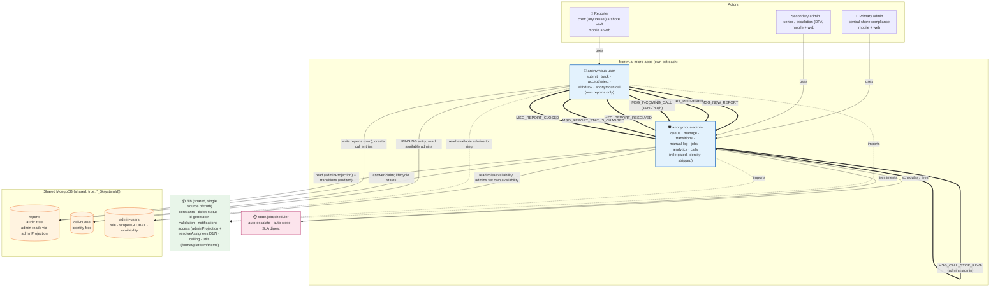

# App Architecture Diagram — Anonymous Reporting System

> LoG.ai Layer 1. Two micro-apps (each its own bot, mobile + web), one shared data cluster, and a
> shared `/lib`. Cross-app arrows are bot-to-bot `MSG_*` contracts — **all reporter-identity-free**.
> Source: [`../REQUIREMENTS.md`](../REQUIREMENTS.md) §4/§11, decisions D1–D17.

## Notes

- **Role-based visibility, not a third app.** Primary and Secondary admin share `anonymous-admin`;
  the queue is role-filtered (Primary: OPEN/UNDER_REVIEW; Secondary: ESCALATED + against-admin).
- **Anonymity is a code chokepoint, not a topology.** Every admin read flows through
  `loadReportsForAdmin()` / `loadReportForAdmin()` applying `adminProjection` (ER-A3); routing flows
  through `resolveAssignees(report)` (D17, `scope = GLOBAL` in v1). No admin path queries `reports`
  directly; no bot-to-bot payload or email carries `reporterId`/contact.
- **Future fleet/region scoping is additive** — populate `admin-users.scope`, add a structured
  vessel→scope map, extend `resolveAssignees`. No new app, no report-schema change.
