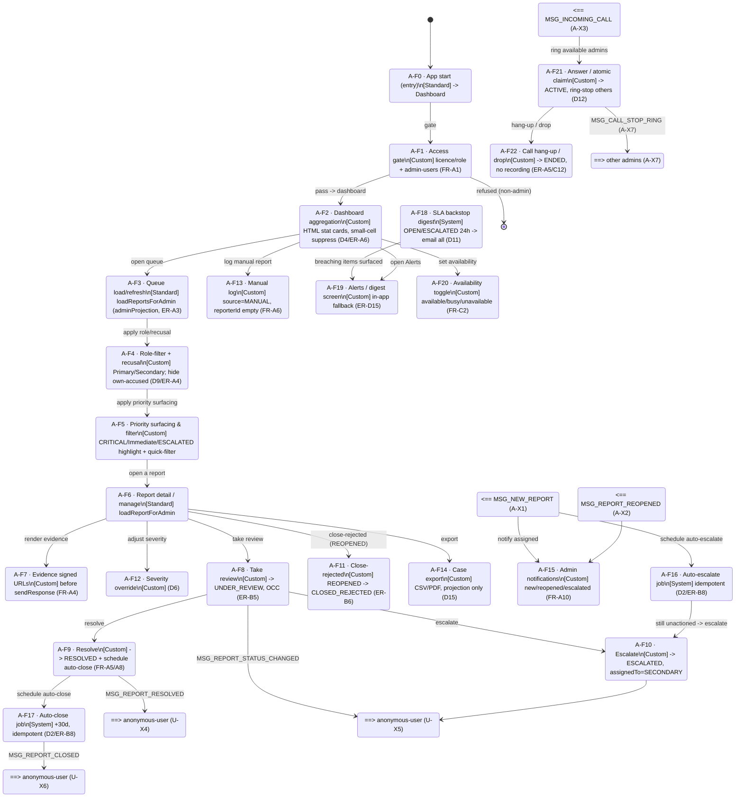

# Frame Graph - anonymous-admin

> LoG.ai Layer 2. Frames (= Intents) and transitions for the Admin micro-app (Primary + Secondary,
> role-gated in one app). Standard CRUD frames in the main flow; custom + system frames annotated;
> cross-app sends/receives shown as `MSG_*`. Every read flows through the `adminProjection`
> chokepoint (identity-stripped). Source: [`../2.brd.md`](../2.brd.md) §5 + §7.

## Notes
- **Single read chokepoint.** A-F2 (dashboard), A-F3 (queue), A-F6 (detail), the jobs, and export
  ALL read via `loadReportsForAdmin()` / `loadReportForAdmin()` - `adminProjection` is always
  applied (ER-A3). No admin frame queries `reports` directly; no admin surface binds `reporterId`.
- **Role + recusal + priority are layered filters** over the same projected queue (A-F4 → A-F5), not
  separate data loads. Priority surfacing (A-F5, added at PM request) highlights CRITICAL severity /
  Immediate-risk urgency / ESCALATED status and offers a quick-filter; severity reflects the A-F12
  override.
- **System frames** (A-F16/F17/F18) run in **Context B** via `state.jobScheduler` - they load the
  report by `reportId` before reading, and are guarded by current `status` + a job-id/`version`
  conditional so duplicate/stale fires are safe no-ops (ER-B8).
- **Optimistic concurrency** (ER-B5) wraps every transition (A-F8/F9/F10/F11): re-read + validate
  against current `status`+`version`; stale writes rejected and surfaced.
- **Calling is unrecorded and identity-free** (ER-A5); answer is an atomic claim (D12).
