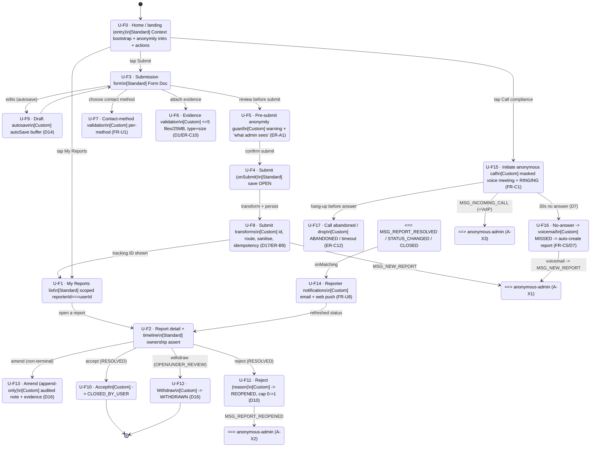

# Frame Graph - anonymous-user

> LoG.ai Layer 2. Frames (= Intents) and transitions for the Reporter micro-app. Standard CRUD
> frames in the main flow; custom frames annotated; cross-app sends/receives shown as `MSG_*`.
> Source: [`../2.brd.md`](../2.brd.md) §4 + §7. British English; frontm.ai lowercase.

## Notes
- **Standard frames** (U-F0/F1/F2/F3/F4) are the inferred CRUD scaffolding; everything else carries
  PM-confirmed rules (BRD §7).
- **Ownership** is asserted in U-F1 (`query { reporterId: userId }`) and again in U-F2 before any
  render/mutate - lookup-by-ID never bypasses it.
- **Context bootstrap** in U-F0 is mandatory because U-F9 (draft autosave) relies on `autoSave: true`
  (CLAUDE.md). Without it, buffered field values never reach Redis.
- **Manual / CALL-source reports** (no `reporterId`) never enter the U-F10/F11/F12 reporter-transition
  paths and receive no reporter notifications.
