# Task Dependency Graph — Anonymous Reporting System

> LoG.ai Task Breakdown (the production schedule). Converts the Layer 1–3 specification package
> into engineering tasks with dependencies, acceptance criteria, story points, and ready-to-use
> Claude Code prompts. British English; frontm.ai is always lowercase. **A frame = one Intent.**
>
> **Scope:** a 2-microapp monorepo (`anonymous-user`, `anonymous-admin`) over one shared MongoDB
> cluster and one shared `/lib`. Both apps use the **Two-Doc** architecture (Data Doc + Display
> Doc), so each has a DISPLAY-SHELL task between SCAFFOLD and its DISPLAY frames.
>
> **This file is the PM review artefact and the execution log.** It is *append-only*: never edit a
> committed `### Task` block. When an audit/bug/spec-change invalidates a task, append a new
> `MP-FIX-*` task at the end (see `.claude/skills/frontm-fix-task.md`). The spec files
> (`specs/1.*`, `2.*`, `3.*`) describe current design and may be updated in place.

## Prerequisites

```bash
git submodule update --remote docs   # refresh framework documentation FIRST
```

- Every Claude Code prompt below **opens with the validation gate** (`specs/PROMPT-GUARDRAILS.md`).
- **Before any code on a task**, present the **Pre-Implementation Briefing** from
  `specs/PROMPT-GUARDRAILS.md` (What & why · How · Framework confidence ✅/🟡/🔴 with `./docs/`
  citations · edge cases · open questions) and get the PM's go-ahead. The inlined gate in each task
  block below predates this step (the file is append-only); the **canonical guardrails govern** —
  the briefing applies to every task regardless of the frozen inline text.
- **Build per app:** `cd anonymous-user && npm run build` / `cd anonymous-admin && npm run build`.
- `admin-users` is **seeded out-of-band** (D3) with ≥1 PRIMARY and ≥1 SECONDARY admin before go-live.
- FrontM has **no unit-test files** — verify on the live runtime (`/frontm-review`, `/verify`).

## Dependency graph

```mermaid
graph TD
    LIB["LIB-FOUNDATION: shared /lib"]

    subgraph user["anonymous-user"]
        U_SCAFFOLD[U-SCAFFOLD]
        U_SHELL[U-DISPLAY-SHELL]
        U_Dhome[DISPLAY: Home]
        U_Dmy[DISPLAY: My Reports]
        U_Ddh[DISPLAY: Detail header]
        U_Ddc[DISPLAY: Detail content]
        U_Ddr[DISPLAY: Detail resolution]
        U_Dda[DISPLAY: Detail actions]
        U_Dam[DISPLAY: Amendments]
        U_Dsh[DISPLAY: Status timeline]
        U_Eam[EDIT: addAmendment]
        U_F5[U-F5]; U_F6[U-F6]; U_F7[U-F7]; U_F8[U-F8]; U_F9[U-F9]
        U_F10[U-F10]; U_F11[U-F11]; U_F12[U-F12]; U_F14[U-F14]
        U_F15[U-F15]; U_F16[U-F16]; U_F17[U-F17]
        U_TEST[U-TEST]
    end

    subgraph admin["anonymous-admin"]
        A_SCAFFOLD[A-SCAFFOLD]
        A_SHELL[A-DISPLAY-SHELL]
        A_Ddash[DISPLAY: Dashboard]
        A_Dq[DISPLAY: Queue]
        A_Dmh[DISPLAY: Manage header]
        A_Dmc[DISPLAY: Manage content]
        A_Dmr[DISPLAY: Manage resolution]
        A_Dma[DISPLAY: Manage actions]
        A_Dsh[DISPLAY: Status timeline]
        A_Dam[DISPLAY: Amendments]
        A_Dal[DISPLAY: Alerts]
        A_Doc[DISPLAY: On-call]
        A_Dic[DISPLAY: Incoming call]
        A_F1[A-F1 gate]
        A_Etr[EDIT: takeReview]; A_Ere[EDIT: resolveReport]; A_Ees[EDIT: escalateReport]
        A_Ecr[EDIT: closeRejected]; A_Eos[EDIT: overrideSeverity]; A_Eml[EDIT: manualLog]
        A_F2[A-F2]; A_F4[A-F4]; A_F5[A-F5]; A_F7[A-F7]; A_F14[A-F14]; A_F15[A-F15]
        A_F16[A-F16]; A_F17[A-F17]; A_F18[A-F18]; A_F20[A-F20]; A_F21[A-F21]; A_F22[A-F22]
        A_TEST[A-TEST]
    end

    subgraph contracts["cross-app contracts"]
        X1[X1 MSG_NEW_REPORT]; X2[X2 MSG_REPORT_REOPENED]; X3[X3 MSG_INCOMING_CALL]
        X4[X4 MSG_REPORT_RESOLVED]; X5[X5 MSG_REPORT_STATUS_CHANGED]; X6[X6 MSG_REPORT_CLOSED]
        X7[X7 MSG_CALL_STOP_RING]
    end

    LIB --> U_SCAFFOLD
    LIB --> A_SCAFFOLD
    U_SCAFFOLD --> U_SHELL
    U_SHELL --> U_Dhome & U_Dmy & U_Ddh & U_Ddc & U_Ddr & U_Dda & U_Dam & U_Dsh
    U_Dam --> U_Eam
    U_SCAFFOLD --> U_F5 & U_F6 & U_F7 & U_F8 & U_F9 & U_F14 & U_F15
    U_Dda --> U_F10 & U_F11 & U_F12
    U_F15 --> U_F16 & U_F17
    A_SCAFFOLD --> A_SHELL
    A_SHELL --> A_Ddash & A_Dq & A_Dmh & A_Dmc & A_Dmr & A_Dma & A_Dsh & A_Dam & A_Dal & A_Doc & A_Dic
    A_SCAFFOLD --> A_F1 & A_F15 & A_F16 & A_F18 & A_Eml
    A_Ddash --> A_F2
    A_Dq --> A_F4 --> A_F5
    A_Dmc --> A_F7
    A_Dma --> A_Etr & A_Ere & A_Ees & A_Ecr & A_Eos & A_F14
    A_Ere --> A_F17
    A_Doc --> A_F20
    A_Dic --> A_F21 --> A_F22
    U_F8 & U_F16 & A_F15 & A_F16 --> X1
    U_F11 --> X2
    U_F15 & A_Dic --> X3
    A_Ere --> X4
    A_Etr & A_Ees --> X5
    A_F17 --> X6
    A_F21 --> X7
    %% integration tests
    U_TEST & A_TEST
```



**Critical path:** `LIB-FOUNDATION → A-SCAFFOLD → A-DISPLAY-SHELL → DISPLAY: Manage actions →
EDIT: resolveReport → A-F17 (auto-close) → X6 (MSG_REPORT_CLOSED) → A-TEST`.
The user side runs in parallel; both apps converge only at the cross-app contract tasks (X1–X7),
which need both scaffolds, and at the per-app integration tests.

## Task summary

| ID | Title | Label | Type | Points | Depends on |
|---|---|---|---|---|---|
| LIB-FOUNDATION | shared /lib (anonymity core, state machine, collections, utils) | shared-lib | foundation | 2 | — |
| U-SCAFFOLD | anonymous-user data model + standard frames | anonymous-user | scaffold | 1 | LIB-FOUNDATION |
| U-DISPLAY-SHELL | anonymous-user Display Doc + CardsSet placeholders | anonymous-user | shell | 1 | U-SCAFFOLD |
| U-D-home | Home / landing (HTML content) | anonymous-user | display | 0.5 | U-DISPLAY-SHELL |
| U-D-myreports | My Reports list (HTML content) | anonymous-user | display | 0.5 | U-DISPLAY-SHELL |
| U-D-detailheader | Report detail header (HTML content) | anonymous-user | display | 0.5 | U-DISPLAY-SHELL |
| U-D-detailcontent | Report detail content (with evidence signed URLs) (HTML content) | anonymous-user | display | 0.5 | U-DISPLAY-SHELL |
| U-D-detailresolution | Report detail resolution (HTML content) | anonymous-user | display | 0.5 | U-DISPLAY-SHELL |
| U-D-detailactions | Report detail actions (HTML content) | anonymous-user | display | 0.5 | U-DISPLAY-SHELL |
| U-D-amendments | Amendments table (HTML content) | anonymous-user | display | 0.5 | U-DISPLAY-SHELL |
| U-D-statushistory | Status timeline (HTML content) | anonymous-user | display | 0.5 | U-DISPLAY-SHELL |
| U-E-addAmendment | addAmendment (append-only amendment popup, U-F13) | anonymous-user | edit | 1 | U-D-amendments |
| U-F5 | Pre-submit anonymity guard | anonymous-user | custom | 0.5 | U-SCAFFOLD |
| U-F6 | Evidence upload validation + atomicity | anonymous-user | custom | 1 | U-SCAFFOLD |
| U-F7 | Contact-method conditional validation | anonymous-user | custom | 0.5 | U-SCAFFOLD |
| U-F8 | Submit-time transforms + idempotency | anonymous-user | custom | 1 | U-SCAFFOLD |
| U-F9 | Draft autosave verification | anonymous-user | custom | 0.5 | U-SCAFFOLD |
| U-F10 | Accept resolution (RESOLVED -> CLOSED_BY_USER) | anonymous-user | custom | 0.5 | U-D-detailactions |
| U-F11 | Reject resolution (RESOLVED -> REOPENED, once) | anonymous-user | custom | 1 | U-D-detailactions |
| U-F12 | Withdraw (OPEN/UNDER_REVIEW -> WITHDRAWN) | anonymous-user | custom | 0.5 | U-D-detailactions |
| U-F14 | Reporter notification dispatch | anonymous-user | custom | 0.5 | U-SCAFFOLD |
| U-F15 | Anonymous call — start (masked, voice-only) | anonymous-user | custom | 2 | U-SCAFFOLD |
| U-F16 | Anonymous call — 30s no-answer -> voicemail -> auto-report | anonymous-user | custom | 1 | U-F15 |
| U-F17 | Anonymous call — abandon / end | anonymous-user | custom | 0.5 | U-F15 |
| U-TEST | anonymous-user integration testing | anonymous-user | test | 2 | U-DISPLAY-SHELL, U-D-home, U-D-myreports, U-D-detailheader, U-D-detailcontent, U-D-detailresolution, U-D-detailactions, U-D-amendments, U-D-statushistory, U-E-addAmendment, U-F5, U-F6, U-F7, U-F8, U-F9, U-F10, U-F11, U-F12, U-F14, U-F15, U-F16, U-F17, X1, X2, X3, X4, X5, X6 |
| A-SCAFFOLD | anonymous-admin data model + standard frames | anonymous-admin | scaffold | 1 | LIB-FOUNDATION |
| A-DISPLAY-SHELL | anonymous-admin Display Doc + CardsSet placeholders | anonymous-admin | shell | 1 | A-SCAFFOLD |
| A-D-dashboard | Dashboard (placeholder stat-card layout) (HTML content) | anonymous-admin | display | 0.5 | A-DISPLAY-SHELL |
| A-D-queue | Report queue (list layout) (HTML content) | anonymous-admin | display | 0.5 | A-DISPLAY-SHELL |
| A-D-manageheader | Manage detail header (HTML content) | anonymous-admin | display | 0.5 | A-DISPLAY-SHELL |
| A-D-managecontent | Manage detail content (HTML content) | anonymous-admin | display | 0.5 | A-DISPLAY-SHELL |
| A-D-manageresolution | Manage detail resolution (HTML content) | anonymous-admin | display | 0.5 | A-DISPLAY-SHELL |
| A-D-manageactions | Manage detail actions (HTML content) | anonymous-admin | display | 0.5 | A-DISPLAY-SHELL |
| A-D-statushistory | Status timeline (HTML content) | anonymous-admin | display | 0.5 | A-DISPLAY-SHELL |
| A-D-amendments | Amendments (read-only) (HTML content) | anonymous-admin | display | 0.5 | A-DISPLAY-SHELL |
| A-D-alerts | Alerts / Digest (A-F19) (HTML content) | anonymous-admin | display | 0.5 | A-DISPLAY-SHELL |
| A-D-oncall | On-call status (availability) (HTML content) | anonymous-admin | display | 0.5 | A-DISPLAY-SHELL |
| A-D-incomingcall | Incoming call (ring banner) (HTML content) | anonymous-admin | display | 0.5 | A-DISPLAY-SHELL |
| A-F1 | Access gate (role + admin-users registry) | anonymous-admin | custom | 0.5 | A-SCAFFOLD |
| A-E-takeReview | takeReview (OPEN/REOPENED/ESCALATED -> UNDER_REVIEW) | anonymous-admin | edit | 0.5 | A-D-manageactions |
| A-E-resolveReport | resolveReport (resolvePopup -> RESOLVED) | anonymous-admin | edit | 0.5 | A-D-manageactions |
| A-E-escalateReport | escalateReport (transitionNotePopup -> ESCALATED) | anonymous-admin | edit | 0.5 | A-D-manageactions |
| A-E-closeRejected | closeRejected (transitionNotePopup -> CLOSED_REJECTED) | anonymous-admin | edit | 0.5 | A-D-manageactions |
| A-E-overrideSeverity | overrideSeverity (severityPopup -> write severity) | anonymous-admin | edit | 0.5 | A-D-manageactions |
| A-E-manualLog | openManualLog (manualLog form -> MANUAL report) | anonymous-admin | edit | 1 | A-SCAFFOLD |
| A-F2 | Dashboard aggregation + small-cell suppression | anonymous-admin | custom | 1 | A-D-dashboard |
| A-F4 | Role filter + recusal | anonymous-admin | custom | 1 | A-D-queue |
| A-F5 | Priority surfacing & filtering | anonymous-admin | custom | 1 | A-D-queue, A-F4 |
| A-F7 | Evidence signed URLs | anonymous-admin | custom | 0.5 | A-D-managecontent |
| A-F14 | Case export (CSV / PDF) | anonymous-admin | custom | 1 | A-D-manageactions |
| A-F15 | Admin notification dispatch | anonymous-admin | custom | 0.5 | A-SCAFFOLD |
| A-F16 | Auto-escalate job | anonymous-admin | custom | 1 | A-SCAFFOLD |
| A-F17 | Auto-close job | anonymous-admin | custom | 1 | A-E-resolveReport |
| A-F18 | SLA backstop digest job | anonymous-admin | custom | 0.5 | A-SCAFFOLD |
| A-F20 | Set availability | anonymous-admin | custom | 0.5 | A-D-oncall |
| A-F21 | Answer call (atomic claim) | anonymous-admin | custom | 1 | A-D-incomingcall |
| A-F22 | End call | anonymous-admin | custom | 0.5 | A-F21 |
| A-TEST | anonymous-admin integration testing | anonymous-admin | test | 3 | A-DISPLAY-SHELL, A-D-dashboard, A-D-queue, A-D-manageheader, A-D-managecontent, A-D-manageresolution, A-D-manageactions, A-D-statushistory, A-D-amendments, A-D-alerts, A-D-oncall, A-D-incomingcall, A-F1, A-E-takeReview, A-E-resolveReport, A-E-escalateReport, A-E-closeRejected, A-E-overrideSeverity, A-E-manualLog, A-F2, A-F4, A-F5, A-F7, A-F14, A-F15, A-F16, A-F17, A-F18, A-F20, A-F21, A-F22, X1, X2, X3, X4, X5, X6, X7 |
| X1 | MSG_NEW_REPORT (anonymous-user -> anonymous-admin) | cross-app | contract | 2 | U-F8, U-F16, A-SCAFFOLD, A-F15, A-F16 |
| X2 | MSG_REPORT_REOPENED (anonymous-user -> anonymous-admin) | cross-app | contract | 2 | U-F11, A-SCAFFOLD, A-F15 |
| X3 | MSG_INCOMING_CALL (anonymous-user -> anonymous-admin) | cross-app | contract | 2 | U-F15, A-SCAFFOLD, A-D-incomingcall |
| X4 | MSG_REPORT_RESOLVED (anonymous-admin -> anonymous-user) | cross-app | contract | 2 | A-E-resolveReport, U-SCAFFOLD, U-F14 |
| X5 | MSG_REPORT_STATUS_CHANGED (anonymous-admin -> anonymous-user) | cross-app | contract | 2 | A-E-takeReview, A-E-escalateReport, U-SCAFFOLD, U-F14 |
| X6 | MSG_REPORT_CLOSED (anonymous-admin -> anonymous-user) | cross-app | contract | 2 | A-F17, U-SCAFFOLD, U-F14 |
| X7 | MSG_CALL_STOP_RING (anonymous-admin -> anonymous-admin) | cross-app | contract | 1 | A-F21 |
| MP-FIX-APPSTART-LOAD-RESILIENCE | app-start renders Home even when the My Reports load fails | anonymous-user | fix | 0.25 | U-SCAFFOLD, U-DISPLAY-SHELL |
| MP-FIX-NAV-DISPLAY-ROUTING | read-screen nav intents render via the Display Doc + per-screen section.hidden | anonymous-user | fix | 1 | U-SCAFFOLD, U-DISPLAY-SHELL, U-D-myreports, U-D-detailheader, U-D-detailcontent, U-D-detailresolution, U-D-detailactions, U-D-amendments, U-D-statushistory |
| MP-FIX-MYREPORTS-FILTERS | wire the My Reports filter loader + search box | anonymous-user | fix | 0.5 | U-D-myreports, MP-FIX-NAV-DISPLAY-ROUTING |
| MP-FIX-AMENDMENT-EVIDENCE-SIGNING | sign amendmentEvidenceKey into the evidence stash so the admin Amendments table renders working download links | anonymous-admin | fix | 0.5 | A-F7, A-D-amendments |

**Totals:** 69 tasks, 59.75 points.

| By label | Tasks | Points |
|---|---|---|
| shared-lib | 1 | 2 |
| anonymous-user | 27 | 20.25 |
| anonymous-admin | 34 | 24.5 |
| cross-app | 7 | 13 |

| By type | Count |
|---|---|
| foundation | 1 |
| scaffold | 2 |
| shell | 2 |
| display | 19 |
| edit | 7 |
| custom | 25 |
| contract | 7 |
| test | 2 |
| fix | 4 |

**Estimated effort.** Development is AI-assisted: a well-specified frame generates in one pass, so
code-generation time is small relative to human verification. The realistic bottleneck is live-
runtime verification on web + Android + iOS (the two TEST tasks and the cross-app message flows).
Expect a few focused working sessions per app rather than sprints.

---

## Task detail

### Task LIB-FOUNDATION — LIB-FOUNDATION: shared /lib (anonymity core, state machine, collections, utils)

- **Label:** shared-lib  ·  **Type:** foundation  ·  **Points:** 2
- **Dependencies:** None

**Description.** Implement the entire shared /lib (currently skeleton placeholders — adminProjection={}, resolveAssignees=[], isAdmin/ownsReport=false, ticket-status/calling/notifications/validation stubbed). This is the 'B1 foundation' both apps import. Zero duplication (C9): every shared rule lives here once. Pure helpers (no Doc/Section/Field instances except the three shared collection registrations) so they verify quickly on the live runtime.

**Acceptance criteria.**
- [ ] lib/constants.js exports populated CATEGORY, URGENCY, SEVERITY (LOW|MEDIUM|HIGH|CRITICAL), LOCATION, CONTACT_METHOD, ROLE (PRIMARY_ADMIN|SECONDARY_ADMIN), SOURCE (REPORTER|MANUAL|CALL), MSG (all 7 types), CALL_STATUS, AVAILABILITY — as SCREAMING_SNAKE_CASE; no magic strings anywhere downstream
- [ ] lib/ticket-status.js exports STATUS (9 values), STATUS_META ({label,tone,allowedActionsByRole,terminal}), STATUS_TRANSITIONS, and canTransition(from,to,actor) returning true only for moves in SPEC.md's transition table
- [ ] lib/access.js: adminProjection EXCLUDES reporterId/contactMethod/contactValue + reporter-create audit; loadReportsForAdmin/loadReportForAdmin ALWAYS apply { projection: adminProjection } (single gateway, ER-A3); resolveAssignees(report) is the sole routing chokepoint (againstAdmin->SECONDARY else PRIMARY, scope GLOBAL, D17); resolveAdminRole/isAdmin/ownsReport implemented against admin-users + state.user
- [ ] lib/validation.js: email (RFC-pragmatic), phone (E.164-tolerant), cabin (alphanumeric), incidentDate (parseable, not future), evidence file (extension AND content-type AND size<=limit), HTML sanitiser for free-text
- [ ] lib/id-generator.js generates RPT-+10 (collision-resistant alphabet) and CALL- references
- [ ] lib/calling.js: masked/system host (never state.user.userEmail), masked guest 'Anonymous Reporter', voice-only meeting (video muted, no recording), identity-free ring payloads (callRef+meetingId only)
- [ ] lib/notifications.js: email + web push helpers; best-effort but logged (NFR-4)
- [ ] lib/utils/theme.js (status/severity tone tokens), lib/utils/format.js (escapeHtml + HTML builders), lib/utils/platform.js (renderForPlatform + state.client detection against ALL_CONSTANTS.CLIENTS.*)
- [ ] lib/collections/{reports,call-queue,admin-users}.js each register their shared Doc+Collection (shared:true, suffixed *_${systemId}; reports audit:true) once, side-effect-importable by both apps
- [ ] Pure helpers verify on the live runtime: id format+uniqueness, canTransition allowed/denied per role, validators, sanitiser injection cases, adminProjection has NO identity fields

**Claude Code prompt:**

```text
  VALIDATION GATE — do this BEFORE writing any code:
  1. Docs-first: read the relevant ./docs/ guides for THIS task (never from memory);
     run /frontm-api-verify and emit the report; use /frontm-docs for anything unclear.
  2. Read context: specs/1-4 + REQUIREMENTS.md (ER-* edge cases, D1-D17 decisions) +
     specs/SPEC.md for the entities involved.
  3. Analyse real-world scenarios (developer lens): mobile AND web, poor maritime link,
     unhappy paths, races, failure modes.
  4. Think like the end-user: a frightened anonymous reporter and a busy compliance
     officer — is it clear, fast, safe, genuinely anonymous, trustworthy?
  5. Enumerate edge cases & worst flows BEFORE coding (empty/none, concurrency,
     missing/unavailable admin, no network, oversized file, abuse, anonymity-leak);
     cross-check REQUIREMENTS ER-* and resolve or flag each.
  6. Honour the non-negotiables: code-enforced anonymity (adminProjection gateway,
     recusal, identity-free payloads/audit); mobile+web SEPARATE per-platform renderers
     via state.client; custom HTML UI (no MongoDB Atlas Charts); voice-only masked
     calling; routing only via resolveAssignees; optimistic concurrency on transitions.
  7. Use the Claude skills: /frontm-api-verify, /frontm-docs, /frontm-new-intent,
     /frontm-add-collection, then /frontm-review; verify on the LIVE runtime with /verify
     (no unit-test files). Runtime bugs -> /frontm-fix-task (append-only), never a silent edit.

  Read ALL relevant docs in ./docs/ before generating any code, plus:
    - specs/SPEC.md (entity, enums, state machine, adminProjection, calling, validation)
    - REQUIREMENTS.md (§5 enums, §6 state machine, §7 flows, ER-A2/A3 anonymity, D17 routing)
    - specs/3.field-spec.md
    - docs/frontm-lib-database-operations.md
    - docs/frontm-ai-collection-class-comprehensive-guide.md (shared:true naming convention)

  WHAT to build:
  - Populate every export in lib/constants.js and lib/ticket-status.js from SPEC.md (the
    canonical values). STATUS_TRANSITIONS must match SPEC.md's table exactly (per actor).
  - lib/access.js — the anonymity core:
    * adminProjection: the ONLY report field set the admin app may read. It MUST omit
      reporterId, contactMethod, contactValue and the reporter-create audit fields (ER-A2).
    * loadReportsForAdmin / loadReportForAdmin: the SINGLE admin read gateway — every call
      applies { projection: adminProjection } (ER-A3). No other admin path queries reports.
    * resolveAssignees(report): single routing chokepoint (D17) — againstAdmin -> SECONDARY_ADMIN,
      else PRIMARY_ADMIN; v1 returns the GLOBAL-scope admin-users of the target role. No hardcoded
      role query anywhere else.
    * resolveAdminRole / isAdmin (against the seeded admin-users registry) and ownsReport
      (reporterId === state.user.userId) for ownership assertion.
  - lib/validation.js, lib/id-generator.js, lib/calling.js, lib/notifications.js per SPEC.md.
  - lib/utils/{theme,format,platform}.js — the shared rendering toolkit used by BOTH apps'
    per-platform renderers (REQUIREMENTS §9.1): renderForPlatform(data,{web,mobile}) dispatches
    ONCE on state.client; no scattered isMobile() ternaries.
  - lib/collections/{reports,call-queue,admin-users}.js — register each shared Doc + Collection
    (shared:true; reports audit:true). admin-users is seeded out-of-band (D3) — register it for
    reads (gating/routing/availability/ringing); do NOT build a UI lookup field for it.
  - All keys/enums/error-codes/static-data-keys are SCREAMING_SNAKE_CASE constants (rule 19).

  HOW to build it: read the docs AND specs/3.framework-mapping.md (the rendering
  primitives + the 30 code-generator rules). Composing documented primitives is NOT
  inventing; inventing is calling a method/event/property found in no ./docs/ file.
  Do NOT invent any APIs. Follow the circular-dependency prevention rules in AGENTS.md.
```

### Task U-SCAFFOLD — U-SCAFFOLD: anonymous-user data model + standard frames

- **Label:** anonymous-user  ·  **Type:** scaffold  ·  **Points:** 1
- **Dependencies:** LIB-FOUNDATION

**Description.** Scaffold the anonymous-user DATA MODEL only. reportDoc (Data Doc, autoSave:true) with all infrastructure + content fields; standard form sections (reportDetails, contact, evidence) rendered inline; the amendments and statusHistory forCollection sub-collections; reportsCollection; state.onConfig (contextAware:true, BRD §8.1); the Context bootstrap in main.onResolution; app-start data loading; navigation intents. NO CardsSet, NO HTML, NO transition/popup handlers (later tasks).

**Acceptance criteria.**
- [ ] App opens; submit-form sections render inline with every field from specs/3.anonymous-user-input-schema.md in the correct section + column (alternating 0,1)
- [ ] reportDoc has autoSave:true; src/main.js sets state.onConfig=()=>{state.contextAware=true;} AND main.onResolution calls await Context.CreateAndInit('mainApp',{state}) BEFORE any loadDocument (CLAUDE.md bootstrap, rule 17)
- [ ] Infrastructure fields exist on reportDoc: reportId (PK, hidden), reporterId (hidden, NOT PK), status/severity/source/assignedTo/createdOn/updatedOn/version/reopenCount/withdrawnOn/resolvedOn, resolution (read-only here), rejectReason
- [ ] contactValue is encrypted:true; evidenceFile1..5 are FILE_FIELD
- [ ] amendments + statusHistory are forCollection:true sub-collections with addCollection wired (NO CardsSet on these sections)
- [ ] app-start loads via reportsCollection.loadCollectionWithQuery({query:{reporterId}}) for the list and reportDoc.loadDocument({reportId}) for detail; sub-collections loaded after loadDocument
- [ ] Data persists to reports_${systemId}; no onPostLoad used

**Claude Code prompt:**

```text
  VALIDATION GATE — do this BEFORE writing any code:
  1. Docs-first: read the relevant ./docs/ guides for THIS task (never from memory);
     run /frontm-api-verify and emit the report; use /frontm-docs for anything unclear.
  2. Read context: specs/1-4 + REQUIREMENTS.md (ER-* edge cases, D1-D17 decisions) +
     specs/SPEC.md for the entities involved.
  3. Analyse real-world scenarios (developer lens): mobile AND web, poor maritime link,
     unhappy paths, races, failure modes.
  4. Think like the end-user: a frightened anonymous reporter and a busy compliance
     officer — is it clear, fast, safe, genuinely anonymous, trustworthy?
  5. Enumerate edge cases & worst flows BEFORE coding (empty/none, concurrency,
     missing/unavailable admin, no network, oversized file, abuse, anonymity-leak);
     cross-check REQUIREMENTS ER-* and resolve or flag each.
  6. Honour the non-negotiables: code-enforced anonymity (adminProjection gateway,
     recusal, identity-free payloads/audit); mobile+web SEPARATE per-platform renderers
     via state.client; custom HTML UI (no MongoDB Atlas Charts); voice-only masked
     calling; routing only via resolveAssignees; optimistic concurrency on transitions.
  7. Use the Claude skills: /frontm-api-verify, /frontm-docs, /frontm-new-intent,
     /frontm-add-collection, then /frontm-review; verify on the LIVE runtime with /verify
     (no unit-test files). Runtime bugs -> /frontm-fix-task (append-only), never a silent edit.

  Read ALL relevant docs in ./docs/ before generating any code, plus:
    - specs/3.anonymous-user-input-schema.md (sections, fields, columns)
    - specs/3.field-spec.md
    - specs/3.framework-mapping.md (Two-Doc, rules 4/5/7/17/22/23)
    - specs/SPEC.md
    - AGENTS.md File Organisation Rules

  WHAT to build:
  Build the anonymous-user DATA MODEL split by responsibility (AGENTS.md):
  - src/main.js — main intent, state.onConfig, side-effect imports only.
  - src/docs/report-doc.js — reportDoc (Data Doc; autoSave:true; constructor only).
  - src/sections/*.js — reportDetails (2-col), contact (2-col, contactValue encrypted),
    evidence (1-col, FILE_FIELDs) standard form sections + amendments & statusHistory
    forCollection sub-collections (fields per the sub_entity blocks).
  - src/collections/reports.js — side-effect import of the shared reports collection from lib/.
  - src/frames/app-start.js — Context.CreateAndInit FIRST, then loadDocument / load sub-collections.
  - src/frames/nav-*.js — openSubmitReport, openMyReports, openReportDetail (navigation only).
  WHAT NOT TO BUILD (later tasks): no CardsSet/HTML, no sendResponse() on the Data Doc, no
  transition/popup/contract handlers, no display sections, no onPostLoad. All sections render
  inline for now; rendering: values are honoured in the Display tasks.

  HOW to build it: read the docs AND specs/3.framework-mapping.md (the rendering
  primitives + the 30 code-generator rules). Composing documented primitives is NOT
  inventing; inventing is calling a method/event/property found in no ./docs/ file.
  Do NOT invent any APIs. Follow the circular-dependency prevention rules in AGENTS.md.
```

### Task U-DISPLAY-SHELL — U-DISPLAY-SHELL: anonymous-user Display Doc + CardsSet placeholders

- **Label:** anonymous-user  ·  **Type:** shell  ·  **Points:** 1
- **Dependencies:** U-SCAFFOLD

**Description.** Create reportDisplayDoc (no title) with ALL display sections, each carrying a CardsSet (CARD_TYPES.HTML) + placeholder Card + grid positioning. app-start hides the tab bar and calls sendResponse() on the Display Doc (never the Data Doc).

**Acceptance criteria.**
- [ ] reportDisplayDoc created WITHOUT a title parameter (avoids triple-title)
- [ ] sendResponse() is called on reportDisplayDoc, never on reportDoc
- [ ] Every display section (homeLanding, myReportsList, detailHeader, detailContent, detailResolution, detailActions, amendments, statusHistory) has a CardsSet (CARD_TYPES.HTML) + placeholder Card + grid:{row,column}
- [ ] Cards that will host buttons are readOnly:true
- [ ] tabBarHidden set before sendResponse(); app opens showing laid-out placeholder sections in input-schema order
- [ ] Section properties (borderless/collapsable) match the input schema

**Claude Code prompt:**

```text
  VALIDATION GATE — do this BEFORE writing any code:
  1. Docs-first: read the relevant ./docs/ guides for THIS task (never from memory);
     run /frontm-api-verify and emit the report; use /frontm-docs for anything unclear.
  2. Read context: specs/1-4 + REQUIREMENTS.md (ER-* edge cases, D1-D17 decisions) +
     specs/SPEC.md for the entities involved.
  3. Analyse real-world scenarios (developer lens): mobile AND web, poor maritime link,
     unhappy paths, races, failure modes.
  4. Think like the end-user: a frightened anonymous reporter and a busy compliance
     officer — is it clear, fast, safe, genuinely anonymous, trustworthy?
  5. Enumerate edge cases & worst flows BEFORE coding (empty/none, concurrency,
     missing/unavailable admin, no network, oversized file, abuse, anonymity-leak);
     cross-check REQUIREMENTS ER-* and resolve or flag each.
  6. Honour the non-negotiables: code-enforced anonymity (adminProjection gateway,
     recusal, identity-free payloads/audit); mobile+web SEPARATE per-platform renderers
     via state.client; custom HTML UI (no MongoDB Atlas Charts); voice-only masked
     calling; routing only via resolveAssignees; optimistic concurrency on transitions.
  7. Use the Claude skills: /frontm-api-verify, /frontm-docs, /frontm-new-intent,
     /frontm-add-collection, then /frontm-review; verify on the LIVE runtime with /verify
     (no unit-test files). Runtime bugs -> /frontm-fix-task (append-only), never a silent edit.

  Read ALL relevant docs in ./docs/ before generating any code, plus:
    - specs/3.anonymous-user-input-schema.md (section list/order/properties)
    - specs/3.wireframes-anonymous-user.md (grid layout)
    - specs/3.framework-mapping.md (Two-Doc)
    - current src/ (the scaffold)
    - docs/frontm-ai-cards-cardsets-comprehensive-guide.md

  WHAT to build:
  ARCHITECTURE — TWO DOCS: reportDoc (Data, already built, never sendResponse()d) and
  reportDisplayDoc (NEW, CardsSet sections, the only Doc sendResponse()d).
  - src/docs/report-display-doc.js — reportDisplayDoc, NO title.
  - src/sections/display/<screen>/index.js — one folder per display section; each Section has a
    CardsSet (CARD_TYPES.HTML) + placeholder Card + grid:{row,column} (vertical layout per the
    wireframes). Per §9.1 each index.js will dispatch via renderForPlatform; for now ship a minimal
    placeholder (e.g. <div class="placeholder">[Section Title]</div>).
  - Update src/frames/app-start.js: keep the Data Doc load, hide the tab bar, then call
    reportDisplayDoc.sendResponse().
  Do NOT create bare sections without a CardsSet (empty box). Every display section has CardsSet+Card.

  HOW to build it: read the docs AND specs/3.framework-mapping.md (the rendering
  primitives + the 30 code-generator rules). Composing documented primitives is NOT
  inventing; inventing is calling a method/event/property found in no ./docs/ file.
  Do NOT invent any APIs. Follow the circular-dependency prevention rules in AGENTS.md.
```

### Task U-D-home — U-DISPLAY: Home / landing (HTML content)

- **Label:** anonymous-user  ·  **Type:** display  ·  **Points:** 0.5
- **Dependencies:** U-DISPLAY-SHELL

**Description.** Populate the HTML Card content for the Home / landing display section in its onResponse, reading field values from reportDoc via the per-platform renderers (web.js/mobile.js). The CardsSet+placeholder already exist (DISPLAY-SHELL) — update content only.

**Acceptance criteria.**
- [ ] Home / landing renders as an HTML Card (not inline fields), via renderForPlatform on web AND mobile
- [ ] onResponse fires for every sendResponse() including new users with no data (empty-safe)
- [ ] Trust banner + anonymity intro shown
- [ ] Buttons present: Submit a report (openSubmitReport), My Reports (openMyReports), Call compliance (startAnonymousCall)

**Claude Code prompt:**

```text
  VALIDATION GATE — do this BEFORE writing any code:
  1. Docs-first: read the relevant ./docs/ guides for THIS task (never from memory);
     run /frontm-api-verify and emit the report; use /frontm-docs for anything unclear.
  2. Read context: specs/1-4 + REQUIREMENTS.md (ER-* edge cases, D1-D17 decisions) +
     specs/SPEC.md for the entities involved.
  3. Analyse real-world scenarios (developer lens): mobile AND web, poor maritime link,
     unhappy paths, races, failure modes.
  4. Think like the end-user: a frightened anonymous reporter and a busy compliance
     officer — is it clear, fast, safe, genuinely anonymous, trustworthy?
  5. Enumerate edge cases & worst flows BEFORE coding (empty/none, concurrency,
     missing/unavailable admin, no network, oversized file, abuse, anonymity-leak);
     cross-check REQUIREMENTS ER-* and resolve or flag each.
  6. Honour the non-negotiables: code-enforced anonymity (adminProjection gateway,
     recusal, identity-free payloads/audit); mobile+web SEPARATE per-platform renderers
     via state.client; custom HTML UI (no MongoDB Atlas Charts); voice-only masked
     calling; routing only via resolveAssignees; optimistic concurrency on transitions.
  7. Use the Claude skills: /frontm-api-verify, /frontm-docs, /frontm-new-intent,
     /frontm-add-collection, then /frontm-review; verify on the LIVE runtime with /verify
     (no unit-test files). Runtime bugs -> /frontm-fix-task (append-only), never a silent edit.

  Read ALL relevant docs in ./docs/ before generating any code, plus:
    - specs/3.framework-mapping.md
    - specs/3.anonymous-user-input-schema.md (display_elements)
    - specs/3.wireframes-anonymous-user.md
    - current src/ (scaffold + shell)
    - lib/utils/{theme,format,platform}.js

  WHAT to build:
  Populate the Home / landing card content in src/sections/display/home/{index,web,mobile}.js.
  - Do NOT recreate the CardsSet/Section (they exist). Build the HTML string in onResponse by
    reading reportDoc field values and dispatching via renderForPlatform(data,{web,mobile}).
  - Sanitise every free-text value (escapeHtml from lib/utils/format.js) before HTML use (rule 10).
  - display_only navigation card: trust banner, anonymity intro, and three action buttons
    using <button data-action="intent" data-intent-id="openSubmitReport|openMyReports|startAnonymousCall">.

  HOW to build it: read the docs AND specs/3.framework-mapping.md (the rendering
  primitives + the 30 code-generator rules). Composing documented primitives is NOT
  inventing; inventing is calling a method/event/property found in no ./docs/ file.
  Do NOT invent any APIs. Follow the circular-dependency prevention rules in AGENTS.md.
```

### Task U-D-myreports — U-DISPLAY: My Reports list (HTML content)

- **Label:** anonymous-user  ·  **Type:** display  ·  **Points:** 0.5
- **Dependencies:** U-DISPLAY-SHELL

**Description.** Populate the HTML Card content for the My Reports list display section in its onResponse, reading field values from reportDoc via the per-platform renderers (web.js/mobile.js). The CardsSet+placeholder already exist (DISPLAY-SHELL) — update content only.

**Acceptance criteria.**
- [ ] My Reports list renders as an HTML Card (not inline fields), via renderForPlatform on web AND mobile
- [ ] onResponse fires for every sendResponse() including new users with no data (empty-safe)
- [ ] Card list of the caller's OWN reports only (reporterId===userId)
- [ ] Each row shows tracking id, status pill, category, urgency, date + an Open button (data-payload {reportId})
- [ ] Filters: status-group, category, search:reportId; empty-state shown when no reports

**Claude Code prompt:**

```text
  VALIDATION GATE — do this BEFORE writing any code:
  1. Docs-first: read the relevant ./docs/ guides for THIS task (never from memory);
     run /frontm-api-verify and emit the report; use /frontm-docs for anything unclear.
  2. Read context: specs/1-4 + REQUIREMENTS.md (ER-* edge cases, D1-D17 decisions) +
     specs/SPEC.md for the entities involved.
  3. Analyse real-world scenarios (developer lens): mobile AND web, poor maritime link,
     unhappy paths, races, failure modes.
  4. Think like the end-user: a frightened anonymous reporter and a busy compliance
     officer — is it clear, fast, safe, genuinely anonymous, trustworthy?
  5. Enumerate edge cases & worst flows BEFORE coding (empty/none, concurrency,
     missing/unavailable admin, no network, oversized file, abuse, anonymity-leak);
     cross-check REQUIREMENTS ER-* and resolve or flag each.
  6. Honour the non-negotiables: code-enforced anonymity (adminProjection gateway,
     recusal, identity-free payloads/audit); mobile+web SEPARATE per-platform renderers
     via state.client; custom HTML UI (no MongoDB Atlas Charts); voice-only masked
     calling; routing only via resolveAssignees; optimistic concurrency on transitions.
  7. Use the Claude skills: /frontm-api-verify, /frontm-docs, /frontm-new-intent,
     /frontm-add-collection, then /frontm-review; verify on the LIVE runtime with /verify
     (no unit-test files). Runtime bugs -> /frontm-fix-task (append-only), never a silent edit.

  Read ALL relevant docs in ./docs/ before generating any code, plus:
    - specs/3.framework-mapping.md
    - specs/3.anonymous-user-input-schema.md (display_elements)
    - specs/3.wireframes-anonymous-user.md
    - current src/ (scaffold + shell)
    - lib/utils/{theme,format,platform}.js

  WHAT to build:
  Populate the My Reports list card content in src/sections/display/my-reports/{index,web,mobile}.js.
  - Do NOT recreate the CardsSet/Section (they exist). Build the HTML string in onResponse by
    reading reportDoc field values and dispatching via renderForPlatform(data,{web,mobile}).
  - Sanitise every free-text value (escapeHtml from lib/utils/format.js) before HTML use (rule 10).
  - custom_card collection list reading reportsCollection rows (loaded in app-start, scoped by
    reporterId). Render status as a tone pill (lib/utils/theme.js). Open button:
    <button data-action="intent" data-intent-id="openReportDetail" data-payload='{"reportId":"..."}'>.
    Icon buttons: every nested child carries style="pointer-events:none;".

  HOW to build it: read the docs AND specs/3.framework-mapping.md (the rendering
  primitives + the 30 code-generator rules). Composing documented primitives is NOT
  inventing; inventing is calling a method/event/property found in no ./docs/ file.
  Do NOT invent any APIs. Follow the circular-dependency prevention rules in AGENTS.md.
```

### Task U-D-detailheader — U-DISPLAY: Report detail header (HTML content)

- **Label:** anonymous-user  ·  **Type:** display  ·  **Points:** 0.5
- **Dependencies:** U-DISPLAY-SHELL

**Description.** Populate the HTML Card content for the Report detail header display section in its onResponse, reading field values from reportDoc via the per-platform renderers (web.js/mobile.js). The CardsSet+placeholder already exist (DISPLAY-SHELL) — update content only.

**Acceptance criteria.**
- [ ] Report detail header renders as an HTML Card (not inline fields), via renderForPlatform on web AND mobile
- [ ] onResponse fires for every sendResponse() including new users with no data (empty-safe)
- [ ] Shows tracking id, status pill, severity, category, urgency, submitted date for the opened report

**Claude Code prompt:**

```text
  VALIDATION GATE — do this BEFORE writing any code:
  1. Docs-first: read the relevant ./docs/ guides for THIS task (never from memory);
     run /frontm-api-verify and emit the report; use /frontm-docs for anything unclear.
  2. Read context: specs/1-4 + REQUIREMENTS.md (ER-* edge cases, D1-D17 decisions) +
     specs/SPEC.md for the entities involved.
  3. Analyse real-world scenarios (developer lens): mobile AND web, poor maritime link,
     unhappy paths, races, failure modes.
  4. Think like the end-user: a frightened anonymous reporter and a busy compliance
     officer — is it clear, fast, safe, genuinely anonymous, trustworthy?
  5. Enumerate edge cases & worst flows BEFORE coding (empty/none, concurrency,
     missing/unavailable admin, no network, oversized file, abuse, anonymity-leak);
     cross-check REQUIREMENTS ER-* and resolve or flag each.
  6. Honour the non-negotiables: code-enforced anonymity (adminProjection gateway,
     recusal, identity-free payloads/audit); mobile+web SEPARATE per-platform renderers
     via state.client; custom HTML UI (no MongoDB Atlas Charts); voice-only masked
     calling; routing only via resolveAssignees; optimistic concurrency on transitions.
  7. Use the Claude skills: /frontm-api-verify, /frontm-docs, /frontm-new-intent,
     /frontm-add-collection, then /frontm-review; verify on the LIVE runtime with /verify
     (no unit-test files). Runtime bugs -> /frontm-fix-task (append-only), never a silent edit.

  Read ALL relevant docs in ./docs/ before generating any code, plus:
    - specs/3.framework-mapping.md
    - specs/3.anonymous-user-input-schema.md (display_elements)
    - specs/3.wireframes-anonymous-user.md
    - current src/ (scaffold + shell)
    - lib/utils/{theme,format,platform}.js

  WHAT to build:
  Populate the Report detail header card content in src/sections/display/detail-header/{index,web,mobile}.js.
  - Do NOT recreate the CardsSet/Section (they exist). Build the HTML string in onResponse by
    reading reportDoc field values and dispatching via renderForPlatform(data,{web,mobile}).
  - Sanitise every free-text value (escapeHtml from lib/utils/format.js) before HTML use (rule 10).
  - display_only header card from the loaded reportDoc.

  HOW to build it: read the docs AND specs/3.framework-mapping.md (the rendering
  primitives + the 30 code-generator rules). Composing documented primitives is NOT
  inventing; inventing is calling a method/event/property found in no ./docs/ file.
  Do NOT invent any APIs. Follow the circular-dependency prevention rules in AGENTS.md.
```

### Task U-D-detailcontent — U-DISPLAY: Report detail content (with evidence signed URLs) (HTML content)

- **Label:** anonymous-user  ·  **Type:** display  ·  **Points:** 0.5
- **Dependencies:** U-DISPLAY-SHELL

**Description.** Populate the HTML Card content for the Report detail content (with evidence signed URLs) display section in its onResponse, reading field values from reportDoc via the per-platform renderers (web.js/mobile.js). The CardsSet+placeholder already exist (DISPLAY-SHELL) — update content only.

**Acceptance criteria.**
- [ ] Report detail content (with evidence signed URLs) renders as an HTML Card (not inline fields), via renderForPlatform on web AND mobile
- [ ] onResponse fires for every sendResponse() including new users with no data (empty-safe)
- [ ] Shows ship, location, incident date, description, accused party
- [ ] Evidence rendered as signed-URL download links generated server-side BEFORE sendResponse (never in onResponse) — bucket from static data, not hardcoded
- [ ] Broken-key never embedded: the media-field .value envelope is drilled to .value?.value before signing

**Claude Code prompt:**

```text
  VALIDATION GATE — do this BEFORE writing any code:
  1. Docs-first: read the relevant ./docs/ guides for THIS task (never from memory);
     run /frontm-api-verify and emit the report; use /frontm-docs for anything unclear.
  2. Read context: specs/1-4 + REQUIREMENTS.md (ER-* edge cases, D1-D17 decisions) +
     specs/SPEC.md for the entities involved.
  3. Analyse real-world scenarios (developer lens): mobile AND web, poor maritime link,
     unhappy paths, races, failure modes.
  4. Think like the end-user: a frightened anonymous reporter and a busy compliance
     officer — is it clear, fast, safe, genuinely anonymous, trustworthy?
  5. Enumerate edge cases & worst flows BEFORE coding (empty/none, concurrency,
     missing/unavailable admin, no network, oversized file, abuse, anonymity-leak);
     cross-check REQUIREMENTS ER-* and resolve or flag each.
  6. Honour the non-negotiables: code-enforced anonymity (adminProjection gateway,
     recusal, identity-free payloads/audit); mobile+web SEPARATE per-platform renderers
     via state.client; custom HTML UI (no MongoDB Atlas Charts); voice-only masked
     calling; routing only via resolveAssignees; optimistic concurrency on transitions.
  7. Use the Claude skills: /frontm-api-verify, /frontm-docs, /frontm-new-intent,
     /frontm-add-collection, then /frontm-review; verify on the LIVE runtime with /verify
     (no unit-test files). Runtime bugs -> /frontm-fix-task (append-only), never a silent edit.

  Read ALL relevant docs in ./docs/ before generating any code, plus:
    - specs/3.framework-mapping.md
    - specs/3.anonymous-user-input-schema.md (display_elements)
    - specs/3.wireframes-anonymous-user.md
    - current src/ (scaffold + shell)
    - lib/utils/{theme,format,platform}.js

  WHAT to build:
  Populate the Report detail content (with evidence signed URLs) card content in src/sections/display/detail-content/{index,web,mobile}.js.
  - Do NOT recreate the CardsSet/Section (they exist). Build the HTML string in onResponse by
    reading reportDoc field values and dispatching via renderForPlatform(data,{web,mobile}).
  - Sanitise every free-text value (escapeHtml from lib/utils/format.js) before HTML use (rule 10).
  - display_only content card. EVIDENCE: read each evidenceFile*.value?.value (S3 key), build a
    signed URL via state.frontmlib.getS3SignedUrl(bucket, "${state.conversationId}/${key}",
    SIGNED_URL_EXPIRY_SECONDS) in the frame BEFORE sendResponse(), stash it, and embed the signed URL
    (rule 11/18). bucket via state.getStaticData(STATIC_DATA_KEYS.CONVERSATIONS_BUCKET).

  HOW to build it: read the docs AND specs/3.framework-mapping.md (the rendering
  primitives + the 30 code-generator rules). Composing documented primitives is NOT
  inventing; inventing is calling a method/event/property found in no ./docs/ file.
  Do NOT invent any APIs. Follow the circular-dependency prevention rules in AGENTS.md.
```

### Task U-D-detailresolution — U-DISPLAY: Report detail resolution (HTML content)

- **Label:** anonymous-user  ·  **Type:** display  ·  **Points:** 0.5
- **Dependencies:** U-DISPLAY-SHELL

**Description.** Populate the HTML Card content for the Report detail resolution display section in its onResponse, reading field values from reportDoc via the per-platform renderers (web.js/mobile.js). The CardsSet+placeholder already exist (DISPLAY-SHELL) — update content only.

**Acceptance criteria.**
- [ ] Report detail resolution renders as an HTML Card (not inline fields), via renderForPlatform on web AND mobile
- [ ] onResponse fires for every sendResponse() including new users with no data (empty-safe)
- [ ] Resolution text + resolved-on shown ONLY when present; hidden otherwise

**Claude Code prompt:**

```text
  VALIDATION GATE — do this BEFORE writing any code:
  1. Docs-first: read the relevant ./docs/ guides for THIS task (never from memory);
     run /frontm-api-verify and emit the report; use /frontm-docs for anything unclear.
  2. Read context: specs/1-4 + REQUIREMENTS.md (ER-* edge cases, D1-D17 decisions) +
     specs/SPEC.md for the entities involved.
  3. Analyse real-world scenarios (developer lens): mobile AND web, poor maritime link,
     unhappy paths, races, failure modes.
  4. Think like the end-user: a frightened anonymous reporter and a busy compliance
     officer — is it clear, fast, safe, genuinely anonymous, trustworthy?
  5. Enumerate edge cases & worst flows BEFORE coding (empty/none, concurrency,
     missing/unavailable admin, no network, oversized file, abuse, anonymity-leak);
     cross-check REQUIREMENTS ER-* and resolve or flag each.
  6. Honour the non-negotiables: code-enforced anonymity (adminProjection gateway,
     recusal, identity-free payloads/audit); mobile+web SEPARATE per-platform renderers
     via state.client; custom HTML UI (no MongoDB Atlas Charts); voice-only masked
     calling; routing only via resolveAssignees; optimistic concurrency on transitions.
  7. Use the Claude skills: /frontm-api-verify, /frontm-docs, /frontm-new-intent,
     /frontm-add-collection, then /frontm-review; verify on the LIVE runtime with /verify
     (no unit-test files). Runtime bugs -> /frontm-fix-task (append-only), never a silent edit.

  Read ALL relevant docs in ./docs/ before generating any code, plus:
    - specs/3.framework-mapping.md
    - specs/3.anonymous-user-input-schema.md (display_elements)
    - specs/3.wireframes-anonymous-user.md
    - current src/ (scaffold + shell)
    - lib/utils/{theme,format,platform}.js

  WHAT to build:
  Populate the Report detail resolution card content in src/sections/display/detail-resolution/{index,web,mobile}.js.
  - Do NOT recreate the CardsSet/Section (they exist). Build the HTML string in onResponse by
    reading reportDoc field values and dispatching via renderForPlatform(data,{web,mobile}).
  - Sanitise every free-text value (escapeHtml from lib/utils/format.js) before HTML use (rule 10).
  - display_only card; render nothing/empty-state when resolution is absent.

  HOW to build it: read the docs AND specs/3.framework-mapping.md (the rendering
  primitives + the 30 code-generator rules). Composing documented primitives is NOT
  inventing; inventing is calling a method/event/property found in no ./docs/ file.
  Do NOT invent any APIs. Follow the circular-dependency prevention rules in AGENTS.md.
```

### Task U-D-detailactions — U-DISPLAY: Report detail actions (HTML content)

- **Label:** anonymous-user  ·  **Type:** display  ·  **Points:** 0.5
- **Dependencies:** U-DISPLAY-SHELL

**Description.** Populate the HTML Card content for the Report detail actions display section in its onResponse, reading field values from reportDoc via the per-platform renderers (web.js/mobile.js). The CardsSet+placeholder already exist (DISPLAY-SHELL) — update content only.

**Acceptance criteria.**
- [ ] Report detail actions renders as an HTML Card (not inline fields), via renderForPlatform on web AND mobile
- [ ] onResponse fires for every sendResponse() including new users with no data (empty-safe)
- [ ] Buttons rendered conditional on current status: Amend (non-terminal), Withdraw (OPEN/UNDER_REVIEW), Accept (RESOLVED), Reject (RESOLVED & reopenCount<1)
- [ ] Clicking a button does nothing yet (handlers are later tasks); each carries data-payload {reportId}

**Claude Code prompt:**

```text
  VALIDATION GATE — do this BEFORE writing any code:
  1. Docs-first: read the relevant ./docs/ guides for THIS task (never from memory);
     run /frontm-api-verify and emit the report; use /frontm-docs for anything unclear.
  2. Read context: specs/1-4 + REQUIREMENTS.md (ER-* edge cases, D1-D17 decisions) +
     specs/SPEC.md for the entities involved.
  3. Analyse real-world scenarios (developer lens): mobile AND web, poor maritime link,
     unhappy paths, races, failure modes.
  4. Think like the end-user: a frightened anonymous reporter and a busy compliance
     officer — is it clear, fast, safe, genuinely anonymous, trustworthy?
  5. Enumerate edge cases & worst flows BEFORE coding (empty/none, concurrency,
     missing/unavailable admin, no network, oversized file, abuse, anonymity-leak);
     cross-check REQUIREMENTS ER-* and resolve or flag each.
  6. Honour the non-negotiables: code-enforced anonymity (adminProjection gateway,
     recusal, identity-free payloads/audit); mobile+web SEPARATE per-platform renderers
     via state.client; custom HTML UI (no MongoDB Atlas Charts); voice-only masked
     calling; routing only via resolveAssignees; optimistic concurrency on transitions.
  7. Use the Claude skills: /frontm-api-verify, /frontm-docs, /frontm-new-intent,
     /frontm-add-collection, then /frontm-review; verify on the LIVE runtime with /verify
     (no unit-test files). Runtime bugs -> /frontm-fix-task (append-only), never a silent edit.

  Read ALL relevant docs in ./docs/ before generating any code, plus:
    - specs/3.framework-mapping.md
    - specs/3.anonymous-user-input-schema.md (display_elements)
    - specs/3.wireframes-anonymous-user.md
    - current src/ (scaffold + shell)
    - lib/utils/{theme,format,platform}.js

  WHAT to build:
  Populate the Report detail actions card content in src/sections/display/detail-actions/{index,web,mobile}.js.
  - Do NOT recreate the CardsSet/Section (they exist). Build the HTML string in onResponse by
    reading reportDoc field values and dispatching via renderForPlatform(data,{web,mobile}).
  - Sanitise every free-text value (escapeHtml from lib/utils/format.js) before HTML use (rule 10).
  - display_only action card. Gate each button on STATUS_META.allowedActionsByRole (lib/ticket-status.js)
    against the report's current status — never render an illegal action. Buttons:
    addAmendment / withdrawReport / acceptResolution / rejectResolution, each data-payload '{"reportId":"..."}'.

  HOW to build it: read the docs AND specs/3.framework-mapping.md (the rendering
  primitives + the 30 code-generator rules). Composing documented primitives is NOT
  inventing; inventing is calling a method/event/property found in no ./docs/ file.
  Do NOT invent any APIs. Follow the circular-dependency prevention rules in AGENTS.md.
```

### Task U-D-amendments — U-DISPLAY: Amendments table (HTML content)

- **Label:** anonymous-user  ·  **Type:** display  ·  **Points:** 0.5
- **Dependencies:** U-DISPLAY-SHELL

**Description.** Populate the HTML Card content for the Amendments table display section in its onResponse, reading field values from reportDoc via the per-platform renderers (web.js/mobile.js). The CardsSet+placeholder already exist (DISPLAY-SHELL) — update content only.

**Acceptance criteria.**
- [ ] Amendments table renders as an HTML Card (not inline fields), via renderForPlatform on web AND mobile
- [ ] onResponse fires for every sendResponse() including new users with no data (empty-safe)
- [ ] HTML table of amendment rows (when, note, evidence link or —) from the amendments sub-collection
- [ ] An '+ Add' button (addAmendment) in the card header; NO edit/delete (append-only, D16)
- [ ] Evidence cell uses a signed URL (built before sendResponse) or '—'

**Claude Code prompt:**

```text
  VALIDATION GATE — do this BEFORE writing any code:
  1. Docs-first: read the relevant ./docs/ guides for THIS task (never from memory);
     run /frontm-api-verify and emit the report; use /frontm-docs for anything unclear.
  2. Read context: specs/1-4 + REQUIREMENTS.md (ER-* edge cases, D1-D17 decisions) +
     specs/SPEC.md for the entities involved.
  3. Analyse real-world scenarios (developer lens): mobile AND web, poor maritime link,
     unhappy paths, races, failure modes.
  4. Think like the end-user: a frightened anonymous reporter and a busy compliance
     officer — is it clear, fast, safe, genuinely anonymous, trustworthy?
  5. Enumerate edge cases & worst flows BEFORE coding (empty/none, concurrency,
     missing/unavailable admin, no network, oversized file, abuse, anonymity-leak);
     cross-check REQUIREMENTS ER-* and resolve or flag each.
  6. Honour the non-negotiables: code-enforced anonymity (adminProjection gateway,
     recusal, identity-free payloads/audit); mobile+web SEPARATE per-platform renderers
     via state.client; custom HTML UI (no MongoDB Atlas Charts); voice-only masked
     calling; routing only via resolveAssignees; optimistic concurrency on transitions.
  7. Use the Claude skills: /frontm-api-verify, /frontm-docs, /frontm-new-intent,
     /frontm-add-collection, then /frontm-review; verify on the LIVE runtime with /verify
     (no unit-test files). Runtime bugs -> /frontm-fix-task (append-only), never a silent edit.

  Read ALL relevant docs in ./docs/ before generating any code, plus:
    - specs/3.framework-mapping.md
    - specs/3.anonymous-user-input-schema.md (display_elements)
    - specs/3.wireframes-anonymous-user.md
    - current src/ (scaffold + shell)
    - lib/utils/{theme,format,platform}.js

  WHAT to build:
  Populate the Amendments table card content in src/sections/display/amendments/{index,web,mobile}.js.
  - Do NOT recreate the CardsSet/Section (they exist). Build the HTML string in onResponse by
    reading reportDoc field values and dispatching via renderForPlatform(data,{web,mobile}).
  - Sanitise every free-text value (escapeHtml from lib/utils/format.js) before HTML use (rule 10).
  - custom_card sub-collection table reading amendments rows. Add button:
    <button data-action="intent" data-intent-id="addAmendment" data-payload='{"reportId":"..."}'>.
    Append-only: render NO edit/delete affordance (rule 25). Sign any amendmentEvidenceKey before sendResponse.

  HOW to build it: read the docs AND specs/3.framework-mapping.md (the rendering
  primitives + the 30 code-generator rules). Composing documented primitives is NOT
  inventing; inventing is calling a method/event/property found in no ./docs/ file.
  Do NOT invent any APIs. Follow the circular-dependency prevention rules in AGENTS.md.
```

### Task U-D-statushistory — U-DISPLAY: Status timeline (HTML content)

- **Label:** anonymous-user  ·  **Type:** display  ·  **Points:** 0.5
- **Dependencies:** U-DISPLAY-SHELL

**Description.** Populate the HTML Card content for the Status timeline display section in its onResponse, reading field values from reportDoc via the per-platform renderers (web.js/mobile.js). The CardsSet+placeholder already exist (DISPLAY-SHELL) — update content only.

**Acceptance criteria.**
- [ ] Status timeline renders as an HTML Card (not inline fields), via renderForPlatform on web AND mobile
- [ ] onResponse fires for every sendResponse() including new users with no data (empty-safe)
- [ ] Timeline rows from statusHistory: status label+tone (lib/ticket-status.js), changedOn, optional note
- [ ] Identity-free: shows actorRole only, never an id

**Claude Code prompt:**

```text
  VALIDATION GATE — do this BEFORE writing any code:
  1. Docs-first: read the relevant ./docs/ guides for THIS task (never from memory);
     run /frontm-api-verify and emit the report; use /frontm-docs for anything unclear.
  2. Read context: specs/1-4 + REQUIREMENTS.md (ER-* edge cases, D1-D17 decisions) +
     specs/SPEC.md for the entities involved.
  3. Analyse real-world scenarios (developer lens): mobile AND web, poor maritime link,
     unhappy paths, races, failure modes.
  4. Think like the end-user: a frightened anonymous reporter and a busy compliance
     officer — is it clear, fast, safe, genuinely anonymous, trustworthy?
  5. Enumerate edge cases & worst flows BEFORE coding (empty/none, concurrency,
     missing/unavailable admin, no network, oversized file, abuse, anonymity-leak);
     cross-check REQUIREMENTS ER-* and resolve or flag each.
  6. Honour the non-negotiables: code-enforced anonymity (adminProjection gateway,
     recusal, identity-free payloads/audit); mobile+web SEPARATE per-platform renderers
     via state.client; custom HTML UI (no MongoDB Atlas Charts); voice-only masked
     calling; routing only via resolveAssignees; optimistic concurrency on transitions.
  7. Use the Claude skills: /frontm-api-verify, /frontm-docs, /frontm-new-intent,
     /frontm-add-collection, then /frontm-review; verify on the LIVE runtime with /verify
     (no unit-test files). Runtime bugs -> /frontm-fix-task (append-only), never a silent edit.

  Read ALL relevant docs in ./docs/ before generating any code, plus:
    - specs/3.framework-mapping.md
    - specs/3.anonymous-user-input-schema.md (display_elements)
    - specs/3.wireframes-anonymous-user.md
    - current src/ (scaffold + shell)
    - lib/utils/{theme,format,platform}.js

  WHAT to build:
  Populate the Status timeline card content in src/sections/display/status-history/{index,web,mobile}.js.
  - Do NOT recreate the CardsSet/Section (they exist). Build the HTML string in onResponse by
    reading reportDoc field values and dispatching via renderForPlatform(data,{web,mobile}).
  - Sanitise every free-text value (escapeHtml from lib/utils/format.js) before HTML use (rule 10).
  - display_only timeline; map toStatus -> STATUS_META {label,tone}; show note when present; actorRole only.

  HOW to build it: read the docs AND specs/3.framework-mapping.md (the rendering
  primitives + the 30 code-generator rules). Composing documented primitives is NOT
  inventing; inventing is calling a method/event/property found in no ./docs/ file.
  Do NOT invent any APIs. Follow the circular-dependency prevention rules in AGENTS.md.
```

### Task U-E-addAmendment — U-EDIT: addAmendment (append-only amendment popup, U-F13)

- **Label:** anonymous-user  ·  **Type:** edit  ·  **Points:** 1
- **Dependencies:** U-D-amendments

**Description.** Implement the addAmendment intent: a sendQuickFormResponse() popup that appends a timestamped, audited amendment (note + optional evidence) to a non-terminal report. Original reporter-entered fields stay locked (append-only, D16).

**Acceptance criteria.**
- [ ] Clicking '+ Add' opens an empty popup with amendmentNote (mandatory) + amendmentEvidenceKey (optional), both includeInQuickEdit
- [ ] Saving appends a new amendment row (amendedOn set) and re-renders the amendments table
- [ ] Available on non-terminal reports only; rowId/reportId read from state.messageFromUser.payload (NOT top-level)
- [ ] Add uses Context.Create + new docId + clear-values-in-place — NEVER cloneAndInit (rule 26)
- [ ] No edit/delete path exists (append-only)

**Claude Code prompt:**

```text
  VALIDATION GATE — do this BEFORE writing any code:
  1. Docs-first: read the relevant ./docs/ guides for THIS task (never from memory);
     run /frontm-api-verify and emit the report; use /frontm-docs for anything unclear.
  2. Read context: specs/1-4 + REQUIREMENTS.md (ER-* edge cases, D1-D17 decisions) +
     specs/SPEC.md for the entities involved.
  3. Analyse real-world scenarios (developer lens): mobile AND web, poor maritime link,
     unhappy paths, races, failure modes.
  4. Think like the end-user: a frightened anonymous reporter and a busy compliance
     officer — is it clear, fast, safe, genuinely anonymous, trustworthy?
  5. Enumerate edge cases & worst flows BEFORE coding (empty/none, concurrency,
     missing/unavailable admin, no network, oversized file, abuse, anonymity-leak);
     cross-check REQUIREMENTS ER-* and resolve or flag each.
  6. Honour the non-negotiables: code-enforced anonymity (adminProjection gateway,
     recusal, identity-free payloads/audit); mobile+web SEPARATE per-platform renderers
     via state.client; custom HTML UI (no MongoDB Atlas Charts); voice-only masked
     calling; routing only via resolveAssignees; optimistic concurrency on transitions.
  7. Use the Claude skills: /frontm-api-verify, /frontm-docs, /frontm-new-intent,
     /frontm-add-collection, then /frontm-review; verify on the LIVE runtime with /verify
     (no unit-test files). Runtime bugs -> /frontm-fix-task (append-only), never a silent edit.

  Read ALL relevant docs in ./docs/ before generating any code, plus:
    - specs/3.framework-mapping.md (rules 22/25/26, payload wire format)
    - current src/ (scaffold + amendments display)
    - docs/frontm-ai-cards-cardsets-comprehensive-guide.md
    - docs/frontm-ai-intent-class-events-lifecycle-reference.md

  WHAT to build:
  - Child intent addAmendment.onResolution: read { reportId } from state.messageFromUser?.payload
    (guard if missing). Attach via Context.Create(state.currentTabId,{state}) — do NOT loadDocument.
    Set the amendment sub-entity docId = state.getUniqueId() FIRST, then clear its field values in
    place, then sendQuickFormResponse() (Doc needs confirm/cancel). On submit, add the row via
    self.collection.addRow(self) (live graph) and await self.collection.parentDoc.save(); set
    amendedOn; sanitise amendmentNote; then re-render the Display Doc.
  - NEVER cloneAndInit (clone shares intentId -> un-registered -> submit lands on the original;
    empty row + no persistence). NEVER an edit or delete intent (append-only).

  HOW to build it: read the docs AND specs/3.framework-mapping.md (the rendering
  primitives + the 30 code-generator rules). Composing documented primitives is NOT
  inventing; inventing is calling a method/event/property found in no ./docs/ file.
  Do NOT invent any APIs. Follow the circular-dependency prevention rules in AGENTS.md.
```

### Task U-F5 — U-F5: Pre-submit anonymity guard

- **Label:** anonymous-user  ·  **Type:** custom  ·  **Points:** 0.5
- **Dependencies:** U-SCAFFOLD

**Description.** On opening / before submitting the report form, show an anonymity warning + a 'what the admin will see' preview built from the adminProjection field set, with guidance not to include self-identifying detail (small crews can be de-anonymised even with keys stripped). Read-only; no write.

**Acceptance criteria.**
- [ ] Anonymity warning + admin-visible preview shown on the submit form (and on submit attempt)
- [ ] Preview is built from lib/access.js adminProjection set ONLY — no reporter-private field shown
- [ ] Guidance text discourages self-identifying free-text

**Claude Code prompt:**

```text
  VALIDATION GATE — do this BEFORE writing any code:
  1. Docs-first: read the relevant ./docs/ guides for THIS task (never from memory);
     run /frontm-api-verify and emit the report; use /frontm-docs for anything unclear.
  2. Read context: specs/1-4 + REQUIREMENTS.md (ER-* edge cases, D1-D17 decisions) +
     specs/SPEC.md for the entities involved.
  3. Analyse real-world scenarios (developer lens): mobile AND web, poor maritime link,
     unhappy paths, races, failure modes.
  4. Think like the end-user: a frightened anonymous reporter and a busy compliance
     officer — is it clear, fast, safe, genuinely anonymous, trustworthy?
  5. Enumerate edge cases & worst flows BEFORE coding (empty/none, concurrency,
     missing/unavailable admin, no network, oversized file, abuse, anonymity-leak);
     cross-check REQUIREMENTS ER-* and resolve or flag each.
  6. Honour the non-negotiables: code-enforced anonymity (adminProjection gateway,
     recusal, identity-free payloads/audit); mobile+web SEPARATE per-platform renderers
     via state.client; custom HTML UI (no MongoDB Atlas Charts); voice-only masked
     calling; routing only via resolveAssignees; optimistic concurrency on transitions.
  7. Use the Claude skills: /frontm-api-verify, /frontm-docs, /frontm-new-intent,
     /frontm-add-collection, then /frontm-review; verify on the LIVE runtime with /verify
     (no unit-test files). Runtime bugs -> /frontm-fix-task (append-only), never a silent edit.

  Read ALL relevant docs in ./docs/ before generating any code, plus:
    - specs/3.anonymous-user-input-schema.md (frames)
    - specs/3.field-spec.md
    - specs/3.framework-mapping.md
    - specs/SPEC.md
    - current src/

  WHAT to build:
  - Render the guard as part of the submit experience (custom HTML in the submit display, or a
    pre-submit card). Build the 'what the admin will see' list strictly from adminProjection (the
    same field set the admin app reads) so the preview is provably faithful. No mutation.

  HOW to build it: read the docs AND specs/3.framework-mapping.md (the rendering
  primitives + the 30 code-generator rules). Composing documented primitives is NOT
  inventing; inventing is calling a method/event/property found in no ./docs/ file.
  Do NOT invent any APIs. Follow the circular-dependency prevention rules in AGENTS.md.
```

### Task U-F6 — U-F6: Evidence upload validation + atomicity

- **Label:** anonymous-user  ·  **Type:** custom  ·  **Points:** 1
- **Dependencies:** U-SCAFFOLD

**Description.** On file attach / form save, validate evidence server-side (<=5 files, <=25 MB each; allowed extensions AND content type; images/PDF/doc(x)/audio/video/text). Reject otherwise. Atomic with save — no orphaned S3 objects, no saved-without-evidence partial state (ER-C10).

**Acceptance criteria.**
- [ ] Files over 25 MB or with disallowed extension/content-type are rejected with a clear message
- [ ] >5 files rejected
- [ ] Valid files store to domain S3 and persist atomically with the report
- [ ] A rejected upload leaves no orphaned S3 object and no partial saved state

**Claude Code prompt:**

```text
  VALIDATION GATE — do this BEFORE writing any code:
  1. Docs-first: read the relevant ./docs/ guides for THIS task (never from memory);
     run /frontm-api-verify and emit the report; use /frontm-docs for anything unclear.
  2. Read context: specs/1-4 + REQUIREMENTS.md (ER-* edge cases, D1-D17 decisions) +
     specs/SPEC.md for the entities involved.
  3. Analyse real-world scenarios (developer lens): mobile AND web, poor maritime link,
     unhappy paths, races, failure modes.
  4. Think like the end-user: a frightened anonymous reporter and a busy compliance
     officer — is it clear, fast, safe, genuinely anonymous, trustworthy?
  5. Enumerate edge cases & worst flows BEFORE coding (empty/none, concurrency,
     missing/unavailable admin, no network, oversized file, abuse, anonymity-leak);
     cross-check REQUIREMENTS ER-* and resolve or flag each.
  6. Honour the non-negotiables: code-enforced anonymity (adminProjection gateway,
     recusal, identity-free payloads/audit); mobile+web SEPARATE per-platform renderers
     via state.client; custom HTML UI (no MongoDB Atlas Charts); voice-only masked
     calling; routing only via resolveAssignees; optimistic concurrency on transitions.
  7. Use the Claude skills: /frontm-api-verify, /frontm-docs, /frontm-new-intent,
     /frontm-add-collection, then /frontm-review; verify on the LIVE runtime with /verify
     (no unit-test files). Runtime bugs -> /frontm-fix-task (append-only), never a silent edit.

  Read ALL relevant docs in ./docs/ before generating any code, plus:
    - specs/3.anonymous-user-input-schema.md (frames)
    - specs/3.field-spec.md
    - specs/3.framework-mapping.md
    - specs/SPEC.md
    - current src/
    - docs/frontm-ai-s3-signed-urls-frontmlib-guide.md
    - docs/frontm-ai-field-class-comprehensive-guide.md

  WHAT to build:
  - In reportDoc onSubmit (and on attach), call lib/validation.js evidence validators (extension
    AND content type AND size). On any failure addErrorToStack and abort the save so nothing partial
    persists. Treat the media-field .value as an envelope (drill to .value?.value).

  HOW to build it: read the docs AND specs/3.framework-mapping.md (the rendering
  primitives + the 30 code-generator rules). Composing documented primitives is NOT
  inventing; inventing is calling a method/event/property found in no ./docs/ file.
  Do NOT invent any APIs. Follow the circular-dependency prevention rules in AGENTS.md.
```

### Task U-F7 — U-F7: Contact-method conditional validation

- **Label:** anonymous-user  ·  **Type:** custom  ·  **Points:** 0.5
- **Dependencies:** U-SCAFFOLD

**Description.** On contact method change / save: None hides the value; Email -> RFC-pragmatic regex; Phone -> E.164-tolerant; Cabin number -> alphanumeric. contactValue is reporter-private (encrypted, excluded from adminProjection). Conditional require/show is CODE (onValidation/onSave), not a declarative show-if (rule 24).

**Acceptance criteria.**
- [ ] None hides contactValue and requires nothing
- [ ] Email/Phone/Cabin each validate per their rule and are required when chosen
- [ ] contactValue is encrypted and never appears in any admin read/payload

**Claude Code prompt:**

```text
  VALIDATION GATE — do this BEFORE writing any code:
  1. Docs-first: read the relevant ./docs/ guides for THIS task (never from memory);
     run /frontm-api-verify and emit the report; use /frontm-docs for anything unclear.
  2. Read context: specs/1-4 + REQUIREMENTS.md (ER-* edge cases, D1-D17 decisions) +
     specs/SPEC.md for the entities involved.
  3. Analyse real-world scenarios (developer lens): mobile AND web, poor maritime link,
     unhappy paths, races, failure modes.
  4. Think like the end-user: a frightened anonymous reporter and a busy compliance
     officer — is it clear, fast, safe, genuinely anonymous, trustworthy?
  5. Enumerate edge cases & worst flows BEFORE coding (empty/none, concurrency,
     missing/unavailable admin, no network, oversized file, abuse, anonymity-leak);
     cross-check REQUIREMENTS ER-* and resolve or flag each.
  6. Honour the non-negotiables: code-enforced anonymity (adminProjection gateway,
     recusal, identity-free payloads/audit); mobile+web SEPARATE per-platform renderers
     via state.client; custom HTML UI (no MongoDB Atlas Charts); voice-only masked
     calling; routing only via resolveAssignees; optimistic concurrency on transitions.
  7. Use the Claude skills: /frontm-api-verify, /frontm-docs, /frontm-new-intent,
     /frontm-add-collection, then /frontm-review; verify on the LIVE runtime with /verify
     (no unit-test files). Runtime bugs -> /frontm-fix-task (append-only), never a silent edit.

  Read ALL relevant docs in ./docs/ before generating any code, plus:
    - specs/3.anonymous-user-input-schema.md (frames)
    - specs/3.field-spec.md
    - specs/3.framework-mapping.md
    - specs/SPEC.md
    - current src/

  WHAT to build:
  - Enforce show/require-by-method in contactValue onValidation (and reportDoc onValidation/onSave),
    delegating the per-method checks to lib/validation.js. There is NO 'show-if' property — it is code.

  HOW to build it: read the docs AND specs/3.framework-mapping.md (the rendering
  primitives + the 30 code-generator rules). Composing documented primitives is NOT
  inventing; inventing is calling a method/event/property found in no ./docs/ file.
  Do NOT invent any APIs. Follow the circular-dependency prevention rules in AGENTS.md.
```

### Task U-F8 — U-F8: Submit-time transforms + idempotency

- **Label:** anonymous-user  ·  **Type:** custom  ·  **Points:** 1
- **Dependencies:** U-SCAFFOLD

**Description.** On reportDoc onSubmit: sanitise all free-text; incidentDate must parse and not be in the future; generate reportId (RPT-+10) and retry on unique-index violation; set status=OPEN, createdOn, source=REPORTER; severity initialised from urgency (D6); route via resolveAssignees (againstAdmin -> SECONDARY); append the FIRST statusHistory row; debounce double-submit.

**Acceptance criteria.**
- [ ] A valid submission generates a unique reportId (retries on collision), sets OPEN/createdOn/source=REPORTER, derives severity from urgency, routes via resolveAssignees
- [ ] Future incidentDate rejected; free-text sanitised
- [ ] First statusHistory row appended in the same path
- [ ] Double-submit is debounced (no duplicate report)

**Claude Code prompt:**

```text
  VALIDATION GATE — do this BEFORE writing any code:
  1. Docs-first: read the relevant ./docs/ guides for THIS task (never from memory);
     run /frontm-api-verify and emit the report; use /frontm-docs for anything unclear.
  2. Read context: specs/1-4 + REQUIREMENTS.md (ER-* edge cases, D1-D17 decisions) +
     specs/SPEC.md for the entities involved.
  3. Analyse real-world scenarios (developer lens): mobile AND web, poor maritime link,
     unhappy paths, races, failure modes.
  4. Think like the end-user: a frightened anonymous reporter and a busy compliance
     officer — is it clear, fast, safe, genuinely anonymous, trustworthy?
  5. Enumerate edge cases & worst flows BEFORE coding (empty/none, concurrency,
     missing/unavailable admin, no network, oversized file, abuse, anonymity-leak);
     cross-check REQUIREMENTS ER-* and resolve or flag each.
  6. Honour the non-negotiables: code-enforced anonymity (adminProjection gateway,
     recusal, identity-free payloads/audit); mobile+web SEPARATE per-platform renderers
     via state.client; custom HTML UI (no MongoDB Atlas Charts); voice-only masked
     calling; routing only via resolveAssignees; optimistic concurrency on transitions.
  7. Use the Claude skills: /frontm-api-verify, /frontm-docs, /frontm-new-intent,
     /frontm-add-collection, then /frontm-review; verify on the LIVE runtime with /verify
     (no unit-test files). Runtime bugs -> /frontm-fix-task (append-only), never a silent edit.

  Read ALL relevant docs in ./docs/ before generating any code, plus:
    - specs/3.anonymous-user-input-schema.md (frames)
    - specs/3.field-spec.md
    - specs/3.framework-mapping.md
    - specs/SPEC.md
    - current src/

  WHAT to build:
  - In reportDoc onSubmit: sanitise (lib/validation.js), validate incidentDate, generate reportId
    via lib/id-generator.js with retry-on-collision, set system fields, severity = mapping(urgency),
    assignedTo = resolveAssignees(report) result (rule 14), append statusHistory (toStatus=OPEN,
    actorRole=REPORTER) via the transition path (rule 12). The MSG_NEW_REPORT send is wired by the
    X1 contract task — call its sender AFTER save() (rule 16).

  HOW to build it: read the docs AND specs/3.framework-mapping.md (the rendering
  primitives + the 30 code-generator rules). Composing documented primitives is NOT
  inventing; inventing is calling a method/event/property found in no ./docs/ file.
  Do NOT invent any APIs. Follow the circular-dependency prevention rules in AGENTS.md.
```

### Task U-F9 — U-F9: Draft autosave verification

- **Label:** anonymous-user  ·  **Type:** custom  ·  **Points:** 0.5
- **Dependencies:** U-SCAFFOLD

**Description.** Confirm the in-progress submission survives crash/navigation on slow maritime links (D14, ER-C13). This depends entirely on the Context bootstrap (state.contextAware=true + Context.CreateAndInit in main.onResolution) wired by the scaffold — verify it actually buffers.

**Acceptance criteria.**
- [ ] Editing submit fields then navigating away and back restores the draft from the Redis autoSaveBuffer
- [ ] state.currentTabId is set (bootstrap ran) so setAutoSaveFieldValue is not silently skipped

**Claude Code prompt:**

```text
  VALIDATION GATE — do this BEFORE writing any code:
  1. Docs-first: read the relevant ./docs/ guides for THIS task (never from memory);
     run /frontm-api-verify and emit the report; use /frontm-docs for anything unclear.
  2. Read context: specs/1-4 + REQUIREMENTS.md (ER-* edge cases, D1-D17 decisions) +
     specs/SPEC.md for the entities involved.
  3. Analyse real-world scenarios (developer lens): mobile AND web, poor maritime link,
     unhappy paths, races, failure modes.
  4. Think like the end-user: a frightened anonymous reporter and a busy compliance
     officer — is it clear, fast, safe, genuinely anonymous, trustworthy?
  5. Enumerate edge cases & worst flows BEFORE coding (empty/none, concurrency,
     missing/unavailable admin, no network, oversized file, abuse, anonymity-leak);
     cross-check REQUIREMENTS ER-* and resolve or flag each.
  6. Honour the non-negotiables: code-enforced anonymity (adminProjection gateway,
     recusal, identity-free payloads/audit); mobile+web SEPARATE per-platform renderers
     via state.client; custom HTML UI (no MongoDB Atlas Charts); voice-only masked
     calling; routing only via resolveAssignees; optimistic concurrency on transitions.
  7. Use the Claude skills: /frontm-api-verify, /frontm-docs, /frontm-new-intent,
     /frontm-add-collection, then /frontm-review; verify on the LIVE runtime with /verify
     (no unit-test files). Runtime bugs -> /frontm-fix-task (append-only), never a silent edit.

  Read ALL relevant docs in ./docs/ before generating any code, plus:
    - specs/3.anonymous-user-input-schema.md (frames)
    - specs/3.field-spec.md
    - specs/3.framework-mapping.md
    - specs/SPEC.md
    - current src/

  WHAT to build:
  - No new Doc work: verify reportDoc.autoSave===true, the bootstrap ordering in main.onResolution,
    and that buffer writes occur (CLAUDE.md 'App Entry-Point Bootstrap'). If the bootstrap is missing
    or mis-ordered, fix it here. Limited/resumable uploads acknowledged.

  HOW to build it: read the docs AND specs/3.framework-mapping.md (the rendering
  primitives + the 30 code-generator rules). Composing documented primitives is NOT
  inventing; inventing is calling a method/event/property found in no ./docs/ file.
  Do NOT invent any APIs. Follow the circular-dependency prevention rules in AGENTS.md.
```

### Task U-F10 — U-F10: Accept resolution (RESOLVED -> CLOSED_BY_USER)

- **Label:** anonymous-user  ·  **Type:** custom  ·  **Points:** 0.5
- **Dependencies:** U-D-detailactions

**Description.** Reporter accepts a resolution. Load by reportId, assert ownership, validate the transition against current status+version (optimistic concurrency), set CLOSED_BY_USER, append statusHistory.

**Acceptance criteria.**
- [ ] Accept on a RESOLVED owned report -> CLOSED_BY_USER (terminal)
- [ ] Ownership asserted first; non-owners blocked
- [ ] Stale version (someone else moved it) is rejected and surfaced, not overwritten
- [ ] statusHistory row appended

**Claude Code prompt:**

```text
  VALIDATION GATE — do this BEFORE writing any code:
  1. Docs-first: read the relevant ./docs/ guides for THIS task (never from memory);
     run /frontm-api-verify and emit the report; use /frontm-docs for anything unclear.
  2. Read context: specs/1-4 + REQUIREMENTS.md (ER-* edge cases, D1-D17 decisions) +
     specs/SPEC.md for the entities involved.
  3. Analyse real-world scenarios (developer lens): mobile AND web, poor maritime link,
     unhappy paths, races, failure modes.
  4. Think like the end-user: a frightened anonymous reporter and a busy compliance
     officer — is it clear, fast, safe, genuinely anonymous, trustworthy?
  5. Enumerate edge cases & worst flows BEFORE coding (empty/none, concurrency,
     missing/unavailable admin, no network, oversized file, abuse, anonymity-leak);
     cross-check REQUIREMENTS ER-* and resolve or flag each.
  6. Honour the non-negotiables: code-enforced anonymity (adminProjection gateway,
     recusal, identity-free payloads/audit); mobile+web SEPARATE per-platform renderers
     via state.client; custom HTML UI (no MongoDB Atlas Charts); voice-only masked
     calling; routing only via resolveAssignees; optimistic concurrency on transitions.
  7. Use the Claude skills: /frontm-api-verify, /frontm-docs, /frontm-new-intent,
     /frontm-add-collection, then /frontm-review; verify on the LIVE runtime with /verify
     (no unit-test files). Runtime bugs -> /frontm-fix-task (append-only), never a silent edit.

  Read ALL relevant docs in ./docs/ before generating any code, plus:
    - specs/3.anonymous-user-input-schema.md (frames)
    - specs/3.field-spec.md
    - specs/3.framework-mapping.md
    - specs/SPEC.md
    - current src/

  WHAT to build:
  - Context-B intent: load reportDoc.loadDocument({reportId}) (reportId from payload), ownsReport
    guard, canTransition(current,CLOSED_BY_USER,REPORTER), version match (rule 12), save, append history.

  HOW to build it: read the docs AND specs/3.framework-mapping.md (the rendering
  primitives + the 30 code-generator rules). Composing documented primitives is NOT
  inventing; inventing is calling a method/event/property found in no ./docs/ file.
  Do NOT invent any APIs. Follow the circular-dependency prevention rules in AGENTS.md.
```

### Task U-F11 — U-F11: Reject resolution (RESOLVED -> REOPENED, once)

- **Label:** anonymous-user  ·  **Type:** custom  ·  **Points:** 1
- **Dependencies:** U-D-detailactions

**Description.** Reporter rejects with a reason. RESOLVED -> REOPENED, reopenCount 0->1 ONCE only (D10); after the cap the reject action is unavailable. Append statusHistory (note=reason). Sends MSG_REPORT_REOPENED (wired by X2 after persist).

**Acceptance criteria.**
- [ ] Reject with reason on a RESOLVED report with reopenCount<1 -> REOPENED, reopenCount becomes 1
- [ ] Reject is unavailable once reopenCount>=1 (cap, D10)
- [ ] Reason captured via popup, sanitised, stored in rejectReason + statusHistory.note
- [ ] Concurrency guard applied; ownership asserted

**Claude Code prompt:**

```text
  VALIDATION GATE — do this BEFORE writing any code:
  1. Docs-first: read the relevant ./docs/ guides for THIS task (never from memory);
     run /frontm-api-verify and emit the report; use /frontm-docs for anything unclear.
  2. Read context: specs/1-4 + REQUIREMENTS.md (ER-* edge cases, D1-D17 decisions) +
     specs/SPEC.md for the entities involved.
  3. Analyse real-world scenarios (developer lens): mobile AND web, poor maritime link,
     unhappy paths, races, failure modes.
  4. Think like the end-user: a frightened anonymous reporter and a busy compliance
     officer — is it clear, fast, safe, genuinely anonymous, trustworthy?
  5. Enumerate edge cases & worst flows BEFORE coding (empty/none, concurrency,
     missing/unavailable admin, no network, oversized file, abuse, anonymity-leak);
     cross-check REQUIREMENTS ER-* and resolve or flag each.
  6. Honour the non-negotiables: code-enforced anonymity (adminProjection gateway,
     recusal, identity-free payloads/audit); mobile+web SEPARATE per-platform renderers
     via state.client; custom HTML UI (no MongoDB Atlas Charts); voice-only masked
     calling; routing only via resolveAssignees; optimistic concurrency on transitions.
  7. Use the Claude skills: /frontm-api-verify, /frontm-docs, /frontm-new-intent,
     /frontm-add-collection, then /frontm-review; verify on the LIVE runtime with /verify
     (no unit-test files). Runtime bugs -> /frontm-fix-task (append-only), never a silent edit.

  Read ALL relevant docs in ./docs/ before generating any code, plus:
    - specs/3.anonymous-user-input-schema.md (frames)
    - specs/3.field-spec.md
    - specs/3.framework-mapping.md
    - specs/SPEC.md
    - current src/

  WHAT to build:
  - Reason popup -> Context-B transition with ownership + canTransition + version guard; increment
    reopenCount once; write rejectReason; append history. The MSG_REPORT_REOPENED send is the X2 task,
    called AFTER save() (rule 16).

  HOW to build it: read the docs AND specs/3.framework-mapping.md (the rendering
  primitives + the 30 code-generator rules). Composing documented primitives is NOT
  inventing; inventing is calling a method/event/property found in no ./docs/ file.
  Do NOT invent any APIs. Follow the circular-dependency prevention rules in AGENTS.md.
```

### Task U-F12 — U-F12: Withdraw (OPEN/UNDER_REVIEW -> WITHDRAWN)

- **Label:** anonymous-user  ·  **Type:** custom  ·  **Points:** 0.5
- **Dependencies:** U-D-detailactions

**Description.** Reporter withdraws an OPEN or UNDER_REVIEW report -> WITHDRAWN (terminal). Ownership + concurrency guard; append statusHistory; set withdrawnOn.

**Acceptance criteria.**
- [ ] Withdraw on OPEN/UNDER_REVIEW owned report -> WITHDRAWN, withdrawnOn set
- [ ] Not offered on other statuses
- [ ] Ownership + version guard applied; statusHistory appended

**Claude Code prompt:**

```text
  VALIDATION GATE — do this BEFORE writing any code:
  1. Docs-first: read the relevant ./docs/ guides for THIS task (never from memory);
     run /frontm-api-verify and emit the report; use /frontm-docs for anything unclear.
  2. Read context: specs/1-4 + REQUIREMENTS.md (ER-* edge cases, D1-D17 decisions) +
     specs/SPEC.md for the entities involved.
  3. Analyse real-world scenarios (developer lens): mobile AND web, poor maritime link,
     unhappy paths, races, failure modes.
  4. Think like the end-user: a frightened anonymous reporter and a busy compliance
     officer — is it clear, fast, safe, genuinely anonymous, trustworthy?
  5. Enumerate edge cases & worst flows BEFORE coding (empty/none, concurrency,
     missing/unavailable admin, no network, oversized file, abuse, anonymity-leak);
     cross-check REQUIREMENTS ER-* and resolve or flag each.
  6. Honour the non-negotiables: code-enforced anonymity (adminProjection gateway,
     recusal, identity-free payloads/audit); mobile+web SEPARATE per-platform renderers
     via state.client; custom HTML UI (no MongoDB Atlas Charts); voice-only masked
     calling; routing only via resolveAssignees; optimistic concurrency on transitions.
  7. Use the Claude skills: /frontm-api-verify, /frontm-docs, /frontm-new-intent,
     /frontm-add-collection, then /frontm-review; verify on the LIVE runtime with /verify
     (no unit-test files). Runtime bugs -> /frontm-fix-task (append-only), never a silent edit.

  Read ALL relevant docs in ./docs/ before generating any code, plus:
    - specs/3.anonymous-user-input-schema.md (frames)
    - specs/3.field-spec.md
    - specs/3.framework-mapping.md
    - specs/SPEC.md
    - current src/

  WHAT to build:
  - Context-B transition: load, ownsReport, canTransition(current,WITHDRAWN,REPORTER) + version guard,
    set withdrawnOn, save, append history.

  HOW to build it: read the docs AND specs/3.framework-mapping.md (the rendering
  primitives + the 30 code-generator rules). Composing documented primitives is NOT
  inventing; inventing is calling a method/event/property found in no ./docs/ file.
  Do NOT invent any APIs. Follow the circular-dependency prevention rules in AGENTS.md.
```

### Task U-F14 — U-F14: Reporter notification dispatch

- **Label:** anonymous-user  ·  **Type:** custom  ·  **Points:** 0.5
- **Dependencies:** U-SCAFFOLD

**Description.** Email + web push to the reporter on received / status-changed / resolved / closed (best-effort, logged, NFR-4). Triggered by own actions and by inbound MSG_REPORT_* (the X4/X5/X6 receivers call this).

**Acceptance criteria.**
- [ ] Reporter receives email + web push on status change / resolved / closed
- [ ] Failures are logged, not silent (NFR-4)
- [ ] Notification payloads carry NO content beyond what the reporter already owns

**Claude Code prompt:**

```text
  VALIDATION GATE — do this BEFORE writing any code:
  1. Docs-first: read the relevant ./docs/ guides for THIS task (never from memory);
     run /frontm-api-verify and emit the report; use /frontm-docs for anything unclear.
  2. Read context: specs/1-4 + REQUIREMENTS.md (ER-* edge cases, D1-D17 decisions) +
     specs/SPEC.md for the entities involved.
  3. Analyse real-world scenarios (developer lens): mobile AND web, poor maritime link,
     unhappy paths, races, failure modes.
  4. Think like the end-user: a frightened anonymous reporter and a busy compliance
     officer — is it clear, fast, safe, genuinely anonymous, trustworthy?
  5. Enumerate edge cases & worst flows BEFORE coding (empty/none, concurrency,
     missing/unavailable admin, no network, oversized file, abuse, anonymity-leak);
     cross-check REQUIREMENTS ER-* and resolve or flag each.
  6. Honour the non-negotiables: code-enforced anonymity (adminProjection gateway,
     recusal, identity-free payloads/audit); mobile+web SEPARATE per-platform renderers
     via state.client; custom HTML UI (no MongoDB Atlas Charts); voice-only masked
     calling; routing only via resolveAssignees; optimistic concurrency on transitions.
  7. Use the Claude skills: /frontm-api-verify, /frontm-docs, /frontm-new-intent,
     /frontm-add-collection, then /frontm-review; verify on the LIVE runtime with /verify
     (no unit-test files). Runtime bugs -> /frontm-fix-task (append-only), never a silent edit.

  Read ALL relevant docs in ./docs/ before generating any code, plus:
    - specs/3.anonymous-user-input-schema.md (frames)
    - specs/3.field-spec.md
    - specs/3.framework-mapping.md
    - specs/SPEC.md
    - current src/

  WHAT to build:
  - A reusable dispatch helper (frame) using lib/notifications.js. The cross-app receivers (X4/X5/X6)
    load the report by reportId (Context B) then call this. Best-effort + D.log on failure.

  HOW to build it: read the docs AND specs/3.framework-mapping.md (the rendering
  primitives + the 30 code-generator rules). Composing documented primitives is NOT
  inventing; inventing is calling a method/event/property found in no ./docs/ file.
  Do NOT invent any APIs. Follow the circular-dependency prevention rules in AGENTS.md.
```

### Task U-F15 — U-F15: Anonymous call — start (masked, voice-only)

- **Label:** anonymous-user  ·  **Type:** custom  ·  **Points:** 2
- **Dependencies:** U-SCAFFOLD

**Description.** Create a voice-only masked Daily.co meeting (system host, never state.user.userEmail); reporter joins as a per-call throwaway masked guest ('Anonymous Reporter'), video muted; create an identity-free RINGING call-queue entry (callRef+meetingId); ring available admins via MSG_INCOMING_CALL + VoIP (wired by X3).

**Acceptance criteria.**
- [ ] Tapping 'Call compliance' creates a voice-only meeting with a masked/system host (no reporter email)
- [ ] A RINGING call-queue entry (callRef PK, identity-free) is created
- [ ] Reporter joins muted as 'Anonymous Reporter'
- [ ] No recording; ring payload carries only callRef+meetingId

**Claude Code prompt:**

```text
  VALIDATION GATE — do this BEFORE writing any code:
  1. Docs-first: read the relevant ./docs/ guides for THIS task (never from memory);
     run /frontm-api-verify and emit the report; use /frontm-docs for anything unclear.
  2. Read context: specs/1-4 + REQUIREMENTS.md (ER-* edge cases, D1-D17 decisions) +
     specs/SPEC.md for the entities involved.
  3. Analyse real-world scenarios (developer lens): mobile AND web, poor maritime link,
     unhappy paths, races, failure modes.
  4. Think like the end-user: a frightened anonymous reporter and a busy compliance
     officer — is it clear, fast, safe, genuinely anonymous, trustworthy?
  5. Enumerate edge cases & worst flows BEFORE coding (empty/none, concurrency,
     missing/unavailable admin, no network, oversized file, abuse, anonymity-leak);
     cross-check REQUIREMENTS ER-* and resolve or flag each.
  6. Honour the non-negotiables: code-enforced anonymity (adminProjection gateway,
     recusal, identity-free payloads/audit); mobile+web SEPARATE per-platform renderers
     via state.client; custom HTML UI (no MongoDB Atlas Charts); voice-only masked
     calling; routing only via resolveAssignees; optimistic concurrency on transitions.
  7. Use the Claude skills: /frontm-api-verify, /frontm-docs, /frontm-new-intent,
     /frontm-add-collection, then /frontm-review; verify on the LIVE runtime with /verify
     (no unit-test files). Runtime bugs -> /frontm-fix-task (append-only), never a silent edit.

  Read ALL relevant docs in ./docs/ before generating any code, plus:
    - specs/3.anonymous-user-input-schema.md (frames)
    - specs/3.field-spec.md
    - specs/3.framework-mapping.md
    - specs/SPEC.md
    - current src/
    - docs/ (VideoCall / calling docs)
    - lib/calling.js
    - lib/collections/call-queue.js

  WHAT to build:
  - Use lib/calling.js (masked host, masked guest, voice-only, no recording). Create the RINGING
    call-queue row (callRef via lib/id-generator.js; NO reporter id/email/name). The MSG_INCOMING_CALL
    send is the X3 task. Generate the meeting + join token server-side.

  HOW to build it: read the docs AND specs/3.framework-mapping.md (the rendering
  primitives + the 30 code-generator rules). Composing documented primitives is NOT
  inventing; inventing is calling a method/event/property found in no ./docs/ file.
  Do NOT invent any APIs. Follow the circular-dependency prevention rules in AGENTS.md.
```

### Task U-F16 — U-F16: Anonymous call — 30s no-answer -> voicemail -> auto-report

- **Label:** anonymous-user  ·  **Type:** custom  ·  **Points:** 1
- **Dependencies:** U-F15

**Description.** On 30s no-answer (D7): entry -> MISSED; prompt voicemail (<=3 min / 25 MB) stored to domain S3; auto-create a report (source=CALL, reporterId empty, voicemail as evidence, OPEN); send MSG_NEW_REPORT.

**Acceptance criteria.**
- [ ] No admin answers within 30s -> call-queue MISSED
- [ ] Voicemail (<=3min/25MB) stored to domain S3, linked via voicemailKey
- [ ] An OPEN report is auto-created with source=CALL, reporterId empty, voicemail as evidence, linkedReportId set
- [ ] MSG_NEW_REPORT (identity-free) follows the auto-create

**Claude Code prompt:**

```text
  VALIDATION GATE — do this BEFORE writing any code:
  1. Docs-first: read the relevant ./docs/ guides for THIS task (never from memory);
     run /frontm-api-verify and emit the report; use /frontm-docs for anything unclear.
  2. Read context: specs/1-4 + REQUIREMENTS.md (ER-* edge cases, D1-D17 decisions) +
     specs/SPEC.md for the entities involved.
  3. Analyse real-world scenarios (developer lens): mobile AND web, poor maritime link,
     unhappy paths, races, failure modes.
  4. Think like the end-user: a frightened anonymous reporter and a busy compliance
     officer — is it clear, fast, safe, genuinely anonymous, trustworthy?
  5. Enumerate edge cases & worst flows BEFORE coding (empty/none, concurrency,
     missing/unavailable admin, no network, oversized file, abuse, anonymity-leak);
     cross-check REQUIREMENTS ER-* and resolve or flag each.
  6. Honour the non-negotiables: code-enforced anonymity (adminProjection gateway,
     recusal, identity-free payloads/audit); mobile+web SEPARATE per-platform renderers
     via state.client; custom HTML UI (no MongoDB Atlas Charts); voice-only masked
     calling; routing only via resolveAssignees; optimistic concurrency on transitions.
  7. Use the Claude skills: /frontm-api-verify, /frontm-docs, /frontm-new-intent,
     /frontm-add-collection, then /frontm-review; verify on the LIVE runtime with /verify
     (no unit-test files). Runtime bugs -> /frontm-fix-task (append-only), never a silent edit.

  Read ALL relevant docs in ./docs/ before generating any code, plus:
    - specs/3.anonymous-user-input-schema.md (frames)
    - specs/3.field-spec.md
    - specs/3.framework-mapping.md
    - specs/SPEC.md
    - current src/

  WHAT to build:
  - Timeout path: set MISSED, capture voicemail (validate size/duration), store to S3, auto-create
    the report (source=CALL via the U-F8 transforms path, reporterId empty), set voicemailKey +
    linkedReportId. MSG_NEW_REPORT send = X1, AFTER save().

  HOW to build it: read the docs AND specs/3.framework-mapping.md (the rendering
  primitives + the 30 code-generator rules). Composing documented primitives is NOT
  inventing; inventing is calling a method/event/property found in no ./docs/ file.
  Do NOT invent any APIs. Follow the circular-dependency prevention rules in AGENTS.md.
```

### Task U-F17 — U-F17: Anonymous call — abandon / end

- **Label:** anonymous-user  ·  **Type:** custom  ·  **Points:** 0.5
- **Dependencies:** U-F15

**Description.** Reporter hangs up before answer -> RINGING->ABANDONED; network drop mid-call -> ACTIVE->ENDED via inactivity timeout (ER-C12).

**Acceptance criteria.**
- [ ] Hang-up before answer -> ABANDONED
- [ ] Mid-call drop -> inactivity timeout -> ENDED (duration recorded where applicable)
- [ ] Transitions are idempotent/no-op if the entry already moved

**Claude Code prompt:**

```text
  VALIDATION GATE — do this BEFORE writing any code:
  1. Docs-first: read the relevant ./docs/ guides for THIS task (never from memory);
     run /frontm-api-verify and emit the report; use /frontm-docs for anything unclear.
  2. Read context: specs/1-4 + REQUIREMENTS.md (ER-* edge cases, D1-D17 decisions) +
     specs/SPEC.md for the entities involved.
  3. Analyse real-world scenarios (developer lens): mobile AND web, poor maritime link,
     unhappy paths, races, failure modes.
  4. Think like the end-user: a frightened anonymous reporter and a busy compliance
     officer — is it clear, fast, safe, genuinely anonymous, trustworthy?
  5. Enumerate edge cases & worst flows BEFORE coding (empty/none, concurrency,
     missing/unavailable admin, no network, oversized file, abuse, anonymity-leak);
     cross-check REQUIREMENTS ER-* and resolve or flag each.
  6. Honour the non-negotiables: code-enforced anonymity (adminProjection gateway,
     recusal, identity-free payloads/audit); mobile+web SEPARATE per-platform renderers
     via state.client; custom HTML UI (no MongoDB Atlas Charts); voice-only masked
     calling; routing only via resolveAssignees; optimistic concurrency on transitions.
  7. Use the Claude skills: /frontm-api-verify, /frontm-docs, /frontm-new-intent,
     /frontm-add-collection, then /frontm-review; verify on the LIVE runtime with /verify
     (no unit-test files). Runtime bugs -> /frontm-fix-task (append-only), never a silent edit.

  Read ALL relevant docs in ./docs/ before generating any code, plus:
    - specs/3.anonymous-user-input-schema.md (frames)
    - specs/3.field-spec.md
    - specs/3.framework-mapping.md
    - specs/SPEC.md
    - current src/

  WHAT to build:
  - End/abandon handlers update the call-queue status with the same guard idea (status conditional)
    so duplicate/stale fires are safe no-ops.

  HOW to build it: read the docs AND specs/3.framework-mapping.md (the rendering
  primitives + the 30 code-generator rules). Composing documented primitives is NOT
  inventing; inventing is calling a method/event/property found in no ./docs/ file.
  Do NOT invent any APIs. Follow the circular-dependency prevention rules in AGENTS.md.
```

### Task U-TEST — U-TEST: anonymous-user integration testing

- **Label:** anonymous-user  ·  **Type:** test  ·  **Points:** 2
- **Dependencies:** U-DISPLAY-SHELL, U-D-home, U-D-myreports, U-D-detailheader, U-D-detailcontent, U-D-detailresolution, U-D-detailactions, U-D-amendments, U-D-statushistory, U-E-addAmendment, U-F5, U-F6, U-F7, U-F8, U-F9, U-F10, U-F11, U-F12, U-F14, U-F15, U-F16, U-F17, X1, X2, X3, X4, X5, X6

**Description.** End-to-end testing of anonymous-user on web, Android, iOS. Human-driven (FrontM has no unit-test files).

**Acceptance criteria.**
- [ ] Happy path: open -> submit (draft autosaves) -> tracking id shown -> MSG_NEW_REPORT reaches admin
- [ ] My Reports shows only own reports; detail asserts ownership; evidence opens via signed URL
- [ ] Amend appends; Withdraw/Accept/Reject behave per state machine; reject capped at once
- [ ] Anonymous call: ring -> answer OR 30s -> voicemail -> auto-report; abandon/drop handled
- [ ] Inbound resolved/status/closed notify the reporter
- [ ] Anonymity: no reporter identity leaves the app in any payload/email

**Claude Code prompt:**

```text
  VALIDATION GATE — do this BEFORE writing any code:
  1. Docs-first: read the relevant ./docs/ guides for THIS task (never from memory);
     run /frontm-api-verify and emit the report; use /frontm-docs for anything unclear.
  2. Read context: specs/1-4 + REQUIREMENTS.md (ER-* edge cases, D1-D17 decisions) +
     specs/SPEC.md for the entities involved.
  3. Analyse real-world scenarios (developer lens): mobile AND web, poor maritime link,
     unhappy paths, races, failure modes.
  4. Think like the end-user: a frightened anonymous reporter and a busy compliance
     officer — is it clear, fast, safe, genuinely anonymous, trustworthy?
  5. Enumerate edge cases & worst flows BEFORE coding (empty/none, concurrency,
     missing/unavailable admin, no network, oversized file, abuse, anonymity-leak);
     cross-check REQUIREMENTS ER-* and resolve or flag each.
  6. Honour the non-negotiables: code-enforced anonymity (adminProjection gateway,
     recusal, identity-free payloads/audit); mobile+web SEPARATE per-platform renderers
     via state.client; custom HTML UI (no MongoDB Atlas Charts); voice-only masked
     calling; routing only via resolveAssignees; optimistic concurrency on transitions.
  7. Use the Claude skills: /frontm-api-verify, /frontm-docs, /frontm-new-intent,
     /frontm-add-collection, then /frontm-review; verify on the LIVE runtime with /verify
     (no unit-test files). Runtime bugs -> /frontm-fix-task (append-only), never a silent edit.

  Read ALL relevant docs in ./docs/ before generating any code, plus:
    - specs/4 acceptance criteria for every U-* + contract task

  WHAT to build:
  (Checklist, not codegen.) Verify every U-* and user-facing contract acceptance criterion on web, Android, iOS.

  HOW to build it: read the docs AND specs/3.framework-mapping.md (the rendering
  primitives + the 30 code-generator rules). Composing documented primitives is NOT
  inventing; inventing is calling a method/event/property found in no ./docs/ file.
  Do NOT invent any APIs. Follow the circular-dependency prevention rules in AGENTS.md.
```

### Task A-SCAFFOLD — A-SCAFFOLD: anonymous-admin data model + standard frames

- **Label:** anonymous-admin  ·  **Type:** scaffold  ·  **Points:** 1
- **Dependencies:** LIB-FOUNDATION

**Description.** Scaffold the anonymous-admin DATA MODEL. adminReportDoc (Data Doc, autoSave:true) binding the adminProjection field set + admin-entered fields (NO reporterId/contactMethod/contactValue); per-action popup sections (resolvePopup, severityPopup, transitionNotePopup); the manualLog form section (NO contact fields); statusHistory + amendments (read-only) forCollection sub-collections; aux docs adminUserDoc + callQueueDoc; reportsCollection (admin); state.onConfig (contextAware); main.onResolution ordered as access-gate-then-bootstrap; navigation intents. NO CardsSet/HTML/transition handlers.

**Acceptance criteria.**
- [ ] adminReportDoc binds NO reporter identity field (no reporterId/contactMethod/contactValue, no reporter-create audit) — C1/ER-A2/rule 30
- [ ] adminReportDoc has autoSave:true; state.onConfig sets contextAware (BRD §8.2, D-L3-2); main.onResolution runs the access gate FIRST, then Context.CreateAndInit BEFORE any gateway read (rule 27)
- [ ] Popup sections exist with includeInQuickEdit fields + confirm/cancel: resolvePopup (resolution), severityPopup (severity dropdown), transitionNotePopup (transitionNote — TRANSIENT, never a reports column)
- [ ] manualLog form section has the report content + evidence fields and NO contact fields (D-L3-5)
- [ ] statusHistory + amendments are forCollection (amendments read-only on admin side; no add/edit/delete)
- [ ] aux docs adminUserDoc (admin-users) + callQueueDoc (call-queue) loadable; reports read only via loadReportsForAdmin/loadReportForAdmin (gateway, rule 15)
- [ ] Navigation intents present: openDashboard, openQueue, openManageReport, openManualLog, openOnCall

**Claude Code prompt:**

```text
  VALIDATION GATE — do this BEFORE writing any code:
  1. Docs-first: read the relevant ./docs/ guides for THIS task (never from memory);
     run /frontm-api-verify and emit the report; use /frontm-docs for anything unclear.
  2. Read context: specs/1-4 + REQUIREMENTS.md (ER-* edge cases, D1-D17 decisions) +
     specs/SPEC.md for the entities involved.
  3. Analyse real-world scenarios (developer lens): mobile AND web, poor maritime link,
     unhappy paths, races, failure modes.
  4. Think like the end-user: a frightened anonymous reporter and a busy compliance
     officer — is it clear, fast, safe, genuinely anonymous, trustworthy?
  5. Enumerate edge cases & worst flows BEFORE coding (empty/none, concurrency,
     missing/unavailable admin, no network, oversized file, abuse, anonymity-leak);
     cross-check REQUIREMENTS ER-* and resolve or flag each.
  6. Honour the non-negotiables: code-enforced anonymity (adminProjection gateway,
     recusal, identity-free payloads/audit); mobile+web SEPARATE per-platform renderers
     via state.client; custom HTML UI (no MongoDB Atlas Charts); voice-only masked
     calling; routing only via resolveAssignees; optimistic concurrency on transitions.
  7. Use the Claude skills: /frontm-api-verify, /frontm-docs, /frontm-new-intent,
     /frontm-add-collection, then /frontm-review; verify on the LIVE runtime with /verify
     (no unit-test files). Runtime bugs -> /frontm-fix-task (append-only), never a silent edit.

  Read ALL relevant docs in ./docs/ before generating any code, plus:
    - specs/3.anonymous-admin-input-schema.md
    - specs/3.field-spec.md
    - specs/3.framework-mapping.md (rules 15/16/17/27/29/30)
    - specs/SPEC.md
    - lib/access.js
    - AGENTS.md

  WHAT to build:
  Build the anonymous-admin DATA MODEL split by responsibility (AGENTS.md):
  - src/main.js — main intent + state.onConfig + imports; main.onResolution = access gate (A-F1
    logic is its own task but the ORDERING lives here): verify isAdmin/resolveAdminRole against
    admin-users; on deny render refusal + STOP (no bootstrap, no read); on allow setField(role),
    Context.CreateAndInit('mainApp',{state}), then render Dashboard.
  - src/docs/admin-report-doc.js — adminReportDoc (Data; autoSave:true; adminProjection set + admin
    fields; NO identity fields). src/docs/admin-user-doc.js, src/docs/call-queue-doc.js (aux).
  - src/sections/*.js — resolvePopup / severityPopup / transitionNotePopup (standard, includeInQuickEdit,
    confirm/cancel) + manualLog (2-col form, NO contact fields) + statusHistory & amendments forCollection.
  - src/collections/reports.js — side-effect import of the shared reports collection.
  - src/frames/app-start.js — gateway loads only (loadReportsForAdmin); navigation intents.
  WHAT NOT TO BUILD: no CardsSet/HTML, no sendResponse() on a Data Doc, no transition/contract
  handlers, no display sections, no reporter-identity field anywhere, no direct reports query.

  HOW to build it: read the docs AND specs/3.framework-mapping.md (the rendering
  primitives + the 30 code-generator rules). Composing documented primitives is NOT
  inventing; inventing is calling a method/event/property found in no ./docs/ file.
  Do NOT invent any APIs. Follow the circular-dependency prevention rules in AGENTS.md.
```

### Task A-DISPLAY-SHELL — A-DISPLAY-SHELL: anonymous-admin Display Doc + CardsSet placeholders

- **Label:** anonymous-admin  ·  **Type:** shell  ·  **Points:** 1
- **Dependencies:** A-SCAFFOLD

**Description.** Create adminDisplayDoc (no title) with ALL display sections (dashboard, reportQueue, manageHeader, manageContent, manageResolution, manageActions, statusHistory, amendments, alertsDigest, onCall, incomingCall), each with a CardsSet (CARD_TYPES.HTML) + placeholder Card + grid. On allow, app renders the Dashboard via sendResponse() on the Display Doc.

**Acceptance criteria.**
- [ ] adminDisplayDoc created WITHOUT a title; sendResponse() only on the Display Doc
- [ ] Every display section has a CardsSet (CARD_TYPES.HTML) + placeholder Card + grid; button-hosting cards readOnly:true
- [ ] tabBarHidden before sendResponse(); Dashboard shown first on allow
- [ ] Section order/properties match specs/3.anonymous-admin-input-schema.md

**Claude Code prompt:**

```text
  VALIDATION GATE — do this BEFORE writing any code:
  1. Docs-first: read the relevant ./docs/ guides for THIS task (never from memory);
     run /frontm-api-verify and emit the report; use /frontm-docs for anything unclear.
  2. Read context: specs/1-4 + REQUIREMENTS.md (ER-* edge cases, D1-D17 decisions) +
     specs/SPEC.md for the entities involved.
  3. Analyse real-world scenarios (developer lens): mobile AND web, poor maritime link,
     unhappy paths, races, failure modes.
  4. Think like the end-user: a frightened anonymous reporter and a busy compliance
     officer — is it clear, fast, safe, genuinely anonymous, trustworthy?
  5. Enumerate edge cases & worst flows BEFORE coding (empty/none, concurrency,
     missing/unavailable admin, no network, oversized file, abuse, anonymity-leak);
     cross-check REQUIREMENTS ER-* and resolve or flag each.
  6. Honour the non-negotiables: code-enforced anonymity (adminProjection gateway,
     recusal, identity-free payloads/audit); mobile+web SEPARATE per-platform renderers
     via state.client; custom HTML UI (no MongoDB Atlas Charts); voice-only masked
     calling; routing only via resolveAssignees; optimistic concurrency on transitions.
  7. Use the Claude skills: /frontm-api-verify, /frontm-docs, /frontm-new-intent,
     /frontm-add-collection, then /frontm-review; verify on the LIVE runtime with /verify
     (no unit-test files). Runtime bugs -> /frontm-fix-task (append-only), never a silent edit.

  Read ALL relevant docs in ./docs/ before generating any code, plus:
    - specs/3.anonymous-admin-input-schema.md
    - specs/3.wireframes-anonymous-admin.md
    - specs/3.framework-mapping.md
    - current src/
    - docs/frontm-ai-cards-cardsets-comprehensive-guide.md

  WHAT to build:
  TWO DOCS: adminReportDoc (Data, never sendResponse()d) + adminDisplayDoc (NEW, CardsSet, the only
  Doc sendResponse()d). Note onCall renders from adminUserDoc and incomingCall from callQueueDoc.
  - src/docs/admin-display-doc.js — adminDisplayDoc, NO title.
  - src/sections/display/<screen>/{index,web,mobile}.js — one folder per section; CardsSet+placeholder
    Card + grid per the wireframes; renderForPlatform dispatch stub for now.
  - Update app-start: after the gate+bootstrap, hide tab bar, sendResponse() the Display Doc (Dashboard).
  Every display section MUST have a CardsSet+Card (no bare sections).

  HOW to build it: read the docs AND specs/3.framework-mapping.md (the rendering
  primitives + the 30 code-generator rules). Composing documented primitives is NOT
  inventing; inventing is calling a method/event/property found in no ./docs/ file.
  Do NOT invent any APIs. Follow the circular-dependency prevention rules in AGENTS.md.
```

### Task A-D-dashboard — A-DISPLAY: Dashboard (placeholder stat-card layout) (HTML content)

- **Label:** anonymous-admin  ·  **Type:** display  ·  **Points:** 0.5
- **Dependencies:** A-DISPLAY-SHELL

**Description.** Populate the HTML Card content for the Dashboard (placeholder stat-card layout) display section in its onResponse via the per-platform renderers, reading from the gateway-loaded data. CardsSet+placeholder already exist.

**Acceptance criteria.**
- [ ] Dashboard (placeholder stat-card layout) renders as an HTML Card via renderForPlatform on web AND mobile
- [ ] Empty-safe (onResponse fires for no-data states)
- [ ] Stat-card layout for by-status / by-severity / by-age + a highlighted Priority/Escalated card + per-ship
- [ ] Renders from a state-field stash (the A-F2 aggregation task computes it); NO Atlas Charts

**Claude Code prompt:**

```text
  VALIDATION GATE — do this BEFORE writing any code:
  1. Docs-first: read the relevant ./docs/ guides for THIS task (never from memory);
     run /frontm-api-verify and emit the report; use /frontm-docs for anything unclear.
  2. Read context: specs/1-4 + REQUIREMENTS.md (ER-* edge cases, D1-D17 decisions) +
     specs/SPEC.md for the entities involved.
  3. Analyse real-world scenarios (developer lens): mobile AND web, poor maritime link,
     unhappy paths, races, failure modes.
  4. Think like the end-user: a frightened anonymous reporter and a busy compliance
     officer — is it clear, fast, safe, genuinely anonymous, trustworthy?
  5. Enumerate edge cases & worst flows BEFORE coding (empty/none, concurrency,
     missing/unavailable admin, no network, oversized file, abuse, anonymity-leak);
     cross-check REQUIREMENTS ER-* and resolve or flag each.
  6. Honour the non-negotiables: code-enforced anonymity (adminProjection gateway,
     recusal, identity-free payloads/audit); mobile+web SEPARATE per-platform renderers
     via state.client; custom HTML UI (no MongoDB Atlas Charts); voice-only masked
     calling; routing only via resolveAssignees; optimistic concurrency on transitions.
  7. Use the Claude skills: /frontm-api-verify, /frontm-docs, /frontm-new-intent,
     /frontm-add-collection, then /frontm-review; verify on the LIVE runtime with /verify
     (no unit-test files). Runtime bugs -> /frontm-fix-task (append-only), never a silent edit.

  Read ALL relevant docs in ./docs/ before generating any code, plus:
    - specs/3.framework-mapping.md
    - specs/3.anonymous-admin-input-schema.md (display_elements)
    - specs/3.wireframes-anonymous-admin.md
    - current src/
    - lib/utils/{theme,format,platform}.js
    - lib/access.js (gateway + adminProjection)

  WHAT to build:
  Populate Dashboard (placeholder stat-card layout) in src/sections/display/dashboard/{index,web,mobile}.js (content only; do not
  recreate the CardsSet). Read ONLY adminProjection data (via loadReportsForAdmin/loadReportForAdmin);
  bind NO reporter-identity field (rule 30). Sanitise free-text (rule 10).
  - Lay out custom-HTML stat cards reading the aggregation stash (produced by A-F2). The
    Priority/Escalated card is clickable -> openQueue with the priority filter. No charts library.

  HOW to build it: read the docs AND specs/3.framework-mapping.md (the rendering
  primitives + the 30 code-generator rules). Composing documented primitives is NOT
  inventing; inventing is calling a method/event/property found in no ./docs/ file.
  Do NOT invent any APIs. Follow the circular-dependency prevention rules in AGENTS.md.
```

### Task A-D-queue — A-DISPLAY: Report queue (list layout) (HTML content)

- **Label:** anonymous-admin  ·  **Type:** display  ·  **Points:** 0.5
- **Dependencies:** A-DISPLAY-SHELL

**Description.** Populate the HTML Card content for the Report queue (list layout) display section in its onResponse via the per-platform renderers, reading from the gateway-loaded data. CardsSet+placeholder already exist.

**Acceptance criteria.**
- [ ] Report queue (list layout) renders as an HTML Card via renderForPlatform on web AND mobile
- [ ] Empty-safe (onResponse fires for no-data states)
- [ ] Card list of reports from the gateway set: tracking id, priority badge, status pill, severity tone, category, urgency, age, assigned, Open button (data-payload {reportId})
- [ ] Filters surface: status-group, priority-escalated, severity, category, search:reportId

**Claude Code prompt:**

```text
  VALIDATION GATE — do this BEFORE writing any code:
  1. Docs-first: read the relevant ./docs/ guides for THIS task (never from memory);
     run /frontm-api-verify and emit the report; use /frontm-docs for anything unclear.
  2. Read context: specs/1-4 + REQUIREMENTS.md (ER-* edge cases, D1-D17 decisions) +
     specs/SPEC.md for the entities involved.
  3. Analyse real-world scenarios (developer lens): mobile AND web, poor maritime link,
     unhappy paths, races, failure modes.
  4. Think like the end-user: a frightened anonymous reporter and a busy compliance
     officer — is it clear, fast, safe, genuinely anonymous, trustworthy?
  5. Enumerate edge cases & worst flows BEFORE coding (empty/none, concurrency,
     missing/unavailable admin, no network, oversized file, abuse, anonymity-leak);
     cross-check REQUIREMENTS ER-* and resolve or flag each.
  6. Honour the non-negotiables: code-enforced anonymity (adminProjection gateway,
     recusal, identity-free payloads/audit); mobile+web SEPARATE per-platform renderers
     via state.client; custom HTML UI (no MongoDB Atlas Charts); voice-only masked
     calling; routing only via resolveAssignees; optimistic concurrency on transitions.
  7. Use the Claude skills: /frontm-api-verify, /frontm-docs, /frontm-new-intent,
     /frontm-add-collection, then /frontm-review; verify on the LIVE runtime with /verify
     (no unit-test files). Runtime bugs -> /frontm-fix-task (append-only), never a silent edit.

  Read ALL relevant docs in ./docs/ before generating any code, plus:
    - specs/3.framework-mapping.md
    - specs/3.anonymous-admin-input-schema.md (display_elements)
    - specs/3.wireframes-anonymous-admin.md
    - current src/
    - lib/utils/{theme,format,platform}.js
    - lib/access.js (gateway + adminProjection)

  WHAT to build:
  Populate Report queue (list layout) in src/sections/display/report-queue/{index,web,mobile}.js (content only; do not
  recreate the CardsSet). Read ONLY adminProjection data (via loadReportsForAdmin/loadReportForAdmin);
  bind NO reporter-identity field (rule 30). Sanitise free-text (rule 10).
  - custom_card list rendering the loadReportsForAdmin set. Open button:
    <button data-action="intent" data-intent-id="openManageReport" data-payload='{"reportId":"..."}'>.
    Role-filter (A-F4) and priority surfacing/sort (A-F5) are separate tasks that feed this render.

  HOW to build it: read the docs AND specs/3.framework-mapping.md (the rendering
  primitives + the 30 code-generator rules). Composing documented primitives is NOT
  inventing; inventing is calling a method/event/property found in no ./docs/ file.
  Do NOT invent any APIs. Follow the circular-dependency prevention rules in AGENTS.md.
```

### Task A-D-manageheader — A-DISPLAY: Manage detail header (HTML content)

- **Label:** anonymous-admin  ·  **Type:** display  ·  **Points:** 0.5
- **Dependencies:** A-DISPLAY-SHELL

**Description.** Populate the HTML Card content for the Manage detail header display section in its onResponse via the per-platform renderers, reading from the gateway-loaded data. CardsSet+placeholder already exist.

**Acceptance criteria.**
- [ ] Manage detail header renders as an HTML Card via renderForPlatform on web AND mobile
- [ ] Empty-safe (onResponse fires for no-data states)
- [ ] Shows tracking id, status pill, severity tone, assigned, category, urgency, created for the opened report

**Claude Code prompt:**

```text
  VALIDATION GATE — do this BEFORE writing any code:
  1. Docs-first: read the relevant ./docs/ guides for THIS task (never from memory);
     run /frontm-api-verify and emit the report; use /frontm-docs for anything unclear.
  2. Read context: specs/1-4 + REQUIREMENTS.md (ER-* edge cases, D1-D17 decisions) +
     specs/SPEC.md for the entities involved.
  3. Analyse real-world scenarios (developer lens): mobile AND web, poor maritime link,
     unhappy paths, races, failure modes.
  4. Think like the end-user: a frightened anonymous reporter and a busy compliance
     officer — is it clear, fast, safe, genuinely anonymous, trustworthy?
  5. Enumerate edge cases & worst flows BEFORE coding (empty/none, concurrency,
     missing/unavailable admin, no network, oversized file, abuse, anonymity-leak);
     cross-check REQUIREMENTS ER-* and resolve or flag each.
  6. Honour the non-negotiables: code-enforced anonymity (adminProjection gateway,
     recusal, identity-free payloads/audit); mobile+web SEPARATE per-platform renderers
     via state.client; custom HTML UI (no MongoDB Atlas Charts); voice-only masked
     calling; routing only via resolveAssignees; optimistic concurrency on transitions.
  7. Use the Claude skills: /frontm-api-verify, /frontm-docs, /frontm-new-intent,
     /frontm-add-collection, then /frontm-review; verify on the LIVE runtime with /verify
     (no unit-test files). Runtime bugs -> /frontm-fix-task (append-only), never a silent edit.

  Read ALL relevant docs in ./docs/ before generating any code, plus:
    - specs/3.framework-mapping.md
    - specs/3.anonymous-admin-input-schema.md (display_elements)
    - specs/3.wireframes-anonymous-admin.md
    - current src/
    - lib/utils/{theme,format,platform}.js
    - lib/access.js (gateway + adminProjection)

  WHAT to build:
  Populate Manage detail header in src/sections/display/manage-header/{index,web,mobile}.js (content only; do not
  recreate the CardsSet). Read ONLY adminProjection data (via loadReportsForAdmin/loadReportForAdmin);
  bind NO reporter-identity field (rule 30). Sanitise free-text (rule 10).
  - display_only header from loadReportForAdmin (projection applied). No identity field.

  HOW to build it: read the docs AND specs/3.framework-mapping.md (the rendering
  primitives + the 30 code-generator rules). Composing documented primitives is NOT
  inventing; inventing is calling a method/event/property found in no ./docs/ file.
  Do NOT invent any APIs. Follow the circular-dependency prevention rules in AGENTS.md.
```

### Task A-D-managecontent — A-DISPLAY: Manage detail content (HTML content)

- **Label:** anonymous-admin  ·  **Type:** display  ·  **Points:** 0.5
- **Dependencies:** A-DISPLAY-SHELL

**Description.** Populate the HTML Card content for the Manage detail content display section in its onResponse via the per-platform renderers, reading from the gateway-loaded data. CardsSet+placeholder already exist.

**Acceptance criteria.**
- [ ] Manage detail content renders as an HTML Card via renderForPlatform on web AND mobile
- [ ] Empty-safe (onResponse fires for no-data states)
- [ ] Shows ship, location, incident date, description, accused party, against-admin, evidence notes
- [ ] Evidence rendered via signed URLs (built by A-F7 BEFORE sendResponse); 'at your own risk' note (D13)
- [ ] NO reporter-identity element (C1)

**Claude Code prompt:**

```text
  VALIDATION GATE — do this BEFORE writing any code:
  1. Docs-first: read the relevant ./docs/ guides for THIS task (never from memory);
     run /frontm-api-verify and emit the report; use /frontm-docs for anything unclear.
  2. Read context: specs/1-4 + REQUIREMENTS.md (ER-* edge cases, D1-D17 decisions) +
     specs/SPEC.md for the entities involved.
  3. Analyse real-world scenarios (developer lens): mobile AND web, poor maritime link,
     unhappy paths, races, failure modes.
  4. Think like the end-user: a frightened anonymous reporter and a busy compliance
     officer — is it clear, fast, safe, genuinely anonymous, trustworthy?
  5. Enumerate edge cases & worst flows BEFORE coding (empty/none, concurrency,
     missing/unavailable admin, no network, oversized file, abuse, anonymity-leak);
     cross-check REQUIREMENTS ER-* and resolve or flag each.
  6. Honour the non-negotiables: code-enforced anonymity (adminProjection gateway,
     recusal, identity-free payloads/audit); mobile+web SEPARATE per-platform renderers
     via state.client; custom HTML UI (no MongoDB Atlas Charts); voice-only masked
     calling; routing only via resolveAssignees; optimistic concurrency on transitions.
  7. Use the Claude skills: /frontm-api-verify, /frontm-docs, /frontm-new-intent,
     /frontm-add-collection, then /frontm-review; verify on the LIVE runtime with /verify
     (no unit-test files). Runtime bugs -> /frontm-fix-task (append-only), never a silent edit.

  Read ALL relevant docs in ./docs/ before generating any code, plus:
    - specs/3.framework-mapping.md
    - specs/3.anonymous-admin-input-schema.md (display_elements)
    - specs/3.wireframes-anonymous-admin.md
    - current src/
    - lib/utils/{theme,format,platform}.js
    - lib/access.js (gateway + adminProjection)

  WHAT to build:
  Populate Manage detail content in src/sections/display/manage-content/{index,web,mobile}.js (content only; do not
  recreate the CardsSet). Read ONLY adminProjection data (via loadReportsForAdmin/loadReportForAdmin);
  bind NO reporter-identity field (rule 30). Sanitise free-text (rule 10).
  - display_only content card from the projection set. Evidence links use the signed URLs produced
    by A-F7 (built before sendResponse, never in onResponse). Include the 'download at your own risk' note.

  HOW to build it: read the docs AND specs/3.framework-mapping.md (the rendering
  primitives + the 30 code-generator rules). Composing documented primitives is NOT
  inventing; inventing is calling a method/event/property found in no ./docs/ file.
  Do NOT invent any APIs. Follow the circular-dependency prevention rules in AGENTS.md.
```

### Task A-D-manageresolution — A-DISPLAY: Manage detail resolution (HTML content)

- **Label:** anonymous-admin  ·  **Type:** display  ·  **Points:** 0.5
- **Dependencies:** A-DISPLAY-SHELL

**Description.** Populate the HTML Card content for the Manage detail resolution display section in its onResponse via the per-platform renderers, reading from the gateway-loaded data. CardsSet+placeholder already exist.

**Acceptance criteria.**
- [ ] Manage detail resolution renders as an HTML Card via renderForPlatform on web AND mobile
- [ ] Empty-safe (onResponse fires for no-data states)
- [ ] Resolution + resolved-on shown when present; rejectReason (reporter-written) shown read-only

**Claude Code prompt:**

```text
  VALIDATION GATE — do this BEFORE writing any code:
  1. Docs-first: read the relevant ./docs/ guides for THIS task (never from memory);
     run /frontm-api-verify and emit the report; use /frontm-docs for anything unclear.
  2. Read context: specs/1-4 + REQUIREMENTS.md (ER-* edge cases, D1-D17 decisions) +
     specs/SPEC.md for the entities involved.
  3. Analyse real-world scenarios (developer lens): mobile AND web, poor maritime link,
     unhappy paths, races, failure modes.
  4. Think like the end-user: a frightened anonymous reporter and a busy compliance
     officer — is it clear, fast, safe, genuinely anonymous, trustworthy?
  5. Enumerate edge cases & worst flows BEFORE coding (empty/none, concurrency,
     missing/unavailable admin, no network, oversized file, abuse, anonymity-leak);
     cross-check REQUIREMENTS ER-* and resolve or flag each.
  6. Honour the non-negotiables: code-enforced anonymity (adminProjection gateway,
     recusal, identity-free payloads/audit); mobile+web SEPARATE per-platform renderers
     via state.client; custom HTML UI (no MongoDB Atlas Charts); voice-only masked
     calling; routing only via resolveAssignees; optimistic concurrency on transitions.
  7. Use the Claude skills: /frontm-api-verify, /frontm-docs, /frontm-new-intent,
     /frontm-add-collection, then /frontm-review; verify on the LIVE runtime with /verify
     (no unit-test files). Runtime bugs -> /frontm-fix-task (append-only), never a silent edit.

  Read ALL relevant docs in ./docs/ before generating any code, plus:
    - specs/3.framework-mapping.md
    - specs/3.anonymous-admin-input-schema.md (display_elements)
    - specs/3.wireframes-anonymous-admin.md
    - current src/
    - lib/utils/{theme,format,platform}.js
    - lib/access.js (gateway + adminProjection)

  WHAT to build:
  Populate Manage detail resolution in src/sections/display/manage-resolution/{index,web,mobile}.js (content only; do not
  recreate the CardsSet). Read ONLY adminProjection data (via loadReportsForAdmin/loadReportForAdmin);
  bind NO reporter-identity field (rule 30). Sanitise free-text (rule 10).
  - display_only; rejectReason is read-only here (reporter wrote it).

  HOW to build it: read the docs AND specs/3.framework-mapping.md (the rendering
  primitives + the 30 code-generator rules). Composing documented primitives is NOT
  inventing; inventing is calling a method/event/property found in no ./docs/ file.
  Do NOT invent any APIs. Follow the circular-dependency prevention rules in AGENTS.md.
```

### Task A-D-manageactions — A-DISPLAY: Manage detail actions (HTML content)

- **Label:** anonymous-admin  ·  **Type:** display  ·  **Points:** 0.5
- **Dependencies:** A-DISPLAY-SHELL

**Description.** Populate the HTML Card content for the Manage detail actions display section in its onResponse via the per-platform renderers, reading from the gateway-loaded data. CardsSet+placeholder already exist.

**Acceptance criteria.**
- [ ] Manage detail actions renders as an HTML Card via renderForPlatform on web AND mobile
- [ ] Empty-safe (onResponse fires for no-data states)
- [ ] Buttons: Take review, Override severity, Resolve, Escalate, Close as rejected, Export — each gated by status+role
- [ ] Buttons carry data-payload {reportId}; clicking does nothing yet (handlers are later tasks)

**Claude Code prompt:**

```text
  VALIDATION GATE — do this BEFORE writing any code:
  1. Docs-first: read the relevant ./docs/ guides for THIS task (never from memory);
     run /frontm-api-verify and emit the report; use /frontm-docs for anything unclear.
  2. Read context: specs/1-4 + REQUIREMENTS.md (ER-* edge cases, D1-D17 decisions) +
     specs/SPEC.md for the entities involved.
  3. Analyse real-world scenarios (developer lens): mobile AND web, poor maritime link,
     unhappy paths, races, failure modes.
  4. Think like the end-user: a frightened anonymous reporter and a busy compliance
     officer — is it clear, fast, safe, genuinely anonymous, trustworthy?
  5. Enumerate edge cases & worst flows BEFORE coding (empty/none, concurrency,
     missing/unavailable admin, no network, oversized file, abuse, anonymity-leak);
     cross-check REQUIREMENTS ER-* and resolve or flag each.
  6. Honour the non-negotiables: code-enforced anonymity (adminProjection gateway,
     recusal, identity-free payloads/audit); mobile+web SEPARATE per-platform renderers
     via state.client; custom HTML UI (no MongoDB Atlas Charts); voice-only masked
     calling; routing only via resolveAssignees; optimistic concurrency on transitions.
  7. Use the Claude skills: /frontm-api-verify, /frontm-docs, /frontm-new-intent,
     /frontm-add-collection, then /frontm-review; verify on the LIVE runtime with /verify
     (no unit-test files). Runtime bugs -> /frontm-fix-task (append-only), never a silent edit.

  Read ALL relevant docs in ./docs/ before generating any code, plus:
    - specs/3.framework-mapping.md
    - specs/3.anonymous-admin-input-schema.md (display_elements)
    - specs/3.wireframes-anonymous-admin.md
    - current src/
    - lib/utils/{theme,format,platform}.js
    - lib/access.js (gateway + adminProjection)

  WHAT to build:
  Populate Manage detail actions in src/sections/display/manage-actions/{index,web,mobile}.js (content only; do not
  recreate the CardsSet). Read ONLY adminProjection data (via loadReportsForAdmin/loadReportForAdmin);
  bind NO reporter-identity field (rule 30). Sanitise free-text (rule 10).
  - display_only action card; gate each action via STATUS_META.allowedActionsByRole + the caller's
    role (lib/ticket-status.js / lib/access.js). Buttons: takeReview, overrideSeverity, resolveReport,
    escalateReport, closeRejected, exportReport — each data-payload '{"reportId":"..."}'.

  HOW to build it: read the docs AND specs/3.framework-mapping.md (the rendering
  primitives + the 30 code-generator rules). Composing documented primitives is NOT
  inventing; inventing is calling a method/event/property found in no ./docs/ file.
  Do NOT invent any APIs. Follow the circular-dependency prevention rules in AGENTS.md.
```

### Task A-D-statushistory — A-DISPLAY: Status timeline (HTML content)

- **Label:** anonymous-admin  ·  **Type:** display  ·  **Points:** 0.5
- **Dependencies:** A-DISPLAY-SHELL

**Description.** Populate the HTML Card content for the Status timeline display section in its onResponse via the per-platform renderers, reading from the gateway-loaded data. CardsSet+placeholder already exist.

**Acceptance criteria.**
- [ ] Status timeline renders as an HTML Card via renderForPlatform on web AND mobile
- [ ] Empty-safe (onResponse fires for no-data states)
- [ ] Timeline from statusHistory: label+tone, changedOn, actorRole (NO id), optional note

**Claude Code prompt:**

```text
  VALIDATION GATE — do this BEFORE writing any code:
  1. Docs-first: read the relevant ./docs/ guides for THIS task (never from memory);
     run /frontm-api-verify and emit the report; use /frontm-docs for anything unclear.
  2. Read context: specs/1-4 + REQUIREMENTS.md (ER-* edge cases, D1-D17 decisions) +
     specs/SPEC.md for the entities involved.
  3. Analyse real-world scenarios (developer lens): mobile AND web, poor maritime link,
     unhappy paths, races, failure modes.
  4. Think like the end-user: a frightened anonymous reporter and a busy compliance
     officer — is it clear, fast, safe, genuinely anonymous, trustworthy?
  5. Enumerate edge cases & worst flows BEFORE coding (empty/none, concurrency,
     missing/unavailable admin, no network, oversized file, abuse, anonymity-leak);
     cross-check REQUIREMENTS ER-* and resolve or flag each.
  6. Honour the non-negotiables: code-enforced anonymity (adminProjection gateway,
     recusal, identity-free payloads/audit); mobile+web SEPARATE per-platform renderers
     via state.client; custom HTML UI (no MongoDB Atlas Charts); voice-only masked
     calling; routing only via resolveAssignees; optimistic concurrency on transitions.
  7. Use the Claude skills: /frontm-api-verify, /frontm-docs, /frontm-new-intent,
     /frontm-add-collection, then /frontm-review; verify on the LIVE runtime with /verify
     (no unit-test files). Runtime bugs -> /frontm-fix-task (append-only), never a silent edit.

  Read ALL relevant docs in ./docs/ before generating any code, plus:
    - specs/3.framework-mapping.md
    - specs/3.anonymous-admin-input-schema.md (display_elements)
    - specs/3.wireframes-anonymous-admin.md
    - current src/
    - lib/utils/{theme,format,platform}.js
    - lib/access.js (gateway + adminProjection)

  WHAT to build:
  Populate Status timeline in src/sections/display/status-history/{index,web,mobile}.js (content only; do not
  recreate the CardsSet). Read ONLY adminProjection data (via loadReportsForAdmin/loadReportForAdmin);
  bind NO reporter-identity field (rule 30). Sanitise free-text (rule 10).
  - display_only timeline; actorRole only (identity-free); map via STATUS_META.

  HOW to build it: read the docs AND specs/3.framework-mapping.md (the rendering
  primitives + the 30 code-generator rules). Composing documented primitives is NOT
  inventing; inventing is calling a method/event/property found in no ./docs/ file.
  Do NOT invent any APIs. Follow the circular-dependency prevention rules in AGENTS.md.
```

### Task A-D-amendments — A-DISPLAY: Amendments (read-only) (HTML content)

- **Label:** anonymous-admin  ·  **Type:** display  ·  **Points:** 0.5
- **Dependencies:** A-DISPLAY-SHELL

**Description.** Populate the HTML Card content for the Amendments (read-only) display section in its onResponse via the per-platform renderers, reading from the gateway-loaded data. CardsSet+placeholder already exist.

**Acceptance criteria.**
- [ ] Amendments (read-only) renders as an HTML Card via renderForPlatform on web AND mobile
- [ ] Empty-safe (onResponse fires for no-data states)
- [ ] Read-only table of amendment rows (note + optional signed-URL evidence); NO add/edit/delete on the admin side

**Claude Code prompt:**

```text
  VALIDATION GATE — do this BEFORE writing any code:
  1. Docs-first: read the relevant ./docs/ guides for THIS task (never from memory);
     run /frontm-api-verify and emit the report; use /frontm-docs for anything unclear.
  2. Read context: specs/1-4 + REQUIREMENTS.md (ER-* edge cases, D1-D17 decisions) +
     specs/SPEC.md for the entities involved.
  3. Analyse real-world scenarios (developer lens): mobile AND web, poor maritime link,
     unhappy paths, races, failure modes.
  4. Think like the end-user: a frightened anonymous reporter and a busy compliance
     officer — is it clear, fast, safe, genuinely anonymous, trustworthy?
  5. Enumerate edge cases & worst flows BEFORE coding (empty/none, concurrency,
     missing/unavailable admin, no network, oversized file, abuse, anonymity-leak);
     cross-check REQUIREMENTS ER-* and resolve or flag each.
  6. Honour the non-negotiables: code-enforced anonymity (adminProjection gateway,
     recusal, identity-free payloads/audit); mobile+web SEPARATE per-platform renderers
     via state.client; custom HTML UI (no MongoDB Atlas Charts); voice-only masked
     calling; routing only via resolveAssignees; optimistic concurrency on transitions.
  7. Use the Claude skills: /frontm-api-verify, /frontm-docs, /frontm-new-intent,
     /frontm-add-collection, then /frontm-review; verify on the LIVE runtime with /verify
     (no unit-test files). Runtime bugs -> /frontm-fix-task (append-only), never a silent edit.

  Read ALL relevant docs in ./docs/ before generating any code, plus:
    - specs/3.framework-mapping.md
    - specs/3.anonymous-admin-input-schema.md (display_elements)
    - specs/3.wireframes-anonymous-admin.md
    - current src/
    - lib/utils/{theme,format,platform}.js
    - lib/access.js (gateway + adminProjection)

  WHAT to build:
  Populate Amendments (read-only) in src/sections/display/amendments/{index,web,mobile}.js (content only; do not
  recreate the CardsSet). Read ONLY adminProjection data (via loadReportsForAdmin/loadReportForAdmin);
  bind NO reporter-identity field (rule 30). Sanitise free-text (rule 10).
  - display_only read-only table (reporter owns U-F13). Sign any amendmentEvidenceKey before sendResponse.

  HOW to build it: read the docs AND specs/3.framework-mapping.md (the rendering
  primitives + the 30 code-generator rules). Composing documented primitives is NOT
  inventing; inventing is calling a method/event/property found in no ./docs/ file.
  Do NOT invent any APIs. Follow the circular-dependency prevention rules in AGENTS.md.
```

### Task A-D-alerts — A-DISPLAY: Alerts / Digest (A-F19) (HTML content)

- **Label:** anonymous-admin  ·  **Type:** display  ·  **Points:** 0.5
- **Dependencies:** A-DISPLAY-SHELL

**Description.** Populate the HTML Card content for the Alerts / Digest (A-F19) display section in its onResponse via the per-platform renderers, reading from the gateway-loaded data. CardsSet+placeholder already exist.

**Acceptance criteria.**
- [ ] Alerts / Digest (A-F19) renders as an HTML Card via renderForPlatform on web AND mobile
- [ ] Empty-safe (onResponse fires for no-data states)
- [ ] Lists SLA-breaching reports (OPEN 24h / ESCALATED 24h) + notification-fallback items so a missed email still surfaces (ER-D15)
- [ ] Each row -> openManageReport; identity-stripped; empty-state when none

**Claude Code prompt:**

```text
  VALIDATION GATE — do this BEFORE writing any code:
  1. Docs-first: read the relevant ./docs/ guides for THIS task (never from memory);
     run /frontm-api-verify and emit the report; use /frontm-docs for anything unclear.
  2. Read context: specs/1-4 + REQUIREMENTS.md (ER-* edge cases, D1-D17 decisions) +
     specs/SPEC.md for the entities involved.
  3. Analyse real-world scenarios (developer lens): mobile AND web, poor maritime link,
     unhappy paths, races, failure modes.
  4. Think like the end-user: a frightened anonymous reporter and a busy compliance
     officer — is it clear, fast, safe, genuinely anonymous, trustworthy?
  5. Enumerate edge cases & worst flows BEFORE coding (empty/none, concurrency,
     missing/unavailable admin, no network, oversized file, abuse, anonymity-leak);
     cross-check REQUIREMENTS ER-* and resolve or flag each.
  6. Honour the non-negotiables: code-enforced anonymity (adminProjection gateway,
     recusal, identity-free payloads/audit); mobile+web SEPARATE per-platform renderers
     via state.client; custom HTML UI (no MongoDB Atlas Charts); voice-only masked
     calling; routing only via resolveAssignees; optimistic concurrency on transitions.
  7. Use the Claude skills: /frontm-api-verify, /frontm-docs, /frontm-new-intent,
     /frontm-add-collection, then /frontm-review; verify on the LIVE runtime with /verify
     (no unit-test files). Runtime bugs -> /frontm-fix-task (append-only), never a silent edit.

  Read ALL relevant docs in ./docs/ before generating any code, plus:
    - specs/3.framework-mapping.md
    - specs/3.anonymous-admin-input-schema.md (display_elements)
    - specs/3.wireframes-anonymous-admin.md
    - current src/
    - lib/utils/{theme,format,platform}.js
    - lib/access.js (gateway + adminProjection)

  WHAT to build:
  Populate Alerts / Digest (A-F19) in src/sections/display/alerts-digest/{index,web,mobile}.js (content only; do not
  recreate the CardsSet). Read ONLY adminProjection data (via loadReportsForAdmin/loadReportForAdmin);
  bind NO reporter-identity field (rule 30). Sanitise free-text (rule 10).
  - display_only digest reading loadReportsForAdmin (SLA-breaching) + the notification-failure list.
    Row click -> openManageReport (data-payload {reportId}). This IS frame A-F19.

  HOW to build it: read the docs AND specs/3.framework-mapping.md (the rendering
  primitives + the 30 code-generator rules). Composing documented primitives is NOT
  inventing; inventing is calling a method/event/property found in no ./docs/ file.
  Do NOT invent any APIs. Follow the circular-dependency prevention rules in AGENTS.md.
```

### Task A-D-oncall — A-DISPLAY: On-call status (availability) (HTML content)

- **Label:** anonymous-admin  ·  **Type:** display  ·  **Points:** 0.5
- **Dependencies:** A-DISPLAY-SHELL

**Description.** Populate the HTML Card content for the On-call status (availability) display section in its onResponse via the per-platform renderers, reading from the gateway-loaded data. CardsSet+placeholder already exist.

**Acceptance criteria.**
- [ ] On-call status (availability) renders as an HTML Card via renderForPlatform on web AND mobile
- [ ] Empty-safe (onResponse fires for no-data states)
- [ ] Shows current availability pill + Available/Busy/Unavailable buttons (data-payload {availability})
- [ ] Reads adminUserDoc; availability is a 3-state DROPDOWN value driven by buttons, never a SWITCH (rule 30)

**Claude Code prompt:**

```text
  VALIDATION GATE — do this BEFORE writing any code:
  1. Docs-first: read the relevant ./docs/ guides for THIS task (never from memory);
     run /frontm-api-verify and emit the report; use /frontm-docs for anything unclear.
  2. Read context: specs/1-4 + REQUIREMENTS.md (ER-* edge cases, D1-D17 decisions) +
     specs/SPEC.md for the entities involved.
  3. Analyse real-world scenarios (developer lens): mobile AND web, poor maritime link,
     unhappy paths, races, failure modes.
  4. Think like the end-user: a frightened anonymous reporter and a busy compliance
     officer — is it clear, fast, safe, genuinely anonymous, trustworthy?
  5. Enumerate edge cases & worst flows BEFORE coding (empty/none, concurrency,
     missing/unavailable admin, no network, oversized file, abuse, anonymity-leak);
     cross-check REQUIREMENTS ER-* and resolve or flag each.
  6. Honour the non-negotiables: code-enforced anonymity (adminProjection gateway,
     recusal, identity-free payloads/audit); mobile+web SEPARATE per-platform renderers
     via state.client; custom HTML UI (no MongoDB Atlas Charts); voice-only masked
     calling; routing only via resolveAssignees; optimistic concurrency on transitions.
  7. Use the Claude skills: /frontm-api-verify, /frontm-docs, /frontm-new-intent,
     /frontm-add-collection, then /frontm-review; verify on the LIVE runtime with /verify
     (no unit-test files). Runtime bugs -> /frontm-fix-task (append-only), never a silent edit.

  Read ALL relevant docs in ./docs/ before generating any code, plus:
    - specs/3.framework-mapping.md
    - specs/3.anonymous-admin-input-schema.md (display_elements)
    - specs/3.wireframes-anonymous-admin.md
    - current src/
    - lib/utils/{theme,format,platform}.js
    - lib/access.js (gateway + adminProjection)

  WHAT to build:
  Populate On-call status (availability) in src/sections/display/on-call/{index,web,mobile}.js (content only; do not
  recreate the CardsSet). Read ONLY adminProjection data (via loadReportsForAdmin/loadReportForAdmin);
  bind NO reporter-identity field (rule 30). Sanitise free-text (rule 10).
  - custom_card on adminUserDoc. Buttons:
    <button data-action="intent" data-intent-id="setAvailability" data-payload='{"availability":"available|busy|unavailable"}'>.
    Render the current state as a pill. The write handler is A-F20.

  HOW to build it: read the docs AND specs/3.framework-mapping.md (the rendering
  primitives + the 30 code-generator rules). Composing documented primitives is NOT
  inventing; inventing is calling a method/event/property found in no ./docs/ file.
  Do NOT invent any APIs. Follow the circular-dependency prevention rules in AGENTS.md.
```

### Task A-D-incomingcall — A-DISPLAY: Incoming call (ring banner) (HTML content)

- **Label:** anonymous-admin  ·  **Type:** display  ·  **Points:** 0.5
- **Dependencies:** A-DISPLAY-SHELL

**Description.** Populate the HTML Card content for the Incoming call (ring banner) display section in its onResponse via the per-platform renderers, reading from the gateway-loaded data. CardsSet+placeholder already exist.

**Acceptance criteria.**
- [ ] Incoming call (ring banner) renders as an HTML Card via renderForPlatform on web AND mobile
- [ ] Empty-safe (onResponse fires for no-data states)
- [ ] Generic 'Incoming anonymous call' banner — NO caller name/id/email (ER-A5)
- [ ] Answer (data-payload {callRef, meetingId}) + Dismiss buttons; answer is an atomic claim (A-F21)

**Claude Code prompt:**

```text
  VALIDATION GATE — do this BEFORE writing any code:
  1. Docs-first: read the relevant ./docs/ guides for THIS task (never from memory);
     run /frontm-api-verify and emit the report; use /frontm-docs for anything unclear.
  2. Read context: specs/1-4 + REQUIREMENTS.md (ER-* edge cases, D1-D17 decisions) +
     specs/SPEC.md for the entities involved.
  3. Analyse real-world scenarios (developer lens): mobile AND web, poor maritime link,
     unhappy paths, races, failure modes.
  4. Think like the end-user: a frightened anonymous reporter and a busy compliance
     officer — is it clear, fast, safe, genuinely anonymous, trustworthy?
  5. Enumerate edge cases & worst flows BEFORE coding (empty/none, concurrency,
     missing/unavailable admin, no network, oversized file, abuse, anonymity-leak);
     cross-check REQUIREMENTS ER-* and resolve or flag each.
  6. Honour the non-negotiables: code-enforced anonymity (adminProjection gateway,
     recusal, identity-free payloads/audit); mobile+web SEPARATE per-platform renderers
     via state.client; custom HTML UI (no MongoDB Atlas Charts); voice-only masked
     calling; routing only via resolveAssignees; optimistic concurrency on transitions.
  7. Use the Claude skills: /frontm-api-verify, /frontm-docs, /frontm-new-intent,
     /frontm-add-collection, then /frontm-review; verify on the LIVE runtime with /verify
     (no unit-test files). Runtime bugs -> /frontm-fix-task (append-only), never a silent edit.

  Read ALL relevant docs in ./docs/ before generating any code, plus:
    - specs/3.framework-mapping.md
    - specs/3.anonymous-admin-input-schema.md (display_elements)
    - specs/3.wireframes-anonymous-admin.md
    - current src/
    - lib/utils/{theme,format,platform}.js
    - lib/access.js (gateway + adminProjection)

  WHAT to build:
  Populate Incoming call (ring banner) in src/sections/display/incoming-call/{index,web,mobile}.js (content only; do not
  recreate the CardsSet). Read ONLY adminProjection data (via loadReportsForAdmin/loadReportForAdmin);
  bind NO reporter-identity field (rule 30). Sanitise free-text (rule 10).
  - custom_card on callQueueDoc. Ring banner is generic (identity-free). Buttons:
    answerCall (data-payload {callRef,meetingId}) and dismissCall (local dismiss; others keep ringing).
    The atomic-claim handler is A-F21.

  HOW to build it: read the docs AND specs/3.framework-mapping.md (the rendering
  primitives + the 30 code-generator rules). Composing documented primitives is NOT
  inventing; inventing is calling a method/event/property found in no ./docs/ file.
  Do NOT invent any APIs. Follow the circular-dependency prevention rules in AGENTS.md.
```

### Task A-F1 — A-F1: Access gate (role + admin-users registry)

- **Label:** anonymous-admin  ·  **Type:** custom  ·  **Points:** 0.5
- **Dependencies:** A-SCAFFOLD

**Description.** Harden the access gate that runs in Context B at app start BEFORE the bootstrap: verify platform licence/role AND presence in the seeded admin-users registry; refuse non-admins with a clear card and STOP (no Context.CreateAndInit, no gateway read). On allow, stash the role (for A-F4) and proceed to bootstrap + Dashboard. The registry is the single source for gating, role, recusal, availability (D3).

**Acceptance criteria.**
- [ ] A non-admin sees a clear refusal card and NO data is loaded (no bootstrap, no gateway read)
- [ ] An admin proceeds; their role (PRIMARY/SECONDARY) is stashed via setField for A-F4
- [ ] Gate logic uses lib/access.js isAdmin/resolveAdminRole against admin-users — no hardcoded allowlist
- [ ] Runs before Context.CreateAndInit (rule 27)

**Claude Code prompt:**

```text
  VALIDATION GATE — do this BEFORE writing any code:
  1. Docs-first: read the relevant ./docs/ guides for THIS task (never from memory);
     run /frontm-api-verify and emit the report; use /frontm-docs for anything unclear.
  2. Read context: specs/1-4 + REQUIREMENTS.md (ER-* edge cases, D1-D17 decisions) +
     specs/SPEC.md for the entities involved.
  3. Analyse real-world scenarios (developer lens): mobile AND web, poor maritime link,
     unhappy paths, races, failure modes.
  4. Think like the end-user: a frightened anonymous reporter and a busy compliance
     officer — is it clear, fast, safe, genuinely anonymous, trustworthy?
  5. Enumerate edge cases & worst flows BEFORE coding (empty/none, concurrency,
     missing/unavailable admin, no network, oversized file, abuse, anonymity-leak);
     cross-check REQUIREMENTS ER-* and resolve or flag each.
  6. Honour the non-negotiables: code-enforced anonymity (adminProjection gateway,
     recusal, identity-free payloads/audit); mobile+web SEPARATE per-platform renderers
     via state.client; custom HTML UI (no MongoDB Atlas Charts); voice-only masked
     calling; routing only via resolveAssignees; optimistic concurrency on transitions.
  7. Use the Claude skills: /frontm-api-verify, /frontm-docs, /frontm-new-intent,
     /frontm-add-collection, then /frontm-review; verify on the LIVE runtime with /verify
     (no unit-test files). Runtime bugs -> /frontm-fix-task (append-only), never a silent edit.

  Read ALL relevant docs in ./docs/ before generating any code, plus:
    - specs/3.framework-mapping.md (rule 27)
    - specs/3.anonymous-admin-input-schema.md (access_gate)
    - lib/access.js
    - current src/main.js
    - docs/frontm-ai-intent-class-events-lifecycle-reference.md (Context B)

  WHAT to build:
  - In main.onResolution (Context B): call lib/access.js isAdmin()/resolveAdminRole(). On deny,
    render a refusal card and return — do NOT call Context.CreateAndInit and do NOT touch the gateway.
    On allow, state.setField the role, then Context.CreateAndInit('mainApp',{state}), then render the
    Dashboard. (adminReportDoc is autoSave:true, D-L3-2 -> bootstrap mandatory, rule 17.)

  HOW to build it: read the docs AND specs/3.framework-mapping.md (the rendering
  primitives + the 30 code-generator rules). Composing documented primitives is NOT
  inventing; inventing is calling a method/event/property found in no ./docs/ file.
  Do NOT invent any APIs. Follow the circular-dependency prevention rules in AGENTS.md.
```

### Task A-E-takeReview — A-EDIT: takeReview (OPEN/REOPENED/ESCALATED -> UNDER_REVIEW)

- **Label:** anonymous-admin  ·  **Type:** edit  ·  **Points:** 0.5
- **Dependencies:** A-D-manageactions

**Description.** Direct transition (no popup): OPEN/REOPENED -> UNDER_REVIEW (ESCALATED -> UNDER_REVIEW for secondary). Re-read + concurrency guard; append statusHistory; send MSG_REPORT_STATUS_CHANGED (X5).

**Acceptance criteria.**
- [ ] Take review moves the report to UNDER_REVIEW per role; stale version rejected
- [ ] statusHistory appended; MSG_REPORT_STATUS_CHANGED sent after save
- [ ] reportId from payload (not top-level)

**Claude Code prompt:**

```text
  VALIDATION GATE — do this BEFORE writing any code:
  1. Docs-first: read the relevant ./docs/ guides for THIS task (never from memory);
     run /frontm-api-verify and emit the report; use /frontm-docs for anything unclear.
  2. Read context: specs/1-4 + REQUIREMENTS.md (ER-* edge cases, D1-D17 decisions) +
     specs/SPEC.md for the entities involved.
  3. Analyse real-world scenarios (developer lens): mobile AND web, poor maritime link,
     unhappy paths, races, failure modes.
  4. Think like the end-user: a frightened anonymous reporter and a busy compliance
     officer — is it clear, fast, safe, genuinely anonymous, trustworthy?
  5. Enumerate edge cases & worst flows BEFORE coding (empty/none, concurrency,
     missing/unavailable admin, no network, oversized file, abuse, anonymity-leak);
     cross-check REQUIREMENTS ER-* and resolve or flag each.
  6. Honour the non-negotiables: code-enforced anonymity (adminProjection gateway,
     recusal, identity-free payloads/audit); mobile+web SEPARATE per-platform renderers
     via state.client; custom HTML UI (no MongoDB Atlas Charts); voice-only masked
     calling; routing only via resolveAssignees; optimistic concurrency on transitions.
  7. Use the Claude skills: /frontm-api-verify, /frontm-docs, /frontm-new-intent,
     /frontm-add-collection, then /frontm-review; verify on the LIVE runtime with /verify
     (no unit-test files). Runtime bugs -> /frontm-fix-task (append-only), never a silent edit.

  Read ALL relevant docs in ./docs/ before generating any code, plus:
    - specs/3.framework-mapping.md (rules 12/16/22/29, payload wire format)
    - specs/3.anonymous-admin-input-schema.md
    - lib/ticket-status.js
    - lib/access.js
    - current src/

  WHAT to build:
  - Context-B intent: loadReportForAdmin({reportId}), canTransition + version guard (rule 12),
    save, append history. MSG_REPORT_STATUS_CHANGED send = X5, AFTER save() (rule 16). No popup.

  HOW to build it: read the docs AND specs/3.framework-mapping.md (the rendering
  primitives + the 30 code-generator rules). Composing documented primitives is NOT
  inventing; inventing is calling a method/event/property found in no ./docs/ file.
  Do NOT invent any APIs. Follow the circular-dependency prevention rules in AGENTS.md.
```

### Task A-E-resolveReport — A-EDIT: resolveReport (resolvePopup -> RESOLVED)

- **Label:** anonymous-admin  ·  **Type:** edit  ·  **Points:** 0.5
- **Dependencies:** A-D-manageactions

**Description.** sendQuickFormResponse() resolvePopup (resolution mandatory) -> RESOLVED; concurrency guard; send MSG_REPORT_RESOLVED (X4); schedule auto-close +30d (A-F17); append statusHistory.

**Acceptance criteria.**
- [ ] Resolve opens the resolution popup; saving sets RESOLVED + resolvedOn
- [ ] resolution sanitised + persisted
- [ ] MSG_REPORT_RESOLVED sent after save; auto-close +30d scheduled
- [ ] Concurrency guard + statusHistory append

**Claude Code prompt:**

```text
  VALIDATION GATE — do this BEFORE writing any code:
  1. Docs-first: read the relevant ./docs/ guides for THIS task (never from memory);
     run /frontm-api-verify and emit the report; use /frontm-docs for anything unclear.
  2. Read context: specs/1-4 + REQUIREMENTS.md (ER-* edge cases, D1-D17 decisions) +
     specs/SPEC.md for the entities involved.
  3. Analyse real-world scenarios (developer lens): mobile AND web, poor maritime link,
     unhappy paths, races, failure modes.
  4. Think like the end-user: a frightened anonymous reporter and a busy compliance
     officer — is it clear, fast, safe, genuinely anonymous, trustworthy?
  5. Enumerate edge cases & worst flows BEFORE coding (empty/none, concurrency,
     missing/unavailable admin, no network, oversized file, abuse, anonymity-leak);
     cross-check REQUIREMENTS ER-* and resolve or flag each.
  6. Honour the non-negotiables: code-enforced anonymity (adminProjection gateway,
     recusal, identity-free payloads/audit); mobile+web SEPARATE per-platform renderers
     via state.client; custom HTML UI (no MongoDB Atlas Charts); voice-only masked
     calling; routing only via resolveAssignees; optimistic concurrency on transitions.
  7. Use the Claude skills: /frontm-api-verify, /frontm-docs, /frontm-new-intent,
     /frontm-add-collection, then /frontm-review; verify on the LIVE runtime with /verify
     (no unit-test files). Runtime bugs -> /frontm-fix-task (append-only), never a silent edit.

  Read ALL relevant docs in ./docs/ before generating any code, plus:
    - specs/3.framework-mapping.md (rules 12/16/22/29, payload wire format)
    - specs/3.anonymous-admin-input-schema.md
    - lib/ticket-status.js
    - lib/access.js
    - current src/

  WHAT to build:
  - Popup via sendQuickFormResponse() (Context.Create attach, rule 22). On submit: guard + transition
    to RESOLVED, set resolvedOn, sanitise resolution, save, append history; schedule the +30d auto-close
    job (A-F17); MSG_REPORT_RESOLVED = X4 AFTER save().

  HOW to build it: read the docs AND specs/3.framework-mapping.md (the rendering
  primitives + the 30 code-generator rules). Composing documented primitives is NOT
  inventing; inventing is calling a method/event/property found in no ./docs/ file.
  Do NOT invent any APIs. Follow the circular-dependency prevention rules in AGENTS.md.
```

### Task A-E-escalateReport — A-EDIT: escalateReport (transitionNotePopup -> ESCALATED)

- **Label:** anonymous-admin  ·  **Type:** edit  ·  **Points:** 0.5
- **Dependencies:** A-D-manageactions

**Description.** sendQuickFormResponse() transitionNotePopup (optional note) -> ESCALATED, assignedTo=SECONDARY_ADMIN; notify secondary admins; send MSG_REPORT_STATUS_CHANGED (X5); append statusHistory (note=transitionNote, then clear — TRANSIENT, never a reports column).

**Acceptance criteria.**
- [ ] Escalate sets ESCALATED + assignedTo=SECONDARY_ADMIN; secondary admins notified
- [ ] Optional note recorded in statusHistory.note then cleared; never persisted as a reports column (rule 29)
- [ ] MSG_REPORT_STATUS_CHANGED sent after save; concurrency guard applied

**Claude Code prompt:**

```text
  VALIDATION GATE — do this BEFORE writing any code:
  1. Docs-first: read the relevant ./docs/ guides for THIS task (never from memory);
     run /frontm-api-verify and emit the report; use /frontm-docs for anything unclear.
  2. Read context: specs/1-4 + REQUIREMENTS.md (ER-* edge cases, D1-D17 decisions) +
     specs/SPEC.md for the entities involved.
  3. Analyse real-world scenarios (developer lens): mobile AND web, poor maritime link,
     unhappy paths, races, failure modes.
  4. Think like the end-user: a frightened anonymous reporter and a busy compliance
     officer — is it clear, fast, safe, genuinely anonymous, trustworthy?
  5. Enumerate edge cases & worst flows BEFORE coding (empty/none, concurrency,
     missing/unavailable admin, no network, oversized file, abuse, anonymity-leak);
     cross-check REQUIREMENTS ER-* and resolve or flag each.
  6. Honour the non-negotiables: code-enforced anonymity (adminProjection gateway,
     recusal, identity-free payloads/audit); mobile+web SEPARATE per-platform renderers
     via state.client; custom HTML UI (no MongoDB Atlas Charts); voice-only masked
     calling; routing only via resolveAssignees; optimistic concurrency on transitions.
  7. Use the Claude skills: /frontm-api-verify, /frontm-docs, /frontm-new-intent,
     /frontm-add-collection, then /frontm-review; verify on the LIVE runtime with /verify
     (no unit-test files). Runtime bugs -> /frontm-fix-task (append-only), never a silent edit.

  Read ALL relevant docs in ./docs/ before generating any code, plus:
    - specs/3.framework-mapping.md (rules 12/16/22/29, payload wire format)
    - specs/3.anonymous-admin-input-schema.md
    - lib/ticket-status.js
    - lib/access.js
    - current src/

  WHAT to build:
  - Popup -> guard + transition to ESCALATED, assignedTo via resolveAssignees/SECONDARY (rule 14),
    consume transitionNote into the appended statusHistory.note then clear it. Notify secondary (A-F15);
    MSG_REPORT_STATUS_CHANGED = X5 AFTER save().

  HOW to build it: read the docs AND specs/3.framework-mapping.md (the rendering
  primitives + the 30 code-generator rules). Composing documented primitives is NOT
  inventing; inventing is calling a method/event/property found in no ./docs/ file.
  Do NOT invent any APIs. Follow the circular-dependency prevention rules in AGENTS.md.
```

### Task A-E-closeRejected — A-EDIT: closeRejected (transitionNotePopup -> CLOSED_REJECTED)

- **Label:** anonymous-admin  ·  **Type:** edit  ·  **Points:** 0.5
- **Dependencies:** A-D-manageactions

**Description.** sendQuickFormResponse() transitionNotePopup (optional note) -> REOPENED -> CLOSED_REJECTED (force-close past the reopen cap, ER-B6); append statusHistory.

**Acceptance criteria.**
- [ ] Close-as-rejected on a REOPENED report -> CLOSED_REJECTED (terminal)
- [ ] Optional note -> statusHistory.note (transient)
- [ ] Concurrency guard applied

**Claude Code prompt:**

```text
  VALIDATION GATE — do this BEFORE writing any code:
  1. Docs-first: read the relevant ./docs/ guides for THIS task (never from memory);
     run /frontm-api-verify and emit the report; use /frontm-docs for anything unclear.
  2. Read context: specs/1-4 + REQUIREMENTS.md (ER-* edge cases, D1-D17 decisions) +
     specs/SPEC.md for the entities involved.
  3. Analyse real-world scenarios (developer lens): mobile AND web, poor maritime link,
     unhappy paths, races, failure modes.
  4. Think like the end-user: a frightened anonymous reporter and a busy compliance
     officer — is it clear, fast, safe, genuinely anonymous, trustworthy?
  5. Enumerate edge cases & worst flows BEFORE coding (empty/none, concurrency,
     missing/unavailable admin, no network, oversized file, abuse, anonymity-leak);
     cross-check REQUIREMENTS ER-* and resolve or flag each.
  6. Honour the non-negotiables: code-enforced anonymity (adminProjection gateway,
     recusal, identity-free payloads/audit); mobile+web SEPARATE per-platform renderers
     via state.client; custom HTML UI (no MongoDB Atlas Charts); voice-only masked
     calling; routing only via resolveAssignees; optimistic concurrency on transitions.
  7. Use the Claude skills: /frontm-api-verify, /frontm-docs, /frontm-new-intent,
     /frontm-add-collection, then /frontm-review; verify on the LIVE runtime with /verify
     (no unit-test files). Runtime bugs -> /frontm-fix-task (append-only), never a silent edit.

  Read ALL relevant docs in ./docs/ before generating any code, plus:
    - specs/3.framework-mapping.md (rules 12/16/22/29, payload wire format)
    - specs/3.anonymous-admin-input-schema.md
    - lib/ticket-status.js
    - lib/access.js
    - current src/

  WHAT to build:
  - Popup -> guard + transition REOPENED->CLOSED_REJECTED, consume transitionNote into history.note,
    save, append history. (No reporter notification beyond the closed contract if applicable.)

  HOW to build it: read the docs AND specs/3.framework-mapping.md (the rendering
  primitives + the 30 code-generator rules). Composing documented primitives is NOT
  inventing; inventing is calling a method/event/property found in no ./docs/ file.
  Do NOT invent any APIs. Follow the circular-dependency prevention rules in AGENTS.md.
```

### Task A-E-overrideSeverity — A-EDIT: overrideSeverity (severityPopup -> write severity)

- **Label:** anonymous-admin  ·  **Type:** edit  ·  **Points:** 0.5
- **Dependencies:** A-D-manageactions

**Description.** sendQuickFormResponse() severityPopup (LOW/MEDIUM/HIGH/CRITICAL) -> write severity (D6); feeds priority surfacing (A-F5) and auto-escalate timing; append statusHistory.

**Acceptance criteria.**
- [ ] Override severity opens a dropdown popup; saving writes the new severity
- [ ] New severity feeds priority surfacing + auto-escalate timing
- [ ] statusHistory appended; concurrency guard applied

**Claude Code prompt:**

```text
  VALIDATION GATE — do this BEFORE writing any code:
  1. Docs-first: read the relevant ./docs/ guides for THIS task (never from memory);
     run /frontm-api-verify and emit the report; use /frontm-docs for anything unclear.
  2. Read context: specs/1-4 + REQUIREMENTS.md (ER-* edge cases, D1-D17 decisions) +
     specs/SPEC.md for the entities involved.
  3. Analyse real-world scenarios (developer lens): mobile AND web, poor maritime link,
     unhappy paths, races, failure modes.
  4. Think like the end-user: a frightened anonymous reporter and a busy compliance
     officer — is it clear, fast, safe, genuinely anonymous, trustworthy?
  5. Enumerate edge cases & worst flows BEFORE coding (empty/none, concurrency,
     missing/unavailable admin, no network, oversized file, abuse, anonymity-leak);
     cross-check REQUIREMENTS ER-* and resolve or flag each.
  6. Honour the non-negotiables: code-enforced anonymity (adminProjection gateway,
     recusal, identity-free payloads/audit); mobile+web SEPARATE per-platform renderers
     via state.client; custom HTML UI (no MongoDB Atlas Charts); voice-only masked
     calling; routing only via resolveAssignees; optimistic concurrency on transitions.
  7. Use the Claude skills: /frontm-api-verify, /frontm-docs, /frontm-new-intent,
     /frontm-add-collection, then /frontm-review; verify on the LIVE runtime with /verify
     (no unit-test files). Runtime bugs -> /frontm-fix-task (append-only), never a silent edit.

  Read ALL relevant docs in ./docs/ before generating any code, plus:
    - specs/3.framework-mapping.md (rules 12/16/22/29, payload wire format)
    - specs/3.anonymous-admin-input-schema.md
    - lib/ticket-status.js
    - lib/access.js
    - current src/

  WHAT to build:
  - Popup -> set severity (constants), save, append history. No status change. Severity override is
    the only edit to severity (initial value derived from urgency at submit, D6).

  HOW to build it: read the docs AND specs/3.framework-mapping.md (the rendering
  primitives + the 30 code-generator rules). Composing documented primitives is NOT
  inventing; inventing is calling a method/event/property found in no ./docs/ file.
  Do NOT invent any APIs. Follow the circular-dependency prevention rules in AGENTS.md.
```

### Task A-E-manualLog — A-EDIT: openManualLog (manualLog form -> MANUAL report)

- **Label:** anonymous-admin  ·  **Type:** edit  ·  **Points:** 1
- **Dependencies:** A-SCAFFOLD

**Description.** manualLog form (NO contact fields) onSubmit -> source=MANUAL, reporterId empty (no notifications/tracking owner), OPEN, severity from urgency, route via resolveAssignees, generate reportId + retry on collision, sanitise, append first statusHistory.

**Acceptance criteria.**
- [ ] Manual log form has NO contact fields (D-L3-5)
- [ ] Submit creates an OPEN report with source=MANUAL, reporterId empty, routed via resolveAssignees
- [ ] reportId generated with retry-on-collision; free-text sanitised; first statusHistory row appended
- [ ] No reporter notifications/transitions are wired for MANUAL reports

**Claude Code prompt:**

```text
  VALIDATION GATE — do this BEFORE writing any code:
  1. Docs-first: read the relevant ./docs/ guides for THIS task (never from memory);
     run /frontm-api-verify and emit the report; use /frontm-docs for anything unclear.
  2. Read context: specs/1-4 + REQUIREMENTS.md (ER-* edge cases, D1-D17 decisions) +
     specs/SPEC.md for the entities involved.
  3. Analyse real-world scenarios (developer lens): mobile AND web, poor maritime link,
     unhappy paths, races, failure modes.
  4. Think like the end-user: a frightened anonymous reporter and a busy compliance
     officer — is it clear, fast, safe, genuinely anonymous, trustworthy?
  5. Enumerate edge cases & worst flows BEFORE coding (empty/none, concurrency,
     missing/unavailable admin, no network, oversized file, abuse, anonymity-leak);
     cross-check REQUIREMENTS ER-* and resolve or flag each.
  6. Honour the non-negotiables: code-enforced anonymity (adminProjection gateway,
     recusal, identity-free payloads/audit); mobile+web SEPARATE per-platform renderers
     via state.client; custom HTML UI (no MongoDB Atlas Charts); voice-only masked
     calling; routing only via resolveAssignees; optimistic concurrency on transitions.
  7. Use the Claude skills: /frontm-api-verify, /frontm-docs, /frontm-new-intent,
     /frontm-add-collection, then /frontm-review; verify on the LIVE runtime with /verify
     (no unit-test files). Runtime bugs -> /frontm-fix-task (append-only), never a silent edit.

  Read ALL relevant docs in ./docs/ before generating any code, plus:
    - specs/3.framework-mapping.md (rules 12/16/22/29, payload wire format)
    - specs/3.anonymous-admin-input-schema.md
    - lib/ticket-status.js
    - lib/access.js
    - current src/

  WHAT to build:
  - adminReportDoc manualLog onSubmit: sanitise, generate reportId (retry), set source=MANUAL,
    reporterId empty, status=OPEN, severity=mapping(urgency), assignedTo=resolveAssignees (rule 14),
    append statusHistory (actorRole=relevant admin role). MSG_NEW_REPORT to assigned admins is via the
    same X1 sender pattern (this app receives its own? No — manual log notifies assigned admins via
    A-F15 directly, no cross-app send needed). Confirm in specs.

  HOW to build it: read the docs AND specs/3.framework-mapping.md (the rendering
  primitives + the 30 code-generator rules). Composing documented primitives is NOT
  inventing; inventing is calling a method/event/property found in no ./docs/ file.
  Do NOT invent any APIs. Follow the circular-dependency prevention rules in AGENTS.md.
```

### Task A-F2 — A-F2: Dashboard aggregation + small-cell suppression

- **Label:** anonymous-admin  ·  **Type:** custom  ·  **Points:** 1
- **Dependencies:** A-D-dashboard

**Description.** Compute counts by status / severity / age + the Priority/Escalated aggregate from the gateway set (loadReportsForAdmin, projection applied); merge any per-ship (or other de-anonymising) cell with fewer than SMALL_CELL_THRESHOLD (5) reports into 'Other' (D-L3-3, ER-A6); stash for the dashboard render. Custom HTML stat cards only — NO Atlas Charts (D4).

**Acceptance criteria.**
- [ ] Counts by status/severity/age computed over the gateway set
- [ ] Per-ship (and any de-anonymising) breakdown merges cells with <5 into 'Other' (threshold a named constant)
- [ ] Priority/Escalated aggregate (CRITICAL || Immediate-risk || ESCALATED) computed
- [ ] No Atlas Charts; stash drives A-D-dashboard

**Claude Code prompt:**

```text
  VALIDATION GATE — do this BEFORE writing any code:
  1. Docs-first: read the relevant ./docs/ guides for THIS task (never from memory);
     run /frontm-api-verify and emit the report; use /frontm-docs for anything unclear.
  2. Read context: specs/1-4 + REQUIREMENTS.md (ER-* edge cases, D1-D17 decisions) +
     specs/SPEC.md for the entities involved.
  3. Analyse real-world scenarios (developer lens): mobile AND web, poor maritime link,
     unhappy paths, races, failure modes.
  4. Think like the end-user: a frightened anonymous reporter and a busy compliance
     officer — is it clear, fast, safe, genuinely anonymous, trustworthy?
  5. Enumerate edge cases & worst flows BEFORE coding (empty/none, concurrency,
     missing/unavailable admin, no network, oversized file, abuse, anonymity-leak);
     cross-check REQUIREMENTS ER-* and resolve or flag each.
  6. Honour the non-negotiables: code-enforced anonymity (adminProjection gateway,
     recusal, identity-free payloads/audit); mobile+web SEPARATE per-platform renderers
     via state.client; custom HTML UI (no MongoDB Atlas Charts); voice-only masked
     calling; routing only via resolveAssignees; optimistic concurrency on transitions.
  7. Use the Claude skills: /frontm-api-verify, /frontm-docs, /frontm-new-intent,
     /frontm-add-collection, then /frontm-review; verify on the LIVE runtime with /verify
     (no unit-test files). Runtime bugs -> /frontm-fix-task (append-only), never a silent edit.

  Read ALL relevant docs in ./docs/ before generating any code, plus:
    - specs/3.anonymous-admin-input-schema.md (frames)
    - specs/3.field-spec.md
    - specs/3.framework-mapping.md
    - specs/SPEC.md
    - lib/access.js
    - current src/

  WHAT to build:
  - Aggregate over loadReportsForAdmin only (rule 15). SMALL_CELL_THRESHOLD is a SCREAMING_SNAKE_CASE
    constant (rule 28). Stash results via setField for A-D-dashboard to render. No charting library.

  HOW to build it: read the docs AND specs/3.framework-mapping.md (the rendering
  primitives + the 30 code-generator rules). Composing documented primitives is NOT
  inventing; inventing is calling a method/event/property found in no ./docs/ file.
  Do NOT invent any APIs. Follow the circular-dependency prevention rules in AGENTS.md.
```

### Task A-F4 — A-F4: Role filter + recusal

- **Label:** anonymous-admin  ·  **Type:** custom  ·  **Points:** 1
- **Dependencies:** A-D-queue

**Description.** Filter the queue by role and recuse: Primary sees OPEN/UNDER_REVIEW; Secondary sees ESCALATED + against-admin (+ Primary set); a report ABOUT a specific admin is hidden from that admin and routed away (D9). Accepted residual gap: a report about the secondary admin is still visible to them in v1.

**Acceptance criteria.**
- [ ] Primary queue = OPEN/UNDER_REVIEW; Secondary queue = ESCALATED + against-admin (+ Primary set)
- [ ] A report about an admin is hidden from that admin (recusal, D9)
- [ ] Filtering uses the stashed role (A-F1) + assignedTo/accusedParty/againstAdmin; no hardcoded role query

**Claude Code prompt:**

```text
  VALIDATION GATE — do this BEFORE writing any code:
  1. Docs-first: read the relevant ./docs/ guides for THIS task (never from memory);
     run /frontm-api-verify and emit the report; use /frontm-docs for anything unclear.
  2. Read context: specs/1-4 + REQUIREMENTS.md (ER-* edge cases, D1-D17 decisions) +
     specs/SPEC.md for the entities involved.
  3. Analyse real-world scenarios (developer lens): mobile AND web, poor maritime link,
     unhappy paths, races, failure modes.
  4. Think like the end-user: a frightened anonymous reporter and a busy compliance
     officer — is it clear, fast, safe, genuinely anonymous, trustworthy?
  5. Enumerate edge cases & worst flows BEFORE coding (empty/none, concurrency,
     missing/unavailable admin, no network, oversized file, abuse, anonymity-leak);
     cross-check REQUIREMENTS ER-* and resolve or flag each.
  6. Honour the non-negotiables: code-enforced anonymity (adminProjection gateway,
     recusal, identity-free payloads/audit); mobile+web SEPARATE per-platform renderers
     via state.client; custom HTML UI (no MongoDB Atlas Charts); voice-only masked
     calling; routing only via resolveAssignees; optimistic concurrency on transitions.
  7. Use the Claude skills: /frontm-api-verify, /frontm-docs, /frontm-new-intent,
     /frontm-add-collection, then /frontm-review; verify on the LIVE runtime with /verify
     (no unit-test files). Runtime bugs -> /frontm-fix-task (append-only), never a silent edit.

  Read ALL relevant docs in ./docs/ before generating any code, plus:
    - specs/3.anonymous-admin-input-schema.md (frames)
    - specs/3.field-spec.md
    - specs/3.framework-mapping.md
    - specs/SPEC.md
    - lib/access.js
    - current src/

  WHAT to build:
  - Filter the loadReportsForAdmin set by the stashed role + recusal. Routing/role come from
    lib/access.js (rule 14); never a hardcoded query. Feeds the A-D-queue render.

  HOW to build it: read the docs AND specs/3.framework-mapping.md (the rendering
  primitives + the 30 code-generator rules). Composing documented primitives is NOT
  inventing; inventing is calling a method/event/property found in no ./docs/ file.
  Do NOT invent any APIs. Follow the circular-dependency prevention rules in AGENTS.md.
```

### Task A-F5 — A-F5: Priority surfacing & filtering

- **Label:** anonymous-admin  ·  **Type:** custom  ·  **Points:** 1
- **Dependencies:** A-D-queue, A-F4

**Description.** Reports with severity=CRITICAL, urgency=Immediate risk, or status=ESCALATED are (a) visually differentiated (tone tokens + priority badge, sorted to top) and (b) available as a 'Priority / Escalated' quick-filter on the queue with a matching dashboard stat card (PM-confirmed both).

**Acceptance criteria.**
- [ ] CRITICAL / Immediate-risk / ESCALATED reports show a priority badge + distinct tone and sort to the top
- [ ] A 'Priority / Escalated' quick-filter narrows the queue to exactly these
- [ ] Matching dashboard stat card present (A-F2/A-D-dashboard)

**Claude Code prompt:**

```text
  VALIDATION GATE — do this BEFORE writing any code:
  1. Docs-first: read the relevant ./docs/ guides for THIS task (never from memory);
     run /frontm-api-verify and emit the report; use /frontm-docs for anything unclear.
  2. Read context: specs/1-4 + REQUIREMENTS.md (ER-* edge cases, D1-D17 decisions) +
     specs/SPEC.md for the entities involved.
  3. Analyse real-world scenarios (developer lens): mobile AND web, poor maritime link,
     unhappy paths, races, failure modes.
  4. Think like the end-user: a frightened anonymous reporter and a busy compliance
     officer — is it clear, fast, safe, genuinely anonymous, trustworthy?
  5. Enumerate edge cases & worst flows BEFORE coding (empty/none, concurrency,
     missing/unavailable admin, no network, oversized file, abuse, anonymity-leak);
     cross-check REQUIREMENTS ER-* and resolve or flag each.
  6. Honour the non-negotiables: code-enforced anonymity (adminProjection gateway,
     recusal, identity-free payloads/audit); mobile+web SEPARATE per-platform renderers
     via state.client; custom HTML UI (no MongoDB Atlas Charts); voice-only masked
     calling; routing only via resolveAssignees; optimistic concurrency on transitions.
  7. Use the Claude skills: /frontm-api-verify, /frontm-docs, /frontm-new-intent,
     /frontm-add-collection, then /frontm-review; verify on the LIVE runtime with /verify
     (no unit-test files). Runtime bugs -> /frontm-fix-task (append-only), never a silent edit.

  Read ALL relevant docs in ./docs/ before generating any code, plus:
    - specs/3.anonymous-admin-input-schema.md (frames)
    - specs/3.field-spec.md
    - specs/3.framework-mapping.md
    - specs/SPEC.md
    - lib/access.js
    - current src/

  WHAT to build:
  - Compute the priority predicate + sort in the queue data prep; tone tokens from lib/utils/theme.js.
    Add the quick-filter option. Severity reflects the A-F12 override.

  HOW to build it: read the docs AND specs/3.framework-mapping.md (the rendering
  primitives + the 30 code-generator rules). Composing documented primitives is NOT
  inventing; inventing is calling a method/event/property found in no ./docs/ file.
  Do NOT invent any APIs. Follow the circular-dependency prevention rules in AGENTS.md.
```

### Task A-F7 — A-F7: Evidence signed URLs

- **Label:** anonymous-admin  ·  **Type:** custom  ·  **Points:** 0.5
- **Dependencies:** A-D-managecontent

**Description.** On openManageReport, build evidence signed URLs server-side BEFORE sendResponse (NOT in onResponse, which is not awaited); bucket from static data; re-fetch on expiry (ER-D16); 'at your own risk' (D13).

**Acceptance criteria.**
- [ ] Evidence links are signed URLs built before sendResponse; bucket from static data, not hardcoded
- [ ] Expired links re-fetch (ER-D16)
- [ ] Media-field envelope drilled to .value?.value; raw key never embedded

**Claude Code prompt:**

```text
  VALIDATION GATE — do this BEFORE writing any code:
  1. Docs-first: read the relevant ./docs/ guides for THIS task (never from memory);
     run /frontm-api-verify and emit the report; use /frontm-docs for anything unclear.
  2. Read context: specs/1-4 + REQUIREMENTS.md (ER-* edge cases, D1-D17 decisions) +
     specs/SPEC.md for the entities involved.
  3. Analyse real-world scenarios (developer lens): mobile AND web, poor maritime link,
     unhappy paths, races, failure modes.
  4. Think like the end-user: a frightened anonymous reporter and a busy compliance
     officer — is it clear, fast, safe, genuinely anonymous, trustworthy?
  5. Enumerate edge cases & worst flows BEFORE coding (empty/none, concurrency,
     missing/unavailable admin, no network, oversized file, abuse, anonymity-leak);
     cross-check REQUIREMENTS ER-* and resolve or flag each.
  6. Honour the non-negotiables: code-enforced anonymity (adminProjection gateway,
     recusal, identity-free payloads/audit); mobile+web SEPARATE per-platform renderers
     via state.client; custom HTML UI (no MongoDB Atlas Charts); voice-only masked
     calling; routing only via resolveAssignees; optimistic concurrency on transitions.
  7. Use the Claude skills: /frontm-api-verify, /frontm-docs, /frontm-new-intent,
     /frontm-add-collection, then /frontm-review; verify on the LIVE runtime with /verify
     (no unit-test files). Runtime bugs -> /frontm-fix-task (append-only), never a silent edit.

  Read ALL relevant docs in ./docs/ before generating any code, plus:
    - specs/3.anonymous-admin-input-schema.md (frames)
    - specs/3.field-spec.md
    - specs/3.framework-mapping.md
    - specs/SPEC.md
    - lib/access.js
    - current src/
    - docs/frontm-ai-s3-signed-urls-frontmlib-guide.md

  WHAT to build:
  - In openManageReport.onResolution (the frame, before sendResponse): for each evidenceFile* key,
    state.frontmlib.getS3SignedUrl(bucket,"${state.conversationId}/${key}",SIGNED_URL_EXPIRY_SECONDS);
    stash the signed URLs for A-D-managecontent. bucket via getStaticData(CONVERSATIONS_BUCKET). Never
    sign inside onResponse (rule 11).

  HOW to build it: read the docs AND specs/3.framework-mapping.md (the rendering
  primitives + the 30 code-generator rules). Composing documented primitives is NOT
  inventing; inventing is calling a method/event/property found in no ./docs/ file.
  Do NOT invent any APIs. Follow the circular-dependency prevention rules in AGENTS.md.
```

### Task A-F14 — A-F14: Case export (CSV / PDF)

- **Label:** anonymous-admin  ·  **Type:** custom  ·  **Points:** 1
- **Dependencies:** A-D-manageactions

**Description.** Export a report or filtered set as CSV / PDF from the adminProjection set ONLY (no reporter identity, D15). PDFs via the HTML class / toPDF.

**Acceptance criteria.**
- [ ] Export produces CSV/PDF containing ONLY adminProjection fields (no reporter identity)
- [ ] Single-report and filtered-set export both work
- [ ] PDF via the HTML class toPDF

**Claude Code prompt:**

```text
  VALIDATION GATE — do this BEFORE writing any code:
  1. Docs-first: read the relevant ./docs/ guides for THIS task (never from memory);
     run /frontm-api-verify and emit the report; use /frontm-docs for anything unclear.
  2. Read context: specs/1-4 + REQUIREMENTS.md (ER-* edge cases, D1-D17 decisions) +
     specs/SPEC.md for the entities involved.
  3. Analyse real-world scenarios (developer lens): mobile AND web, poor maritime link,
     unhappy paths, races, failure modes.
  4. Think like the end-user: a frightened anonymous reporter and a busy compliance
     officer — is it clear, fast, safe, genuinely anonymous, trustworthy?
  5. Enumerate edge cases & worst flows BEFORE coding (empty/none, concurrency,
     missing/unavailable admin, no network, oversized file, abuse, anonymity-leak);
     cross-check REQUIREMENTS ER-* and resolve or flag each.
  6. Honour the non-negotiables: code-enforced anonymity (adminProjection gateway,
     recusal, identity-free payloads/audit); mobile+web SEPARATE per-platform renderers
     via state.client; custom HTML UI (no MongoDB Atlas Charts); voice-only masked
     calling; routing only via resolveAssignees; optimistic concurrency on transitions.
  7. Use the Claude skills: /frontm-api-verify, /frontm-docs, /frontm-new-intent,
     /frontm-add-collection, then /frontm-review; verify on the LIVE runtime with /verify
     (no unit-test files). Runtime bugs -> /frontm-fix-task (append-only), never a silent edit.

  Read ALL relevant docs in ./docs/ before generating any code, plus:
    - specs/3.anonymous-admin-input-schema.md (frames)
    - specs/3.field-spec.md
    - specs/3.framework-mapping.md
    - specs/SPEC.md
    - lib/access.js
    - current src/
    - docs/frontm-ai-html-class-guide.md
    - docs/frontm-ai-pdf-generation-guide.md

  WHAT to build:
  - Build the export from the loadReportsForAdmin/loadReportForAdmin set (rule 15/16). PDF via the
    HTML class (toPDF). Verify the output carries no identity field.

  HOW to build it: read the docs AND specs/3.framework-mapping.md (the rendering
  primitives + the 30 code-generator rules). Composing documented primitives is NOT
  inventing; inventing is calling a method/event/property found in no ./docs/ file.
  Do NOT invent any APIs. Follow the circular-dependency prevention rules in AGENTS.md.
```

### Task A-F15 — A-F15: Admin notification dispatch

- **Label:** anonymous-admin  ·  **Type:** custom  ·  **Points:** 0.5
- **Dependencies:** A-SCAFFOLD

**Description.** Email + web push to assigned admins on new/reopened (assigned) and to secondary admins on escalation. Best-effort but logged; the SLA digest (A-F18/A-D-alerts) is the fallback so a failed notification never means an unseen report (ER-D15).

**Acceptance criteria.**
- [ ] Assigned admins notified on new/reopened; secondary admins notified on escalation
- [ ] Failures logged + surfaced via the alerts digest fallback
- [ ] Payloads identity-free

**Claude Code prompt:**

```text
  VALIDATION GATE — do this BEFORE writing any code:
  1. Docs-first: read the relevant ./docs/ guides for THIS task (never from memory);
     run /frontm-api-verify and emit the report; use /frontm-docs for anything unclear.
  2. Read context: specs/1-4 + REQUIREMENTS.md (ER-* edge cases, D1-D17 decisions) +
     specs/SPEC.md for the entities involved.
  3. Analyse real-world scenarios (developer lens): mobile AND web, poor maritime link,
     unhappy paths, races, failure modes.
  4. Think like the end-user: a frightened anonymous reporter and a busy compliance
     officer — is it clear, fast, safe, genuinely anonymous, trustworthy?
  5. Enumerate edge cases & worst flows BEFORE coding (empty/none, concurrency,
     missing/unavailable admin, no network, oversized file, abuse, anonymity-leak);
     cross-check REQUIREMENTS ER-* and resolve or flag each.
  6. Honour the non-negotiables: code-enforced anonymity (adminProjection gateway,
     recusal, identity-free payloads/audit); mobile+web SEPARATE per-platform renderers
     via state.client; custom HTML UI (no MongoDB Atlas Charts); voice-only masked
     calling; routing only via resolveAssignees; optimistic concurrency on transitions.
  7. Use the Claude skills: /frontm-api-verify, /frontm-docs, /frontm-new-intent,
     /frontm-add-collection, then /frontm-review; verify on the LIVE runtime with /verify
     (no unit-test files). Runtime bugs -> /frontm-fix-task (append-only), never a silent edit.

  Read ALL relevant docs in ./docs/ before generating any code, plus:
    - specs/3.anonymous-admin-input-schema.md (frames)
    - specs/3.field-spec.md
    - specs/3.framework-mapping.md
    - specs/SPEC.md
    - lib/access.js
    - current src/

  WHAT to build:
  - Reusable dispatch (frame) over lib/notifications.js + resolveAssignees. Called by the X1/X2
    receivers and by the escalate handler. Log failures and feed the notification-fallback list (A-D-alerts).

  HOW to build it: read the docs AND specs/3.framework-mapping.md (the rendering
  primitives + the 30 code-generator rules). Composing documented primitives is NOT
  inventing; inventing is calling a method/event/property found in no ./docs/ file.
  Do NOT invent any APIs. Follow the circular-dependency prevention rules in AGENTS.md.
```

### Task A-F16 — A-F16: Auto-escalate job

- **Label:** anonymous-admin  ·  **Type:** custom  ·  **Points:** 1
- **Dependencies:** A-SCAFFOLD

**Description.** System job (Context B), scheduled at submit (CRITICAL +1d / others +3d, D2): if still OPEN/unactioned -> ESCALATED + notify secondary; idempotent no-op otherwise (ER-B8). Guarded by status + job-id/version conditional.

**Acceptance criteria.**
- [ ] Fires at the scheduled time; escalates only if still OPEN/unactioned
- [ ] Stale/duplicate fire is a safe no-op + log (idempotent)
- [ ] On escalate: notify secondary; statusHistory appended

**Claude Code prompt:**

```text
  VALIDATION GATE — do this BEFORE writing any code:
  1. Docs-first: read the relevant ./docs/ guides for THIS task (never from memory);
     run /frontm-api-verify and emit the report; use /frontm-docs for anything unclear.
  2. Read context: specs/1-4 + REQUIREMENTS.md (ER-* edge cases, D1-D17 decisions) +
     specs/SPEC.md for the entities involved.
  3. Analyse real-world scenarios (developer lens): mobile AND web, poor maritime link,
     unhappy paths, races, failure modes.
  4. Think like the end-user: a frightened anonymous reporter and a busy compliance
     officer — is it clear, fast, safe, genuinely anonymous, trustworthy?
  5. Enumerate edge cases & worst flows BEFORE coding (empty/none, concurrency,
     missing/unavailable admin, no network, oversized file, abuse, anonymity-leak);
     cross-check REQUIREMENTS ER-* and resolve or flag each.
  6. Honour the non-negotiables: code-enforced anonymity (adminProjection gateway,
     recusal, identity-free payloads/audit); mobile+web SEPARATE per-platform renderers
     via state.client; custom HTML UI (no MongoDB Atlas Charts); voice-only masked
     calling; routing only via resolveAssignees; optimistic concurrency on transitions.
  7. Use the Claude skills: /frontm-api-verify, /frontm-docs, /frontm-new-intent,
     /frontm-add-collection, then /frontm-review; verify on the LIVE runtime with /verify
     (no unit-test files). Runtime bugs -> /frontm-fix-task (append-only), never a silent edit.

  Read ALL relevant docs in ./docs/ before generating any code, plus:
    - specs/3.anonymous-admin-input-schema.md (frames)
    - specs/3.field-spec.md
    - specs/3.framework-mapping.md
    - specs/SPEC.md
    - lib/access.js
    - current src/
    - docs/ (job scheduler docs)

  WHAT to build:
  - Context-B job handler: loadReportForAdmin({reportId}), guard status+version/job-id, transition
    OPEN->ESCALATED (rule 13), append history, notify secondary (A-F15). Scheduled by U-F8/X1 receiver
    via state.jobScheduler (CRITICAL +1d else +3d).

  HOW to build it: read the docs AND specs/3.framework-mapping.md (the rendering
  primitives + the 30 code-generator rules). Composing documented primitives is NOT
  inventing; inventing is calling a method/event/property found in no ./docs/ file.
  Do NOT invent any APIs. Follow the circular-dependency prevention rules in AGENTS.md.
```

### Task A-F17 — A-F17: Auto-close job

- **Label:** anonymous-admin  ·  **Type:** custom  ·  **Points:** 1
- **Dependencies:** A-E-resolveReport

**Description.** System job (Context B), scheduled at resolve (+30d): if still RESOLVED -> CLOSED_BY_SYSTEM + send MSG_REPORT_CLOSED (X6); idempotent no-op otherwise.

**Acceptance criteria.**
- [ ] Fires +30d after resolve; closes only if still RESOLVED -> CLOSED_BY_SYSTEM
- [ ] MSG_REPORT_CLOSED sent after save
- [ ] Stale/duplicate fire is a safe no-op + log
- [ ] statusHistory appended

**Claude Code prompt:**

```text
  VALIDATION GATE — do this BEFORE writing any code:
  1. Docs-first: read the relevant ./docs/ guides for THIS task (never from memory);
     run /frontm-api-verify and emit the report; use /frontm-docs for anything unclear.
  2. Read context: specs/1-4 + REQUIREMENTS.md (ER-* edge cases, D1-D17 decisions) +
     specs/SPEC.md for the entities involved.
  3. Analyse real-world scenarios (developer lens): mobile AND web, poor maritime link,
     unhappy paths, races, failure modes.
  4. Think like the end-user: a frightened anonymous reporter and a busy compliance
     officer — is it clear, fast, safe, genuinely anonymous, trustworthy?
  5. Enumerate edge cases & worst flows BEFORE coding (empty/none, concurrency,
     missing/unavailable admin, no network, oversized file, abuse, anonymity-leak);
     cross-check REQUIREMENTS ER-* and resolve or flag each.
  6. Honour the non-negotiables: code-enforced anonymity (adminProjection gateway,
     recusal, identity-free payloads/audit); mobile+web SEPARATE per-platform renderers
     via state.client; custom HTML UI (no MongoDB Atlas Charts); voice-only masked
     calling; routing only via resolveAssignees; optimistic concurrency on transitions.
  7. Use the Claude skills: /frontm-api-verify, /frontm-docs, /frontm-new-intent,
     /frontm-add-collection, then /frontm-review; verify on the LIVE runtime with /verify
     (no unit-test files). Runtime bugs -> /frontm-fix-task (append-only), never a silent edit.

  Read ALL relevant docs in ./docs/ before generating any code, plus:
    - specs/3.anonymous-admin-input-schema.md (frames)
    - specs/3.field-spec.md
    - specs/3.framework-mapping.md
    - specs/SPEC.md
    - lib/access.js
    - current src/

  WHAT to build:
  - Context-B job handler: guard status+version, RESOLVED->CLOSED_BY_SYSTEM (rule 13), append history;
    MSG_REPORT_CLOSED = X6 AFTER save(). Scheduled by A-E-resolveReport.

  HOW to build it: read the docs AND specs/3.framework-mapping.md (the rendering
  primitives + the 30 code-generator rules). Composing documented primitives is NOT
  inventing; inventing is calling a method/event/property found in no ./docs/ file.
  Do NOT invent any APIs. Follow the circular-dependency prevention rules in AGENTS.md.
```

### Task A-F18 — A-F18: SLA backstop digest job

- **Label:** anonymous-admin  ·  **Type:** custom  ·  **Points:** 0.5
- **Dependencies:** A-SCAFFOLD

**Description.** System job (Context B): OPEN 24h / ESCALATED 24h unactioned (D11) -> email digest of breaching reports to ALL admins. The in-app twin is A-D-alerts.

**Acceptance criteria.**
- [ ] A periodic job finds OPEN>24h / ESCALATED>24h reports and emails ALL admins a digest
- [ ] Empty registry still triggers the backstop (never silent loss, A2/ER-B7)
- [ ] Digest is identity-free

**Claude Code prompt:**

```text
  VALIDATION GATE — do this BEFORE writing any code:
  1. Docs-first: read the relevant ./docs/ guides for THIS task (never from memory);
     run /frontm-api-verify and emit the report; use /frontm-docs for anything unclear.
  2. Read context: specs/1-4 + REQUIREMENTS.md (ER-* edge cases, D1-D17 decisions) +
     specs/SPEC.md for the entities involved.
  3. Analyse real-world scenarios (developer lens): mobile AND web, poor maritime link,
     unhappy paths, races, failure modes.
  4. Think like the end-user: a frightened anonymous reporter and a busy compliance
     officer — is it clear, fast, safe, genuinely anonymous, trustworthy?
  5. Enumerate edge cases & worst flows BEFORE coding (empty/none, concurrency,
     missing/unavailable admin, no network, oversized file, abuse, anonymity-leak);
     cross-check REQUIREMENTS ER-* and resolve or flag each.
  6. Honour the non-negotiables: code-enforced anonymity (adminProjection gateway,
     recusal, identity-free payloads/audit); mobile+web SEPARATE per-platform renderers
     via state.client; custom HTML UI (no MongoDB Atlas Charts); voice-only masked
     calling; routing only via resolveAssignees; optimistic concurrency on transitions.
  7. Use the Claude skills: /frontm-api-verify, /frontm-docs, /frontm-new-intent,
     /frontm-add-collection, then /frontm-review; verify on the LIVE runtime with /verify
     (no unit-test files). Runtime bugs -> /frontm-fix-task (append-only), never a silent edit.

  Read ALL relevant docs in ./docs/ before generating any code, plus:
    - specs/3.anonymous-admin-input-schema.md (frames)
    - specs/3.field-spec.md
    - specs/3.framework-mapping.md
    - specs/SPEC.md
    - lib/access.js
    - current src/

  WHAT to build:
  - Context-B job over loadReportsForAdmin (SLA-breaching predicate); email all admins via
    lib/notifications.js. Thresholds are named constants (rule 19). Feeds A-D-alerts.

  HOW to build it: read the docs AND specs/3.framework-mapping.md (the rendering
  primitives + the 30 code-generator rules). Composing documented primitives is NOT
  inventing; inventing is calling a method/event/property found in no ./docs/ file.
  Do NOT invent any APIs. Follow the circular-dependency prevention rules in AGENTS.md.
```

### Task A-F20 — A-F20: Set availability

- **Label:** anonymous-admin  ·  **Type:** custom  ·  **Points:** 0.5
- **Dependencies:** A-D-oncall

**Description.** Toggle the caller's own availability (available/busy/unavailable) in admin-users (adminUserDoc); only the caller's own row is writable. availability is a 3-state value, never a boolean SWITCH (rule 30).

**Acceptance criteria.**
- [ ] Available/Busy/Unavailable buttons set the caller's own availability
- [ ] Only the caller's own admin-users row is writable
- [ ] availability persists and the on-call pill updates
- [ ] availability is read from payload (data-payload {availability})

**Claude Code prompt:**

```text
  VALIDATION GATE — do this BEFORE writing any code:
  1. Docs-first: read the relevant ./docs/ guides for THIS task (never from memory);
     run /frontm-api-verify and emit the report; use /frontm-docs for anything unclear.
  2. Read context: specs/1-4 + REQUIREMENTS.md (ER-* edge cases, D1-D17 decisions) +
     specs/SPEC.md for the entities involved.
  3. Analyse real-world scenarios (developer lens): mobile AND web, poor maritime link,
     unhappy paths, races, failure modes.
  4. Think like the end-user: a frightened anonymous reporter and a busy compliance
     officer — is it clear, fast, safe, genuinely anonymous, trustworthy?
  5. Enumerate edge cases & worst flows BEFORE coding (empty/none, concurrency,
     missing/unavailable admin, no network, oversized file, abuse, anonymity-leak);
     cross-check REQUIREMENTS ER-* and resolve or flag each.
  6. Honour the non-negotiables: code-enforced anonymity (adminProjection gateway,
     recusal, identity-free payloads/audit); mobile+web SEPARATE per-platform renderers
     via state.client; custom HTML UI (no MongoDB Atlas Charts); voice-only masked
     calling; routing only via resolveAssignees; optimistic concurrency on transitions.
  7. Use the Claude skills: /frontm-api-verify, /frontm-docs, /frontm-new-intent,
     /frontm-add-collection, then /frontm-review; verify on the LIVE runtime with /verify
     (no unit-test files). Runtime bugs -> /frontm-fix-task (append-only), never a silent edit.

  Read ALL relevant docs in ./docs/ before generating any code, plus:
    - specs/3.anonymous-admin-input-schema.md (frames)
    - specs/3.field-spec.md
    - specs/3.framework-mapping.md
    - specs/SPEC.md
    - lib/access.js
    - current src/

  WHAT to build:
  - Context-B intent: read {availability} from payload, load the caller's own adminUserDoc
    ({adminUserId}), write availability, save. Never write another admin's row.

  HOW to build it: read the docs AND specs/3.framework-mapping.md (the rendering
  primitives + the 30 code-generator rules). Composing documented primitives is NOT
  inventing; inventing is calling a method/event/property found in no ./docs/ file.
  Do NOT invent any APIs. Follow the circular-dependency prevention rules in AGENTS.md.
```

### Task A-F21 — A-F21: Answer call (atomic claim)

- **Label:** anonymous-admin  ·  **Type:** custom  ·  **Points:** 1
- **Dependencies:** A-D-incomingcall

**Description.** Atomic claim: the first admin to set ACTIVE/attendedBy wins (status conditional, rule 13); that admin joins the meeting and is marked busy; MSG_CALL_STOP_RING (X7) is sent to the others (D12).

**Acceptance criteria.**
- [ ] First admin to answer claims the call (ACTIVE/attendedBy); concurrent answers lose cleanly
- [ ] Winner joins the meeting and is marked busy (skipped for other rings)
- [ ] MSG_CALL_STOP_RING sent to the other admins after the claim
- [ ] callRef/meetingId read from payload

**Claude Code prompt:**

```text
  VALIDATION GATE — do this BEFORE writing any code:
  1. Docs-first: read the relevant ./docs/ guides for THIS task (never from memory);
     run /frontm-api-verify and emit the report; use /frontm-docs for anything unclear.
  2. Read context: specs/1-4 + REQUIREMENTS.md (ER-* edge cases, D1-D17 decisions) +
     specs/SPEC.md for the entities involved.
  3. Analyse real-world scenarios (developer lens): mobile AND web, poor maritime link,
     unhappy paths, races, failure modes.
  4. Think like the end-user: a frightened anonymous reporter and a busy compliance
     officer — is it clear, fast, safe, genuinely anonymous, trustworthy?
  5. Enumerate edge cases & worst flows BEFORE coding (empty/none, concurrency,
     missing/unavailable admin, no network, oversized file, abuse, anonymity-leak);
     cross-check REQUIREMENTS ER-* and resolve or flag each.
  6. Honour the non-negotiables: code-enforced anonymity (adminProjection gateway,
     recusal, identity-free payloads/audit); mobile+web SEPARATE per-platform renderers
     via state.client; custom HTML UI (no MongoDB Atlas Charts); voice-only masked
     calling; routing only via resolveAssignees; optimistic concurrency on transitions.
  7. Use the Claude skills: /frontm-api-verify, /frontm-docs, /frontm-new-intent,
     /frontm-add-collection, then /frontm-review; verify on the LIVE runtime with /verify
     (no unit-test files). Runtime bugs -> /frontm-fix-task (append-only), never a silent edit.

  Read ALL relevant docs in ./docs/ before generating any code, plus:
    - specs/3.anonymous-admin-input-schema.md (frames)
    - specs/3.field-spec.md
    - specs/3.framework-mapping.md
    - specs/SPEC.md
    - lib/access.js
    - current src/
    - lib/calling.js
    - lib/collections/call-queue.js

  WHAT to build:
  - Context-B intent: load callQueueDoc({callRef}), conditional claim (only if still RINGING) setting
    ACTIVE/attendedBy/answeredOn (rule 13); on win, mark the admin busy (A-F20 store) and join the
    meeting (lib/calling.js). MSG_CALL_STOP_RING = X7 to the others. On lose, no-op.

  HOW to build it: read the docs AND specs/3.framework-mapping.md (the rendering
  primitives + the 30 code-generator rules). Composing documented primitives is NOT
  inventing; inventing is calling a method/event/property found in no ./docs/ file.
  Do NOT invent any APIs. Follow the circular-dependency prevention rules in AGENTS.md.
```

### Task A-F22 — A-F22: End call

- **Label:** anonymous-admin  ·  **Type:** custom  ·  **Points:** 0.5
- **Dependencies:** A-F21

**Description.** Hang-up/drop -> ENDED (duration recorded); mid-call inactivity timeout ACTIVE->ENDED (ER-C12); no recording (ER-A5).

**Acceptance criteria.**
- [ ] Hang-up/drop -> ENDED with durationMs = endedOn - answeredOn
- [ ] Mid-call inactivity timeout moves ACTIVE->ENDED
- [ ] No recording captured; transitions idempotent

**Claude Code prompt:**

```text
  VALIDATION GATE — do this BEFORE writing any code:
  1. Docs-first: read the relevant ./docs/ guides for THIS task (never from memory);
     run /frontm-api-verify and emit the report; use /frontm-docs for anything unclear.
  2. Read context: specs/1-4 + REQUIREMENTS.md (ER-* edge cases, D1-D17 decisions) +
     specs/SPEC.md for the entities involved.
  3. Analyse real-world scenarios (developer lens): mobile AND web, poor maritime link,
     unhappy paths, races, failure modes.
  4. Think like the end-user: a frightened anonymous reporter and a busy compliance
     officer — is it clear, fast, safe, genuinely anonymous, trustworthy?
  5. Enumerate edge cases & worst flows BEFORE coding (empty/none, concurrency,
     missing/unavailable admin, no network, oversized file, abuse, anonymity-leak);
     cross-check REQUIREMENTS ER-* and resolve or flag each.
  6. Honour the non-negotiables: code-enforced anonymity (adminProjection gateway,
     recusal, identity-free payloads/audit); mobile+web SEPARATE per-platform renderers
     via state.client; custom HTML UI (no MongoDB Atlas Charts); voice-only masked
     calling; routing only via resolveAssignees; optimistic concurrency on transitions.
  7. Use the Claude skills: /frontm-api-verify, /frontm-docs, /frontm-new-intent,
     /frontm-add-collection, then /frontm-review; verify on the LIVE runtime with /verify
     (no unit-test files). Runtime bugs -> /frontm-fix-task (append-only), never a silent edit.

  Read ALL relevant docs in ./docs/ before generating any code, plus:
    - specs/3.anonymous-admin-input-schema.md (frames)
    - specs/3.field-spec.md
    - specs/3.framework-mapping.md
    - specs/SPEC.md
    - lib/access.js
    - current src/

  WHAT to build:
  - Update callQueueDoc status to ENDED with duration; inactivity timeout path; status-conditional
    guard so duplicate fires are safe no-ops. No recording.

  HOW to build it: read the docs AND specs/3.framework-mapping.md (the rendering
  primitives + the 30 code-generator rules). Composing documented primitives is NOT
  inventing; inventing is calling a method/event/property found in no ./docs/ file.
  Do NOT invent any APIs. Follow the circular-dependency prevention rules in AGENTS.md.
```

### Task A-TEST — A-TEST: anonymous-admin integration testing

- **Label:** anonymous-admin  ·  **Type:** test  ·  **Points:** 3
- **Dependencies:** A-DISPLAY-SHELL, A-D-dashboard, A-D-queue, A-D-manageheader, A-D-managecontent, A-D-manageresolution, A-D-manageactions, A-D-statushistory, A-D-amendments, A-D-alerts, A-D-oncall, A-D-incomingcall, A-F1, A-E-takeReview, A-E-resolveReport, A-E-escalateReport, A-E-closeRejected, A-E-overrideSeverity, A-E-manualLog, A-F2, A-F4, A-F5, A-F7, A-F14, A-F15, A-F16, A-F17, A-F18, A-F20, A-F21, A-F22, X1, X2, X3, X4, X5, X6, X7

**Description.** End-to-end testing of anonymous-admin on web, Android, iOS. Human-driven (no unit-test files).

**Acceptance criteria.**
- [ ] Access gate: non-admin refused with no data load; admin role drives the queue filter
- [ ] Dashboard aggregations correct with small-cell suppression; no charts library
- [ ] Queue role-filter + recusal + priority surfacing + quick-filter all behave
- [ ] Full transition lifecycle (take review/resolve/escalate/close-rejected/override severity) with concurrency guards + statusHistory
- [ ] Manual log creates a MANUAL report with no contact fields; export carries no identity
- [ ] System jobs (auto-escalate/auto-close/SLA digest) are idempotent; calling atomic-claim + stop-ring works
- [ ] Anonymity: adminProjection gateway enforced on every read; no identity field bound anywhere

**Claude Code prompt:**

```text
  VALIDATION GATE — do this BEFORE writing any code:
  1. Docs-first: read the relevant ./docs/ guides for THIS task (never from memory);
     run /frontm-api-verify and emit the report; use /frontm-docs for anything unclear.
  2. Read context: specs/1-4 + REQUIREMENTS.md (ER-* edge cases, D1-D17 decisions) +
     specs/SPEC.md for the entities involved.
  3. Analyse real-world scenarios (developer lens): mobile AND web, poor maritime link,
     unhappy paths, races, failure modes.
  4. Think like the end-user: a frightened anonymous reporter and a busy compliance
     officer — is it clear, fast, safe, genuinely anonymous, trustworthy?
  5. Enumerate edge cases & worst flows BEFORE coding (empty/none, concurrency,
     missing/unavailable admin, no network, oversized file, abuse, anonymity-leak);
     cross-check REQUIREMENTS ER-* and resolve or flag each.
  6. Honour the non-negotiables: code-enforced anonymity (adminProjection gateway,
     recusal, identity-free payloads/audit); mobile+web SEPARATE per-platform renderers
     via state.client; custom HTML UI (no MongoDB Atlas Charts); voice-only masked
     calling; routing only via resolveAssignees; optimistic concurrency on transitions.
  7. Use the Claude skills: /frontm-api-verify, /frontm-docs, /frontm-new-intent,
     /frontm-add-collection, then /frontm-review; verify on the LIVE runtime with /verify
     (no unit-test files). Runtime bugs -> /frontm-fix-task (append-only), never a silent edit.

  Read ALL relevant docs in ./docs/ before generating any code, plus:
    - specs/4 acceptance criteria for every A-* + contract task

  WHAT to build:
  (Checklist, not codegen.) Verify every A-* and admin-facing contract acceptance criterion on web, Android, iOS.

  HOW to build it: read the docs AND specs/3.framework-mapping.md (the rendering
  primitives + the 30 code-generator rules). Composing documented primitives is NOT
  inventing; inventing is calling a method/event/property found in no ./docs/ file.
  Do NOT invent any APIs. Follow the circular-dependency prevention rules in AGENTS.md.
```

### Task X1 — CONTRACT: MSG_NEW_REPORT (anonymous-user -> anonymous-admin)

- **Label:** cross-app  ·  **Type:** contract  ·  **Points:** 2
- **Dependencies:** U-F8, U-F16, A-SCAFFOLD, A-F15, A-F16

**Description.** Implement the MSG_NEW_REPORT bot-to-bot contract (identity-free). Sender (anonymous-user): build the payload {reportId, category, urgency, severity, assignedTo, createdOn} from the adminProjection/report set and send AFTER save() via state.notification.sendMessageToUserInBot. Receiver (anonymous-admin): onMatching handler for MSG_NEW_REPORT (Context B) that loads by reportId/callRef before reading, then notify assigned admins (A-F15) AND schedule auto-escalate (A-F16; CRITICAL +1d / others +3d).

**Acceptance criteria.**
- [ ] Sender emits MSG_NEW_REPORT with payload {reportId, category, urgency, severity, assignedTo, createdOn} only — NO reporter identity (rule 16)
- [ ] Payload sent AFTER the originating save() persists
- [ ] Receiver onMatching(MSG_NEW_REPORT) runs in Context B and loads by id before reading
- [ ] Receiver action: notify assigned admins (A-F15) AND schedule auto-escalate (A-F16; CRITICAL +1d / others +3d)

**Claude Code prompt:**

```text
  VALIDATION GATE — do this BEFORE writing any code:
  1. Docs-first: read the relevant ./docs/ guides for THIS task (never from memory);
     run /frontm-api-verify and emit the report; use /frontm-docs for anything unclear.
  2. Read context: specs/1-4 + REQUIREMENTS.md (ER-* edge cases, D1-D17 decisions) +
     specs/SPEC.md for the entities involved.
  3. Analyse real-world scenarios (developer lens): mobile AND web, poor maritime link,
     unhappy paths, races, failure modes.
  4. Think like the end-user: a frightened anonymous reporter and a busy compliance
     officer — is it clear, fast, safe, genuinely anonymous, trustworthy?
  5. Enumerate edge cases & worst flows BEFORE coding (empty/none, concurrency,
     missing/unavailable admin, no network, oversized file, abuse, anonymity-leak);
     cross-check REQUIREMENTS ER-* and resolve or flag each.
  6. Honour the non-negotiables: code-enforced anonymity (adminProjection gateway,
     recusal, identity-free payloads/audit); mobile+web SEPARATE per-platform renderers
     via state.client; custom HTML UI (no MongoDB Atlas Charts); voice-only masked
     calling; routing only via resolveAssignees; optimistic concurrency on transitions.
  7. Use the Claude skills: /frontm-api-verify, /frontm-docs, /frontm-new-intent,
     /frontm-add-collection, then /frontm-review; verify on the LIVE runtime with /verify
     (no unit-test files). Runtime bugs -> /frontm-fix-task (append-only), never a silent edit.

  Read ALL relevant docs in ./docs/ before generating any code, plus:
    - specs/2.brd.md §6/§11 (contract table)
    - specs/3.*-input-schema.md (cross_app)
    - lib/constants.js (MSG_*)
    - specs/3.framework-mapping.md (rules 16/20/21)
    - docs/ (bot-to-bot messaging / sendMessageToUserInBot / onMatching)

  WHAT to build:
  Implement BOTH sides of MSG_NEW_REPORT:
  - Sender (anonymous-user): construct {reportId, category, urgency, severity, assignedTo, createdOn} from the report (adminProjection set / non-identity
    fields) and call state.notification.sendMessageToUserInBot with the MSG_NEW_REPORT constant (lib/constants.js
    MSG.*) AFTER save() (rule 16). The originating frame is listed in deps.
  - Receiver (anonymous-admin): src/frames/contracts/<msg>.js onMatching handler (Context B, rule 20):
    load the report/call by id (rule 21), then notify assigned admins (A-F15) AND schedule auto-escalate (A-F16; CRITICAL +1d / others +3d).
  No payload, email, or HTML carries reporterId/contactMethod/contactValue or an actorId.

  HOW to build it: read the docs AND specs/3.framework-mapping.md (the rendering
  primitives + the 30 code-generator rules). Composing documented primitives is NOT
  inventing; inventing is calling a method/event/property found in no ./docs/ file.
  Do NOT invent any APIs. Follow the circular-dependency prevention rules in AGENTS.md.
```

### Task X2 — CONTRACT: MSG_REPORT_REOPENED (anonymous-user -> anonymous-admin)

- **Label:** cross-app  ·  **Type:** contract  ·  **Points:** 2
- **Dependencies:** U-F11, A-SCAFFOLD, A-F15

**Description.** Implement the MSG_REPORT_REOPENED bot-to-bot contract (identity-free). Sender (anonymous-user): build the payload {reportId, reopenCount, rejectReason} from the adminProjection/report set and send AFTER save() via state.notification.sendMessageToUserInBot. Receiver (anonymous-admin): onMatching handler for MSG_REPORT_REOPENED (Context B) that loads by reportId/callRef before reading, then notify assigned admins (A-F15).

**Acceptance criteria.**
- [ ] Sender emits MSG_REPORT_REOPENED with payload {reportId, reopenCount, rejectReason} only — NO reporter identity (rule 16)
- [ ] Payload sent AFTER the originating save() persists
- [ ] Receiver onMatching(MSG_REPORT_REOPENED) runs in Context B and loads by id before reading
- [ ] Receiver action: notify assigned admins (A-F15)

**Claude Code prompt:**

```text
  VALIDATION GATE — do this BEFORE writing any code:
  1. Docs-first: read the relevant ./docs/ guides for THIS task (never from memory);
     run /frontm-api-verify and emit the report; use /frontm-docs for anything unclear.
  2. Read context: specs/1-4 + REQUIREMENTS.md (ER-* edge cases, D1-D17 decisions) +
     specs/SPEC.md for the entities involved.
  3. Analyse real-world scenarios (developer lens): mobile AND web, poor maritime link,
     unhappy paths, races, failure modes.
  4. Think like the end-user: a frightened anonymous reporter and a busy compliance
     officer — is it clear, fast, safe, genuinely anonymous, trustworthy?
  5. Enumerate edge cases & worst flows BEFORE coding (empty/none, concurrency,
     missing/unavailable admin, no network, oversized file, abuse, anonymity-leak);
     cross-check REQUIREMENTS ER-* and resolve or flag each.
  6. Honour the non-negotiables: code-enforced anonymity (adminProjection gateway,
     recusal, identity-free payloads/audit); mobile+web SEPARATE per-platform renderers
     via state.client; custom HTML UI (no MongoDB Atlas Charts); voice-only masked
     calling; routing only via resolveAssignees; optimistic concurrency on transitions.
  7. Use the Claude skills: /frontm-api-verify, /frontm-docs, /frontm-new-intent,
     /frontm-add-collection, then /frontm-review; verify on the LIVE runtime with /verify
     (no unit-test files). Runtime bugs -> /frontm-fix-task (append-only), never a silent edit.

  Read ALL relevant docs in ./docs/ before generating any code, plus:
    - specs/2.brd.md §6/§11 (contract table)
    - specs/3.*-input-schema.md (cross_app)
    - lib/constants.js (MSG_*)
    - specs/3.framework-mapping.md (rules 16/20/21)
    - docs/ (bot-to-bot messaging / sendMessageToUserInBot / onMatching)

  WHAT to build:
  Implement BOTH sides of MSG_REPORT_REOPENED:
  - Sender (anonymous-user): construct {reportId, reopenCount, rejectReason} from the report (adminProjection set / non-identity
    fields) and call state.notification.sendMessageToUserInBot with the MSG_REPORT_REOPENED constant (lib/constants.js
    MSG.*) AFTER save() (rule 16). The originating frame is listed in deps.
  - Receiver (anonymous-admin): src/frames/contracts/<msg>.js onMatching handler (Context B, rule 20):
    load the report/call by id (rule 21), then notify assigned admins (A-F15).
  No payload, email, or HTML carries reporterId/contactMethod/contactValue or an actorId.

  HOW to build it: read the docs AND specs/3.framework-mapping.md (the rendering
  primitives + the 30 code-generator rules). Composing documented primitives is NOT
  inventing; inventing is calling a method/event/property found in no ./docs/ file.
  Do NOT invent any APIs. Follow the circular-dependency prevention rules in AGENTS.md.
```

### Task X3 — CONTRACT: MSG_INCOMING_CALL (anonymous-user -> anonymous-admin)

- **Label:** cross-app  ·  **Type:** contract  ·  **Points:** 2
- **Dependencies:** U-F15, A-SCAFFOLD, A-D-incomingcall

**Description.** Implement the MSG_INCOMING_CALL bot-to-bot contract (identity-free). Sender (anonymous-user): build the payload {callRef, meetingId} from the adminProjection/report set and send AFTER save() via state.notification.sendMessageToUserInBot. Receiver (anonymous-admin): onMatching handler for MSG_INCOMING_CALL (Context B) that loads by reportId/callRef before reading, then ring all available admins (A-F21 surface); identity-free (+ VoIP push).

**Acceptance criteria.**
- [ ] Sender emits MSG_INCOMING_CALL with payload {callRef, meetingId} only — NO reporter identity (rule 16)
- [ ] Payload sent AFTER the originating save() persists
- [ ] Receiver onMatching(MSG_INCOMING_CALL) runs in Context B and loads by id before reading
- [ ] Receiver action: ring all available admins (A-F21 surface); identity-free (+ VoIP push)
- [ ] Only available admins are rung; VoIP push carries callRef+meetingId only

**Claude Code prompt:**

```text
  VALIDATION GATE — do this BEFORE writing any code:
  1. Docs-first: read the relevant ./docs/ guides for THIS task (never from memory);
     run /frontm-api-verify and emit the report; use /frontm-docs for anything unclear.
  2. Read context: specs/1-4 + REQUIREMENTS.md (ER-* edge cases, D1-D17 decisions) +
     specs/SPEC.md for the entities involved.
  3. Analyse real-world scenarios (developer lens): mobile AND web, poor maritime link,
     unhappy paths, races, failure modes.
  4. Think like the end-user: a frightened anonymous reporter and a busy compliance
     officer — is it clear, fast, safe, genuinely anonymous, trustworthy?
  5. Enumerate edge cases & worst flows BEFORE coding (empty/none, concurrency,
     missing/unavailable admin, no network, oversized file, abuse, anonymity-leak);
     cross-check REQUIREMENTS ER-* and resolve or flag each.
  6. Honour the non-negotiables: code-enforced anonymity (adminProjection gateway,
     recusal, identity-free payloads/audit); mobile+web SEPARATE per-platform renderers
     via state.client; custom HTML UI (no MongoDB Atlas Charts); voice-only masked
     calling; routing only via resolveAssignees; optimistic concurrency on transitions.
  7. Use the Claude skills: /frontm-api-verify, /frontm-docs, /frontm-new-intent,
     /frontm-add-collection, then /frontm-review; verify on the LIVE runtime with /verify
     (no unit-test files). Runtime bugs -> /frontm-fix-task (append-only), never a silent edit.

  Read ALL relevant docs in ./docs/ before generating any code, plus:
    - specs/2.brd.md §6/§11 (contract table)
    - specs/3.*-input-schema.md (cross_app)
    - lib/constants.js (MSG_*)
    - specs/3.framework-mapping.md (rules 16/20/21)
    - docs/ (bot-to-bot messaging / sendMessageToUserInBot / onMatching)

  WHAT to build:
  Implement BOTH sides of MSG_INCOMING_CALL:
  - Sender (anonymous-user): construct {callRef, meetingId} from the report (adminProjection set / non-identity
    fields) and call state.notification.sendMessageToUserInBot with the MSG_INCOMING_CALL constant (lib/constants.js
    MSG.*) AFTER save() (rule 16). The originating frame is listed in deps.
  - Receiver (anonymous-admin): src/frames/contracts/<msg>.js onMatching handler (Context B, rule 20):
    load the report/call by id (rule 21), then ring all available admins (A-F21 surface); identity-free (+ VoIP push).
  No payload, email, or HTML carries reporterId/contactMethod/contactValue or an actorId.

  HOW to build it: read the docs AND specs/3.framework-mapping.md (the rendering
  primitives + the 30 code-generator rules). Composing documented primitives is NOT
  inventing; inventing is calling a method/event/property found in no ./docs/ file.
  Do NOT invent any APIs. Follow the circular-dependency prevention rules in AGENTS.md.
```

### Task X4 — CONTRACT: MSG_REPORT_RESOLVED (anonymous-admin -> anonymous-user)

- **Label:** cross-app  ·  **Type:** contract  ·  **Points:** 2
- **Dependencies:** A-E-resolveReport, U-SCAFFOLD, U-F14

**Description.** Implement the MSG_REPORT_RESOLVED bot-to-bot contract (identity-free). Sender (anonymous-admin): build the payload {reportId, resolvedOn} from the adminProjection/report set and send AFTER save() via state.notification.sendMessageToUserInBot. Receiver (anonymous-user): onMatching handler for MSG_REPORT_RESOLVED (Context B) that loads by reportId/callRef before reading, then load report by reportId; notify reporter via U-F14 (email + push).

**Acceptance criteria.**
- [ ] Sender emits MSG_REPORT_RESOLVED with payload {reportId, resolvedOn} only — NO reporter identity (rule 16)
- [ ] Payload sent AFTER the originating save() persists
- [ ] Receiver onMatching(MSG_REPORT_RESOLVED) runs in Context B and loads by id before reading
- [ ] Receiver action: load report by reportId; notify reporter via U-F14 (email + push)

**Claude Code prompt:**

```text
  VALIDATION GATE — do this BEFORE writing any code:
  1. Docs-first: read the relevant ./docs/ guides for THIS task (never from memory);
     run /frontm-api-verify and emit the report; use /frontm-docs for anything unclear.
  2. Read context: specs/1-4 + REQUIREMENTS.md (ER-* edge cases, D1-D17 decisions) +
     specs/SPEC.md for the entities involved.
  3. Analyse real-world scenarios (developer lens): mobile AND web, poor maritime link,
     unhappy paths, races, failure modes.
  4. Think like the end-user: a frightened anonymous reporter and a busy compliance
     officer — is it clear, fast, safe, genuinely anonymous, trustworthy?
  5. Enumerate edge cases & worst flows BEFORE coding (empty/none, concurrency,
     missing/unavailable admin, no network, oversized file, abuse, anonymity-leak);
     cross-check REQUIREMENTS ER-* and resolve or flag each.
  6. Honour the non-negotiables: code-enforced anonymity (adminProjection gateway,
     recusal, identity-free payloads/audit); mobile+web SEPARATE per-platform renderers
     via state.client; custom HTML UI (no MongoDB Atlas Charts); voice-only masked
     calling; routing only via resolveAssignees; optimistic concurrency on transitions.
  7. Use the Claude skills: /frontm-api-verify, /frontm-docs, /frontm-new-intent,
     /frontm-add-collection, then /frontm-review; verify on the LIVE runtime with /verify
     (no unit-test files). Runtime bugs -> /frontm-fix-task (append-only), never a silent edit.

  Read ALL relevant docs in ./docs/ before generating any code, plus:
    - specs/2.brd.md §6/§11 (contract table)
    - specs/3.*-input-schema.md (cross_app)
    - lib/constants.js (MSG_*)
    - specs/3.framework-mapping.md (rules 16/20/21)
    - docs/ (bot-to-bot messaging / sendMessageToUserInBot / onMatching)

  WHAT to build:
  Implement BOTH sides of MSG_REPORT_RESOLVED:
  - Sender (anonymous-admin): construct {reportId, resolvedOn} from the report (adminProjection set / non-identity
    fields) and call state.notification.sendMessageToUserInBot with the MSG_REPORT_RESOLVED constant (lib/constants.js
    MSG.*) AFTER save() (rule 16). The originating frame is listed in deps.
  - Receiver (anonymous-user): src/frames/contracts/<msg>.js onMatching handler (Context B, rule 20):
    load the report/call by id (rule 21), then load report by reportId; notify reporter via U-F14 (email + push).
  No payload, email, or HTML carries reporterId/contactMethod/contactValue or an actorId.

  HOW to build it: read the docs AND specs/3.framework-mapping.md (the rendering
  primitives + the 30 code-generator rules). Composing documented primitives is NOT
  inventing; inventing is calling a method/event/property found in no ./docs/ file.
  Do NOT invent any APIs. Follow the circular-dependency prevention rules in AGENTS.md.
```

### Task X5 — CONTRACT: MSG_REPORT_STATUS_CHANGED (anonymous-admin -> anonymous-user)

- **Label:** cross-app  ·  **Type:** contract  ·  **Points:** 2
- **Dependencies:** A-E-takeReview, A-E-escalateReport, U-SCAFFOLD, U-F14

**Description.** Implement the MSG_REPORT_STATUS_CHANGED bot-to-bot contract (identity-free). Sender (anonymous-admin): build the payload {reportId, newStatus} from the adminProjection/report set and send AFTER save() via state.notification.sendMessageToUserInBot. Receiver (anonymous-user): onMatching handler for MSG_REPORT_STATUS_CHANGED (Context B) that loads by reportId/callRef before reading, then load report by reportId; notify reporter via U-F14.

**Acceptance criteria.**
- [ ] Sender emits MSG_REPORT_STATUS_CHANGED with payload {reportId, newStatus} only — NO reporter identity (rule 16)
- [ ] Payload sent AFTER the originating save() persists
- [ ] Receiver onMatching(MSG_REPORT_STATUS_CHANGED) runs in Context B and loads by id before reading
- [ ] Receiver action: load report by reportId; notify reporter via U-F14

**Claude Code prompt:**

```text
  VALIDATION GATE — do this BEFORE writing any code:
  1. Docs-first: read the relevant ./docs/ guides for THIS task (never from memory);
     run /frontm-api-verify and emit the report; use /frontm-docs for anything unclear.
  2. Read context: specs/1-4 + REQUIREMENTS.md (ER-* edge cases, D1-D17 decisions) +
     specs/SPEC.md for the entities involved.
  3. Analyse real-world scenarios (developer lens): mobile AND web, poor maritime link,
     unhappy paths, races, failure modes.
  4. Think like the end-user: a frightened anonymous reporter and a busy compliance
     officer — is it clear, fast, safe, genuinely anonymous, trustworthy?
  5. Enumerate edge cases & worst flows BEFORE coding (empty/none, concurrency,
     missing/unavailable admin, no network, oversized file, abuse, anonymity-leak);
     cross-check REQUIREMENTS ER-* and resolve or flag each.
  6. Honour the non-negotiables: code-enforced anonymity (adminProjection gateway,
     recusal, identity-free payloads/audit); mobile+web SEPARATE per-platform renderers
     via state.client; custom HTML UI (no MongoDB Atlas Charts); voice-only masked
     calling; routing only via resolveAssignees; optimistic concurrency on transitions.
  7. Use the Claude skills: /frontm-api-verify, /frontm-docs, /frontm-new-intent,
     /frontm-add-collection, then /frontm-review; verify on the LIVE runtime with /verify
     (no unit-test files). Runtime bugs -> /frontm-fix-task (append-only), never a silent edit.

  Read ALL relevant docs in ./docs/ before generating any code, plus:
    - specs/2.brd.md §6/§11 (contract table)
    - specs/3.*-input-schema.md (cross_app)
    - lib/constants.js (MSG_*)
    - specs/3.framework-mapping.md (rules 16/20/21)
    - docs/ (bot-to-bot messaging / sendMessageToUserInBot / onMatching)

  WHAT to build:
  Implement BOTH sides of MSG_REPORT_STATUS_CHANGED:
  - Sender (anonymous-admin): construct {reportId, newStatus} from the report (adminProjection set / non-identity
    fields) and call state.notification.sendMessageToUserInBot with the MSG_REPORT_STATUS_CHANGED constant (lib/constants.js
    MSG.*) AFTER save() (rule 16). The originating frame is listed in deps.
  - Receiver (anonymous-user): src/frames/contracts/<msg>.js onMatching handler (Context B, rule 20):
    load the report/call by id (rule 21), then load report by reportId; notify reporter via U-F14.
  No payload, email, or HTML carries reporterId/contactMethod/contactValue or an actorId.

  HOW to build it: read the docs AND specs/3.framework-mapping.md (the rendering
  primitives + the 30 code-generator rules). Composing documented primitives is NOT
  inventing; inventing is calling a method/event/property found in no ./docs/ file.
  Do NOT invent any APIs. Follow the circular-dependency prevention rules in AGENTS.md.
```

### Task X6 — CONTRACT: MSG_REPORT_CLOSED (anonymous-admin -> anonymous-user)

- **Label:** cross-app  ·  **Type:** contract  ·  **Points:** 2
- **Dependencies:** A-F17, U-SCAFFOLD, U-F14

**Description.** Implement the MSG_REPORT_CLOSED bot-to-bot contract (identity-free). Sender (anonymous-admin): build the payload {reportId, closeType} from the adminProjection/report set and send AFTER save() via state.notification.sendMessageToUserInBot. Receiver (anonymous-user): onMatching handler for MSG_REPORT_CLOSED (Context B) that loads by reportId/callRef before reading, then load report by reportId; notify reporter via U-F14.

**Acceptance criteria.**
- [ ] Sender emits MSG_REPORT_CLOSED with payload {reportId, closeType} only — NO reporter identity (rule 16)
- [ ] Payload sent AFTER the originating save() persists
- [ ] Receiver onMatching(MSG_REPORT_CLOSED) runs in Context B and loads by id before reading
- [ ] Receiver action: load report by reportId; notify reporter via U-F14

**Claude Code prompt:**

```text
  VALIDATION GATE — do this BEFORE writing any code:
  1. Docs-first: read the relevant ./docs/ guides for THIS task (never from memory);
     run /frontm-api-verify and emit the report; use /frontm-docs for anything unclear.
  2. Read context: specs/1-4 + REQUIREMENTS.md (ER-* edge cases, D1-D17 decisions) +
     specs/SPEC.md for the entities involved.
  3. Analyse real-world scenarios (developer lens): mobile AND web, poor maritime link,
     unhappy paths, races, failure modes.
  4. Think like the end-user: a frightened anonymous reporter and a busy compliance
     officer — is it clear, fast, safe, genuinely anonymous, trustworthy?
  5. Enumerate edge cases & worst flows BEFORE coding (empty/none, concurrency,
     missing/unavailable admin, no network, oversized file, abuse, anonymity-leak);
     cross-check REQUIREMENTS ER-* and resolve or flag each.
  6. Honour the non-negotiables: code-enforced anonymity (adminProjection gateway,
     recusal, identity-free payloads/audit); mobile+web SEPARATE per-platform renderers
     via state.client; custom HTML UI (no MongoDB Atlas Charts); voice-only masked
     calling; routing only via resolveAssignees; optimistic concurrency on transitions.
  7. Use the Claude skills: /frontm-api-verify, /frontm-docs, /frontm-new-intent,
     /frontm-add-collection, then /frontm-review; verify on the LIVE runtime with /verify
     (no unit-test files). Runtime bugs -> /frontm-fix-task (append-only), never a silent edit.

  Read ALL relevant docs in ./docs/ before generating any code, plus:
    - specs/2.brd.md §6/§11 (contract table)
    - specs/3.*-input-schema.md (cross_app)
    - lib/constants.js (MSG_*)
    - specs/3.framework-mapping.md (rules 16/20/21)
    - docs/ (bot-to-bot messaging / sendMessageToUserInBot / onMatching)

  WHAT to build:
  Implement BOTH sides of MSG_REPORT_CLOSED:
  - Sender (anonymous-admin): construct {reportId, closeType} from the report (adminProjection set / non-identity
    fields) and call state.notification.sendMessageToUserInBot with the MSG_REPORT_CLOSED constant (lib/constants.js
    MSG.*) AFTER save() (rule 16). The originating frame is listed in deps.
  - Receiver (anonymous-user): src/frames/contracts/<msg>.js onMatching handler (Context B, rule 20):
    load the report/call by id (rule 21), then load report by reportId; notify reporter via U-F14.
  No payload, email, or HTML carries reporterId/contactMethod/contactValue or an actorId.

  HOW to build it: read the docs AND specs/3.framework-mapping.md (the rendering
  primitives + the 30 code-generator rules). Composing documented primitives is NOT
  inventing; inventing is calling a method/event/property found in no ./docs/ file.
  Do NOT invent any APIs. Follow the circular-dependency prevention rules in AGENTS.md.
```

### Task X7 — CONTRACT: MSG_CALL_STOP_RING (anonymous-admin -> anonymous-admin)

- **Label:** cross-app  ·  **Type:** contract  ·  **Points:** 1
- **Dependencies:** A-F21

**Description.** Implement the MSG_CALL_STOP_RING bot-to-bot contract (identity-free). Sender (anonymous-admin): build the payload {callRef, meetingId} from the adminProjection/report set and send AFTER save() via state.notification.sendMessageToUserInBot. Receiver (anonymous-admin): onMatching handler for MSG_CALL_STOP_RING (Context B) that loads by reportId/callRef before reading, then stop ringing this admin (another admin claimed the call).

**Acceptance criteria.**
- [ ] Sender emits MSG_CALL_STOP_RING with payload {callRef, meetingId} only — NO reporter identity (rule 16)
- [ ] Payload sent AFTER the originating save() persists
- [ ] Receiver onMatching(MSG_CALL_STOP_RING) runs in Context B and loads by id before reading
- [ ] Receiver action: stop ringing this admin (another admin claimed the call)

**Claude Code prompt:**

```text
  VALIDATION GATE — do this BEFORE writing any code:
  1. Docs-first: read the relevant ./docs/ guides for THIS task (never from memory);
     run /frontm-api-verify and emit the report; use /frontm-docs for anything unclear.
  2. Read context: specs/1-4 + REQUIREMENTS.md (ER-* edge cases, D1-D17 decisions) +
     specs/SPEC.md for the entities involved.
  3. Analyse real-world scenarios (developer lens): mobile AND web, poor maritime link,
     unhappy paths, races, failure modes.
  4. Think like the end-user: a frightened anonymous reporter and a busy compliance
     officer — is it clear, fast, safe, genuinely anonymous, trustworthy?
  5. Enumerate edge cases & worst flows BEFORE coding (empty/none, concurrency,
     missing/unavailable admin, no network, oversized file, abuse, anonymity-leak);
     cross-check REQUIREMENTS ER-* and resolve or flag each.
  6. Honour the non-negotiables: code-enforced anonymity (adminProjection gateway,
     recusal, identity-free payloads/audit); mobile+web SEPARATE per-platform renderers
     via state.client; custom HTML UI (no MongoDB Atlas Charts); voice-only masked
     calling; routing only via resolveAssignees; optimistic concurrency on transitions.
  7. Use the Claude skills: /frontm-api-verify, /frontm-docs, /frontm-new-intent,
     /frontm-add-collection, then /frontm-review; verify on the LIVE runtime with /verify
     (no unit-test files). Runtime bugs -> /frontm-fix-task (append-only), never a silent edit.

  Read ALL relevant docs in ./docs/ before generating any code, plus:
    - specs/2.brd.md §6/§11 (contract table)
    - specs/3.*-input-schema.md (cross_app)
    - lib/constants.js (MSG_*)
    - specs/3.framework-mapping.md (rules 16/20/21)
    - docs/ (bot-to-bot messaging / sendMessageToUserInBot / onMatching)

  WHAT to build:
  Implement BOTH sides of MSG_CALL_STOP_RING:
  - Sender (anonymous-admin): construct {callRef, meetingId} from the report (adminProjection set / non-identity
    fields) and call state.notification.sendMessageToUserInBot with the MSG_CALL_STOP_RING constant (lib/constants.js
    MSG.*) AFTER save() (rule 16). The originating frame is listed in deps.
  - Receiver (anonymous-admin): src/frames/contracts/<msg>.js onMatching handler (Context B, rule 20):
    load the report/call by id (rule 21), then stop ringing this admin (another admin claimed the call).
  No payload, email, or HTML carries reporterId/contactMethod/contactValue or an actorId.

  HOW to build it: read the docs AND specs/3.framework-mapping.md (the rendering
  primitives + the 30 code-generator rules). Composing documented primitives is NOT
  inventing; inventing is calling a method/event/property found in no ./docs/ file.
  Do NOT invent any APIs. Follow the circular-dependency prevention rules in AGENTS.md.
```

### Task MP-FIX-APPSTART-LOAD-RESILIENCE — app-start renders Home even when the My Reports load fails

**Type:** Fix (post-implementation)
**Dependencies:** U-SCAFFOLD (built `app-start.js`), U-DISPLAY-SHELL (the Display Doc render)
**Points:** 0.25
**Tag:** `anonymous-user`, `fix`, `resilience`

**Description.** `anonymous-user/src/frames/app-start.js` (generated by U-SCAFFOLD, render-wired by
U-DISPLAY-SHELL) awaits `reportsCollection.loadCollectionWithQuery(...)` with no error handling. On a
dropped/slow maritime link the rejection escapes `main.onResolution` and the app renders **nothing** —
no Home, no error card — which is the worst outcome for a frightened reporter who just opened the app
(REQUIREMENTS NFR "poor maritime link"; the wireframes mandate first-class empty/error states). The
U-SCAFFOLD/U-DISPLAY-SHELL prompts did not call out load-failure resilience, so the happy-path load was
generated unguarded. This fix wraps the list load so the Display Doc (Home) **always** renders, with an
empty `reportsCollection` on failure.

**Files to modify** (surgical patch — do not regenerate):

- `anonymous-user/src/frames/app-start.js`

**Acceptance criteria:**

- [ ] The `reportsCollection.loadCollectionWithQuery(...)` call is wrapped in `try/catch`; on failure it
      logs via `D.log(...)` and `state.addSystemErrorToStack(...)` (an `ERROR_CODES` constant, rule 19),
      leaves the collection empty, and execution continues.
- [ ] The Context bootstrap (`Context.CreateAndInit` FIRST), `reportDisplayDoc.tabBarHidden = true`, and
      `reportDisplayDoc.sendResponse()` ALL still run on the failure path — the app renders Home + an
      empty My Reports rather than a blank screen.
- [ ] The success path is unchanged (rows still load and populate).
- [ ] The Context-bootstrap order (rule 17) is preserved — the `try/catch` is around the load only, never
      around `Context.CreateAndInit`.
- [ ] `cd anonymous-user && npm run build` succeeds.
- [ ] Live smoke test: with the network throttled/offline at open, the Home screen + tab-bar-hidden shell
      still render (placeholders), no blank screen.

**Claude Code prompt:**

```
Read .claude/CLAUDE.md § "App Entry-Point Bootstrap — CRITICAL" and § "Error Handling".
Read specs/3.framework-mapping.md rule 8 and rule 17.
Read anonymous-user/src/frames/app-start.js and anonymous-user/src/constants.js.

Invoke /frontm-api-verify on every framework API the patch introduces or modifies
(state.addSystemErrorToStack, D.log). Emit the Verification Report. Do NOT proceed if
any API is NOT FOUND — ask the user instead.

Apply a SURGICAL PATCH to anonymous-user/src/frames/app-start.js:
1. Add an ERROR_CODES constant for the list-load failure if one does not already exist
   (lib/constants.js ERROR_CODES or src/constants.js — match where ERROR_CODES live),
   SCREAMING_SNAKE_CASE (rule 19). Do NOT use a magic number.
2. Wrap ONLY the `await reportsCollection.loadCollectionWithQuery({ query: { reporterId } })`
   call in try/catch. On catch: D.log the failure + state.addSystemErrorToStack(<code>, message);
   do not rethrow. Leave Context.CreateAndInit (step 1) OUTSIDE the try/catch — its failure is a
   genuine bootstrap error that must surface.
3. Leave reportDisplayDoc.tabBarHidden = true and reportDisplayDoc.sendResponse() AFTER the
   try/catch so they always run.

Do NOT:
- Rewrite the file from scratch.
- Move or remove the Context.CreateAndInit bootstrap or change its order.
- Add try/catch around the bootstrap or the sendResponse.
- Invent any frontm.ai API.

Run `cd anonymous-user && npm run build` to verify.
```

---

### Task MP-FIX-NAV-DISPLAY-ROUTING — read-screen nav intents render via the Display Doc + per-screen section.hidden

**Type:** Fix (post-implementation)
**Dependencies:** U-SCAFFOLD (the nav intents), U-DISPLAY-SHELL (`reportDisplayDoc` + the 8 display
sections), and the read-screen content tasks U-D-myreports, U-D-detailheader, U-D-detailcontent,
U-D-detailresolution, U-D-detailactions, U-D-amendments, U-D-statushistory (so the routed screens show
real card content, not placeholders). Run this AFTER those display tasks land.
**Points:** 1
**Tag:** `anonymous-user`, `fix`, `two-doc`, `navigation`

**Description.** U-SCAFFOLD generated the navigation intents as transitional placeholders
(`openReportDetail` ends in `reportDoc.sendResponse()`; `openMyReports` emits a string confirmation),
explicitly deferring "Display Doc wiring" to "later tasks". U-DISPLAY-SHELL built `reportDisplayDoc`
with all 8 display sections stacked and (per the PM's go-ahead) deferred per-screen visibility to the
nav frames. No existing task closes that loop, so today the **read** screens (My Reports list, Report
detail) never route through the custom-card Display Doc — a Two-Doc rule-8 gap (framework-mapping § 8).
This fix routes the read-screen nav intents through `reportDisplayDoc.sendResponse()` and adds the
per-screen `section.hidden` visibility model on the single shared Display Doc. **The submit-form intent
(`openSubmitReport`) is explicitly OUT OF SCOPE and MUST NOT change** — rendering the editable form via
`reportDoc.sendResponse()` is correct (framework-mapping Two-Doc note, the rule-8 exception). app-start
is included only to show the Home screen's sections on open.

**Files to modify** (surgical patch — do not regenerate):

- `anonymous-user/src/frames/nav-report-detail.js` — replace `reportDoc.sendResponse()` with
  `showScreen(DETAIL)` + `reportDisplayDoc.sendResponse()`; keep the Context.Create attach, the
  `loadDocument`, the ownership assertion, and the sub-collection loads exactly as they are.
- `anonymous-user/src/frames/nav-my-reports.js` — replace the string `.sendResponse()` placeholder with
  `showScreen(MY_REPORTS)` + `reportDisplayDoc.sendResponse()`; keep the scoped `loadCollectionWithQuery`.
- `anonymous-user/src/frames/app-start.js` — call `showScreen(HOME)` before
  `reportDisplayDoc.sendResponse()` so the app opens on Home, not all 8 sections stacked.

**Files to create:**

- `anonymous-user/src/frames/display-nav.js` — a tiny shared helper exporting `SCREEN` (HOME / MY_REPORTS
  / DETAIL constants) and `showScreen(screen)` that sets `section.hidden` across the 8 display sections
  per the screen→sections map below. Imports the 8 display Sections from `src/sections/display/*`.

**Screen → visible sections map** (every other display section is `hidden = true`):

- `HOME` → `homeLandingSection`
- `MY_REPORTS` → `myReportsListSection`
- `DETAIL` → `detailHeaderSection`, `detailContentSection`, `statusHistorySection`,
  `detailResolutionSection`, `amendmentsDisplaySection`, `detailActionsSection`

**Acceptance criteria:**

- [ ] `section.hidden` is confirmed via `/frontm-api-verify` against
      `docs/frontm-ai-doc-field-section-collection-data-modeling-guide.md` § "Common Section Properties"
      before any code is written.
- [ ] Opening a report (`openReportDetail`) renders the detail cards via `reportDisplayDoc.sendResponse()`
      — NOT the inline `reportDoc` form; the Home and My Reports sections are hidden on that screen.
- [ ] `openMyReports` renders the My Reports list card via `reportDisplayDoc.sendResponse()`; Home and
      detail sections hidden.
- [ ] App open renders only the Home section (`showScreen(HOME)`); the other 7 are hidden.
- [ ] `openSubmitReport` is UNCHANGED — still `reportDoc.sendResponse()` (the editable form).
- [ ] The ownership assertion, `Context.Create` attach (rule 22 — no re-`loadDocument` in popups),
      sub-collection loads, and reporter-scoped queries in the nav intents are all preserved.
- [ ] `SCREEN` keys are SCREAMING_SNAKE_CASE constants (rule 19); no circular import is introduced
      (`display-nav.js` imports the display Sections; the display Sections do not import `display-nav.js`).
- [ ] `cd anonymous-user && npm run build` succeeds.
- [ ] Live smoke test: Home → My Reports → open a report → each screen shows only its own sections; the
      submit form still opens as the editable inline form.

**Claude Code prompt:**

```
Read .claude/CLAUDE.md § "Invocation Lifecycle — CRITICAL" and § "App Entry-Point Bootstrap".
Read specs/3.framework-mapping.md "Two-Doc architecture" (the editable-submit-form rule-8
exception note) and rules 8, 17, 20, 22.
Read anonymous-user/src/frames/{nav-report-detail,nav-my-reports,nav-submit-report,app-start}.js
and the 8 anonymous-user/src/sections/display/*/index.js section exports.

Invoke /frontm-api-verify on every framework API the patch introduces or modifies — in
particular `section.hidden` (must be confirmed in
docs/frontm-ai-doc-field-section-collection-data-modeling-guide.md § "Common Section
Properties") and reportDisplayDoc.sendResponse(). Emit the Verification Report. Do NOT
proceed if any API is NOT FOUND — ask the user instead.

Create anonymous-user/src/frames/display-nav.js:
1. export const SCREEN = { HOME: "HOME", MY_REPORTS: "MY_REPORTS", DETAIL: "DETAIL" };
2. Import the 8 display Sections from ../sections/display/*/index (homeLandingSection,
   myReportsListSection, detailHeaderSection, detailContentSection, statusHistorySection,
   detailResolutionSection, amendmentsDisplaySection, detailActionsSection).
3. export function showScreen(screen): set section.hidden = false for the screen's sections
   per the map in the task (HOME→[homeLanding]; MY_REPORTS→[myReportsList]; DETAIL→[detailHeader,
   detailContent, statusHistory, detailResolution, amendmentsDisplay, detailActions]) and
   section.hidden = true for ALL others. Pure function, no sendResponse inside.

SURGICAL PATCH the three frames:
- nav-report-detail.js: keep Context.Create, loadDocument, ownership guard, sub-collection
  loads. Replace the final `reportDoc.sendResponse()` with `showScreen(SCREEN.DETAIL);` then
  `reportDisplayDoc.sendResponse();` (import reportDisplayDoc from ../docs/report-display-doc
  and showScreen/SCREEN from ./display-nav).
- nav-my-reports.js: keep the scoped loadCollectionWithQuery. Replace the string
  `.sendResponse()` placeholder with `showScreen(SCREEN.MY_REPORTS);` then
  `reportDisplayDoc.sendResponse();`.
- app-start.js: import showScreen/SCREEN; call `showScreen(SCREEN.HOME);` immediately before
  `reportDisplayDoc.tabBarHidden = true; reportDisplayDoc.sendResponse();`.

Do NOT:
- Touch nav-submit-report.js — `reportDoc.sendResponse()` there is correct (editable form).
- Remove the ownership assertion, the Context.Create attach, or any data load.
- Re-issue loadDocument in a popup-trigger path (rule 22).
- Add a CardsSet/Field to the Display Doc or invent any frontm.ai API.

Run `cd anonymous-user && npm run build` to verify.
```

---


### Task MP-FIX-MYREPORTS-FILTERS — wire the My Reports filter loader + search box

**Type:** Fix (post-implementation)
**Dependencies:** U-D-myreports (the list + functional status-group/category chips that emit
`openMyReports` with a `{ statusGroup, category }` data-payload and read the active filter from
`state.getField(STATE_KEYS.MY_REPORTS_FILTER)`), MP-FIX-NAV-DISPLAY-ROUTING (routes `openMyReports`
through `reportDisplayDoc.sendResponse()`). Run AFTER both land.
**Points:** 0.5
**Tag:** `anonymous-user`, `fix`, `navigation`, `filters`

**Description.** U-D-myreports shipped the My Reports list with **functional-by-design** filter chips
(per the PM decision "functional chips, defer search"): the status-group and category chips are
`openMyReports` intent buttons carrying a `{ statusGroup, category }` payload, and the list renderer
(`src/sections/display/my-reports/index.js`) already reads the active filter from
`state.getField(STATE_KEYS.MY_REPORTS_FILTER)`, highlights the active chip, and filters the rendered
rows. What is NOT yet wired is the **loader side**: `openMyReports.onResolution` does not read the chip
payload, so clicking a chip re-renders with the filter still defaulting to "all". This fix reads the
payload in the loader and stashes it under `STATE_KEYS.MY_REPORTS_FILTER`, closing the loop. It also adds
the deferred `search:reportId` box (a text input → submit needs an intent round-trip the nav frame did
not previously provide). The reporter-scoped `loadCollectionWithQuery` query and ownership scope are
preserved exactly (MP-FIX-NAV-DISPLAY-ROUTING froze them).

**Files to modify** (surgical patch — do not regenerate the display files):

- `anonymous-user/src/frames/nav-my-reports.js` — at the top of `openMyReports.onResolution`, read the
  envelope payload defensively (`const { statusGroup, category, search } = state.messageFromUser?.payload || {};`),
  normalise against `MY_REPORTS_STATUS_GROUP` / `CATEGORY` / `MY_REPORTS_CATEGORY_ALL` (drop unknown
  values to the "all" sentinel; trim/limit search), and `state.setField(STATE_KEYS.MY_REPORTS_FILTER, { statusGroup, category, search })`
  BEFORE the existing `loadCollectionWithQuery` + `showScreen(SCREEN.MY_REPORTS)` + `reportDisplayDoc.sendResponse()`.
  Keep the reporter-scoped query (`{ reporterId: state.user?.userId }`) UNCHANGED — search filtering stays
  client-side in the renderer (reportId substring), so no identity-bearing clause enters the Mongo query.

**Files to modify** (display — add the search input only):

- `anonymous-user/src/sections/display/my-reports/{index,web,mobile}.js` — add a search box to the filter
  bar: an HTML text input + a submit button (`data-action="intent" data-intent-id="openMyReports"`) whose
  payload carries the current `{ statusGroup, category }` plus the typed `search`. The renderer applies the
  `search` term (case-insensitive `reportId` substring) to the already-status/category-filtered rows. Reuse
  the existing `STATE_KEYS.MY_REPORTS_FILTER` shape (`search` field already reserved). Verify the input→intent
  submit wire format against `docs/frontm-ai-cards-cardsets-comprehensive-guide.md` § "Wire format for
  data-action" via `/frontm-api-verify` BEFORE coding — if HTML cards cannot capture free-text input into a
  `data-payload`, STOP and ask the PM (a standard search Field on the Data Doc may be required instead).

**Acceptance criteria:**

- [ ] `/frontm-api-verify` confirms the text-input → `data-action="intent"` submit wire format (how typed
      text reaches `state.messageFromUser.payload`) BEFORE any code is written; if unsupported, the task
      stops and escalates rather than inventing an input API.
- [ ] Clicking a status-group or category chip re-renders the list filtered to that selection; the active
      chip is highlighted; the other dimension's selection is preserved.
- [ ] Typing a tracking-id fragment and submitting filters the visible rows by `reportId` substring
      (case-insensitive); clearing it restores the status/category-filtered set.
- [ ] The reporter-scoped `loadCollectionWithQuery({ query: { reporterId } })` is UNCHANGED; no
      identity-bearing or free-text clause is added to the Mongo query (anonymity + scope preserved).
- [ ] Unknown/garbage payload values fall back to the "all" sentinels (no crash, no empty list by accident).
- [ ] `cd anonymous-user && npm run build` succeeds; live smoke test on web AND mobile.

**Claude Code prompt:**

```
Read .claude/CLAUDE.md § "Invocation Lifecycle — CRITICAL" (Context B — openMyReports is an
independent intent; payload lives ONE LEVEL DEEP under state.messageFromUser.payload) and
§ "Custom HTML Payloads". Read specs/3.framework-mapping.md rules 8, 10, 20, 22 and the
custom_card sections. Read anonymous-user/src/frames/nav-my-reports.js and
anonymous-user/src/sections/display/my-reports/{index,web,mobile}.js and
anonymous-user/src/constants.js (STATE_KEYS.MY_REPORTS_FILTER, MY_REPORTS_STATUS_GROUP,
MY_REPORTS_CATEGORY_ALL — already defined by U-D-myreports).

Invoke /frontm-api-verify FIRST. The critical unknown is whether a CARD_TYPES.HTML card can
capture free-text input and deliver it inside a data-action="intent" data-payload. Confirm
against docs/frontm-ai-cards-cardsets-comprehensive-guide.md § "Wire format". Emit the
Verification Report. If the input wire format is NOT FOUND, STOP and ask the PM — do NOT invent
an input mechanism.

Then: (1) in nav-my-reports.js read + normalise the { statusGroup, category, search } payload
and state.setField(STATE_KEYS.MY_REPORTS_FILTER, ...) BEFORE the existing scoped
loadCollectionWithQuery / showScreen / sendResponse — keep the reporterId query unchanged.
(2) in the three display files add a search box to the filter bar and apply a case-insensitive
reportId substring filter in the renderer, carrying { statusGroup, category, search } in the
submit button's data-payload.

Do NOT: change the reporterId-scoped query; add any free-text/identity clause to the Mongo
query; touch nav-submit-report.js or nav-report-detail.js; invent any frontm.ai API.

Run `cd anonymous-user && npm run build` to verify.
```

---

### Task MP-FIX-AMENDMENT-EVIDENCE-SIGNING — sign amendmentEvidenceKey into the evidence stash so the admin Amendments table renders working download links

**Type:** Fix (post-implementation)
**Dependencies:** A-F7 (builds the `openManageReport` evidence-signing loop + the `STATE_KEYS.CURRENT_REPORT_EVIDENCE` `{ [s3Key]: signedUrl }` stash for the top-level `evidenceFile*` keys), A-D-amendments (the read-only admin Amendments table that CONSUMES that stash by S3 key). Run AFTER A-F7 lands.
**Points:** 0.5
**Tag:** `anonymous-admin`, `fix`, `evidence`, `signed-urls`

**Description.** A-D-amendments renders the admin Amendments table by reading each amendment row's `amendmentEvidenceKey` media envelope and overlaying a signed URL from `STATE_KEYS.CURRENT_REPORT_EVIDENCE` (keyed by raw S3 key), degrading to "(link unavailable)" when no URL is present — never embedding the raw key (rule 18, CLAUDE.md "Render handlers are NOT awaited"). But the PRODUCER of that stash, A-F7's signing loop in `openManageReport.onResolution`, signs ONLY the top-level `evidenceFile*` keys — its prompt and the `CURRENT_REPORT_EVIDENCE` contract comment in `src/constants.js` both scope the map to `evidenceFile*`. Amendment evidence keys are never signed, so every amendment with an attachment renders "(link unavailable)" even though the input schema (`specs/3.anonymous-admin-input-schema.md` amendments block) specifies "optional signed-URL evidence". A-F7's prompt is append-only and cannot be edited; this fix EXTENDS the same signing loop to also walk the loaded report's embedded `amendments` array and sign each `amendmentEvidenceKey` envelope's S3 key into the SAME stash, and widens the `CURRENT_REPORT_EVIDENCE` contract comment to document the broader scope. No consumer change — A-D-amendments lights up automatically once the keys are in the map.

**Files to modify** (surgical patch — do not regenerate from scratch):

- `anonymous-admin/src/frames/nav-manage-report.js` — in `openManageReport.onResolution`, AFTER A-F7's existing `evidenceFile*` signing loop and BEFORE `sendResponse()`, also iterate the loaded report's embedded `amendments` array; for each row, drill `row.amendmentEvidenceKey?.value` to the S3 key (media-field envelope — never bare `.value`), skip falsy keys, and sign each via `state.frontmlib.getS3SignedUrl(bucket, "${state.conversationId}/${key}", SIGNED_URL_EXPIRY_SECONDS)` into the SAME `{ [s3Key]: signedUrl }` object A-F7 stashes under `STATE_KEYS.CURRENT_REPORT_EVIDENCE`. Reuse A-F7's already-resolved `bucket` (`state.getStaticData(STATIC_DATA_KEYS.CONVERSATIONS_BUCKET)`) — do not re-fetch or hardcode it. The `amendments` array is read from the SAME gateway-loaded, projection-stripped `report` object A-F7 already holds (`loadReportForAdmin` result) — no second `reports` query (ER-A3). Signing stays in the frame (Context B), never in a render handler (rule 11/18).
- `anonymous-admin/src/constants.js` — widen the `CURRENT_REPORT_EVIDENCE` doc comment: the map is keyed by EVERY evidence S3 key on the report — the top-level `evidenceFile*` keys AND each amendment row's `amendmentEvidenceKey` — so both `A-D-managecontent` and `A-D-amendments` overlay their links from the one stash. Keys are unique per report (warm-container safe).

**Files to create:** none.

**Acceptance criteria:**

- [ ] After opening (Manage) a report whose amendments carry an attachment, the admin Amendments table shows a working ⬇ download link (signed URL), NOT "(link unavailable)".
- [ ] A-F7's existing `evidenceFile*` signing is UNCHANGED — `A-D-managecontent` evidence links still work; the bucket is resolved once and reused, not re-fetched.
- [ ] The amendment S3 key is read via the envelope drill (`row.amendmentEvidenceKey?.value`); the raw key is NEVER embedded in HTML; signing happens in the frame before `sendResponse()`, never in `onResponse`.
- [ ] No new `reports` query is issued — the `amendments` array is read from the gateway-loaded, projection-stripped report object; anonymity (ER-A2/A3, rule 30) and the single read-gateway (ER-A3) are preserved.
- [ ] An amendment with no attachment, a missing/failed/expired signature, or a report with zero amendments degrades exactly as today ("(link unavailable)" or "—"); no crash, no broken key.
- [ ] `cd anonymous-admin && npm run build` succeeds; live smoke test on web AND mobile (open a report with amendment evidence; confirm the link downloads the correct file).

**Claude Code prompt:**

```
Read .claude/CLAUDE.md § "Field Access Patterns — CRITICAL" → "Special Case: Media Fields"
(envelope drill .value?.value; raw key is an S3 key, not a URL), § "Embedding Media ... in HTML"
(sign server-side BEFORE sendResponse; never in the non-awaited onResponse), and § "Invocation
Lifecycle — CRITICAL" (openManageReport is Context B; the loaded report graph is live in the same
invocation). Read specs/3.framework-mapping.md rules 11, 18, 30. Read docs/frontm-ai-s3-signed-urls-frontmlib-guide.md
§ "Displaying Uploaded Files in HTML Cards". Read anonymous-admin/src/frames/nav-manage-report.js
(A-F7's signing loop must already be present — if it is NOT, STOP: A-F7 has not run yet, this fix
depends on it), anonymous-admin/src/constants.js (STATE_KEYS.CURRENT_REPORT_EVIDENCE,
STATIC_DATA_KEYS.CONVERSATIONS_BUCKET, SIGNED_URL_EXPIRY_SECONDS), and
anonymous-admin/src/sections/amendments.js (amendmentEvidenceKey FILE_FIELD, dbName
"amendmentEvidenceKey"; embedded array property name "amendments").

Invoke /frontm-api-verify on getS3SignedUrl / getStaticData / getField / setField as used here.
Emit the Verification Report. Do NOT proceed if any API is NOT FOUND — ask the user instead.

Apply a SURGICAL PATCH:
1. In openManageReport.onResolution, locate A-F7's existing evidenceFile* signing loop and the
   `bucket` it already resolved and the `{ [s3Key]: signedUrl }` map it builds. AFTER that loop and
   BEFORE the existing sendResponse(): iterate `report.amendments` (defensive: `Array.isArray` guard);
   for each row read `row.amendmentEvidenceKey?.value` (the envelope's S3 key); skip falsy; sign via
   `await state.frontmlib.getS3SignedUrl(bucket, `${state.conversationId}/${key}`, SIGNED_URL_EXPIRY_SECONDS)`
   and write it into the SAME map under that key. Reuse A-F7's resolved `bucket` — do not re-fetch.
   Then state.setField(STATE_KEYS.CURRENT_REPORT_EVIDENCE, map) (or extend the existing setField).
   Wrap per-key signing so one failure logs (D.warning) and continues — best-effort, never throws
   (NFR-4); a missing URL degrades to "(link unavailable)" on the consumer side.
2. In constants.js widen ONLY the CURRENT_REPORT_EVIDENCE doc comment to state the map covers BOTH
   evidenceFile* and amendmentEvidenceKey keys (one stash, two consumers). No code change there.

Do NOT:
- Re-query `reports` or call loadReportForAdmin again (use the already-loaded report object).
- Re-fetch or hardcode the bucket.
- Sign inside any onResponse / render handler.
- Embed the raw S3 key anywhere.
- Touch the A-D-amendments display files (index/web/mobile) — they already consume the stash correctly.
- Modify A-F7's evidenceFile* loop behaviour.
- Invent any frontm.ai API.

Run `cd anonymous-admin && npm run build` to verify.
```

---
