# Task Dependency Graph — Anonymous Reporting System

> LoG.ai Task Breakdown (the production schedule). Converts the Layer 1–3 specification package
> into engineering tasks with dependencies, acceptance criteria, story points, and ready-to-use
> Claude Code prompts. British English; frontm.ai is always lowercase. **A frame = one Intent.**
>
> **Scope:** a 2-microapp monorepo (`anonymous-user`, `anonymous-admin`) over one shared MongoDB
> cluster and one shared `/lib`. Both apps use the **Two-Doc** architecture (Data Doc + Display
> Doc), so each has a DISPLAY-SHELL task between SCAFFOLD and its DISPLAY frames.
>
> **This file is the PM review artefact and the execution log.** It is *append-only*: never edit a
> committed `### Task` block. When an audit/bug/spec-change invalidates a task, append a new
> `MP-FIX-*` task at the end (see `.claude/skills/frontm-fix-task.md`). The spec files
> (`specs/1.*`, `2.*`, `3.*`) describe current design and may be updated in place.

## Prerequisites

```bash
git submodule update --remote docs   # refresh framework documentation FIRST
```

- Every Claude Code prompt below **opens with the validation gate** (`specs/PROMPT-GUARDRAILS.md`).
- **Before any code on a task**, present the **Pre-Implementation Briefing** from
  `specs/PROMPT-GUARDRAILS.md` (What & why · How · Framework confidence ✅/🟡/🔴 with `./docs/`
  citations · edge cases · open questions) and get the PM's go-ahead. The inlined gate in each task
  block below predates this step (the file is append-only); the **canonical guardrails govern** —
  the briefing applies to every task regardless of the frozen inline text.
- **Build per app:** `cd anonymous-user && npm run build` / `cd anonymous-admin && npm run build`.
- `admin-users` is **seeded out-of-band** (D3) with ≥1 PRIMARY and ≥1 SECONDARY admin before go-live.
- FrontM has **no unit-test files** — verify on the live runtime (`/frontm-review`, `/verify`).

## Dependency graph

```mermaid
graph TD
    LIB["LIB-FOUNDATION: shared /lib"]

    subgraph user["anonymous-user"]
        U_SCAFFOLD[U-SCAFFOLD]
        U_SHELL[U-DISPLAY-SHELL]
        U_Dhome[DISPLAY: Home]
        U_Dmy[DISPLAY: My Reports]
        U_Ddh[DISPLAY: Detail header]
        U_Ddc[DISPLAY: Detail content]
        U_Ddr[DISPLAY: Detail resolution]
        U_Dda[DISPLAY: Detail actions]
        U_Dam[DISPLAY: Amendments]
        U_Dsh[DISPLAY: Status timeline]
        U_Eam[EDIT: addAmendment]
        U_F5[U-F5]; U_F6[U-F6]; U_F7[U-F7]; U_F8[U-F8]; U_F9[U-F9]
        U_F10[U-F10]; U_F11[U-F11]; U_F12[U-F12]; U_F14[U-F14]
        U_F15[U-F15]; U_F16[U-F16]; U_F17[U-F17]
        U_TEST[U-TEST]
    end

    subgraph admin["anonymous-admin"]
        A_SCAFFOLD[A-SCAFFOLD]
        A_SHELL[A-DISPLAY-SHELL]
        A_Ddash[DISPLAY: Dashboard]
        A_Dq[DISPLAY: Queue]
        A_Dmh[DISPLAY: Manage header]
        A_Dmc[DISPLAY: Manage content]
        A_Dmr[DISPLAY: Manage resolution]
        A_Dma[DISPLAY: Manage actions]
        A_Dsh[DISPLAY: Status timeline]
        A_Dam[DISPLAY: Amendments]
        A_Dal[DISPLAY: Alerts]
        A_Doc[DISPLAY: On-call]
        A_Dic[DISPLAY: Incoming call]
        A_F1[A-F1 gate]
        A_Etr[EDIT: takeReview]; A_Ere[EDIT: resolveReport]; A_Ees[EDIT: escalateReport]
        A_Ecr[EDIT: closeRejected]; A_Eos[EDIT: overrideSeverity]; A_Eml[EDIT: manualLog]
        A_F2[A-F2]; A_F4[A-F4]; A_F5[A-F5]; A_F7[A-F7]; A_F14[A-F14]; A_F15[A-F15]
        A_F16[A-F16]; A_F17[A-F17]; A_F18[A-F18]; A_F20[A-F20]; A_F21[A-F21]; A_F22[A-F22]
        A_TEST[A-TEST]
    end

    subgraph contracts["cross-app contracts"]
        X1[X1 MSG_NEW_REPORT]; X2[X2 MSG_REPORT_REOPENED]; X3[X3 MSG_INCOMING_CALL]
        X4[X4 MSG_REPORT_RESOLVED]; X5[X5 MSG_REPORT_STATUS_CHANGED]; X6[X6 MSG_REPORT_CLOSED]
        X7[X7 MSG_CALL_STOP_RING]
    end

    LIB --> U_SCAFFOLD
    LIB --> A_SCAFFOLD
    U_SCAFFOLD --> U_SHELL
    U_SHELL --> U_Dhome & U_Dmy & U_Ddh & U_Ddc & U_Ddr & U_Dda & U_Dam & U_Dsh
    U_Dam --> U_Eam
    U_SCAFFOLD --> U_F5 & U_F6 & U_F7 & U_F8 & U_F9 & U_F14 & U_F15
    U_Dda --> U_F10 & U_F11 & U_F12
    U_F15 --> U_F16 & U_F17
    A_SCAFFOLD --> A_SHELL
    A_SHELL --> A_Ddash & A_Dq & A_Dmh & A_Dmc & A_Dmr & A_Dma & A_Dsh & A_Dam & A_Dal & A_Doc & A_Dic
    A_SCAFFOLD --> A_F1 & A_F15 & A_F16 & A_F18 & A_Eml
    A_Ddash --> A_F2
    A_Dq --> A_F4 --> A_F5
    A_Dmc --> A_F7
    A_Dma --> A_Etr & A_Ere & A_Ees & A_Ecr & A_Eos & A_F14
    A_Ere --> A_F17
    A_Doc --> A_F20
    A_Dic --> A_F21 --> A_F22
    U_F8 & U_F16 & A_F15 & A_F16 --> X1
    U_F11 --> X2
    U_F15 & A_Dic --> X3
    A_Ere --> X4
    A_Etr & A_Ees --> X5
    A_F17 --> X6
    A_F21 --> X7
    %% integration tests
    U_TEST & A_TEST
```



**Critical path:** `LIB-FOUNDATION → A-SCAFFOLD → A-DISPLAY-SHELL → DISPLAY: Manage actions →
EDIT: resolveReport → A-F17 (auto-close) → X6 (MSG_REPORT_CLOSED) → A-TEST`.
The user side runs in parallel; both apps converge only at the cross-app contract tasks (X1–X7),
which need both scaffolds, and at the per-app integration tests.

## Task summary

| ID | Title | Label | Type | Points | Depends on |
|---|---|---|---|---|---|
| LIB-FOUNDATION | shared /lib (anonymity core, state machine, collections, utils) | shared-lib | foundation | 2 | — |
| U-SCAFFOLD | anonymous-user data model + standard frames | anonymous-user | scaffold | 1 | LIB-FOUNDATION |
| U-DISPLAY-SHELL | anonymous-user Display Doc + CardsSet placeholders | anonymous-user | shell | 1 | U-SCAFFOLD |
| U-D-home | Home / landing (HTML content) | anonymous-user | display | 0.5 | U-DISPLAY-SHELL |
| U-D-myreports | My Reports list (HTML content) | anonymous-user | display | 0.5 | U-DISPLAY-SHELL |
| U-D-detailheader | Report detail header (HTML content) | anonymous-user | display | 0.5 | U-DISPLAY-SHELL |
| U-D-detailcontent | Report detail content (with evidence signed URLs) (HTML content) | anonymous-user | display | 0.5 | U-DISPLAY-SHELL |
| U-D-detailresolution | Report detail resolution (HTML content) | anonymous-user | display | 0.5 | U-DISPLAY-SHELL |
| U-D-detailactions | Report detail actions (HTML content) | anonymous-user | display | 0.5 | U-DISPLAY-SHELL |
| U-D-amendments | Amendments table (HTML content) | anonymous-user | display | 0.5 | U-DISPLAY-SHELL |
| U-D-statushistory | Status timeline (HTML content) | anonymous-user | display | 0.5 | U-DISPLAY-SHELL |
| U-E-addAmendment | addAmendment (append-only amendment popup, U-F13) | anonymous-user | edit | 1 | U-D-amendments |
| U-F5 | Pre-submit anonymity guard | anonymous-user | custom | 0.5 | U-SCAFFOLD |
| U-F6 | Evidence upload validation + atomicity | anonymous-user | custom | 1 | U-SCAFFOLD |
| U-F7 | Contact-method conditional validation | anonymous-user | custom | 0.5 | U-SCAFFOLD |
| U-F8 | Submit-time transforms + idempotency | anonymous-user | custom | 1 | U-SCAFFOLD |
| U-F9 | Draft autosave verification | anonymous-user | custom | 0.5 | U-SCAFFOLD |
| U-F10 | Accept resolution (RESOLVED -> CLOSED_BY_USER) | anonymous-user | custom | 0.5 | U-D-detailactions |
| U-F11 | Reject resolution (RESOLVED -> REOPENED, once) | anonymous-user | custom | 1 | U-D-detailactions |
| U-F12 | Withdraw (OPEN/UNDER_REVIEW -> WITHDRAWN) | anonymous-user | custom | 0.5 | U-D-detailactions |
| U-F14 | Reporter notification dispatch | anonymous-user | custom | 0.5 | U-SCAFFOLD |
| U-F15 | Anonymous call — start (masked, voice-only) | anonymous-user | custom | 2 | U-SCAFFOLD |
| U-F16 | Anonymous call — 30s no-answer -> voicemail -> auto-report | anonymous-user | custom | 1 | U-F15 |
| U-F17 | Anonymous call — abandon / end | anonymous-user | custom | 0.5 | U-F15 |
| U-TEST | anonymous-user integration testing | anonymous-user | test | 2 | U-DISPLAY-SHELL, U-D-home, U-D-myreports, U-D-detailheader, U-D-detailcontent, U-D-detailresolution, U-D-detailactions, U-D-amendments, U-D-statushistory, U-E-addAmendment, U-F5, U-F6, U-F7, U-F8, U-F9, U-F10, U-F11, U-F12, U-F14, U-F15, U-F16, U-F17, X1, X2, X3, X4, X5, X6 |
| A-SCAFFOLD | anonymous-admin data model + standard frames | anonymous-admin | scaffold | 1 | LIB-FOUNDATION |
| A-DISPLAY-SHELL | anonymous-admin Display Doc + CardsSet placeholders | anonymous-admin | shell | 1 | A-SCAFFOLD |
| A-D-dashboard | Dashboard (placeholder stat-card layout) (HTML content) | anonymous-admin | display | 0.5 | A-DISPLAY-SHELL |
| A-D-queue | Report queue (list layout) (HTML content) | anonymous-admin | display | 0.5 | A-DISPLAY-SHELL |
| A-D-manageheader | Manage detail header (HTML content) | anonymous-admin | display | 0.5 | A-DISPLAY-SHELL |
| A-D-managecontent | Manage detail content (HTML content) | anonymous-admin | display | 0.5 | A-DISPLAY-SHELL |
| A-D-manageresolution | Manage detail resolution (HTML content) | anonymous-admin | display | 0.5 | A-DISPLAY-SHELL |
| A-D-manageactions | Manage detail actions (HTML content) | anonymous-admin | display | 0.5 | A-DISPLAY-SHELL |
| A-D-statushistory | Status timeline (HTML content) | anonymous-admin | display | 0.5 | A-DISPLAY-SHELL |
| A-D-amendments | Amendments (read-only) (HTML content) | anonymous-admin | display | 0.5 | A-DISPLAY-SHELL |
| A-D-alerts | Alerts / Digest (A-F19) (HTML content) | anonymous-admin | display | 0.5 | A-DISPLAY-SHELL |
| A-D-oncall | On-call status (availability) (HTML content) | anonymous-admin | display | 0.5 | A-DISPLAY-SHELL |
| A-D-incomingcall | Incoming call (ring banner) (HTML content) | anonymous-admin | display | 0.5 | A-DISPLAY-SHELL |
| A-F1 | Access gate (role + admin-users registry) | anonymous-admin | custom | 0.5 | A-SCAFFOLD |
| A-E-takeReview | takeReview (OPEN/REOPENED/ESCALATED -> UNDER_REVIEW) | anonymous-admin | edit | 0.5 | A-D-manageactions |
| A-E-resolveReport | resolveReport (resolvePopup -> RESOLVED) | anonymous-admin | edit | 0.5 | A-D-manageactions |
| A-E-escalateReport | escalateReport (transitionNotePopup -> ESCALATED) | anonymous-admin | edit | 0.5 | A-D-manageactions |
| A-E-closeRejected | closeRejected (transitionNotePopup -> CLOSED_REJECTED) | anonymous-admin | edit | 0.5 | A-D-manageactions |
| A-E-overrideSeverity | overrideSeverity (severityPopup -> write severity) | anonymous-admin | edit | 0.5 | A-D-manageactions |
| A-E-manualLog | openManualLog (manualLog form -> MANUAL report) | anonymous-admin | edit | 1 | A-SCAFFOLD |
| A-F2 | Dashboard aggregation + small-cell suppression | anonymous-admin | custom | 1 | A-D-dashboard |
| A-F4 | Role filter + recusal | anonymous-admin | custom | 1 | A-D-queue |
| A-F5 | Priority surfacing & filtering | anonymous-admin | custom | 1 | A-D-queue, A-F4 |
| A-F7 | Evidence signed URLs | anonymous-admin | custom | 0.5 | A-D-managecontent |
| A-F14 | Case export (CSV / PDF) | anonymous-admin | custom | 1 | A-D-manageactions |
| A-F15 | Admin notification dispatch | anonymous-admin | custom | 0.5 | A-SCAFFOLD |
| A-F16 | Auto-escalate job | anonymous-admin | custom | 1 | A-SCAFFOLD |
| A-F17 | Auto-close job | anonymous-admin | custom | 1 | A-E-resolveReport |
| A-F18 | SLA backstop digest job | anonymous-admin | custom | 0.5 | A-SCAFFOLD |
| A-F20 | Set availability | anonymous-admin | custom | 0.5 | A-D-oncall |
| A-F21 | Answer call (atomic claim) | anonymous-admin | custom | 1 | A-D-incomingcall |
| A-F22 | End call | anonymous-admin | custom | 0.5 | A-F21 |
| A-TEST | anonymous-admin integration testing | anonymous-admin | test | 3 | A-DISPLAY-SHELL, A-D-dashboard, A-D-queue, A-D-manageheader, A-D-managecontent, A-D-manageresolution, A-D-manageactions, A-D-statushistory, A-D-amendments, A-D-alerts, A-D-oncall, A-D-incomingcall, A-F1, A-E-takeReview, A-E-resolveReport, A-E-escalateReport, A-E-closeRejected, A-E-overrideSeverity, A-E-manualLog, A-F2, A-F4, A-F5, A-F7, A-F14, A-F15, A-F16, A-F17, A-F18, A-F20, A-F21, A-F22, X1, X2, X3, X4, X5, X6, X7 |
| X1 | MSG_NEW_REPORT (anonymous-user -> anonymous-admin) | cross-app | contract | 2 | U-F8, U-F16, A-SCAFFOLD, A-F15, A-F16 |
| X2 | MSG_REPORT_REOPENED (anonymous-user -> anonymous-admin) | cross-app | contract | 2 | U-F11, A-SCAFFOLD, A-F15 |
| X3 | MSG_INCOMING_CALL (anonymous-user -> anonymous-admin) | cross-app | contract | 2 | U-F15, A-SCAFFOLD, A-D-incomingcall |
| X4 | MSG_REPORT_RESOLVED (anonymous-admin -> anonymous-user) | cross-app | contract | 2 | A-E-resolveReport, U-SCAFFOLD, U-F14 |
| X5 | MSG_REPORT_STATUS_CHANGED (anonymous-admin -> anonymous-user) | cross-app | contract | 2 | A-E-takeReview, A-E-escalateReport, U-SCAFFOLD, U-F14 |
| X6 | MSG_REPORT_CLOSED (anonymous-admin -> anonymous-user) | cross-app | contract | 2 | A-F17, U-SCAFFOLD, U-F14 |
| X7 | MSG_CALL_STOP_RING (anonymous-admin -> anonymous-admin) | cross-app | contract | 1 | A-F21 |
| MP-FIX-APPSTART-LOAD-RESILIENCE | app-start renders Home even when the My Reports load fails | anonymous-user | fix | 0.25 | U-SCAFFOLD, U-DISPLAY-SHELL |
| MP-FIX-NAV-DISPLAY-ROUTING | read-screen nav intents render via the Display Doc + per-screen section.hidden | anonymous-user | fix | 1 | U-SCAFFOLD, U-DISPLAY-SHELL, U-D-myreports, U-D-detailheader, U-D-detailcontent, U-D-detailresolution, U-D-detailactions, U-D-amendments, U-D-statushistory |
| MP-FIX-MYREPORTS-FILTERS | wire the My Reports filter loader + search box | anonymous-user | fix | 0.5 | U-D-myreports, MP-FIX-NAV-DISPLAY-ROUTING |
| MP-FIX-AMENDMENT-EVIDENCE-SIGNING | sign amendmentEvidenceKey into the evidence stash so the admin Amendments table renders working download links | anonymous-admin | fix | 0.5 | A-F7, A-D-amendments |
| MP-FIX-ADMIN-POPUP-CAPTURE-DOCS | admin per-action popups bind to per-action capture Docs (not shared adminReportDoc); implements A-E-resolveReport on the corrected design | anonymous-admin | fix | 1.5 | A-SCAFFOLD, A-E-resolveReport, A-D-manageactions |
| MP-FIX-EVIDENCE-FILESCOPE | reporter + manual-log evidence FILE_FIELDs must be fileScope:"domain" (SPEC) so admins can sign/retrieve them cross-conversation; surfaced by A-F7 | anonymous-user, anonymous-admin | fix | 0.25 | A-F7, U-F6, A-E-manualLog |
| MP-FIX-ADMIN-NAV-DISPLAY-ROUTING | admin read-screen nav intents render via adminDisplayDoc + per-screen section.hidden (admin mirror of MP-FIX-NAV-DISPLAY-ROUTING) | anonymous-admin | fix | 1 | A-SCAFFOLD, A-DISPLAY-SHELL, A-F2, A-F4, A-F5, A-F7, A-F20 |

**Totals:** 89 tasks, 71.25 points.

| By label | Tasks | Points |
|---|---|---|
| shared-lib | 1 | 2 |
| anonymous-user | 27 | 20.25 |
| anonymous-admin | 35 | 25.5 |
| cross-app | 7 | 13 |

| By type | Count |
|---|---|
| foundation | 1 |
| scaffold | 2 |
| shell | 2 |
| display | 19 |
| edit | 7 |
| custom | 25 |
| contract | 7 |
| test | 2 |
| fix | 5 |

**Estimated effort.** Development is AI-assisted: a well-specified frame generates in one pass, so
code-generation time is small relative to human verification. The realistic bottleneck is live-
runtime verification on web + Android + iOS (the two TEST tasks and the cross-app message flows).
Expect a few focused working sessions per app rather than sprints.

---

## Task detail

### Task LIB-FOUNDATION — LIB-FOUNDATION: shared /lib (anonymity core, state machine, collections, utils)

- **Label:** shared-lib  ·  **Type:** foundation  ·  **Points:** 2
- **Dependencies:** None

**Description.** Implement the entire shared /lib (currently skeleton placeholders — adminProjection={}, resolveAssignees=[], isAdmin/ownsReport=false, ticket-status/calling/notifications/validation stubbed). This is the 'B1 foundation' both apps import. Zero duplication (C9): every shared rule lives here once. Pure helpers (no Doc/Section/Field instances except the three shared collection registrations) so they verify quickly on the live runtime.

**Acceptance criteria.**
- [ ] lib/constants.js exports populated CATEGORY, URGENCY, SEVERITY (LOW|MEDIUM|HIGH|CRITICAL), LOCATION, CONTACT_METHOD, ROLE (PRIMARY_ADMIN|SECONDARY_ADMIN), SOURCE (REPORTER|MANUAL|CALL), MSG (all 7 types), CALL_STATUS, AVAILABILITY — as SCREAMING_SNAKE_CASE; no magic strings anywhere downstream
- [ ] lib/ticket-status.js exports STATUS (9 values), STATUS_META ({label,tone,allowedActionsByRole,terminal}), STATUS_TRANSITIONS, and canTransition(from,to,actor) returning true only for moves in SPEC.md's transition table
- [ ] lib/access.js: adminProjection EXCLUDES reporterId/contactMethod/contactValue + reporter-create audit; loadReportsForAdmin/loadReportForAdmin ALWAYS apply { projection: adminProjection } (single gateway, ER-A3); resolveAssignees(report) is the sole routing chokepoint (againstAdmin->SECONDARY else PRIMARY, scope GLOBAL, D17); resolveAdminRole/isAdmin/ownsReport implemented against admin-users + state.user
- [ ] lib/validation.js: email (RFC-pragmatic), phone (E.164-tolerant), cabin (alphanumeric), incidentDate (parseable, not future), evidence file (extension AND content-type AND size<=limit), HTML sanitiser for free-text
- [ ] lib/id-generator.js generates RPT-+10 (collision-resistant alphabet) and CALL- references
- [ ] lib/calling.js: masked/system host (never state.user.userEmail), masked guest 'Anonymous Reporter', voice-only meeting (video muted, no recording), identity-free ring payloads (callRef+meetingId only)
- [ ] lib/notifications.js: email + web push helpers; best-effort but logged (NFR-4)
- [ ] lib/utils/theme.js (status/severity tone tokens), lib/utils/format.js (escapeHtml + HTML builders), lib/utils/platform.js (renderForPlatform + state.client detection against ALL_CONSTANTS.CLIENTS.*)
- [ ] lib/collections/{reports,call-queue,admin-users}.js each register their shared Doc+Collection (shared:true, suffixed *_${systemId}; reports audit:true) once, side-effect-importable by both apps
- [ ] Pure helpers verify on the live runtime: id format+uniqueness, canTransition allowed/denied per role, validators, sanitiser injection cases, adminProjection has NO identity fields

**Claude Code prompt:**

```text
  VALIDATION GATE — do this BEFORE writing any code:
  1. Docs-first: read the relevant ./docs/ guides for THIS task (never from memory);
     run /frontm-api-verify and emit the report; use /frontm-docs for anything unclear.
  2. Read context: specs/1-4 + REQUIREMENTS.md (ER-* edge cases, D1-D17 decisions) +
     specs/SPEC.md for the entities involved.
  3. Analyse real-world scenarios (developer lens): mobile AND web, poor maritime link,
     unhappy paths, races, failure modes.
  4. Think like the end-user: a frightened anonymous reporter and a busy compliance
     officer — is it clear, fast, safe, genuinely anonymous, trustworthy?
  5. Enumerate edge cases & worst flows BEFORE coding (empty/none, concurrency,
     missing/unavailable admin, no network, oversized file, abuse, anonymity-leak);
     cross-check REQUIREMENTS ER-* and resolve or flag each.
  6. Honour the non-negotiables: code-enforced anonymity (adminProjection gateway,
     recusal, identity-free payloads/audit); mobile+web SEPARATE per-platform renderers
     via state.client; custom HTML UI (no MongoDB Atlas Charts); voice-only masked
     calling; routing only via resolveAssignees; optimistic concurrency on transitions.
  7. Use the Claude skills: /frontm-api-verify, /frontm-docs, /frontm-new-intent,
     /frontm-add-collection, then /frontm-review; verify on the LIVE runtime with /verify
     (no unit-test files). Runtime bugs -> /frontm-fix-task (append-only), never a silent edit.

  Read ALL relevant docs in ./docs/ before generating any code, plus:
    - specs/SPEC.md (entity, enums, state machine, adminProjection, calling, validation)
    - REQUIREMENTS.md (§5 enums, §6 state machine, §7 flows, ER-A2/A3 anonymity, D17 routing)
    - specs/3.field-spec.md
    - docs/frontm-lib-database-operations.md
    - docs/frontm-ai-collection-class-comprehensive-guide.md (shared:true naming convention)

  WHAT to build:
  - Populate every export in lib/constants.js and lib/ticket-status.js from SPEC.md (the
    canonical values). STATUS_TRANSITIONS must match SPEC.md's table exactly (per actor).
  - lib/access.js — the anonymity core:
    * adminProjection: the ONLY report field set the admin app may read. It MUST omit
      reporterId, contactMethod, contactValue and the reporter-create audit fields (ER-A2).
    * loadReportsForAdmin / loadReportForAdmin: the SINGLE admin read gateway — every call
      applies { projection: adminProjection } (ER-A3). No other admin path queries reports.
    * resolveAssignees(report): single routing chokepoint (D17) — againstAdmin -> SECONDARY_ADMIN,
      else PRIMARY_ADMIN; v1 returns the GLOBAL-scope admin-users of the target role. No hardcoded
      role query anywhere else.
    * resolveAdminRole / isAdmin (against the seeded admin-users registry) and ownsReport
      (reporterId === state.user.userId) for ownership assertion.
  - lib/validation.js, lib/id-generator.js, lib/calling.js, lib/notifications.js per SPEC.md.
  - lib/utils/{theme,format,platform}.js — the shared rendering toolkit used by BOTH apps'
    per-platform renderers (REQUIREMENTS §9.1): renderForPlatform(data,{web,mobile}) dispatches
    ONCE on state.client; no scattered isMobile() ternaries.
  - lib/collections/{reports,call-queue,admin-users}.js — register each shared Doc + Collection
    (shared:true; reports audit:true). admin-users is seeded out-of-band (D3) — register it for
    reads (gating/routing/availability/ringing); do NOT build a UI lookup field for it.
  - All keys/enums/error-codes/static-data-keys are SCREAMING_SNAKE_CASE constants (rule 19).

  HOW to build it: read the docs AND specs/3.framework-mapping.md (the rendering
  primitives + the 30 code-generator rules). Composing documented primitives is NOT
  inventing; inventing is calling a method/event/property found in no ./docs/ file.
  Do NOT invent any APIs. Follow the circular-dependency prevention rules in AGENTS.md.
```

### Task U-SCAFFOLD — U-SCAFFOLD: anonymous-user data model + standard frames

- **Label:** anonymous-user  ·  **Type:** scaffold  ·  **Points:** 1
- **Dependencies:** LIB-FOUNDATION

**Description.** Scaffold the anonymous-user DATA MODEL only. reportDoc (Data Doc, autoSave:true) with all infrastructure + content fields; standard form sections (reportDetails, contact, evidence) rendered inline; the amendments and statusHistory forCollection sub-collections; reportsCollection; state.onConfig (contextAware:true, BRD §8.1); the Context bootstrap in main.onResolution; app-start data loading; navigation intents. NO CardsSet, NO HTML, NO transition/popup handlers (later tasks).

**Acceptance criteria.**
- [ ] App opens; submit-form sections render inline with every field from specs/3.anonymous-user-input-schema.md in the correct section + column (alternating 0,1)
- [ ] reportDoc has autoSave:true; src/main.js sets state.onConfig=()=>{state.contextAware=true;} AND main.onResolution calls await Context.CreateAndInit('mainApp',{state}) BEFORE any loadDocument (CLAUDE.md bootstrap, rule 17)
- [ ] Infrastructure fields exist on reportDoc: reportId (PK, hidden), reporterId (hidden, NOT PK), status/severity/source/assignedTo/createdOn/updatedOn/version/reopenCount/withdrawnOn/resolvedOn, resolution (read-only here), rejectReason
- [ ] contactValue is encrypted:true; evidenceFile1..5 are FILE_FIELD
- [ ] amendments + statusHistory are forCollection:true sub-collections with addCollection wired (NO CardsSet on these sections)
- [ ] app-start loads via reportsCollection.loadCollectionWithQuery({query:{reporterId}}) for the list and reportDoc.loadDocument({reportId}) for detail; sub-collections loaded after loadDocument
- [ ] Data persists to reports_${systemId}; no onPostLoad used

**Claude Code prompt:**

```text
  VALIDATION GATE — do this BEFORE writing any code:
  1. Docs-first: read the relevant ./docs/ guides for THIS task (never from memory);
     run /frontm-api-verify and emit the report; use /frontm-docs for anything unclear.
  2. Read context: specs/1-4 + REQUIREMENTS.md (ER-* edge cases, D1-D17 decisions) +
     specs/SPEC.md for the entities involved.
  3. Analyse real-world scenarios (developer lens): mobile AND web, poor maritime link,
     unhappy paths, races, failure modes.
  4. Think like the end-user: a frightened anonymous reporter and a busy compliance
     officer — is it clear, fast, safe, genuinely anonymous, trustworthy?
  5. Enumerate edge cases & worst flows BEFORE coding (empty/none, concurrency,
     missing/unavailable admin, no network, oversized file, abuse, anonymity-leak);
     cross-check REQUIREMENTS ER-* and resolve or flag each.
  6. Honour the non-negotiables: code-enforced anonymity (adminProjection gateway,
     recusal, identity-free payloads/audit); mobile+web SEPARATE per-platform renderers
     via state.client; custom HTML UI (no MongoDB Atlas Charts); voice-only masked
     calling; routing only via resolveAssignees; optimistic concurrency on transitions.
  7. Use the Claude skills: /frontm-api-verify, /frontm-docs, /frontm-new-intent,
     /frontm-add-collection, then /frontm-review; verify on the LIVE runtime with /verify
     (no unit-test files). Runtime bugs -> /frontm-fix-task (append-only), never a silent edit.

  Read ALL relevant docs in ./docs/ before generating any code, plus:
    - specs/3.anonymous-user-input-schema.md (sections, fields, columns)
    - specs/3.field-spec.md
    - specs/3.framework-mapping.md (Two-Doc, rules 4/5/7/17/22/23)
    - specs/SPEC.md
    - AGENTS.md File Organisation Rules

  WHAT to build:
  Build the anonymous-user DATA MODEL split by responsibility (AGENTS.md):
  - src/main.js — main intent, state.onConfig, side-effect imports only.
  - src/docs/report-doc.js — reportDoc (Data Doc; autoSave:true; constructor only).
  - src/sections/*.js — reportDetails (2-col), contact (2-col, contactValue encrypted),
    evidence (1-col, FILE_FIELDs) standard form sections + amendments & statusHistory
    forCollection sub-collections (fields per the sub_entity blocks).
  - src/collections/reports.js — side-effect import of the shared reports collection from lib/.
  - src/frames/app-start.js — Context.CreateAndInit FIRST, then loadDocument / load sub-collections.
  - src/frames/nav-*.js — openSubmitReport, openMyReports, openReportDetail (navigation only).
  WHAT NOT TO BUILD (later tasks): no CardsSet/HTML, no sendResponse() on the Data Doc, no
  transition/popup/contract handlers, no display sections, no onPostLoad. All sections render
  inline for now; rendering: values are honoured in the Display tasks.

  HOW to build it: read the docs AND specs/3.framework-mapping.md (the rendering
  primitives + the 30 code-generator rules). Composing documented primitives is NOT
  inventing; inventing is calling a method/event/property found in no ./docs/ file.
  Do NOT invent any APIs. Follow the circular-dependency prevention rules in AGENTS.md.
```

### Task U-DISPLAY-SHELL — U-DISPLAY-SHELL: anonymous-user Display Doc + CardsSet placeholders

- **Label:** anonymous-user  ·  **Type:** shell  ·  **Points:** 1
- **Dependencies:** U-SCAFFOLD

**Description.** Create reportDisplayDoc (no title) with ALL display sections, each carrying a CardsSet (CARD_TYPES.HTML) + placeholder Card + grid positioning. app-start hides the tab bar and calls sendResponse() on the Display Doc (never the Data Doc).

**Acceptance criteria.**
- [ ] reportDisplayDoc created WITHOUT a title parameter (avoids triple-title)
- [ ] sendResponse() is called on reportDisplayDoc, never on reportDoc
- [ ] Every display section (homeLanding, myReportsList, detailHeader, detailContent, detailResolution, detailActions, amendments, statusHistory) has a CardsSet (CARD_TYPES.HTML) + placeholder Card + grid:{row,column}
- [ ] Cards that will host buttons are readOnly:true
- [ ] tabBarHidden set before sendResponse(); app opens showing laid-out placeholder sections in input-schema order
- [ ] Section properties (borderless/collapsable) match the input schema

**Claude Code prompt:**

```text
  VALIDATION GATE — do this BEFORE writing any code:
  1. Docs-first: read the relevant ./docs/ guides for THIS task (never from memory);
     run /frontm-api-verify and emit the report; use /frontm-docs for anything unclear.
  2. Read context: specs/1-4 + REQUIREMENTS.md (ER-* edge cases, D1-D17 decisions) +
     specs/SPEC.md for the entities involved.
  3. Analyse real-world scenarios (developer lens): mobile AND web, poor maritime link,
     unhappy paths, races, failure modes.
  4. Think like the end-user: a frightened anonymous reporter and a busy compliance
     officer — is it clear, fast, safe, genuinely anonymous, trustworthy?
  5. Enumerate edge cases & worst flows BEFORE coding (empty/none, concurrency,
     missing/unavailable admin, no network, oversized file, abuse, anonymity-leak);
     cross-check REQUIREMENTS ER-* and resolve or flag each.
  6. Honour the non-negotiables: code-enforced anonymity (adminProjection gateway,
     recusal, identity-free payloads/audit); mobile+web SEPARATE per-platform renderers
     via state.client; custom HTML UI (no MongoDB Atlas Charts); voice-only masked
     calling; routing only via resolveAssignees; optimistic concurrency on transitions.
  7. Use the Claude skills: /frontm-api-verify, /frontm-docs, /frontm-new-intent,
     /frontm-add-collection, then /frontm-review; verify on the LIVE runtime with /verify
     (no unit-test files). Runtime bugs -> /frontm-fix-task (append-only), never a silent edit.

  Read ALL relevant docs in ./docs/ before generating any code, plus:
    - specs/3.anonymous-user-input-schema.md (section list/order/properties)
    - specs/3.wireframes-anonymous-user.md (grid layout)
    - specs/3.framework-mapping.md (Two-Doc)
    - current src/ (the scaffold)
    - docs/frontm-ai-cards-cardsets-comprehensive-guide.md

  WHAT to build:
  ARCHITECTURE — TWO DOCS: reportDoc (Data, already built, never sendResponse()d) and
  reportDisplayDoc (NEW, CardsSet sections, the only Doc sendResponse()d).
  - src/docs/report-display-doc.js — reportDisplayDoc, NO title.
  - src/sections/display/<screen>/index.js — one folder per display section; each Section has a
    CardsSet (CARD_TYPES.HTML) + placeholder Card + grid:{row,column} (vertical layout per the
    wireframes). Per §9.1 each index.js will dispatch via renderForPlatform; for now ship a minimal
    placeholder (e.g. <div class="placeholder">[Section Title]</div>).
  - Update src/frames/app-start.js: keep the Data Doc load, hide the tab bar, then call
    reportDisplayDoc.sendResponse().
  Do NOT create bare sections without a CardsSet (empty box). Every display section has CardsSet+Card.

  HOW to build it: read the docs AND specs/3.framework-mapping.md (the rendering
  primitives + the 30 code-generator rules). Composing documented primitives is NOT
  inventing; inventing is calling a method/event/property found in no ./docs/ file.
  Do NOT invent any APIs. Follow the circular-dependency prevention rules in AGENTS.md.
```

### Task U-D-home — U-DISPLAY: Home / landing (HTML content)

- **Label:** anonymous-user  ·  **Type:** display  ·  **Points:** 0.5
- **Dependencies:** U-DISPLAY-SHELL

**Description.** Populate the HTML Card content for the Home / landing display section in its onResponse, reading field values from reportDoc via the per-platform renderers (web.js/mobile.js). The CardsSet+placeholder already exist (DISPLAY-SHELL) — update content only.

**Acceptance criteria.**
- [ ] Home / landing renders as an HTML Card (not inline fields), via renderForPlatform on web AND mobile
- [ ] onResponse fires for every sendResponse() including new users with no data (empty-safe)
- [ ] Trust banner + anonymity intro shown
- [ ] Buttons present: Submit a report (openSubmitReport), My Reports (openMyReports), Call compliance (startAnonymousCall)

**Claude Code prompt:**

```text
  VALIDATION GATE — do this BEFORE writing any code:
  1. Docs-first: read the relevant ./docs/ guides for THIS task (never from memory);
     run /frontm-api-verify and emit the report; use /frontm-docs for anything unclear.
  2. Read context: specs/1-4 + REQUIREMENTS.md (ER-* edge cases, D1-D17 decisions) +
     specs/SPEC.md for the entities involved.
  3. Analyse real-world scenarios (developer lens): mobile AND web, poor maritime link,
     unhappy paths, races, failure modes.
  4. Think like the end-user: a frightened anonymous reporter and a busy compliance
     officer — is it clear, fast, safe, genuinely anonymous, trustworthy?
  5. Enumerate edge cases & worst flows BEFORE coding (empty/none, concurrency,
     missing/unavailable admin, no network, oversized file, abuse, anonymity-leak);
     cross-check REQUIREMENTS ER-* and resolve or flag each.
  6. Honour the non-negotiables: code-enforced anonymity (adminProjection gateway,
     recusal, identity-free payloads/audit); mobile+web SEPARATE per-platform renderers
     via state.client; custom HTML UI (no MongoDB Atlas Charts); voice-only masked
     calling; routing only via resolveAssignees; optimistic concurrency on transitions.
  7. Use the Claude skills: /frontm-api-verify, /frontm-docs, /frontm-new-intent,
     /frontm-add-collection, then /frontm-review; verify on the LIVE runtime with /verify
     (no unit-test files). Runtime bugs -> /frontm-fix-task (append-only), never a silent edit.

  Read ALL relevant docs in ./docs/ before generating any code, plus:
    - specs/3.framework-mapping.md
    - specs/3.anonymous-user-input-schema.md (display_elements)
    - specs/3.wireframes-anonymous-user.md
    - current src/ (scaffold + shell)
    - lib/utils/{theme,format,platform}.js

  WHAT to build:
  Populate the Home / landing card content in src/sections/display/home/{index,web,mobile}.js.
  - Do NOT recreate the CardsSet/Section (they exist). Build the HTML string in onResponse by
    reading reportDoc field values and dispatching via renderForPlatform(data,{web,mobile}).
  - Sanitise every free-text value (escapeHtml from lib/utils/format.js) before HTML use (rule 10).
  - display_only navigation card: trust banner, anonymity intro, and three action buttons
    using <button data-action="intent" data-intent-id="openSubmitReport|openMyReports|startAnonymousCall">.

  HOW to build it: read the docs AND specs/3.framework-mapping.md (the rendering
  primitives + the 30 code-generator rules). Composing documented primitives is NOT
  inventing; inventing is calling a method/event/property found in no ./docs/ file.
  Do NOT invent any APIs. Follow the circular-dependency prevention rules in AGENTS.md.
```

### Task U-D-myreports — U-DISPLAY: My Reports list (HTML content)

- **Label:** anonymous-user  ·  **Type:** display  ·  **Points:** 0.5
- **Dependencies:** U-DISPLAY-SHELL

**Description.** Populate the HTML Card content for the My Reports list display section in its onResponse, reading field values from reportDoc via the per-platform renderers (web.js/mobile.js). The CardsSet+placeholder already exist (DISPLAY-SHELL) — update content only.

**Acceptance criteria.**
- [ ] My Reports list renders as an HTML Card (not inline fields), via renderForPlatform on web AND mobile
- [ ] onResponse fires for every sendResponse() including new users with no data (empty-safe)
- [ ] Card list of the caller's OWN reports only (reporterId===userId)
- [ ] Each row shows tracking id, status pill, category, urgency, date + an Open button (data-payload {reportId})
- [ ] Filters: status-group, category, search:reportId; empty-state shown when no reports

**Claude Code prompt:**

```text
  VALIDATION GATE — do this BEFORE writing any code:
  1. Docs-first: read the relevant ./docs/ guides for THIS task (never from memory);
     run /frontm-api-verify and emit the report; use /frontm-docs for anything unclear.
  2. Read context: specs/1-4 + REQUIREMENTS.md (ER-* edge cases, D1-D17 decisions) +
     specs/SPEC.md for the entities involved.
  3. Analyse real-world scenarios (developer lens): mobile AND web, poor maritime link,
     unhappy paths, races, failure modes.
  4. Think like the end-user: a frightened anonymous reporter and a busy compliance
     officer — is it clear, fast, safe, genuinely anonymous, trustworthy?
  5. Enumerate edge cases & worst flows BEFORE coding (empty/none, concurrency,
     missing/unavailable admin, no network, oversized file, abuse, anonymity-leak);
     cross-check REQUIREMENTS ER-* and resolve or flag each.
  6. Honour the non-negotiables: code-enforced anonymity (adminProjection gateway,
     recusal, identity-free payloads/audit); mobile+web SEPARATE per-platform renderers
     via state.client; custom HTML UI (no MongoDB Atlas Charts); voice-only masked
     calling; routing only via resolveAssignees; optimistic concurrency on transitions.
  7. Use the Claude skills: /frontm-api-verify, /frontm-docs, /frontm-new-intent,
     /frontm-add-collection, then /frontm-review; verify on the LIVE runtime with /verify
     (no unit-test files). Runtime bugs -> /frontm-fix-task (append-only), never a silent edit.

  Read ALL relevant docs in ./docs/ before generating any code, plus:
    - specs/3.framework-mapping.md
    - specs/3.anonymous-user-input-schema.md (display_elements)
    - specs/3.wireframes-anonymous-user.md
    - current src/ (scaffold + shell)
    - lib/utils/{theme,format,platform}.js

  WHAT to build:
  Populate the My Reports list card content in src/sections/display/my-reports/{index,web,mobile}.js.
  - Do NOT recreate the CardsSet/Section (they exist). Build the HTML string in onResponse by
    reading reportDoc field values and dispatching via renderForPlatform(data,{web,mobile}).
  - Sanitise every free-text value (escapeHtml from lib/utils/format.js) before HTML use (rule 10).
  - custom_card collection list reading reportsCollection rows (loaded in app-start, scoped by
    reporterId). Render status as a tone pill (lib/utils/theme.js). Open button:
    <button data-action="intent" data-intent-id="openReportDetail" data-payload='{"reportId":"..."}'>.
    Icon buttons: every nested child carries style="pointer-events:none;".

  HOW to build it: read the docs AND specs/3.framework-mapping.md (the rendering
  primitives + the 30 code-generator rules). Composing documented primitives is NOT
  inventing; inventing is calling a method/event/property found in no ./docs/ file.
  Do NOT invent any APIs. Follow the circular-dependency prevention rules in AGENTS.md.
```

### Task U-D-detailheader — U-DISPLAY: Report detail header (HTML content)

- **Label:** anonymous-user  ·  **Type:** display  ·  **Points:** 0.5
- **Dependencies:** U-DISPLAY-SHELL

**Description.** Populate the HTML Card content for the Report detail header display section in its onResponse, reading field values from reportDoc via the per-platform renderers (web.js/mobile.js). The CardsSet+placeholder already exist (DISPLAY-SHELL) — update content only.

**Acceptance criteria.**
- [ ] Report detail header renders as an HTML Card (not inline fields), via renderForPlatform on web AND mobile
- [ ] onResponse fires for every sendResponse() including new users with no data (empty-safe)
- [ ] Shows tracking id, status pill, severity, category, urgency, submitted date for the opened report

**Claude Code prompt:**

```text
  VALIDATION GATE — do this BEFORE writing any code:
  1. Docs-first: read the relevant ./docs/ guides for THIS task (never from memory);
     run /frontm-api-verify and emit the report; use /frontm-docs for anything unclear.
  2. Read context: specs/1-4 + REQUIREMENTS.md (ER-* edge cases, D1-D17 decisions) +
     specs/SPEC.md for the entities involved.
  3. Analyse real-world scenarios (developer lens): mobile AND web, poor maritime link,
     unhappy paths, races, failure modes.
  4. Think like the end-user: a frightened anonymous reporter and a busy compliance
     officer — is it clear, fast, safe, genuinely anonymous, trustworthy?
  5. Enumerate edge cases & worst flows BEFORE coding (empty/none, concurrency,
     missing/unavailable admin, no network, oversized file, abuse, anonymity-leak);
     cross-check REQUIREMENTS ER-* and resolve or flag each.
  6. Honour the non-negotiables: code-enforced anonymity (adminProjection gateway,
     recusal, identity-free payloads/audit); mobile+web SEPARATE per-platform renderers
     via state.client; custom HTML UI (no MongoDB Atlas Charts); voice-only masked
     calling; routing only via resolveAssignees; optimistic concurrency on transitions.
  7. Use the Claude skills: /frontm-api-verify, /frontm-docs, /frontm-new-intent,
     /frontm-add-collection, then /frontm-review; verify on the LIVE runtime with /verify
     (no unit-test files). Runtime bugs -> /frontm-fix-task (append-only), never a silent edit.

  Read ALL relevant docs in ./docs/ before generating any code, plus:
    - specs/3.framework-mapping.md
    - specs/3.anonymous-user-input-schema.md (display_elements)
    - specs/3.wireframes-anonymous-user.md
    - current src/ (scaffold + shell)
    - lib/utils/{theme,format,platform}.js

  WHAT to build:
  Populate the Report detail header card content in src/sections/display/detail-header/{index,web,mobile}.js.
  - Do NOT recreate the CardsSet/Section (they exist). Build the HTML string in onResponse by
    reading reportDoc field values and dispatching via renderForPlatform(data,{web,mobile}).
  - Sanitise every free-text value (escapeHtml from lib/utils/format.js) before HTML use (rule 10).
  - display_only header card from the loaded reportDoc.

  HOW to build it: read the docs AND specs/3.framework-mapping.md (the rendering
  primitives + the 30 code-generator rules). Composing documented primitives is NOT
  inventing; inventing is calling a method/event/property found in no ./docs/ file.
  Do NOT invent any APIs. Follow the circular-dependency prevention rules in AGENTS.md.
```

### Task U-D-detailcontent — U-DISPLAY: Report detail content (with evidence signed URLs) (HTML content)

- **Label:** anonymous-user  ·  **Type:** display  ·  **Points:** 0.5
- **Dependencies:** U-DISPLAY-SHELL

**Description.** Populate the HTML Card content for the Report detail content (with evidence signed URLs) display section in its onResponse, reading field values from reportDoc via the per-platform renderers (web.js/mobile.js). The CardsSet+placeholder already exist (DISPLAY-SHELL) — update content only.

**Acceptance criteria.**
- [ ] Report detail content (with evidence signed URLs) renders as an HTML Card (not inline fields), via renderForPlatform on web AND mobile
- [ ] onResponse fires for every sendResponse() including new users with no data (empty-safe)
- [ ] Shows ship, location, incident date, description, accused party
- [ ] Evidence rendered as signed-URL download links generated server-side BEFORE sendResponse (never in onResponse) — bucket from static data, not hardcoded
- [ ] Broken-key never embedded: the media-field .value envelope is drilled to .value?.value before signing

**Claude Code prompt:**

```text
  VALIDATION GATE — do this BEFORE writing any code:
  1. Docs-first: read the relevant ./docs/ guides for THIS task (never from memory);
     run /frontm-api-verify and emit the report; use /frontm-docs for anything unclear.
  2. Read context: specs/1-4 + REQUIREMENTS.md (ER-* edge cases, D1-D17 decisions) +
     specs/SPEC.md for the entities involved.
  3. Analyse real-world scenarios (developer lens): mobile AND web, poor maritime link,
     unhappy paths, races, failure modes.
  4. Think like the end-user: a frightened anonymous reporter and a busy compliance
     officer — is it clear, fast, safe, genuinely anonymous, trustworthy?
  5. Enumerate edge cases & worst flows BEFORE coding (empty/none, concurrency,
     missing/unavailable admin, no network, oversized file, abuse, anonymity-leak);
     cross-check REQUIREMENTS ER-* and resolve or flag each.
  6. Honour the non-negotiables: code-enforced anonymity (adminProjection gateway,
     recusal, identity-free payloads/audit); mobile+web SEPARATE per-platform renderers
     via state.client; custom HTML UI (no MongoDB Atlas Charts); voice-only masked
     calling; routing only via resolveAssignees; optimistic concurrency on transitions.
  7. Use the Claude skills: /frontm-api-verify, /frontm-docs, /frontm-new-intent,
     /frontm-add-collection, then /frontm-review; verify on the LIVE runtime with /verify
     (no unit-test files). Runtime bugs -> /frontm-fix-task (append-only), never a silent edit.

  Read ALL relevant docs in ./docs/ before generating any code, plus:
    - specs/3.framework-mapping.md
    - specs/3.anonymous-user-input-schema.md (display_elements)
    - specs/3.wireframes-anonymous-user.md
    - current src/ (scaffold + shell)
    - lib/utils/{theme,format,platform}.js

  WHAT to build:
  Populate the Report detail content (with evidence signed URLs) card content in src/sections/display/detail-content/{index,web,mobile}.js.
  - Do NOT recreate the CardsSet/Section (they exist). Build the HTML string in onResponse by
    reading reportDoc field values and dispatching via renderForPlatform(data,{web,mobile}).
  - Sanitise every free-text value (escapeHtml from lib/utils/format.js) before HTML use (rule 10).
  - display_only content card. EVIDENCE: read each evidenceFile*.value?.value (S3 key), build a
    signed URL via state.frontmlib.getS3SignedUrl(bucket, "${state.conversationId}/${key}",
    SIGNED_URL_EXPIRY_SECONDS) in the frame BEFORE sendResponse(), stash it, and embed the signed URL
    (rule 11/18). bucket via state.getStaticData(STATIC_DATA_KEYS.CONVERSATIONS_BUCKET).

  HOW to build it: read the docs AND specs/3.framework-mapping.md (the rendering
  primitives + the 30 code-generator rules). Composing documented primitives is NOT
  inventing; inventing is calling a method/event/property found in no ./docs/ file.
  Do NOT invent any APIs. Follow the circular-dependency prevention rules in AGENTS.md.
```

### Task U-D-detailresolution — U-DISPLAY: Report detail resolution (HTML content)

- **Label:** anonymous-user  ·  **Type:** display  ·  **Points:** 0.5
- **Dependencies:** U-DISPLAY-SHELL

**Description.** Populate the HTML Card content for the Report detail resolution display section in its onResponse, reading field values from reportDoc via the per-platform renderers (web.js/mobile.js). The CardsSet+placeholder already exist (DISPLAY-SHELL) — update content only.

**Acceptance criteria.**
- [ ] Report detail resolution renders as an HTML Card (not inline fields), via renderForPlatform on web AND mobile
- [ ] onResponse fires for every sendResponse() including new users with no data (empty-safe)
- [ ] Resolution text + resolved-on shown ONLY when present; hidden otherwise

**Claude Code prompt:**

```text
  VALIDATION GATE — do this BEFORE writing any code:
  1. Docs-first: read the relevant ./docs/ guides for THIS task (never from memory);
     run /frontm-api-verify and emit the report; use /frontm-docs for anything unclear.
  2. Read context: specs/1-4 + REQUIREMENTS.md (ER-* edge cases, D1-D17 decisions) +
     specs/SPEC.md for the entities involved.
  3. Analyse real-world scenarios (developer lens): mobile AND web, poor maritime link,
     unhappy paths, races, failure modes.
  4. Think like the end-user: a frightened anonymous reporter and a busy compliance
     officer — is it clear, fast, safe, genuinely anonymous, trustworthy?
  5. Enumerate edge cases & worst flows BEFORE coding (empty/none, concurrency,
     missing/unavailable admin, no network, oversized file, abuse, anonymity-leak);
     cross-check REQUIREMENTS ER-* and resolve or flag each.
  6. Honour the non-negotiables: code-enforced anonymity (adminProjection gateway,
     recusal, identity-free payloads/audit); mobile+web SEPARATE per-platform renderers
     via state.client; custom HTML UI (no MongoDB Atlas Charts); voice-only masked
     calling; routing only via resolveAssignees; optimistic concurrency on transitions.
  7. Use the Claude skills: /frontm-api-verify, /frontm-docs, /frontm-new-intent,
     /frontm-add-collection, then /frontm-review; verify on the LIVE runtime with /verify
     (no unit-test files). Runtime bugs -> /frontm-fix-task (append-only), never a silent edit.

  Read ALL relevant docs in ./docs/ before generating any code, plus:
    - specs/3.framework-mapping.md
    - specs/3.anonymous-user-input-schema.md (display_elements)
    - specs/3.wireframes-anonymous-user.md
    - current src/ (scaffold + shell)
    - lib/utils/{theme,format,platform}.js

  WHAT to build:
  Populate the Report detail resolution card content in src/sections/display/detail-resolution/{index,web,mobile}.js.
  - Do NOT recreate the CardsSet/Section (they exist). Build the HTML string in onResponse by
    reading reportDoc field values and dispatching via renderForPlatform(data,{web,mobile}).
  - Sanitise every free-text value (escapeHtml from lib/utils/format.js) before HTML use (rule 10).
  - display_only card; render nothing/empty-state when resolution is absent.

  HOW to build it: read the docs AND specs/3.framework-mapping.md (the rendering
  primitives + the 30 code-generator rules). Composing documented primitives is NOT
  inventing; inventing is calling a method/event/property found in no ./docs/ file.
  Do NOT invent any APIs. Follow the circular-dependency prevention rules in AGENTS.md.
```

### Task U-D-detailactions — U-DISPLAY: Report detail actions (HTML content)

- **Label:** anonymous-user  ·  **Type:** display  ·  **Points:** 0.5
- **Dependencies:** U-DISPLAY-SHELL

**Description.** Populate the HTML Card content for the Report detail actions display section in its onResponse, reading field values from reportDoc via the per-platform renderers (web.js/mobile.js). The CardsSet+placeholder already exist (DISPLAY-SHELL) — update content only.

**Acceptance criteria.**
- [ ] Report detail actions renders as an HTML Card (not inline fields), via renderForPlatform on web AND mobile
- [ ] onResponse fires for every sendResponse() including new users with no data (empty-safe)
- [ ] Buttons rendered conditional on current status: Amend (non-terminal), Withdraw (OPEN/UNDER_REVIEW), Accept (RESOLVED), Reject (RESOLVED & reopenCount<1)
- [ ] Clicking a button does nothing yet (handlers are later tasks); each carries data-payload {reportId}

**Claude Code prompt:**

```text
  VALIDATION GATE — do this BEFORE writing any code:
  1. Docs-first: read the relevant ./docs/ guides for THIS task (never from memory);
     run /frontm-api-verify and emit the report; use /frontm-docs for anything unclear.
  2. Read context: specs/1-4 + REQUIREMENTS.md (ER-* edge cases, D1-D17 decisions) +
     specs/SPEC.md for the entities involved.
  3. Analyse real-world scenarios (developer lens): mobile AND web, poor maritime link,
     unhappy paths, races, failure modes.
  4. Think like the end-user: a frightened anonymous reporter and a busy compliance
     officer — is it clear, fast, safe, genuinely anonymous, trustworthy?
  5. Enumerate edge cases & worst flows BEFORE coding (empty/none, concurrency,
     missing/unavailable admin, no network, oversized file, abuse, anonymity-leak);
     cross-check REQUIREMENTS ER-* and resolve or flag each.
  6. Honour the non-negotiables: code-enforced anonymity (adminProjection gateway,
     recusal, identity-free payloads/audit); mobile+web SEPARATE per-platform renderers
     via state.client; custom HTML UI (no MongoDB Atlas Charts); voice-only masked
     calling; routing only via resolveAssignees; optimistic concurrency on transitions.
  7. Use the Claude skills: /frontm-api-verify, /frontm-docs, /frontm-new-intent,
     /frontm-add-collection, then /frontm-review; verify on the LIVE runtime with /verify
     (no unit-test files). Runtime bugs -> /frontm-fix-task (append-only), never a silent edit.

  Read ALL relevant docs in ./docs/ before generating any code, plus:
    - specs/3.framework-mapping.md
    - specs/3.anonymous-user-input-schema.md (display_elements)
    - specs/3.wireframes-anonymous-user.md
    - current src/ (scaffold + shell)
    - lib/utils/{theme,format,platform}.js

  WHAT to build:
  Populate the Report detail actions card content in src/sections/display/detail-actions/{index,web,mobile}.js.
  - Do NOT recreate the CardsSet/Section (they exist). Build the HTML string in onResponse by
    reading reportDoc field values and dispatching via renderForPlatform(data,{web,mobile}).
  - Sanitise every free-text value (escapeHtml from lib/utils/format.js) before HTML use (rule 10).
  - display_only action card. Gate each button on STATUS_META.allowedActionsByRole (lib/ticket-status.js)
    against the report's current status — never render an illegal action. Buttons:
    addAmendment / withdrawReport / acceptResolution / rejectResolution, each data-payload '{"reportId":"..."}'.

  HOW to build it: read the docs AND specs/3.framework-mapping.md (the rendering
  primitives + the 30 code-generator rules). Composing documented primitives is NOT
  inventing; inventing is calling a method/event/property found in no ./docs/ file.
  Do NOT invent any APIs. Follow the circular-dependency prevention rules in AGENTS.md.
```

### Task U-D-amendments — U-DISPLAY: Amendments table (HTML content)

- **Label:** anonymous-user  ·  **Type:** display  ·  **Points:** 0.5
- **Dependencies:** U-DISPLAY-SHELL

**Description.** Populate the HTML Card content for the Amendments table display section in its onResponse, reading field values from reportDoc via the per-platform renderers (web.js/mobile.js). The CardsSet+placeholder already exist (DISPLAY-SHELL) — update content only.

**Acceptance criteria.**
- [ ] Amendments table renders as an HTML Card (not inline fields), via renderForPlatform on web AND mobile
- [ ] onResponse fires for every sendResponse() including new users with no data (empty-safe)
- [ ] HTML table of amendment rows (when, note, evidence link or —) from the amendments sub-collection
- [ ] An '+ Add' button (addAmendment) in the card header; NO edit/delete (append-only, D16)
- [ ] Evidence cell uses a signed URL (built before sendResponse) or '—'

**Claude Code prompt:**

```text
  VALIDATION GATE — do this BEFORE writing any code:
  1. Docs-first: read the relevant ./docs/ guides for THIS task (never from memory);
     run /frontm-api-verify and emit the report; use /frontm-docs for anything unclear.
  2. Read context: specs/1-4 + REQUIREMENTS.md (ER-* edge cases, D1-D17 decisions) +
     specs/SPEC.md for the entities involved.
  3. Analyse real-world scenarios (developer lens): mobile AND web, poor maritime link,
     unhappy paths, races, failure modes.
  4. Think like the end-user: a frightened anonymous reporter and a busy compliance
     officer — is it clear, fast, safe, genuinely anonymous, trustworthy?
  5. Enumerate edge cases & worst flows BEFORE coding (empty/none, concurrency,
     missing/unavailable admin, no network, oversized file, abuse, anonymity-leak);
     cross-check REQUIREMENTS ER-* and resolve or flag each.
  6. Honour the non-negotiables: code-enforced anonymity (adminProjection gateway,
     recusal, identity-free payloads/audit); mobile+web SEPARATE per-platform renderers
     via state.client; custom HTML UI (no MongoDB Atlas Charts); voice-only masked
     calling; routing only via resolveAssignees; optimistic concurrency on transitions.
  7. Use the Claude skills: /frontm-api-verify, /frontm-docs, /frontm-new-intent,
     /frontm-add-collection, then /frontm-review; verify on the LIVE runtime with /verify
     (no unit-test files). Runtime bugs -> /frontm-fix-task (append-only), never a silent edit.

  Read ALL relevant docs in ./docs/ before generating any code, plus:
    - specs/3.framework-mapping.md
    - specs/3.anonymous-user-input-schema.md (display_elements)
    - specs/3.wireframes-anonymous-user.md
    - current src/ (scaffold + shell)
    - lib/utils/{theme,format,platform}.js

  WHAT to build:
  Populate the Amendments table card content in src/sections/display/amendments/{index,web,mobile}.js.
  - Do NOT recreate the CardsSet/Section (they exist). Build the HTML string in onResponse by
    reading reportDoc field values and dispatching via renderForPlatform(data,{web,mobile}).
  - Sanitise every free-text value (escapeHtml from lib/utils/format.js) before HTML use (rule 10).
  - custom_card sub-collection table reading amendments rows. Add button:
    <button data-action="intent" data-intent-id="addAmendment" data-payload='{"reportId":"..."}'>.
    Append-only: render NO edit/delete affordance (rule 25). Sign any amendmentEvidenceKey before sendResponse.

  HOW to build it: read the docs AND specs/3.framework-mapping.md (the rendering
  primitives + the 30 code-generator rules). Composing documented primitives is NOT
  inventing; inventing is calling a method/event/property found in no ./docs/ file.
  Do NOT invent any APIs. Follow the circular-dependency prevention rules in AGENTS.md.
```

### Task U-D-statushistory — U-DISPLAY: Status timeline (HTML content)

- **Label:** anonymous-user  ·  **Type:** display  ·  **Points:** 0.5
- **Dependencies:** U-DISPLAY-SHELL

**Description.** Populate the HTML Card content for the Status timeline display section in its onResponse, reading field values from reportDoc via the per-platform renderers (web.js/mobile.js). The CardsSet+placeholder already exist (DISPLAY-SHELL) — update content only.

**Acceptance criteria.**
- [ ] Status timeline renders as an HTML Card (not inline fields), via renderForPlatform on web AND mobile
- [ ] onResponse fires for every sendResponse() including new users with no data (empty-safe)
- [ ] Timeline rows from statusHistory: status label+tone (lib/ticket-status.js), changedOn, optional note
- [ ] Identity-free: shows actorRole only, never an id

**Claude Code prompt:**

```text
  VALIDATION GATE — do this BEFORE writing any code:
  1. Docs-first: read the relevant ./docs/ guides for THIS task (never from memory);
     run /frontm-api-verify and emit the report; use /frontm-docs for anything unclear.
  2. Read context: specs/1-4 + REQUIREMENTS.md (ER-* edge cases, D1-D17 decisions) +
     specs/SPEC.md for the entities involved.
  3. Analyse real-world scenarios (developer lens): mobile AND web, poor maritime link,
     unhappy paths, races, failure modes.
  4. Think like the end-user: a frightened anonymous reporter and a busy compliance
     officer — is it clear, fast, safe, genuinely anonymous, trustworthy?
  5. Enumerate edge cases & worst flows BEFORE coding (empty/none, concurrency,
     missing/unavailable admin, no network, oversized file, abuse, anonymity-leak);
     cross-check REQUIREMENTS ER-* and resolve or flag each.
  6. Honour the non-negotiables: code-enforced anonymity (adminProjection gateway,
     recusal, identity-free payloads/audit); mobile+web SEPARATE per-platform renderers
     via state.client; custom HTML UI (no MongoDB Atlas Charts); voice-only masked
     calling; routing only via resolveAssignees; optimistic concurrency on transitions.
  7. Use the Claude skills: /frontm-api-verify, /frontm-docs, /frontm-new-intent,
     /frontm-add-collection, then /frontm-review; verify on the LIVE runtime with /verify
     (no unit-test files). Runtime bugs -> /frontm-fix-task (append-only), never a silent edit.

  Read ALL relevant docs in ./docs/ before generating any code, plus:
    - specs/3.framework-mapping.md
    - specs/3.anonymous-user-input-schema.md (display_elements)
    - specs/3.wireframes-anonymous-user.md
    - current src/ (scaffold + shell)
    - lib/utils/{theme,format,platform}.js

  WHAT to build:
  Populate the Status timeline card content in src/sections/display/status-history/{index,web,mobile}.js.
  - Do NOT recreate the CardsSet/Section (they exist). Build the HTML string in onResponse by
    reading reportDoc field values and dispatching via renderForPlatform(data,{web,mobile}).
  - Sanitise every free-text value (escapeHtml from lib/utils/format.js) before HTML use (rule 10).
  - display_only timeline; map toStatus -> STATUS_META {label,tone}; show note when present; actorRole only.

  HOW to build it: read the docs AND specs/3.framework-mapping.md (the rendering
  primitives + the 30 code-generator rules). Composing documented primitives is NOT
  inventing; inventing is calling a method/event/property found in no ./docs/ file.
  Do NOT invent any APIs. Follow the circular-dependency prevention rules in AGENTS.md.
```

### Task U-E-addAmendment — U-EDIT: addAmendment (append-only amendment popup, U-F13)

- **Label:** anonymous-user  ·  **Type:** edit  ·  **Points:** 1
- **Dependencies:** U-D-amendments

**Description.** Implement the addAmendment intent: a sendQuickFormResponse() popup that appends a timestamped, audited amendment (note + optional evidence) to a non-terminal report. Original reporter-entered fields stay locked (append-only, D16).

**Acceptance criteria.**
- [ ] Clicking '+ Add' opens an empty popup with amendmentNote (mandatory) + amendmentEvidenceKey (optional), both includeInQuickEdit
- [ ] Saving appends a new amendment row (amendedOn set) and re-renders the amendments table
- [ ] Available on non-terminal reports only; rowId/reportId read from state.messageFromUser.payload (NOT top-level)
- [ ] Add uses Context.Create + new docId + clear-values-in-place — NEVER cloneAndInit (rule 26)
- [ ] No edit/delete path exists (append-only)

**Claude Code prompt:**

```text
  VALIDATION GATE — do this BEFORE writing any code:
  1. Docs-first: read the relevant ./docs/ guides for THIS task (never from memory);
     run /frontm-api-verify and emit the report; use /frontm-docs for anything unclear.
  2. Read context: specs/1-4 + REQUIREMENTS.md (ER-* edge cases, D1-D17 decisions) +
     specs/SPEC.md for the entities involved.
  3. Analyse real-world scenarios (developer lens): mobile AND web, poor maritime link,
     unhappy paths, races, failure modes.
  4. Think like the end-user: a frightened anonymous reporter and a busy compliance
     officer — is it clear, fast, safe, genuinely anonymous, trustworthy?
  5. Enumerate edge cases & worst flows BEFORE coding (empty/none, concurrency,
     missing/unavailable admin, no network, oversized file, abuse, anonymity-leak);
     cross-check REQUIREMENTS ER-* and resolve or flag each.
  6. Honour the non-negotiables: code-enforced anonymity (adminProjection gateway,
     recusal, identity-free payloads/audit); mobile+web SEPARATE per-platform renderers
     via state.client; custom HTML UI (no MongoDB Atlas Charts); voice-only masked
     calling; routing only via resolveAssignees; optimistic concurrency on transitions.
  7. Use the Claude skills: /frontm-api-verify, /frontm-docs, /frontm-new-intent,
     /frontm-add-collection, then /frontm-review; verify on the LIVE runtime with /verify
     (no unit-test files). Runtime bugs -> /frontm-fix-task (append-only), never a silent edit.

  Read ALL relevant docs in ./docs/ before generating any code, plus:
    - specs/3.framework-mapping.md (rules 22/25/26, payload wire format)
    - current src/ (scaffold + amendments display)
    - docs/frontm-ai-cards-cardsets-comprehensive-guide.md
    - docs/frontm-ai-intent-class-events-lifecycle-reference.md

  WHAT to build:
  - Child intent addAmendment.onResolution: read { reportId } from state.messageFromUser?.payload
    (guard if missing). Attach via Context.Create(state.currentTabId,{state}) — do NOT loadDocument.
    Set the amendment sub-entity docId = state.getUniqueId() FIRST, then clear its field values in
    place, then sendQuickFormResponse() (Doc needs confirm/cancel). On submit, add the row via
    self.collection.addRow(self) (live graph) and await self.collection.parentDoc.save(); set
    amendedOn; sanitise amendmentNote; then re-render the Display Doc.
  - NEVER cloneAndInit (clone shares intentId -> un-registered -> submit lands on the original;
    empty row + no persistence). NEVER an edit or delete intent (append-only).

  HOW to build it: read the docs AND specs/3.framework-mapping.md (the rendering
  primitives + the 30 code-generator rules). Composing documented primitives is NOT
  inventing; inventing is calling a method/event/property found in no ./docs/ file.
  Do NOT invent any APIs. Follow the circular-dependency prevention rules in AGENTS.md.
```

### Task U-F5 — U-F5: Pre-submit anonymity guard

- **Label:** anonymous-user  ·  **Type:** custom  ·  **Points:** 0.5
- **Dependencies:** U-SCAFFOLD

**Description.** On opening / before submitting the report form, show an anonymity warning + a 'what the admin will see' preview built from the adminProjection field set, with guidance not to include self-identifying detail (small crews can be de-anonymised even with keys stripped). Read-only; no write.

**Acceptance criteria.**
- [ ] Anonymity warning + admin-visible preview shown on the submit form (and on submit attempt)
- [ ] Preview is built from lib/access.js adminProjection set ONLY — no reporter-private field shown
- [ ] Guidance text discourages self-identifying free-text

**Claude Code prompt:**

```text
  VALIDATION GATE — do this BEFORE writing any code:
  1. Docs-first: read the relevant ./docs/ guides for THIS task (never from memory);
     run /frontm-api-verify and emit the report; use /frontm-docs for anything unclear.
  2. Read context: specs/1-4 + REQUIREMENTS.md (ER-* edge cases, D1-D17 decisions) +
     specs/SPEC.md for the entities involved.
  3. Analyse real-world scenarios (developer lens): mobile AND web, poor maritime link,
     unhappy paths, races, failure modes.
  4. Think like the end-user: a frightened anonymous reporter and a busy compliance
     officer — is it clear, fast, safe, genuinely anonymous, trustworthy?
  5. Enumerate edge cases & worst flows BEFORE coding (empty/none, concurrency,
     missing/unavailable admin, no network, oversized file, abuse, anonymity-leak);
     cross-check REQUIREMENTS ER-* and resolve or flag each.
  6. Honour the non-negotiables: code-enforced anonymity (adminProjection gateway,
     recusal, identity-free payloads/audit); mobile+web SEPARATE per-platform renderers
     via state.client; custom HTML UI (no MongoDB Atlas Charts); voice-only masked
     calling; routing only via resolveAssignees; optimistic concurrency on transitions.
  7. Use the Claude skills: /frontm-api-verify, /frontm-docs, /frontm-new-intent,
     /frontm-add-collection, then /frontm-review; verify on the LIVE runtime with /verify
     (no unit-test files). Runtime bugs -> /frontm-fix-task (append-only), never a silent edit.

  Read ALL relevant docs in ./docs/ before generating any code, plus:
    - specs/3.anonymous-user-input-schema.md (frames)
    - specs/3.field-spec.md
    - specs/3.framework-mapping.md
    - specs/SPEC.md
    - current src/

  WHAT to build:
  - Render the guard as part of the submit experience (custom HTML in the submit display, or a
    pre-submit card). Build the 'what the admin will see' list strictly from adminProjection (the
    same field set the admin app reads) so the preview is provably faithful. No mutation.

  HOW to build it: read the docs AND specs/3.framework-mapping.md (the rendering
  primitives + the 30 code-generator rules). Composing documented primitives is NOT
  inventing; inventing is calling a method/event/property found in no ./docs/ file.
  Do NOT invent any APIs. Follow the circular-dependency prevention rules in AGENTS.md.
```

### Task U-F6 — U-F6: Evidence upload validation + atomicity

- **Label:** anonymous-user  ·  **Type:** custom  ·  **Points:** 1
- **Dependencies:** U-SCAFFOLD

**Description.** On file attach / form save, validate evidence server-side (<=5 files, <=25 MB each; allowed extensions AND content type; images/PDF/doc(x)/audio/video/text). Reject otherwise. Atomic with save — no orphaned S3 objects, no saved-without-evidence partial state (ER-C10).

**Acceptance criteria.**
- [ ] Files over 25 MB or with disallowed extension/content-type are rejected with a clear message
- [ ] >5 files rejected
- [ ] Valid files store to domain S3 and persist atomically with the report
- [ ] A rejected upload leaves no orphaned S3 object and no partial saved state

**Claude Code prompt:**

```text
  VALIDATION GATE — do this BEFORE writing any code:
  1. Docs-first: read the relevant ./docs/ guides for THIS task (never from memory);
     run /frontm-api-verify and emit the report; use /frontm-docs for anything unclear.
  2. Read context: specs/1-4 + REQUIREMENTS.md (ER-* edge cases, D1-D17 decisions) +
     specs/SPEC.md for the entities involved.
  3. Analyse real-world scenarios (developer lens): mobile AND web, poor maritime link,
     unhappy paths, races, failure modes.
  4. Think like the end-user: a frightened anonymous reporter and a busy compliance
     officer — is it clear, fast, safe, genuinely anonymous, trustworthy?
  5. Enumerate edge cases & worst flows BEFORE coding (empty/none, concurrency,
     missing/unavailable admin, no network, oversized file, abuse, anonymity-leak);
     cross-check REQUIREMENTS ER-* and resolve or flag each.
  6. Honour the non-negotiables: code-enforced anonymity (adminProjection gateway,
     recusal, identity-free payloads/audit); mobile+web SEPARATE per-platform renderers
     via state.client; custom HTML UI (no MongoDB Atlas Charts); voice-only masked
     calling; routing only via resolveAssignees; optimistic concurrency on transitions.
  7. Use the Claude skills: /frontm-api-verify, /frontm-docs, /frontm-new-intent,
     /frontm-add-collection, then /frontm-review; verify on the LIVE runtime with /verify
     (no unit-test files). Runtime bugs -> /frontm-fix-task (append-only), never a silent edit.

  Read ALL relevant docs in ./docs/ before generating any code, plus:
    - specs/3.anonymous-user-input-schema.md (frames)
    - specs/3.field-spec.md
    - specs/3.framework-mapping.md
    - specs/SPEC.md
    - current src/
    - docs/frontm-ai-s3-signed-urls-frontmlib-guide.md
    - docs/frontm-ai-field-class-comprehensive-guide.md

  WHAT to build:
  - In reportDoc onSubmit (and on attach), call lib/validation.js evidence validators (extension
    AND content type AND size). On any failure addErrorToStack and abort the save so nothing partial
    persists. Treat the media-field .value as an envelope (drill to .value?.value).

  HOW to build it: read the docs AND specs/3.framework-mapping.md (the rendering
  primitives + the 30 code-generator rules). Composing documented primitives is NOT
  inventing; inventing is calling a method/event/property found in no ./docs/ file.
  Do NOT invent any APIs. Follow the circular-dependency prevention rules in AGENTS.md.
```

### Task U-F7 — U-F7: Contact-method conditional validation

- **Label:** anonymous-user  ·  **Type:** custom  ·  **Points:** 0.5
- **Dependencies:** U-SCAFFOLD

**Description.** On contact method change / save: None hides the value; Email -> RFC-pragmatic regex; Phone -> E.164-tolerant; Cabin number -> alphanumeric. contactValue is reporter-private (encrypted, excluded from adminProjection). Conditional require/show is CODE (onValidation/onSave), not a declarative show-if (rule 24).

**Acceptance criteria.**
- [ ] None hides contactValue and requires nothing
- [ ] Email/Phone/Cabin each validate per their rule and are required when chosen
- [ ] contactValue is encrypted and never appears in any admin read/payload

**Claude Code prompt:**

```text
  VALIDATION GATE — do this BEFORE writing any code:
  1. Docs-first: read the relevant ./docs/ guides for THIS task (never from memory);
     run /frontm-api-verify and emit the report; use /frontm-docs for anything unclear.
  2. Read context: specs/1-4 + REQUIREMENTS.md (ER-* edge cases, D1-D17 decisions) +
     specs/SPEC.md for the entities involved.
  3. Analyse real-world scenarios (developer lens): mobile AND web, poor maritime link,
     unhappy paths, races, failure modes.
  4. Think like the end-user: a frightened anonymous reporter and a busy compliance
     officer — is it clear, fast, safe, genuinely anonymous, trustworthy?
  5. Enumerate edge cases & worst flows BEFORE coding (empty/none, concurrency,
     missing/unavailable admin, no network, oversized file, abuse, anonymity-leak);
     cross-check REQUIREMENTS ER-* and resolve or flag each.
  6. Honour the non-negotiables: code-enforced anonymity (adminProjection gateway,
     recusal, identity-free payloads/audit); mobile+web SEPARATE per-platform renderers
     via state.client; custom HTML UI (no MongoDB Atlas Charts); voice-only masked
     calling; routing only via resolveAssignees; optimistic concurrency on transitions.
  7. Use the Claude skills: /frontm-api-verify, /frontm-docs, /frontm-new-intent,
     /frontm-add-collection, then /frontm-review; verify on the LIVE runtime with /verify
     (no unit-test files). Runtime bugs -> /frontm-fix-task (append-only), never a silent edit.

  Read ALL relevant docs in ./docs/ before generating any code, plus:
    - specs/3.anonymous-user-input-schema.md (frames)
    - specs/3.field-spec.md
    - specs/3.framework-mapping.md
    - specs/SPEC.md
    - current src/

  WHAT to build:
  - Enforce show/require-by-method in contactValue onValidation (and reportDoc onValidation/onSave),
    delegating the per-method checks to lib/validation.js. There is NO 'show-if' property — it is code.

  HOW to build it: read the docs AND specs/3.framework-mapping.md (the rendering
  primitives + the 30 code-generator rules). Composing documented primitives is NOT
  inventing; inventing is calling a method/event/property found in no ./docs/ file.
  Do NOT invent any APIs. Follow the circular-dependency prevention rules in AGENTS.md.
```

### Task U-F8 — U-F8: Submit-time transforms + idempotency

- **Label:** anonymous-user  ·  **Type:** custom  ·  **Points:** 1
- **Dependencies:** U-SCAFFOLD

**Description.** On reportDoc onSubmit: sanitise all free-text; incidentDate must parse and not be in the future; generate reportId (RPT-+10) and retry on unique-index violation; set status=OPEN, createdOn, source=REPORTER; severity initialised from urgency (D6); route via resolveAssignees (againstAdmin -> SECONDARY); append the FIRST statusHistory row; debounce double-submit.

**Acceptance criteria.**
- [ ] A valid submission generates a unique reportId (retries on collision), sets OPEN/createdOn/source=REPORTER, derives severity from urgency, routes via resolveAssignees
- [ ] Future incidentDate rejected; free-text sanitised
- [ ] First statusHistory row appended in the same path
- [ ] Double-submit is debounced (no duplicate report)

**Claude Code prompt:**

```text
  VALIDATION GATE — do this BEFORE writing any code:
  1. Docs-first: read the relevant ./docs/ guides for THIS task (never from memory);
     run /frontm-api-verify and emit the report; use /frontm-docs for anything unclear.
  2. Read context: specs/1-4 + REQUIREMENTS.md (ER-* edge cases, D1-D17 decisions) +
     specs/SPEC.md for the entities involved.
  3. Analyse real-world scenarios (developer lens): mobile AND web, poor maritime link,
     unhappy paths, races, failure modes.
  4. Think like the end-user: a frightened anonymous reporter and a busy compliance
     officer — is it clear, fast, safe, genuinely anonymous, trustworthy?
  5. Enumerate edge cases & worst flows BEFORE coding (empty/none, concurrency,
     missing/unavailable admin, no network, oversized file, abuse, anonymity-leak);
     cross-check REQUIREMENTS ER-* and resolve or flag each.
  6. Honour the non-negotiables: code-enforced anonymity (adminProjection gateway,
     recusal, identity-free payloads/audit); mobile+web SEPARATE per-platform renderers
     via state.client; custom HTML UI (no MongoDB Atlas Charts); voice-only masked
     calling; routing only via resolveAssignees; optimistic concurrency on transitions.
  7. Use the Claude skills: /frontm-api-verify, /frontm-docs, /frontm-new-intent,
     /frontm-add-collection, then /frontm-review; verify on the LIVE runtime with /verify
     (no unit-test files). Runtime bugs -> /frontm-fix-task (append-only), never a silent edit.

  Read ALL relevant docs in ./docs/ before generating any code, plus:
    - specs/3.anonymous-user-input-schema.md (frames)
    - specs/3.field-spec.md
    - specs/3.framework-mapping.md
    - specs/SPEC.md
    - current src/

  WHAT to build:
  - In reportDoc onSubmit: sanitise (lib/validation.js), validate incidentDate, generate reportId
    via lib/id-generator.js with retry-on-collision, set system fields, severity = mapping(urgency),
    assignedTo = resolveAssignees(report) result (rule 14), append statusHistory (toStatus=OPEN,
    actorRole=REPORTER) via the transition path (rule 12). The MSG_NEW_REPORT send is wired by the
    X1 contract task — call its sender AFTER save() (rule 16).

  HOW to build it: read the docs AND specs/3.framework-mapping.md (the rendering
  primitives + the 30 code-generator rules). Composing documented primitives is NOT
  inventing; inventing is calling a method/event/property found in no ./docs/ file.
  Do NOT invent any APIs. Follow the circular-dependency prevention rules in AGENTS.md.
```

### Task U-F9 — U-F9: Draft autosave verification

- **Label:** anonymous-user  ·  **Type:** custom  ·  **Points:** 0.5
- **Dependencies:** U-SCAFFOLD

**Description.** Confirm the in-progress submission survives crash/navigation on slow maritime links (D14, ER-C13). This depends entirely on the Context bootstrap (state.contextAware=true + Context.CreateAndInit in main.onResolution) wired by the scaffold — verify it actually buffers.

**Acceptance criteria.**
- [ ] Editing submit fields then navigating away and back restores the draft from the Redis autoSaveBuffer
- [ ] state.currentTabId is set (bootstrap ran) so setAutoSaveFieldValue is not silently skipped

**Claude Code prompt:**

```text
  VALIDATION GATE — do this BEFORE writing any code:
  1. Docs-first: read the relevant ./docs/ guides for THIS task (never from memory);
     run /frontm-api-verify and emit the report; use /frontm-docs for anything unclear.
  2. Read context: specs/1-4 + REQUIREMENTS.md (ER-* edge cases, D1-D17 decisions) +
     specs/SPEC.md for the entities involved.
  3. Analyse real-world scenarios (developer lens): mobile AND web, poor maritime link,
     unhappy paths, races, failure modes.
  4. Think like the end-user: a frightened anonymous reporter and a busy compliance
     officer — is it clear, fast, safe, genuinely anonymous, trustworthy?
  5. Enumerate edge cases & worst flows BEFORE coding (empty/none, concurrency,
     missing/unavailable admin, no network, oversized file, abuse, anonymity-leak);
     cross-check REQUIREMENTS ER-* and resolve or flag each.
  6. Honour the non-negotiables: code-enforced anonymity (adminProjection gateway,
     recusal, identity-free payloads/audit); mobile+web SEPARATE per-platform renderers
     via state.client; custom HTML UI (no MongoDB Atlas Charts); voice-only masked
     calling; routing only via resolveAssignees; optimistic concurrency on transitions.
  7. Use the Claude skills: /frontm-api-verify, /frontm-docs, /frontm-new-intent,
     /frontm-add-collection, then /frontm-review; verify on the LIVE runtime with /verify
     (no unit-test files). Runtime bugs -> /frontm-fix-task (append-only), never a silent edit.

  Read ALL relevant docs in ./docs/ before generating any code, plus:
    - specs/3.anonymous-user-input-schema.md (frames)
    - specs/3.field-spec.md
    - specs/3.framework-mapping.md
    - specs/SPEC.md
    - current src/

  WHAT to build:
  - No new Doc work: verify reportDoc.autoSave===true, the bootstrap ordering in main.onResolution,
    and that buffer writes occur (CLAUDE.md 'App Entry-Point Bootstrap'). If the bootstrap is missing
    or mis-ordered, fix it here. Limited/resumable uploads acknowledged.

  HOW to build it: read the docs AND specs/3.framework-mapping.md (the rendering
  primitives + the 30 code-generator rules). Composing documented primitives is NOT
  inventing; inventing is calling a method/event/property found in no ./docs/ file.
  Do NOT invent any APIs. Follow the circular-dependency prevention rules in AGENTS.md.
```

### Task U-F10 — U-F10: Accept resolution (RESOLVED -> CLOSED_BY_USER)

- **Label:** anonymous-user  ·  **Type:** custom  ·  **Points:** 0.5
- **Dependencies:** U-D-detailactions

**Description.** Reporter accepts a resolution. Load by reportId, assert ownership, validate the transition against current status+version (optimistic concurrency), set CLOSED_BY_USER, append statusHistory.

**Acceptance criteria.**
- [ ] Accept on a RESOLVED owned report -> CLOSED_BY_USER (terminal)
- [ ] Ownership asserted first; non-owners blocked
- [ ] Stale version (someone else moved it) is rejected and surfaced, not overwritten
- [ ] statusHistory row appended

**Claude Code prompt:**

```text
  VALIDATION GATE — do this BEFORE writing any code:
  1. Docs-first: read the relevant ./docs/ guides for THIS task (never from memory);
     run /frontm-api-verify and emit the report; use /frontm-docs for anything unclear.
  2. Read context: specs/1-4 + REQUIREMENTS.md (ER-* edge cases, D1-D17 decisions) +
     specs/SPEC.md for the entities involved.
  3. Analyse real-world scenarios (developer lens): mobile AND web, poor maritime link,
     unhappy paths, races, failure modes.
  4. Think like the end-user: a frightened anonymous reporter and a busy compliance
     officer — is it clear, fast, safe, genuinely anonymous, trustworthy?
  5. Enumerate edge cases & worst flows BEFORE coding (empty/none, concurrency,
     missing/unavailable admin, no network, oversized file, abuse, anonymity-leak);
     cross-check REQUIREMENTS ER-* and resolve or flag each.
  6. Honour the non-negotiables: code-enforced anonymity (adminProjection gateway,
     recusal, identity-free payloads/audit); mobile+web SEPARATE per-platform renderers
     via state.client; custom HTML UI (no MongoDB Atlas Charts); voice-only masked
     calling; routing only via resolveAssignees; optimistic concurrency on transitions.
  7. Use the Claude skills: /frontm-api-verify, /frontm-docs, /frontm-new-intent,
     /frontm-add-collection, then /frontm-review; verify on the LIVE runtime with /verify
     (no unit-test files). Runtime bugs -> /frontm-fix-task (append-only), never a silent edit.

  Read ALL relevant docs in ./docs/ before generating any code, plus:
    - specs/3.anonymous-user-input-schema.md (frames)
    - specs/3.field-spec.md
    - specs/3.framework-mapping.md
    - specs/SPEC.md
    - current src/

  WHAT to build:
  - Context-B intent: load reportDoc.loadDocument({reportId}) (reportId from payload), ownsReport
    guard, canTransition(current,CLOSED_BY_USER,REPORTER), version match (rule 12), save, append history.

  HOW to build it: read the docs AND specs/3.framework-mapping.md (the rendering
  primitives + the 30 code-generator rules). Composing documented primitives is NOT
  inventing; inventing is calling a method/event/property found in no ./docs/ file.
  Do NOT invent any APIs. Follow the circular-dependency prevention rules in AGENTS.md.
```

### Task U-F11 — U-F11: Reject resolution (RESOLVED -> REOPENED, once)

- **Label:** anonymous-user  ·  **Type:** custom  ·  **Points:** 1
- **Dependencies:** U-D-detailactions

**Description.** Reporter rejects with a reason. RESOLVED -> REOPENED, reopenCount 0->1 ONCE only (D10); after the cap the reject action is unavailable. Append statusHistory (note=reason). Sends MSG_REPORT_REOPENED (wired by X2 after persist).

**Acceptance criteria.**
- [ ] Reject with reason on a RESOLVED report with reopenCount<1 -> REOPENED, reopenCount becomes 1
- [ ] Reject is unavailable once reopenCount>=1 (cap, D10)
- [ ] Reason captured via popup, sanitised, stored in rejectReason + statusHistory.note
- [ ] Concurrency guard applied; ownership asserted

**Claude Code prompt:**

```text
  VALIDATION GATE — do this BEFORE writing any code:
  1. Docs-first: read the relevant ./docs/ guides for THIS task (never from memory);
     run /frontm-api-verify and emit the report; use /frontm-docs for anything unclear.
  2. Read context: specs/1-4 + REQUIREMENTS.md (ER-* edge cases, D1-D17 decisions) +
     specs/SPEC.md for the entities involved.
  3. Analyse real-world scenarios (developer lens): mobile AND web, poor maritime link,
     unhappy paths, races, failure modes.
  4. Think like the end-user: a frightened anonymous reporter and a busy compliance
     officer — is it clear, fast, safe, genuinely anonymous, trustworthy?
  5. Enumerate edge cases & worst flows BEFORE coding (empty/none, concurrency,
     missing/unavailable admin, no network, oversized file, abuse, anonymity-leak);
     cross-check REQUIREMENTS ER-* and resolve or flag each.
  6. Honour the non-negotiables: code-enforced anonymity (adminProjection gateway,
     recusal, identity-free payloads/audit); mobile+web SEPARATE per-platform renderers
     via state.client; custom HTML UI (no MongoDB Atlas Charts); voice-only masked
     calling; routing only via resolveAssignees; optimistic concurrency on transitions.
  7. Use the Claude skills: /frontm-api-verify, /frontm-docs, /frontm-new-intent,
     /frontm-add-collection, then /frontm-review; verify on the LIVE runtime with /verify
     (no unit-test files). Runtime bugs -> /frontm-fix-task (append-only), never a silent edit.

  Read ALL relevant docs in ./docs/ before generating any code, plus:
    - specs/3.anonymous-user-input-schema.md (frames)
    - specs/3.field-spec.md
    - specs/3.framework-mapping.md
    - specs/SPEC.md
    - current src/

  WHAT to build:
  - Reason popup -> Context-B transition with ownership + canTransition + version guard; increment
    reopenCount once; write rejectReason; append history. The MSG_REPORT_REOPENED send is the X2 task,
    called AFTER save() (rule 16).

  HOW to build it: read the docs AND specs/3.framework-mapping.md (the rendering
  primitives + the 30 code-generator rules). Composing documented primitives is NOT
  inventing; inventing is calling a method/event/property found in no ./docs/ file.
  Do NOT invent any APIs. Follow the circular-dependency prevention rules in AGENTS.md.
```

### Task U-F12 — U-F12: Withdraw (OPEN/UNDER_REVIEW -> WITHDRAWN)

- **Label:** anonymous-user  ·  **Type:** custom  ·  **Points:** 0.5
- **Dependencies:** U-D-detailactions

**Description.** Reporter withdraws an OPEN or UNDER_REVIEW report -> WITHDRAWN (terminal). Ownership + concurrency guard; append statusHistory; set withdrawnOn.

**Acceptance criteria.**
- [ ] Withdraw on OPEN/UNDER_REVIEW owned report -> WITHDRAWN, withdrawnOn set
- [ ] Not offered on other statuses
- [ ] Ownership + version guard applied; statusHistory appended

**Claude Code prompt:**

```text
  VALIDATION GATE — do this BEFORE writing any code:
  1. Docs-first: read the relevant ./docs/ guides for THIS task (never from memory);
     run /frontm-api-verify and emit the report; use /frontm-docs for anything unclear.
  2. Read context: specs/1-4 + REQUIREMENTS.md (ER-* edge cases, D1-D17 decisions) +
     specs/SPEC.md for the entities involved.
  3. Analyse real-world scenarios (developer lens): mobile AND web, poor maritime link,
     unhappy paths, races, failure modes.
  4. Think like the end-user: a frightened anonymous reporter and a busy compliance
     officer — is it clear, fast, safe, genuinely anonymous, trustworthy?
  5. Enumerate edge cases & worst flows BEFORE coding (empty/none, concurrency,
     missing/unavailable admin, no network, oversized file, abuse, anonymity-leak);
     cross-check REQUIREMENTS ER-* and resolve or flag each.
  6. Honour the non-negotiables: code-enforced anonymity (adminProjection gateway,
     recusal, identity-free payloads/audit); mobile+web SEPARATE per-platform renderers
     via state.client; custom HTML UI (no MongoDB Atlas Charts); voice-only masked
     calling; routing only via resolveAssignees; optimistic concurrency on transitions.
  7. Use the Claude skills: /frontm-api-verify, /frontm-docs, /frontm-new-intent,
     /frontm-add-collection, then /frontm-review; verify on the LIVE runtime with /verify
     (no unit-test files). Runtime bugs -> /frontm-fix-task (append-only), never a silent edit.

  Read ALL relevant docs in ./docs/ before generating any code, plus:
    - specs/3.anonymous-user-input-schema.md (frames)
    - specs/3.field-spec.md
    - specs/3.framework-mapping.md
    - specs/SPEC.md
    - current src/

  WHAT to build:
  - Context-B transition: load, ownsReport, canTransition(current,WITHDRAWN,REPORTER) + version guard,
    set withdrawnOn, save, append history.

  HOW to build it: read the docs AND specs/3.framework-mapping.md (the rendering
  primitives + the 30 code-generator rules). Composing documented primitives is NOT
  inventing; inventing is calling a method/event/property found in no ./docs/ file.
  Do NOT invent any APIs. Follow the circular-dependency prevention rules in AGENTS.md.
```

### Task U-F14 — U-F14: Reporter notification dispatch

- **Label:** anonymous-user  ·  **Type:** custom  ·  **Points:** 0.5
- **Dependencies:** U-SCAFFOLD

**Description.** Email + web push to the reporter on received / status-changed / resolved / closed (best-effort, logged, NFR-4). Triggered by own actions and by inbound MSG_REPORT_* (the X4/X5/X6 receivers call this).

**Acceptance criteria.**
- [ ] Reporter receives email + web push on status change / resolved / closed
- [ ] Failures are logged, not silent (NFR-4)
- [ ] Notification payloads carry NO content beyond what the reporter already owns

**Claude Code prompt:**

```text
  VALIDATION GATE — do this BEFORE writing any code:
  1. Docs-first: read the relevant ./docs/ guides for THIS task (never from memory);
     run /frontm-api-verify and emit the report; use /frontm-docs for anything unclear.
  2. Read context: specs/1-4 + REQUIREMENTS.md (ER-* edge cases, D1-D17 decisions) +
     specs/SPEC.md for the entities involved.
  3. Analyse real-world scenarios (developer lens): mobile AND web, poor maritime link,
     unhappy paths, races, failure modes.
  4. Think like the end-user: a frightened anonymous reporter and a busy compliance
     officer — is it clear, fast, safe, genuinely anonymous, trustworthy?
  5. Enumerate edge cases & worst flows BEFORE coding (empty/none, concurrency,
     missing/unavailable admin, no network, oversized file, abuse, anonymity-leak);
     cross-check REQUIREMENTS ER-* and resolve or flag each.
  6. Honour the non-negotiables: code-enforced anonymity (adminProjection gateway,
     recusal, identity-free payloads/audit); mobile+web SEPARATE per-platform renderers
     via state.client; custom HTML UI (no MongoDB Atlas Charts); voice-only masked
     calling; routing only via resolveAssignees; optimistic concurrency on transitions.
  7. Use the Claude skills: /frontm-api-verify, /frontm-docs, /frontm-new-intent,
     /frontm-add-collection, then /frontm-review; verify on the LIVE runtime with /verify
     (no unit-test files). Runtime bugs -> /frontm-fix-task (append-only), never a silent edit.

  Read ALL relevant docs in ./docs/ before generating any code, plus:
    - specs/3.anonymous-user-input-schema.md (frames)
    - specs/3.field-spec.md
    - specs/3.framework-mapping.md
    - specs/SPEC.md
    - current src/

  WHAT to build:
  - A reusable dispatch helper (frame) using lib/notifications.js. The cross-app receivers (X4/X5/X6)
    load the report by reportId (Context B) then call this. Best-effort + D.log on failure.

  HOW to build it: read the docs AND specs/3.framework-mapping.md (the rendering
  primitives + the 30 code-generator rules). Composing documented primitives is NOT
  inventing; inventing is calling a method/event/property found in no ./docs/ file.
  Do NOT invent any APIs. Follow the circular-dependency prevention rules in AGENTS.md.
```

### Task U-F15 — U-F15: Anonymous call — start (masked, voice-only)

- **Label:** anonymous-user  ·  **Type:** custom  ·  **Points:** 2
- **Dependencies:** U-SCAFFOLD

**Description.** Create a voice-only masked Daily.co meeting (system host, never state.user.userEmail); reporter joins as a per-call throwaway masked guest ('Anonymous Reporter'), video muted; create an identity-free RINGING call-queue entry (callRef+meetingId); ring available admins via MSG_INCOMING_CALL + VoIP (wired by X3).

**Acceptance criteria.**
- [ ] Tapping 'Call compliance' creates a voice-only meeting with a masked/system host (no reporter email)
- [ ] A RINGING call-queue entry (callRef PK, identity-free) is created
- [ ] Reporter joins muted as 'Anonymous Reporter'
- [ ] No recording; ring payload carries only callRef+meetingId

**Claude Code prompt:**

```text
  VALIDATION GATE — do this BEFORE writing any code:
  1. Docs-first: read the relevant ./docs/ guides for THIS task (never from memory);
     run /frontm-api-verify and emit the report; use /frontm-docs for anything unclear.
  2. Read context: specs/1-4 + REQUIREMENTS.md (ER-* edge cases, D1-D17 decisions) +
     specs/SPEC.md for the entities involved.
  3. Analyse real-world scenarios (developer lens): mobile AND web, poor maritime link,
     unhappy paths, races, failure modes.
  4. Think like the end-user: a frightened anonymous reporter and a busy compliance
     officer — is it clear, fast, safe, genuinely anonymous, trustworthy?
  5. Enumerate edge cases & worst flows BEFORE coding (empty/none, concurrency,
     missing/unavailable admin, no network, oversized file, abuse, anonymity-leak);
     cross-check REQUIREMENTS ER-* and resolve or flag each.
  6. Honour the non-negotiables: code-enforced anonymity (adminProjection gateway,
     recusal, identity-free payloads/audit); mobile+web SEPARATE per-platform renderers
     via state.client; custom HTML UI (no MongoDB Atlas Charts); voice-only masked
     calling; routing only via resolveAssignees; optimistic concurrency on transitions.
  7. Use the Claude skills: /frontm-api-verify, /frontm-docs, /frontm-new-intent,
     /frontm-add-collection, then /frontm-review; verify on the LIVE runtime with /verify
     (no unit-test files). Runtime bugs -> /frontm-fix-task (append-only), never a silent edit.

  Read ALL relevant docs in ./docs/ before generating any code, plus:
    - specs/3.anonymous-user-input-schema.md (frames)
    - specs/3.field-spec.md
    - specs/3.framework-mapping.md
    - specs/SPEC.md
    - current src/
    - docs/ (VideoCall / calling docs)
    - lib/calling.js
    - lib/collections/call-queue.js

  WHAT to build:
  - Use lib/calling.js (masked host, masked guest, voice-only, no recording). Create the RINGING
    call-queue row (callRef via lib/id-generator.js; NO reporter id/email/name). The MSG_INCOMING_CALL
    send is the X3 task. Generate the meeting + join token server-side.

  HOW to build it: read the docs AND specs/3.framework-mapping.md (the rendering
  primitives + the 30 code-generator rules). Composing documented primitives is NOT
  inventing; inventing is calling a method/event/property found in no ./docs/ file.
  Do NOT invent any APIs. Follow the circular-dependency prevention rules in AGENTS.md.
```

### Task U-F16 — U-F16: Anonymous call — 30s no-answer -> voicemail -> auto-report

- **Label:** anonymous-user  ·  **Type:** custom  ·  **Points:** 1
- **Dependencies:** U-F15

**Description.** On 30s no-answer (D7): entry -> MISSED; prompt voicemail (<=3 min / 25 MB) stored to domain S3; auto-create a report (source=CALL, reporterId empty, voicemail as evidence, OPEN); send MSG_NEW_REPORT.

**Acceptance criteria.**
- [ ] No admin answers within 30s -> call-queue MISSED
- [ ] Voicemail (<=3min/25MB) stored to domain S3, linked via voicemailKey
- [ ] An OPEN report is auto-created with source=CALL, reporterId empty, voicemail as evidence, linkedReportId set
- [ ] MSG_NEW_REPORT (identity-free) follows the auto-create

**Claude Code prompt:**

```text
  VALIDATION GATE — do this BEFORE writing any code:
  1. Docs-first: read the relevant ./docs/ guides for THIS task (never from memory);
     run /frontm-api-verify and emit the report; use /frontm-docs for anything unclear.
  2. Read context: specs/1-4 + REQUIREMENTS.md (ER-* edge cases, D1-D17 decisions) +
     specs/SPEC.md for the entities involved.
  3. Analyse real-world scenarios (developer lens): mobile AND web, poor maritime link,
     unhappy paths, races, failure modes.
  4. Think like the end-user: a frightened anonymous reporter and a busy compliance
     officer — is it clear, fast, safe, genuinely anonymous, trustworthy?
  5. Enumerate edge cases & worst flows BEFORE coding (empty/none, concurrency,
     missing/unavailable admin, no network, oversized file, abuse, anonymity-leak);
     cross-check REQUIREMENTS ER-* and resolve or flag each.
  6. Honour the non-negotiables: code-enforced anonymity (adminProjection gateway,
     recusal, identity-free payloads/audit); mobile+web SEPARATE per-platform renderers
     via state.client; custom HTML UI (no MongoDB Atlas Charts); voice-only masked
     calling; routing only via resolveAssignees; optimistic concurrency on transitions.
  7. Use the Claude skills: /frontm-api-verify, /frontm-docs, /frontm-new-intent,
     /frontm-add-collection, then /frontm-review; verify on the LIVE runtime with /verify
     (no unit-test files). Runtime bugs -> /frontm-fix-task (append-only), never a silent edit.

  Read ALL relevant docs in ./docs/ before generating any code, plus:
    - specs/3.anonymous-user-input-schema.md (frames)
    - specs/3.field-spec.md
    - specs/3.framework-mapping.md
    - specs/SPEC.md
    - current src/

  WHAT to build:
  - Timeout path: set MISSED, capture voicemail (validate size/duration), store to S3, auto-create
    the report (source=CALL via the U-F8 transforms path, reporterId empty), set voicemailKey +
    linkedReportId. MSG_NEW_REPORT send = X1, AFTER save().

  HOW to build it: read the docs AND specs/3.framework-mapping.md (the rendering
  primitives + the 30 code-generator rules). Composing documented primitives is NOT
  inventing; inventing is calling a method/event/property found in no ./docs/ file.
  Do NOT invent any APIs. Follow the circular-dependency prevention rules in AGENTS.md.
```

### Task U-F17 — U-F17: Anonymous call — abandon / end

- **Label:** anonymous-user  ·  **Type:** custom  ·  **Points:** 0.5
- **Dependencies:** U-F15

**Description.** Reporter hangs up before answer -> RINGING->ABANDONED; network drop mid-call -> ACTIVE->ENDED via inactivity timeout (ER-C12).

**Acceptance criteria.**
- [ ] Hang-up before answer -> ABANDONED
- [ ] Mid-call drop -> inactivity timeout -> ENDED (duration recorded where applicable)
- [ ] Transitions are idempotent/no-op if the entry already moved

**Claude Code prompt:**

```text
  VALIDATION GATE — do this BEFORE writing any code:
  1. Docs-first: read the relevant ./docs/ guides for THIS task (never from memory);
     run /frontm-api-verify and emit the report; use /frontm-docs for anything unclear.
  2. Read context: specs/1-4 + REQUIREMENTS.md (ER-* edge cases, D1-D17 decisions) +
     specs/SPEC.md for the entities involved.
  3. Analyse real-world scenarios (developer lens): mobile AND web, poor maritime link,
     unhappy paths, races, failure modes.
  4. Think like the end-user: a frightened anonymous reporter and a busy compliance
     officer — is it clear, fast, safe, genuinely anonymous, trustworthy?
  5. Enumerate edge cases & worst flows BEFORE coding (empty/none, concurrency,
     missing/unavailable admin, no network, oversized file, abuse, anonymity-leak);
     cross-check REQUIREMENTS ER-* and resolve or flag each.
  6. Honour the non-negotiables: code-enforced anonymity (adminProjection gateway,
     recusal, identity-free payloads/audit); mobile+web SEPARATE per-platform renderers
     via state.client; custom HTML UI (no MongoDB Atlas Charts); voice-only masked
     calling; routing only via resolveAssignees; optimistic concurrency on transitions.
  7. Use the Claude skills: /frontm-api-verify, /frontm-docs, /frontm-new-intent,
     /frontm-add-collection, then /frontm-review; verify on the LIVE runtime with /verify
     (no unit-test files). Runtime bugs -> /frontm-fix-task (append-only), never a silent edit.

  Read ALL relevant docs in ./docs/ before generating any code, plus:
    - specs/3.anonymous-user-input-schema.md (frames)
    - specs/3.field-spec.md
    - specs/3.framework-mapping.md
    - specs/SPEC.md
    - current src/

  WHAT to build:
  - End/abandon handlers update the call-queue status with the same guard idea (status conditional)
    so duplicate/stale fires are safe no-ops.

  HOW to build it: read the docs AND specs/3.framework-mapping.md (the rendering
  primitives + the 30 code-generator rules). Composing documented primitives is NOT
  inventing; inventing is calling a method/event/property found in no ./docs/ file.
  Do NOT invent any APIs. Follow the circular-dependency prevention rules in AGENTS.md.
```

### Task U-TEST — U-TEST: anonymous-user integration testing

- **Label:** anonymous-user  ·  **Type:** test  ·  **Points:** 2
- **Dependencies:** U-DISPLAY-SHELL, U-D-home, U-D-myreports, U-D-detailheader, U-D-detailcontent, U-D-detailresolution, U-D-detailactions, U-D-amendments, U-D-statushistory, U-E-addAmendment, U-F5, U-F6, U-F7, U-F8, U-F9, U-F10, U-F11, U-F12, U-F14, U-F15, U-F16, U-F17, X1, X2, X3, X4, X5, X6

**Description.** End-to-end testing of anonymous-user on web, Android, iOS. Human-driven (FrontM has no unit-test files).

**Acceptance criteria.**
- [ ] Happy path: open -> submit (draft autosaves) -> tracking id shown -> MSG_NEW_REPORT reaches admin
- [ ] My Reports shows only own reports; detail asserts ownership; evidence opens via signed URL
- [ ] Amend appends; Withdraw/Accept/Reject behave per state machine; reject capped at once
- [ ] Anonymous call: ring -> answer OR 30s -> voicemail -> auto-report; abandon/drop handled
- [ ] Inbound resolved/status/closed notify the reporter
- [ ] Anonymity: no reporter identity leaves the app in any payload/email

**Claude Code prompt:**

```text
  VALIDATION GATE — do this BEFORE writing any code:
  1. Docs-first: read the relevant ./docs/ guides for THIS task (never from memory);
     run /frontm-api-verify and emit the report; use /frontm-docs for anything unclear.
  2. Read context: specs/1-4 + REQUIREMENTS.md (ER-* edge cases, D1-D17 decisions) +
     specs/SPEC.md for the entities involved.
  3. Analyse real-world scenarios (developer lens): mobile AND web, poor maritime link,
     unhappy paths, races, failure modes.
  4. Think like the end-user: a frightened anonymous reporter and a busy compliance
     officer — is it clear, fast, safe, genuinely anonymous, trustworthy?
  5. Enumerate edge cases & worst flows BEFORE coding (empty/none, concurrency,
     missing/unavailable admin, no network, oversized file, abuse, anonymity-leak);
     cross-check REQUIREMENTS ER-* and resolve or flag each.
  6. Honour the non-negotiables: code-enforced anonymity (adminProjection gateway,
     recusal, identity-free payloads/audit); mobile+web SEPARATE per-platform renderers
     via state.client; custom HTML UI (no MongoDB Atlas Charts); voice-only masked
     calling; routing only via resolveAssignees; optimistic concurrency on transitions.
  7. Use the Claude skills: /frontm-api-verify, /frontm-docs, /frontm-new-intent,
     /frontm-add-collection, then /frontm-review; verify on the LIVE runtime with /verify
     (no unit-test files). Runtime bugs -> /frontm-fix-task (append-only), never a silent edit.

  Read ALL relevant docs in ./docs/ before generating any code, plus:
    - specs/4 acceptance criteria for every U-* + contract task

  WHAT to build:
  (Checklist, not codegen.) Verify every U-* and user-facing contract acceptance criterion on web, Android, iOS.

  HOW to build it: read the docs AND specs/3.framework-mapping.md (the rendering
  primitives + the 30 code-generator rules). Composing documented primitives is NOT
  inventing; inventing is calling a method/event/property found in no ./docs/ file.
  Do NOT invent any APIs. Follow the circular-dependency prevention rules in AGENTS.md.
```

### Task A-SCAFFOLD — A-SCAFFOLD: anonymous-admin data model + standard frames

- **Label:** anonymous-admin  ·  **Type:** scaffold  ·  **Points:** 1
- **Dependencies:** LIB-FOUNDATION

**Description.** Scaffold the anonymous-admin DATA MODEL. adminReportDoc (Data Doc, autoSave:true) binding the adminProjection field set + admin-entered fields (NO reporterId/contactMethod/contactValue); per-action popup sections (resolvePopup, severityPopup, transitionNotePopup); the manualLog form section (NO contact fields); statusHistory + amendments (read-only) forCollection sub-collections; aux docs adminUserDoc + callQueueDoc; reportsCollection (admin); state.onConfig (contextAware); main.onResolution ordered as access-gate-then-bootstrap; navigation intents. NO CardsSet/HTML/transition handlers.

**Acceptance criteria.**
- [ ] adminReportDoc binds NO reporter identity field (no reporterId/contactMethod/contactValue, no reporter-create audit) — C1/ER-A2/rule 30
- [ ] adminReportDoc has autoSave:true; state.onConfig sets contextAware (BRD §8.2, D-L3-2); main.onResolution runs the access gate FIRST, then Context.CreateAndInit BEFORE any gateway read (rule 27)
- [ ] Popup sections exist with includeInQuickEdit fields + confirm/cancel: resolvePopup (resolution), severityPopup (severity dropdown), transitionNotePopup (transitionNote — TRANSIENT, never a reports column)
- [ ] manualLog form section has the report content + evidence fields and NO contact fields (D-L3-5)
- [ ] statusHistory + amendments are forCollection (amendments read-only on admin side; no add/edit/delete)
- [ ] aux docs adminUserDoc (admin-users) + callQueueDoc (call-queue) loadable; reports read only via loadReportsForAdmin/loadReportForAdmin (gateway, rule 15)
- [ ] Navigation intents present: openDashboard, openQueue, openManageReport, openManualLog, openOnCall

**Claude Code prompt:**

```text
  VALIDATION GATE — do this BEFORE writing any code:
  1. Docs-first: read the relevant ./docs/ guides for THIS task (never from memory);
     run /frontm-api-verify and emit the report; use /frontm-docs for anything unclear.
  2. Read context: specs/1-4 + REQUIREMENTS.md (ER-* edge cases, D1-D17 decisions) +
     specs/SPEC.md for the entities involved.
  3. Analyse real-world scenarios (developer lens): mobile AND web, poor maritime link,
     unhappy paths, races, failure modes.
  4. Think like the end-user: a frightened anonymous reporter and a busy compliance
     officer — is it clear, fast, safe, genuinely anonymous, trustworthy?
  5. Enumerate edge cases & worst flows BEFORE coding (empty/none, concurrency,
     missing/unavailable admin, no network, oversized file, abuse, anonymity-leak);
     cross-check REQUIREMENTS ER-* and resolve or flag each.
  6. Honour the non-negotiables: code-enforced anonymity (adminProjection gateway,
     recusal, identity-free payloads/audit); mobile+web SEPARATE per-platform renderers
     via state.client; custom HTML UI (no MongoDB Atlas Charts); voice-only masked
     calling; routing only via resolveAssignees; optimistic concurrency on transitions.
  7. Use the Claude skills: /frontm-api-verify, /frontm-docs, /frontm-new-intent,
     /frontm-add-collection, then /frontm-review; verify on the LIVE runtime with /verify
     (no unit-test files). Runtime bugs -> /frontm-fix-task (append-only), never a silent edit.

  Read ALL relevant docs in ./docs/ before generating any code, plus:
    - specs/3.anonymous-admin-input-schema.md
    - specs/3.field-spec.md
    - specs/3.framework-mapping.md (rules 15/16/17/27/29/30)
    - specs/SPEC.md
    - lib/access.js
    - AGENTS.md

  WHAT to build:
  Build the anonymous-admin DATA MODEL split by responsibility (AGENTS.md):
  - src/main.js — main intent + state.onConfig + imports; main.onResolution = access gate (A-F1
    logic is its own task but the ORDERING lives here): verify isAdmin/resolveAdminRole against
    admin-users; on deny render refusal + STOP (no bootstrap, no read); on allow setField(role),
    Context.CreateAndInit('mainApp',{state}), then render Dashboard.
  - src/docs/admin-report-doc.js — adminReportDoc (Data; autoSave:true; adminProjection set + admin
    fields; NO identity fields). src/docs/admin-user-doc.js, src/docs/call-queue-doc.js (aux).
  - src/sections/*.js — resolvePopup / severityPopup / transitionNotePopup (standard, includeInQuickEdit,
    confirm/cancel) + manualLog (2-col form, NO contact fields) + statusHistory & amendments forCollection.
  - src/collections/reports.js — side-effect import of the shared reports collection.
  - src/frames/app-start.js — gateway loads only (loadReportsForAdmin); navigation intents.
  WHAT NOT TO BUILD: no CardsSet/HTML, no sendResponse() on a Data Doc, no transition/contract
  handlers, no display sections, no reporter-identity field anywhere, no direct reports query.

  HOW to build it: read the docs AND specs/3.framework-mapping.md (the rendering
  primitives + the 30 code-generator rules). Composing documented primitives is NOT
  inventing; inventing is calling a method/event/property found in no ./docs/ file.
  Do NOT invent any APIs. Follow the circular-dependency prevention rules in AGENTS.md.
```

### Task A-DISPLAY-SHELL — A-DISPLAY-SHELL: anonymous-admin Display Doc + CardsSet placeholders

- **Label:** anonymous-admin  ·  **Type:** shell  ·  **Points:** 1
- **Dependencies:** A-SCAFFOLD

**Description.** Create adminDisplayDoc (no title) with ALL display sections (dashboard, reportQueue, manageHeader, manageContent, manageResolution, manageActions, statusHistory, amendments, alertsDigest, onCall, incomingCall), each with a CardsSet (CARD_TYPES.HTML) + placeholder Card + grid. On allow, app renders the Dashboard via sendResponse() on the Display Doc.

**Acceptance criteria.**
- [ ] adminDisplayDoc created WITHOUT a title; sendResponse() only on the Display Doc
- [ ] Every display section has a CardsSet (CARD_TYPES.HTML) + placeholder Card + grid; button-hosting cards readOnly:true
- [ ] tabBarHidden before sendResponse(); Dashboard shown first on allow
- [ ] Section order/properties match specs/3.anonymous-admin-input-schema.md

**Claude Code prompt:**

```text
  VALIDATION GATE — do this BEFORE writing any code:
  1. Docs-first: read the relevant ./docs/ guides for THIS task (never from memory);
     run /frontm-api-verify and emit the report; use /frontm-docs for anything unclear.
  2. Read context: specs/1-4 + REQUIREMENTS.md (ER-* edge cases, D1-D17 decisions) +
     specs/SPEC.md for the entities involved.
  3. Analyse real-world scenarios (developer lens): mobile AND web, poor maritime link,
     unhappy paths, races, failure modes.
  4. Think like the end-user: a frightened anonymous reporter and a busy compliance
     officer — is it clear, fast, safe, genuinely anonymous, trustworthy?
  5. Enumerate edge cases & worst flows BEFORE coding (empty/none, concurrency,
     missing/unavailable admin, no network, oversized file, abuse, anonymity-leak);
     cross-check REQUIREMENTS ER-* and resolve or flag each.
  6. Honour the non-negotiables: code-enforced anonymity (adminProjection gateway,
     recusal, identity-free payloads/audit); mobile+web SEPARATE per-platform renderers
     via state.client; custom HTML UI (no MongoDB Atlas Charts); voice-only masked
     calling; routing only via resolveAssignees; optimistic concurrency on transitions.
  7. Use the Claude skills: /frontm-api-verify, /frontm-docs, /frontm-new-intent,
     /frontm-add-collection, then /frontm-review; verify on the LIVE runtime with /verify
     (no unit-test files). Runtime bugs -> /frontm-fix-task (append-only), never a silent edit.

  Read ALL relevant docs in ./docs/ before generating any code, plus:
    - specs/3.anonymous-admin-input-schema.md
    - specs/3.wireframes-anonymous-admin.md
    - specs/3.framework-mapping.md
    - current src/
    - docs/frontm-ai-cards-cardsets-comprehensive-guide.md

  WHAT to build:
  TWO DOCS: adminReportDoc (Data, never sendResponse()d) + adminDisplayDoc (NEW, CardsSet, the only
  Doc sendResponse()d). Note onCall renders from adminUserDoc and incomingCall from callQueueDoc.
  - src/docs/admin-display-doc.js — adminDisplayDoc, NO title.
  - src/sections/display/<screen>/{index,web,mobile}.js — one folder per section; CardsSet+placeholder
    Card + grid per the wireframes; renderForPlatform dispatch stub for now.
  - Update app-start: after the gate+bootstrap, hide tab bar, sendResponse() the Display Doc (Dashboard).
  Every display section MUST have a CardsSet+Card (no bare sections).

  HOW to build it: read the docs AND specs/3.framework-mapping.md (the rendering
  primitives + the 30 code-generator rules). Composing documented primitives is NOT
  inventing; inventing is calling a method/event/property found in no ./docs/ file.
  Do NOT invent any APIs. Follow the circular-dependency prevention rules in AGENTS.md.
```

### Task A-D-dashboard — A-DISPLAY: Dashboard (placeholder stat-card layout) (HTML content)

- **Label:** anonymous-admin  ·  **Type:** display  ·  **Points:** 0.5
- **Dependencies:** A-DISPLAY-SHELL

**Description.** Populate the HTML Card content for the Dashboard (placeholder stat-card layout) display section in its onResponse via the per-platform renderers, reading from the gateway-loaded data. CardsSet+placeholder already exist.

**Acceptance criteria.**
- [ ] Dashboard (placeholder stat-card layout) renders as an HTML Card via renderForPlatform on web AND mobile
- [ ] Empty-safe (onResponse fires for no-data states)
- [ ] Stat-card layout for by-status / by-severity / by-age + a highlighted Priority/Escalated card + per-ship
- [ ] Renders from a state-field stash (the A-F2 aggregation task computes it); NO Atlas Charts

**Claude Code prompt:**

```text
  VALIDATION GATE — do this BEFORE writing any code:
  1. Docs-first: read the relevant ./docs/ guides for THIS task (never from memory);
     run /frontm-api-verify and emit the report; use /frontm-docs for anything unclear.
  2. Read context: specs/1-4 + REQUIREMENTS.md (ER-* edge cases, D1-D17 decisions) +
     specs/SPEC.md for the entities involved.
  3. Analyse real-world scenarios (developer lens): mobile AND web, poor maritime link,
     unhappy paths, races, failure modes.
  4. Think like the end-user: a frightened anonymous reporter and a busy compliance
     officer — is it clear, fast, safe, genuinely anonymous, trustworthy?
  5. Enumerate edge cases & worst flows BEFORE coding (empty/none, concurrency,
     missing/unavailable admin, no network, oversized file, abuse, anonymity-leak);
     cross-check REQUIREMENTS ER-* and resolve or flag each.
  6. Honour the non-negotiables: code-enforced anonymity (adminProjection gateway,
     recusal, identity-free payloads/audit); mobile+web SEPARATE per-platform renderers
     via state.client; custom HTML UI (no MongoDB Atlas Charts); voice-only masked
     calling; routing only via resolveAssignees; optimistic concurrency on transitions.
  7. Use the Claude skills: /frontm-api-verify, /frontm-docs, /frontm-new-intent,
     /frontm-add-collection, then /frontm-review; verify on the LIVE runtime with /verify
     (no unit-test files). Runtime bugs -> /frontm-fix-task (append-only), never a silent edit.

  Read ALL relevant docs in ./docs/ before generating any code, plus:
    - specs/3.framework-mapping.md
    - specs/3.anonymous-admin-input-schema.md (display_elements)
    - specs/3.wireframes-anonymous-admin.md
    - current src/
    - lib/utils/{theme,format,platform}.js
    - lib/access.js (gateway + adminProjection)

  WHAT to build:
  Populate Dashboard (placeholder stat-card layout) in src/sections/display/dashboard/{index,web,mobile}.js (content only; do not
  recreate the CardsSet). Read ONLY adminProjection data (via loadReportsForAdmin/loadReportForAdmin);
  bind NO reporter-identity field (rule 30). Sanitise free-text (rule 10).
  - Lay out custom-HTML stat cards reading the aggregation stash (produced by A-F2). The
    Priority/Escalated card is clickable -> openQueue with the priority filter. No charts library.

  HOW to build it: read the docs AND specs/3.framework-mapping.md (the rendering
  primitives + the 30 code-generator rules). Composing documented primitives is NOT
  inventing; inventing is calling a method/event/property found in no ./docs/ file.
  Do NOT invent any APIs. Follow the circular-dependency prevention rules in AGENTS.md.
```

### Task A-D-queue — A-DISPLAY: Report queue (list layout) (HTML content)

- **Label:** anonymous-admin  ·  **Type:** display  ·  **Points:** 0.5
- **Dependencies:** A-DISPLAY-SHELL

**Description.** Populate the HTML Card content for the Report queue (list layout) display section in its onResponse via the per-platform renderers, reading from the gateway-loaded data. CardsSet+placeholder already exist.

**Acceptance criteria.**
- [ ] Report queue (list layout) renders as an HTML Card via renderForPlatform on web AND mobile
- [ ] Empty-safe (onResponse fires for no-data states)
- [ ] Card list of reports from the gateway set: tracking id, priority badge, status pill, severity tone, category, urgency, age, assigned, Open button (data-payload {reportId})
- [ ] Filters surface: status-group, priority-escalated, severity, category, search:reportId

**Claude Code prompt:**

```text
  VALIDATION GATE — do this BEFORE writing any code:
  1. Docs-first: read the relevant ./docs/ guides for THIS task (never from memory);
     run /frontm-api-verify and emit the report; use /frontm-docs for anything unclear.
  2. Read context: specs/1-4 + REQUIREMENTS.md (ER-* edge cases, D1-D17 decisions) +
     specs/SPEC.md for the entities involved.
  3. Analyse real-world scenarios (developer lens): mobile AND web, poor maritime link,
     unhappy paths, races, failure modes.
  4. Think like the end-user: a frightened anonymous reporter and a busy compliance
     officer — is it clear, fast, safe, genuinely anonymous, trustworthy?
  5. Enumerate edge cases & worst flows BEFORE coding (empty/none, concurrency,
     missing/unavailable admin, no network, oversized file, abuse, anonymity-leak);
     cross-check REQUIREMENTS ER-* and resolve or flag each.
  6. Honour the non-negotiables: code-enforced anonymity (adminProjection gateway,
     recusal, identity-free payloads/audit); mobile+web SEPARATE per-platform renderers
     via state.client; custom HTML UI (no MongoDB Atlas Charts); voice-only masked
     calling; routing only via resolveAssignees; optimistic concurrency on transitions.
  7. Use the Claude skills: /frontm-api-verify, /frontm-docs, /frontm-new-intent,
     /frontm-add-collection, then /frontm-review; verify on the LIVE runtime with /verify
     (no unit-test files). Runtime bugs -> /frontm-fix-task (append-only), never a silent edit.

  Read ALL relevant docs in ./docs/ before generating any code, plus:
    - specs/3.framework-mapping.md
    - specs/3.anonymous-admin-input-schema.md (display_elements)
    - specs/3.wireframes-anonymous-admin.md
    - current src/
    - lib/utils/{theme,format,platform}.js
    - lib/access.js (gateway + adminProjection)

  WHAT to build:
  Populate Report queue (list layout) in src/sections/display/report-queue/{index,web,mobile}.js (content only; do not
  recreate the CardsSet). Read ONLY adminProjection data (via loadReportsForAdmin/loadReportForAdmin);
  bind NO reporter-identity field (rule 30). Sanitise free-text (rule 10).
  - custom_card list rendering the loadReportsForAdmin set. Open button:
    <button data-action="intent" data-intent-id="openManageReport" data-payload='{"reportId":"..."}'>.
    Role-filter (A-F4) and priority surfacing/sort (A-F5) are separate tasks that feed this render.

  HOW to build it: read the docs AND specs/3.framework-mapping.md (the rendering
  primitives + the 30 code-generator rules). Composing documented primitives is NOT
  inventing; inventing is calling a method/event/property found in no ./docs/ file.
  Do NOT invent any APIs. Follow the circular-dependency prevention rules in AGENTS.md.
```

### Task A-D-manageheader — A-DISPLAY: Manage detail header (HTML content)

- **Label:** anonymous-admin  ·  **Type:** display  ·  **Points:** 0.5
- **Dependencies:** A-DISPLAY-SHELL

**Description.** Populate the HTML Card content for the Manage detail header display section in its onResponse via the per-platform renderers, reading from the gateway-loaded data. CardsSet+placeholder already exist.

**Acceptance criteria.**
- [ ] Manage detail header renders as an HTML Card via renderForPlatform on web AND mobile
- [ ] Empty-safe (onResponse fires for no-data states)
- [ ] Shows tracking id, status pill, severity tone, assigned, category, urgency, created for the opened report

**Claude Code prompt:**

```text
  VALIDATION GATE — do this BEFORE writing any code:
  1. Docs-first: read the relevant ./docs/ guides for THIS task (never from memory);
     run /frontm-api-verify and emit the report; use /frontm-docs for anything unclear.
  2. Read context: specs/1-4 + REQUIREMENTS.md (ER-* edge cases, D1-D17 decisions) +
     specs/SPEC.md for the entities involved.
  3. Analyse real-world scenarios (developer lens): mobile AND web, poor maritime link,
     unhappy paths, races, failure modes.
  4. Think like the end-user: a frightened anonymous reporter and a busy compliance
     officer — is it clear, fast, safe, genuinely anonymous, trustworthy?
  5. Enumerate edge cases & worst flows BEFORE coding (empty/none, concurrency,
     missing/unavailable admin, no network, oversized file, abuse, anonymity-leak);
     cross-check REQUIREMENTS ER-* and resolve or flag each.
  6. Honour the non-negotiables: code-enforced anonymity (adminProjection gateway,
     recusal, identity-free payloads/audit); mobile+web SEPARATE per-platform renderers
     via state.client; custom HTML UI (no MongoDB Atlas Charts); voice-only masked
     calling; routing only via resolveAssignees; optimistic concurrency on transitions.
  7. Use the Claude skills: /frontm-api-verify, /frontm-docs, /frontm-new-intent,
     /frontm-add-collection, then /frontm-review; verify on the LIVE runtime with /verify
     (no unit-test files). Runtime bugs -> /frontm-fix-task (append-only), never a silent edit.

  Read ALL relevant docs in ./docs/ before generating any code, plus:
    - specs/3.framework-mapping.md
    - specs/3.anonymous-admin-input-schema.md (display_elements)
    - specs/3.wireframes-anonymous-admin.md
    - current src/
    - lib/utils/{theme,format,platform}.js
    - lib/access.js (gateway + adminProjection)

  WHAT to build:
  Populate Manage detail header in src/sections/display/manage-header/{index,web,mobile}.js (content only; do not
  recreate the CardsSet). Read ONLY adminProjection data (via loadReportsForAdmin/loadReportForAdmin);
  bind NO reporter-identity field (rule 30). Sanitise free-text (rule 10).
  - display_only header from loadReportForAdmin (projection applied). No identity field.

  HOW to build it: read the docs AND specs/3.framework-mapping.md (the rendering
  primitives + the 30 code-generator rules). Composing documented primitives is NOT
  inventing; inventing is calling a method/event/property found in no ./docs/ file.
  Do NOT invent any APIs. Follow the circular-dependency prevention rules in AGENTS.md.
```

### Task A-D-managecontent — A-DISPLAY: Manage detail content (HTML content)

- **Label:** anonymous-admin  ·  **Type:** display  ·  **Points:** 0.5
- **Dependencies:** A-DISPLAY-SHELL

**Description.** Populate the HTML Card content for the Manage detail content display section in its onResponse via the per-platform renderers, reading from the gateway-loaded data. CardsSet+placeholder already exist.

**Acceptance criteria.**
- [ ] Manage detail content renders as an HTML Card via renderForPlatform on web AND mobile
- [ ] Empty-safe (onResponse fires for no-data states)
- [ ] Shows ship, location, incident date, description, accused party, against-admin, evidence notes
- [ ] Evidence rendered via signed URLs (built by A-F7 BEFORE sendResponse); 'at your own risk' note (D13)
- [ ] NO reporter-identity element (C1)

**Claude Code prompt:**

```text
  VALIDATION GATE — do this BEFORE writing any code:
  1. Docs-first: read the relevant ./docs/ guides for THIS task (never from memory);
     run /frontm-api-verify and emit the report; use /frontm-docs for anything unclear.
  2. Read context: specs/1-4 + REQUIREMENTS.md (ER-* edge cases, D1-D17 decisions) +
     specs/SPEC.md for the entities involved.
  3. Analyse real-world scenarios (developer lens): mobile AND web, poor maritime link,
     unhappy paths, races, failure modes.
  4. Think like the end-user: a frightened anonymous reporter and a busy compliance
     officer — is it clear, fast, safe, genuinely anonymous, trustworthy?
  5. Enumerate edge cases & worst flows BEFORE coding (empty/none, concurrency,
     missing/unavailable admin, no network, oversized file, abuse, anonymity-leak);
     cross-check REQUIREMENTS ER-* and resolve or flag each.
  6. Honour the non-negotiables: code-enforced anonymity (adminProjection gateway,
     recusal, identity-free payloads/audit); mobile+web SEPARATE per-platform renderers
     via state.client; custom HTML UI (no MongoDB Atlas Charts); voice-only masked
     calling; routing only via resolveAssignees; optimistic concurrency on transitions.
  7. Use the Claude skills: /frontm-api-verify, /frontm-docs, /frontm-new-intent,
     /frontm-add-collection, then /frontm-review; verify on the LIVE runtime with /verify
     (no unit-test files). Runtime bugs -> /frontm-fix-task (append-only), never a silent edit.

  Read ALL relevant docs in ./docs/ before generating any code, plus:
    - specs/3.framework-mapping.md
    - specs/3.anonymous-admin-input-schema.md (display_elements)
    - specs/3.wireframes-anonymous-admin.md
    - current src/
    - lib/utils/{theme,format,platform}.js
    - lib/access.js (gateway + adminProjection)

  WHAT to build:
  Populate Manage detail content in src/sections/display/manage-content/{index,web,mobile}.js (content only; do not
  recreate the CardsSet). Read ONLY adminProjection data (via loadReportsForAdmin/loadReportForAdmin);
  bind NO reporter-identity field (rule 30). Sanitise free-text (rule 10).
  - display_only content card from the projection set. Evidence links use the signed URLs produced
    by A-F7 (built before sendResponse, never in onResponse). Include the 'download at your own risk' note.

  HOW to build it: read the docs AND specs/3.framework-mapping.md (the rendering
  primitives + the 30 code-generator rules). Composing documented primitives is NOT
  inventing; inventing is calling a method/event/property found in no ./docs/ file.
  Do NOT invent any APIs. Follow the circular-dependency prevention rules in AGENTS.md.
```

### Task A-D-manageresolution — A-DISPLAY: Manage detail resolution (HTML content)

- **Label:** anonymous-admin  ·  **Type:** display  ·  **Points:** 0.5
- **Dependencies:** A-DISPLAY-SHELL

**Description.** Populate the HTML Card content for the Manage detail resolution display section in its onResponse via the per-platform renderers, reading from the gateway-loaded data. CardsSet+placeholder already exist.

**Acceptance criteria.**
- [ ] Manage detail resolution renders as an HTML Card via renderForPlatform on web AND mobile
- [ ] Empty-safe (onResponse fires for no-data states)
- [ ] Resolution + resolved-on shown when present; rejectReason (reporter-written) shown read-only

**Claude Code prompt:**

```text
  VALIDATION GATE — do this BEFORE writing any code:
  1. Docs-first: read the relevant ./docs/ guides for THIS task (never from memory);
     run /frontm-api-verify and emit the report; use /frontm-docs for anything unclear.
  2. Read context: specs/1-4 + REQUIREMENTS.md (ER-* edge cases, D1-D17 decisions) +
     specs/SPEC.md for the entities involved.
  3. Analyse real-world scenarios (developer lens): mobile AND web, poor maritime link,
     unhappy paths, races, failure modes.
  4. Think like the end-user: a frightened anonymous reporter and a busy compliance
     officer — is it clear, fast, safe, genuinely anonymous, trustworthy?
  5. Enumerate edge cases & worst flows BEFORE coding (empty/none, concurrency,
     missing/unavailable admin, no network, oversized file, abuse, anonymity-leak);
     cross-check REQUIREMENTS ER-* and resolve or flag each.
  6. Honour the non-negotiables: code-enforced anonymity (adminProjection gateway,
     recusal, identity-free payloads/audit); mobile+web SEPARATE per-platform renderers
     via state.client; custom HTML UI (no MongoDB Atlas Charts); voice-only masked
     calling; routing only via resolveAssignees; optimistic concurrency on transitions.
  7. Use the Claude skills: /frontm-api-verify, /frontm-docs, /frontm-new-intent,
     /frontm-add-collection, then /frontm-review; verify on the LIVE runtime with /verify
     (no unit-test files). Runtime bugs -> /frontm-fix-task (append-only), never a silent edit.

  Read ALL relevant docs in ./docs/ before generating any code, plus:
    - specs/3.framework-mapping.md
    - specs/3.anonymous-admin-input-schema.md (display_elements)
    - specs/3.wireframes-anonymous-admin.md
    - current src/
    - lib/utils/{theme,format,platform}.js
    - lib/access.js (gateway + adminProjection)

  WHAT to build:
  Populate Manage detail resolution in src/sections/display/manage-resolution/{index,web,mobile}.js (content only; do not
  recreate the CardsSet). Read ONLY adminProjection data (via loadReportsForAdmin/loadReportForAdmin);
  bind NO reporter-identity field (rule 30). Sanitise free-text (rule 10).
  - display_only; rejectReason is read-only here (reporter wrote it).

  HOW to build it: read the docs AND specs/3.framework-mapping.md (the rendering
  primitives + the 30 code-generator rules). Composing documented primitives is NOT
  inventing; inventing is calling a method/event/property found in no ./docs/ file.
  Do NOT invent any APIs. Follow the circular-dependency prevention rules in AGENTS.md.
```

### Task A-D-manageactions — A-DISPLAY: Manage detail actions (HTML content)

- **Label:** anonymous-admin  ·  **Type:** display  ·  **Points:** 0.5
- **Dependencies:** A-DISPLAY-SHELL

**Description.** Populate the HTML Card content for the Manage detail actions display section in its onResponse via the per-platform renderers, reading from the gateway-loaded data. CardsSet+placeholder already exist.

**Acceptance criteria.**
- [ ] Manage detail actions renders as an HTML Card via renderForPlatform on web AND mobile
- [ ] Empty-safe (onResponse fires for no-data states)
- [ ] Buttons: Take review, Override severity, Resolve, Escalate, Close as rejected, Export — each gated by status+role
- [ ] Buttons carry data-payload {reportId}; clicking does nothing yet (handlers are later tasks)

**Claude Code prompt:**

```text
  VALIDATION GATE — do this BEFORE writing any code:
  1. Docs-first: read the relevant ./docs/ guides for THIS task (never from memory);
     run /frontm-api-verify and emit the report; use /frontm-docs for anything unclear.
  2. Read context: specs/1-4 + REQUIREMENTS.md (ER-* edge cases, D1-D17 decisions) +
     specs/SPEC.md for the entities involved.
  3. Analyse real-world scenarios (developer lens): mobile AND web, poor maritime link,
     unhappy paths, races, failure modes.
  4. Think like the end-user: a frightened anonymous reporter and a busy compliance
     officer — is it clear, fast, safe, genuinely anonymous, trustworthy?
  5. Enumerate edge cases & worst flows BEFORE coding (empty/none, concurrency,
     missing/unavailable admin, no network, oversized file, abuse, anonymity-leak);
     cross-check REQUIREMENTS ER-* and resolve or flag each.
  6. Honour the non-negotiables: code-enforced anonymity (adminProjection gateway,
     recusal, identity-free payloads/audit); mobile+web SEPARATE per-platform renderers
     via state.client; custom HTML UI (no MongoDB Atlas Charts); voice-only masked
     calling; routing only via resolveAssignees; optimistic concurrency on transitions.
  7. Use the Claude skills: /frontm-api-verify, /frontm-docs, /frontm-new-intent,
     /frontm-add-collection, then /frontm-review; verify on the LIVE runtime with /verify
     (no unit-test files). Runtime bugs -> /frontm-fix-task (append-only), never a silent edit.

  Read ALL relevant docs in ./docs/ before generating any code, plus:
    - specs/3.framework-mapping.md
    - specs/3.anonymous-admin-input-schema.md (display_elements)
    - specs/3.wireframes-anonymous-admin.md
    - current src/
    - lib/utils/{theme,format,platform}.js
    - lib/access.js (gateway + adminProjection)

  WHAT to build:
  Populate Manage detail actions in src/sections/display/manage-actions/{index,web,mobile}.js (content only; do not
  recreate the CardsSet). Read ONLY adminProjection data (via loadReportsForAdmin/loadReportForAdmin);
  bind NO reporter-identity field (rule 30). Sanitise free-text (rule 10).
  - display_only action card; gate each action via STATUS_META.allowedActionsByRole + the caller's
    role (lib/ticket-status.js / lib/access.js). Buttons: takeReview, overrideSeverity, resolveReport,
    escalateReport, closeRejected, exportReport — each data-payload '{"reportId":"..."}'.

  HOW to build it: read the docs AND specs/3.framework-mapping.md (the rendering
  primitives + the 30 code-generator rules). Composing documented primitives is NOT
  inventing; inventing is calling a method/event/property found in no ./docs/ file.
  Do NOT invent any APIs. Follow the circular-dependency prevention rules in AGENTS.md.
```

### Task A-D-statushistory — A-DISPLAY: Status timeline (HTML content)

- **Label:** anonymous-admin  ·  **Type:** display  ·  **Points:** 0.5
- **Dependencies:** A-DISPLAY-SHELL

**Description.** Populate the HTML Card content for the Status timeline display section in its onResponse via the per-platform renderers, reading from the gateway-loaded data. CardsSet+placeholder already exist.

**Acceptance criteria.**
- [ ] Status timeline renders as an HTML Card via renderForPlatform on web AND mobile
- [ ] Empty-safe (onResponse fires for no-data states)
- [ ] Timeline from statusHistory: label+tone, changedOn, actorRole (NO id), optional note

**Claude Code prompt:**

```text
  VALIDATION GATE — do this BEFORE writing any code:
  1. Docs-first: read the relevant ./docs/ guides for THIS task (never from memory);
     run /frontm-api-verify and emit the report; use /frontm-docs for anything unclear.
  2. Read context: specs/1-4 + REQUIREMENTS.md (ER-* edge cases, D1-D17 decisions) +
     specs/SPEC.md for the entities involved.
  3. Analyse real-world scenarios (developer lens): mobile AND web, poor maritime link,
     unhappy paths, races, failure modes.
  4. Think like the end-user: a frightened anonymous reporter and a busy compliance
     officer — is it clear, fast, safe, genuinely anonymous, trustworthy?
  5. Enumerate edge cases & worst flows BEFORE coding (empty/none, concurrency,
     missing/unavailable admin, no network, oversized file, abuse, anonymity-leak);
     cross-check REQUIREMENTS ER-* and resolve or flag each.
  6. Honour the non-negotiables: code-enforced anonymity (adminProjection gateway,
     recusal, identity-free payloads/audit); mobile+web SEPARATE per-platform renderers
     via state.client; custom HTML UI (no MongoDB Atlas Charts); voice-only masked
     calling; routing only via resolveAssignees; optimistic concurrency on transitions.
  7. Use the Claude skills: /frontm-api-verify, /frontm-docs, /frontm-new-intent,
     /frontm-add-collection, then /frontm-review; verify on the LIVE runtime with /verify
     (no unit-test files). Runtime bugs -> /frontm-fix-task (append-only), never a silent edit.

  Read ALL relevant docs in ./docs/ before generating any code, plus:
    - specs/3.framework-mapping.md
    - specs/3.anonymous-admin-input-schema.md (display_elements)
    - specs/3.wireframes-anonymous-admin.md
    - current src/
    - lib/utils/{theme,format,platform}.js
    - lib/access.js (gateway + adminProjection)

  WHAT to build:
  Populate Status timeline in src/sections/display/status-history/{index,web,mobile}.js (content only; do not
  recreate the CardsSet). Read ONLY adminProjection data (via loadReportsForAdmin/loadReportForAdmin);
  bind NO reporter-identity field (rule 30). Sanitise free-text (rule 10).
  - display_only timeline; actorRole only (identity-free); map via STATUS_META.

  HOW to build it: read the docs AND specs/3.framework-mapping.md (the rendering
  primitives + the 30 code-generator rules). Composing documented primitives is NOT
  inventing; inventing is calling a method/event/property found in no ./docs/ file.
  Do NOT invent any APIs. Follow the circular-dependency prevention rules in AGENTS.md.
```

### Task A-D-amendments — A-DISPLAY: Amendments (read-only) (HTML content)

- **Label:** anonymous-admin  ·  **Type:** display  ·  **Points:** 0.5
- **Dependencies:** A-DISPLAY-SHELL

**Description.** Populate the HTML Card content for the Amendments (read-only) display section in its onResponse via the per-platform renderers, reading from the gateway-loaded data. CardsSet+placeholder already exist.

**Acceptance criteria.**
- [ ] Amendments (read-only) renders as an HTML Card via renderForPlatform on web AND mobile
- [ ] Empty-safe (onResponse fires for no-data states)
- [ ] Read-only table of amendment rows (note + optional signed-URL evidence); NO add/edit/delete on the admin side

**Claude Code prompt:**

```text
  VALIDATION GATE — do this BEFORE writing any code:
  1. Docs-first: read the relevant ./docs/ guides for THIS task (never from memory);
     run /frontm-api-verify and emit the report; use /frontm-docs for anything unclear.
  2. Read context: specs/1-4 + REQUIREMENTS.md (ER-* edge cases, D1-D17 decisions) +
     specs/SPEC.md for the entities involved.
  3. Analyse real-world scenarios (developer lens): mobile AND web, poor maritime link,
     unhappy paths, races, failure modes.
  4. Think like the end-user: a frightened anonymous reporter and a busy compliance
     officer — is it clear, fast, safe, genuinely anonymous, trustworthy?
  5. Enumerate edge cases & worst flows BEFORE coding (empty/none, concurrency,
     missing/unavailable admin, no network, oversized file, abuse, anonymity-leak);
     cross-check REQUIREMENTS ER-* and resolve or flag each.
  6. Honour the non-negotiables: code-enforced anonymity (adminProjection gateway,
     recusal, identity-free payloads/audit); mobile+web SEPARATE per-platform renderers
     via state.client; custom HTML UI (no MongoDB Atlas Charts); voice-only masked
     calling; routing only via resolveAssignees; optimistic concurrency on transitions.
  7. Use the Claude skills: /frontm-api-verify, /frontm-docs, /frontm-new-intent,
     /frontm-add-collection, then /frontm-review; verify on the LIVE runtime with /verify
     (no unit-test files). Runtime bugs -> /frontm-fix-task (append-only), never a silent edit.

  Read ALL relevant docs in ./docs/ before generating any code, plus:
    - specs/3.framework-mapping.md
    - specs/3.anonymous-admin-input-schema.md (display_elements)
    - specs/3.wireframes-anonymous-admin.md
    - current src/
    - lib/utils/{theme,format,platform}.js
    - lib/access.js (gateway + adminProjection)

  WHAT to build:
  Populate Amendments (read-only) in src/sections/display/amendments/{index,web,mobile}.js (content only; do not
  recreate the CardsSet). Read ONLY adminProjection data (via loadReportsForAdmin/loadReportForAdmin);
  bind NO reporter-identity field (rule 30). Sanitise free-text (rule 10).
  - display_only read-only table (reporter owns U-F13). Sign any amendmentEvidenceKey before sendResponse.

  HOW to build it: read the docs AND specs/3.framework-mapping.md (the rendering
  primitives + the 30 code-generator rules). Composing documented primitives is NOT
  inventing; inventing is calling a method/event/property found in no ./docs/ file.
  Do NOT invent any APIs. Follow the circular-dependency prevention rules in AGENTS.md.
```

### Task A-D-alerts — A-DISPLAY: Alerts / Digest (A-F19) (HTML content)

- **Label:** anonymous-admin  ·  **Type:** display  ·  **Points:** 0.5
- **Dependencies:** A-DISPLAY-SHELL

**Description.** Populate the HTML Card content for the Alerts / Digest (A-F19) display section in its onResponse via the per-platform renderers, reading from the gateway-loaded data. CardsSet+placeholder already exist.

**Acceptance criteria.**
- [ ] Alerts / Digest (A-F19) renders as an HTML Card via renderForPlatform on web AND mobile
- [ ] Empty-safe (onResponse fires for no-data states)
- [ ] Lists SLA-breaching reports (OPEN 24h / ESCALATED 24h) + notification-fallback items so a missed email still surfaces (ER-D15)
- [ ] Each row -> openManageReport; identity-stripped; empty-state when none

**Claude Code prompt:**

```text
  VALIDATION GATE — do this BEFORE writing any code:
  1. Docs-first: read the relevant ./docs/ guides for THIS task (never from memory);
     run /frontm-api-verify and emit the report; use /frontm-docs for anything unclear.
  2. Read context: specs/1-4 + REQUIREMENTS.md (ER-* edge cases, D1-D17 decisions) +
     specs/SPEC.md for the entities involved.
  3. Analyse real-world scenarios (developer lens): mobile AND web, poor maritime link,
     unhappy paths, races, failure modes.
  4. Think like the end-user: a frightened anonymous reporter and a busy compliance
     officer — is it clear, fast, safe, genuinely anonymous, trustworthy?
  5. Enumerate edge cases & worst flows BEFORE coding (empty/none, concurrency,
     missing/unavailable admin, no network, oversized file, abuse, anonymity-leak);
     cross-check REQUIREMENTS ER-* and resolve or flag each.
  6. Honour the non-negotiables: code-enforced anonymity (adminProjection gateway,
     recusal, identity-free payloads/audit); mobile+web SEPARATE per-platform renderers
     via state.client; custom HTML UI (no MongoDB Atlas Charts); voice-only masked
     calling; routing only via resolveAssignees; optimistic concurrency on transitions.
  7. Use the Claude skills: /frontm-api-verify, /frontm-docs, /frontm-new-intent,
     /frontm-add-collection, then /frontm-review; verify on the LIVE runtime with /verify
     (no unit-test files). Runtime bugs -> /frontm-fix-task (append-only), never a silent edit.

  Read ALL relevant docs in ./docs/ before generating any code, plus:
    - specs/3.framework-mapping.md
    - specs/3.anonymous-admin-input-schema.md (display_elements)
    - specs/3.wireframes-anonymous-admin.md
    - current src/
    - lib/utils/{theme,format,platform}.js
    - lib/access.js (gateway + adminProjection)

  WHAT to build:
  Populate Alerts / Digest (A-F19) in src/sections/display/alerts-digest/{index,web,mobile}.js (content only; do not
  recreate the CardsSet). Read ONLY adminProjection data (via loadReportsForAdmin/loadReportForAdmin);
  bind NO reporter-identity field (rule 30). Sanitise free-text (rule 10).
  - display_only digest reading loadReportsForAdmin (SLA-breaching) + the notification-failure list.
    Row click -> openManageReport (data-payload {reportId}). This IS frame A-F19.

  HOW to build it: read the docs AND specs/3.framework-mapping.md (the rendering
  primitives + the 30 code-generator rules). Composing documented primitives is NOT
  inventing; inventing is calling a method/event/property found in no ./docs/ file.
  Do NOT invent any APIs. Follow the circular-dependency prevention rules in AGENTS.md.
```

### Task A-D-oncall — A-DISPLAY: On-call status (availability) (HTML content)

- **Label:** anonymous-admin  ·  **Type:** display  ·  **Points:** 0.5
- **Dependencies:** A-DISPLAY-SHELL

**Description.** Populate the HTML Card content for the On-call status (availability) display section in its onResponse via the per-platform renderers, reading from the gateway-loaded data. CardsSet+placeholder already exist.

**Acceptance criteria.**
- [ ] On-call status (availability) renders as an HTML Card via renderForPlatform on web AND mobile
- [ ] Empty-safe (onResponse fires for no-data states)
- [ ] Shows current availability pill + Available/Busy/Unavailable buttons (data-payload {availability})
- [ ] Reads adminUserDoc; availability is a 3-state DROPDOWN value driven by buttons, never a SWITCH (rule 30)

**Claude Code prompt:**

```text
  VALIDATION GATE — do this BEFORE writing any code:
  1. Docs-first: read the relevant ./docs/ guides for THIS task (never from memory);
     run /frontm-api-verify and emit the report; use /frontm-docs for anything unclear.
  2. Read context: specs/1-4 + REQUIREMENTS.md (ER-* edge cases, D1-D17 decisions) +
     specs/SPEC.md for the entities involved.
  3. Analyse real-world scenarios (developer lens): mobile AND web, poor maritime link,
     unhappy paths, races, failure modes.
  4. Think like the end-user: a frightened anonymous reporter and a busy compliance
     officer — is it clear, fast, safe, genuinely anonymous, trustworthy?
  5. Enumerate edge cases & worst flows BEFORE coding (empty/none, concurrency,
     missing/unavailable admin, no network, oversized file, abuse, anonymity-leak);
     cross-check REQUIREMENTS ER-* and resolve or flag each.
  6. Honour the non-negotiables: code-enforced anonymity (adminProjection gateway,
     recusal, identity-free payloads/audit); mobile+web SEPARATE per-platform renderers
     via state.client; custom HTML UI (no MongoDB Atlas Charts); voice-only masked
     calling; routing only via resolveAssignees; optimistic concurrency on transitions.
  7. Use the Claude skills: /frontm-api-verify, /frontm-docs, /frontm-new-intent,
     /frontm-add-collection, then /frontm-review; verify on the LIVE runtime with /verify
     (no unit-test files). Runtime bugs -> /frontm-fix-task (append-only), never a silent edit.

  Read ALL relevant docs in ./docs/ before generating any code, plus:
    - specs/3.framework-mapping.md
    - specs/3.anonymous-admin-input-schema.md (display_elements)
    - specs/3.wireframes-anonymous-admin.md
    - current src/
    - lib/utils/{theme,format,platform}.js
    - lib/access.js (gateway + adminProjection)

  WHAT to build:
  Populate On-call status (availability) in src/sections/display/on-call/{index,web,mobile}.js (content only; do not
  recreate the CardsSet). Read ONLY adminProjection data (via loadReportsForAdmin/loadReportForAdmin);
  bind NO reporter-identity field (rule 30). Sanitise free-text (rule 10).
  - custom_card on adminUserDoc. Buttons:
    <button data-action="intent" data-intent-id="setAvailability" data-payload='{"availability":"available|busy|unavailable"}'>.
    Render the current state as a pill. The write handler is A-F20.

  HOW to build it: read the docs AND specs/3.framework-mapping.md (the rendering
  primitives + the 30 code-generator rules). Composing documented primitives is NOT
  inventing; inventing is calling a method/event/property found in no ./docs/ file.
  Do NOT invent any APIs. Follow the circular-dependency prevention rules in AGENTS.md.
```

### Task A-D-incomingcall — A-DISPLAY: Incoming call (ring banner) (HTML content)

- **Label:** anonymous-admin  ·  **Type:** display  ·  **Points:** 0.5
- **Dependencies:** A-DISPLAY-SHELL

**Description.** Populate the HTML Card content for the Incoming call (ring banner) display section in its onResponse via the per-platform renderers, reading from the gateway-loaded data. CardsSet+placeholder already exist.

**Acceptance criteria.**
- [ ] Incoming call (ring banner) renders as an HTML Card via renderForPlatform on web AND mobile
- [ ] Empty-safe (onResponse fires for no-data states)
- [ ] Generic 'Incoming anonymous call' banner — NO caller name/id/email (ER-A5)
- [ ] Answer (data-payload {callRef, meetingId}) + Dismiss buttons; answer is an atomic claim (A-F21)

**Claude Code prompt:**

```text
  VALIDATION GATE — do this BEFORE writing any code:
  1. Docs-first: read the relevant ./docs/ guides for THIS task (never from memory);
     run /frontm-api-verify and emit the report; use /frontm-docs for anything unclear.
  2. Read context: specs/1-4 + REQUIREMENTS.md (ER-* edge cases, D1-D17 decisions) +
     specs/SPEC.md for the entities involved.
  3. Analyse real-world scenarios (developer lens): mobile AND web, poor maritime link,
     unhappy paths, races, failure modes.
  4. Think like the end-user: a frightened anonymous reporter and a busy compliance
     officer — is it clear, fast, safe, genuinely anonymous, trustworthy?
  5. Enumerate edge cases & worst flows BEFORE coding (empty/none, concurrency,
     missing/unavailable admin, no network, oversized file, abuse, anonymity-leak);
     cross-check REQUIREMENTS ER-* and resolve or flag each.
  6. Honour the non-negotiables: code-enforced anonymity (adminProjection gateway,
     recusal, identity-free payloads/audit); mobile+web SEPARATE per-platform renderers
     via state.client; custom HTML UI (no MongoDB Atlas Charts); voice-only masked
     calling; routing only via resolveAssignees; optimistic concurrency on transitions.
  7. Use the Claude skills: /frontm-api-verify, /frontm-docs, /frontm-new-intent,
     /frontm-add-collection, then /frontm-review; verify on the LIVE runtime with /verify
     (no unit-test files). Runtime bugs -> /frontm-fix-task (append-only), never a silent edit.

  Read ALL relevant docs in ./docs/ before generating any code, plus:
    - specs/3.framework-mapping.md
    - specs/3.anonymous-admin-input-schema.md (display_elements)
    - specs/3.wireframes-anonymous-admin.md
    - current src/
    - lib/utils/{theme,format,platform}.js
    - lib/access.js (gateway + adminProjection)

  WHAT to build:
  Populate Incoming call (ring banner) in src/sections/display/incoming-call/{index,web,mobile}.js (content only; do not
  recreate the CardsSet). Read ONLY adminProjection data (via loadReportsForAdmin/loadReportForAdmin);
  bind NO reporter-identity field (rule 30). Sanitise free-text (rule 10).
  - custom_card on callQueueDoc. Ring banner is generic (identity-free). Buttons:
    answerCall (data-payload {callRef,meetingId}) and dismissCall (local dismiss; others keep ringing).
    The atomic-claim handler is A-F21.

  HOW to build it: read the docs AND specs/3.framework-mapping.md (the rendering
  primitives + the 30 code-generator rules). Composing documented primitives is NOT
  inventing; inventing is calling a method/event/property found in no ./docs/ file.
  Do NOT invent any APIs. Follow the circular-dependency prevention rules in AGENTS.md.
```

### Task A-F1 — A-F1: Access gate (role + admin-users registry)

- **Label:** anonymous-admin  ·  **Type:** custom  ·  **Points:** 0.5
- **Dependencies:** A-SCAFFOLD

**Description.** Harden the access gate that runs in Context B at app start BEFORE the bootstrap: verify platform licence/role AND presence in the seeded admin-users registry; refuse non-admins with a clear card and STOP (no Context.CreateAndInit, no gateway read). On allow, stash the role (for A-F4) and proceed to bootstrap + Dashboard. The registry is the single source for gating, role, recusal, availability (D3).

**Acceptance criteria.**
- [ ] A non-admin sees a clear refusal card and NO data is loaded (no bootstrap, no gateway read)
- [ ] An admin proceeds; their role (PRIMARY/SECONDARY) is stashed via setField for A-F4
- [ ] Gate logic uses lib/access.js isAdmin/resolveAdminRole against admin-users — no hardcoded allowlist
- [ ] Runs before Context.CreateAndInit (rule 27)

**Claude Code prompt:**

```text
  VALIDATION GATE — do this BEFORE writing any code:
  1. Docs-first: read the relevant ./docs/ guides for THIS task (never from memory);
     run /frontm-api-verify and emit the report; use /frontm-docs for anything unclear.
  2. Read context: specs/1-4 + REQUIREMENTS.md (ER-* edge cases, D1-D17 decisions) +
     specs/SPEC.md for the entities involved.
  3. Analyse real-world scenarios (developer lens): mobile AND web, poor maritime link,
     unhappy paths, races, failure modes.
  4. Think like the end-user: a frightened anonymous reporter and a busy compliance
     officer — is it clear, fast, safe, genuinely anonymous, trustworthy?
  5. Enumerate edge cases & worst flows BEFORE coding (empty/none, concurrency,
     missing/unavailable admin, no network, oversized file, abuse, anonymity-leak);
     cross-check REQUIREMENTS ER-* and resolve or flag each.
  6. Honour the non-negotiables: code-enforced anonymity (adminProjection gateway,
     recusal, identity-free payloads/audit); mobile+web SEPARATE per-platform renderers
     via state.client; custom HTML UI (no MongoDB Atlas Charts); voice-only masked
     calling; routing only via resolveAssignees; optimistic concurrency on transitions.
  7. Use the Claude skills: /frontm-api-verify, /frontm-docs, /frontm-new-intent,
     /frontm-add-collection, then /frontm-review; verify on the LIVE runtime with /verify
     (no unit-test files). Runtime bugs -> /frontm-fix-task (append-only), never a silent edit.

  Read ALL relevant docs in ./docs/ before generating any code, plus:
    - specs/3.framework-mapping.md (rule 27)
    - specs/3.anonymous-admin-input-schema.md (access_gate)
    - lib/access.js
    - current src/main.js
    - docs/frontm-ai-intent-class-events-lifecycle-reference.md (Context B)

  WHAT to build:
  - In main.onResolution (Context B): call lib/access.js isAdmin()/resolveAdminRole(). On deny,
    render a refusal card and return — do NOT call Context.CreateAndInit and do NOT touch the gateway.
    On allow, state.setField the role, then Context.CreateAndInit('mainApp',{state}), then render the
    Dashboard. (adminReportDoc is autoSave:true, D-L3-2 -> bootstrap mandatory, rule 17.)

  HOW to build it: read the docs AND specs/3.framework-mapping.md (the rendering
  primitives + the 30 code-generator rules). Composing documented primitives is NOT
  inventing; inventing is calling a method/event/property found in no ./docs/ file.
  Do NOT invent any APIs. Follow the circular-dependency prevention rules in AGENTS.md.
```

### Task A-E-takeReview — A-EDIT: takeReview (OPEN/REOPENED/ESCALATED -> UNDER_REVIEW)

- **Label:** anonymous-admin  ·  **Type:** edit  ·  **Points:** 0.5
- **Dependencies:** A-D-manageactions

**Description.** Direct transition (no popup): OPEN/REOPENED -> UNDER_REVIEW (ESCALATED -> UNDER_REVIEW for secondary). Re-read + concurrency guard; append statusHistory; send MSG_REPORT_STATUS_CHANGED (X5).

**Acceptance criteria.**
- [ ] Take review moves the report to UNDER_REVIEW per role; stale version rejected
- [ ] statusHistory appended; MSG_REPORT_STATUS_CHANGED sent after save
- [ ] reportId from payload (not top-level)

**Claude Code prompt:**

```text
  VALIDATION GATE — do this BEFORE writing any code:
  1. Docs-first: read the relevant ./docs/ guides for THIS task (never from memory);
     run /frontm-api-verify and emit the report; use /frontm-docs for anything unclear.
  2. Read context: specs/1-4 + REQUIREMENTS.md (ER-* edge cases, D1-D17 decisions) +
     specs/SPEC.md for the entities involved.
  3. Analyse real-world scenarios (developer lens): mobile AND web, poor maritime link,
     unhappy paths, races, failure modes.
  4. Think like the end-user: a frightened anonymous reporter and a busy compliance
     officer — is it clear, fast, safe, genuinely anonymous, trustworthy?
  5. Enumerate edge cases & worst flows BEFORE coding (empty/none, concurrency,
     missing/unavailable admin, no network, oversized file, abuse, anonymity-leak);
     cross-check REQUIREMENTS ER-* and resolve or flag each.
  6. Honour the non-negotiables: code-enforced anonymity (adminProjection gateway,
     recusal, identity-free payloads/audit); mobile+web SEPARATE per-platform renderers
     via state.client; custom HTML UI (no MongoDB Atlas Charts); voice-only masked
     calling; routing only via resolveAssignees; optimistic concurrency on transitions.
  7. Use the Claude skills: /frontm-api-verify, /frontm-docs, /frontm-new-intent,
     /frontm-add-collection, then /frontm-review; verify on the LIVE runtime with /verify
     (no unit-test files). Runtime bugs -> /frontm-fix-task (append-only), never a silent edit.

  Read ALL relevant docs in ./docs/ before generating any code, plus:
    - specs/3.framework-mapping.md (rules 12/16/22/29, payload wire format)
    - specs/3.anonymous-admin-input-schema.md
    - lib/ticket-status.js
    - lib/access.js
    - current src/

  WHAT to build:
  - Context-B intent: loadReportForAdmin({reportId}), canTransition + version guard (rule 12),
    save, append history. MSG_REPORT_STATUS_CHANGED send = X5, AFTER save() (rule 16). No popup.

  HOW to build it: read the docs AND specs/3.framework-mapping.md (the rendering
  primitives + the 30 code-generator rules). Composing documented primitives is NOT
  inventing; inventing is calling a method/event/property found in no ./docs/ file.
  Do NOT invent any APIs. Follow the circular-dependency prevention rules in AGENTS.md.
```

### Task A-E-resolveReport — A-EDIT: resolveReport (resolvePopup -> RESOLVED)

- **Label:** anonymous-admin  ·  **Type:** edit  ·  **Points:** 0.5
- **Dependencies:** A-D-manageactions

**Description.** sendQuickFormResponse() resolvePopup (resolution mandatory) -> RESOLVED; concurrency guard; send MSG_REPORT_RESOLVED (X4); schedule auto-close +30d (A-F17); append statusHistory.

**Acceptance criteria.**
- [ ] Resolve opens the resolution popup; saving sets RESOLVED + resolvedOn
- [ ] resolution sanitised + persisted
- [ ] MSG_REPORT_RESOLVED sent after save; auto-close +30d scheduled
- [ ] Concurrency guard + statusHistory append

**Claude Code prompt:**

```text
  VALIDATION GATE — do this BEFORE writing any code:
  1. Docs-first: read the relevant ./docs/ guides for THIS task (never from memory);
     run /frontm-api-verify and emit the report; use /frontm-docs for anything unclear.
  2. Read context: specs/1-4 + REQUIREMENTS.md (ER-* edge cases, D1-D17 decisions) +
     specs/SPEC.md for the entities involved.
  3. Analyse real-world scenarios (developer lens): mobile AND web, poor maritime link,
     unhappy paths, races, failure modes.
  4. Think like the end-user: a frightened anonymous reporter and a busy compliance
     officer — is it clear, fast, safe, genuinely anonymous, trustworthy?
  5. Enumerate edge cases & worst flows BEFORE coding (empty/none, concurrency,
     missing/unavailable admin, no network, oversized file, abuse, anonymity-leak);
     cross-check REQUIREMENTS ER-* and resolve or flag each.
  6. Honour the non-negotiables: code-enforced anonymity (adminProjection gateway,
     recusal, identity-free payloads/audit); mobile+web SEPARATE per-platform renderers
     via state.client; custom HTML UI (no MongoDB Atlas Charts); voice-only masked
     calling; routing only via resolveAssignees; optimistic concurrency on transitions.
  7. Use the Claude skills: /frontm-api-verify, /frontm-docs, /frontm-new-intent,
     /frontm-add-collection, then /frontm-review; verify on the LIVE runtime with /verify
     (no unit-test files). Runtime bugs -> /frontm-fix-task (append-only), never a silent edit.

  Read ALL relevant docs in ./docs/ before generating any code, plus:
    - specs/3.framework-mapping.md (rules 12/16/22/29, payload wire format)
    - specs/3.anonymous-admin-input-schema.md
    - lib/ticket-status.js
    - lib/access.js
    - current src/

  WHAT to build:
  - Popup via sendQuickFormResponse() (Context.Create attach, rule 22). On submit: guard + transition
    to RESOLVED, set resolvedOn, sanitise resolution, save, append history; schedule the +30d auto-close
    job (A-F17); MSG_REPORT_RESOLVED = X4 AFTER save().

  HOW to build it: read the docs AND specs/3.framework-mapping.md (the rendering
  primitives + the 30 code-generator rules). Composing documented primitives is NOT
  inventing; inventing is calling a method/event/property found in no ./docs/ file.
  Do NOT invent any APIs. Follow the circular-dependency prevention rules in AGENTS.md.
```

### Task A-E-escalateReport — A-EDIT: escalateReport (transitionNotePopup -> ESCALATED)

- **Label:** anonymous-admin  ·  **Type:** edit  ·  **Points:** 0.5
- **Dependencies:** A-D-manageactions

**Description.** sendQuickFormResponse() transitionNotePopup (optional note) -> ESCALATED, assignedTo=SECONDARY_ADMIN; notify secondary admins; send MSG_REPORT_STATUS_CHANGED (X5); append statusHistory (note=transitionNote, then clear — TRANSIENT, never a reports column).

**Acceptance criteria.**
- [ ] Escalate sets ESCALATED + assignedTo=SECONDARY_ADMIN; secondary admins notified
- [ ] Optional note recorded in statusHistory.note then cleared; never persisted as a reports column (rule 29)
- [ ] MSG_REPORT_STATUS_CHANGED sent after save; concurrency guard applied

**Claude Code prompt:**

```text
  VALIDATION GATE — do this BEFORE writing any code:
  1. Docs-first: read the relevant ./docs/ guides for THIS task (never from memory);
     run /frontm-api-verify and emit the report; use /frontm-docs for anything unclear.
  2. Read context: specs/1-4 + REQUIREMENTS.md (ER-* edge cases, D1-D17 decisions) +
     specs/SPEC.md for the entities involved.
  3. Analyse real-world scenarios (developer lens): mobile AND web, poor maritime link,
     unhappy paths, races, failure modes.
  4. Think like the end-user: a frightened anonymous reporter and a busy compliance
     officer — is it clear, fast, safe, genuinely anonymous, trustworthy?
  5. Enumerate edge cases & worst flows BEFORE coding (empty/none, concurrency,
     missing/unavailable admin, no network, oversized file, abuse, anonymity-leak);
     cross-check REQUIREMENTS ER-* and resolve or flag each.
  6. Honour the non-negotiables: code-enforced anonymity (adminProjection gateway,
     recusal, identity-free payloads/audit); mobile+web SEPARATE per-platform renderers
     via state.client; custom HTML UI (no MongoDB Atlas Charts); voice-only masked
     calling; routing only via resolveAssignees; optimistic concurrency on transitions.
  7. Use the Claude skills: /frontm-api-verify, /frontm-docs, /frontm-new-intent,
     /frontm-add-collection, then /frontm-review; verify on the LIVE runtime with /verify
     (no unit-test files). Runtime bugs -> /frontm-fix-task (append-only), never a silent edit.

  Read ALL relevant docs in ./docs/ before generating any code, plus:
    - specs/3.framework-mapping.md (rules 12/16/22/29, payload wire format)
    - specs/3.anonymous-admin-input-schema.md
    - lib/ticket-status.js
    - lib/access.js
    - current src/

  WHAT to build:
  - Popup -> guard + transition to ESCALATED, assignedTo via resolveAssignees/SECONDARY (rule 14),
    consume transitionNote into the appended statusHistory.note then clear it. Notify secondary (A-F15);
    MSG_REPORT_STATUS_CHANGED = X5 AFTER save().

  HOW to build it: read the docs AND specs/3.framework-mapping.md (the rendering
  primitives + the 30 code-generator rules). Composing documented primitives is NOT
  inventing; inventing is calling a method/event/property found in no ./docs/ file.
  Do NOT invent any APIs. Follow the circular-dependency prevention rules in AGENTS.md.
```

### Task A-E-closeRejected — A-EDIT: closeRejected (transitionNotePopup -> CLOSED_REJECTED)

- **Label:** anonymous-admin  ·  **Type:** edit  ·  **Points:** 0.5
- **Dependencies:** A-D-manageactions

**Description.** sendQuickFormResponse() transitionNotePopup (optional note) -> REOPENED -> CLOSED_REJECTED (force-close past the reopen cap, ER-B6); append statusHistory.

**Acceptance criteria.**
- [ ] Close-as-rejected on a REOPENED report -> CLOSED_REJECTED (terminal)
- [ ] Optional note -> statusHistory.note (transient)
- [ ] Concurrency guard applied

**Claude Code prompt:**

```text
  VALIDATION GATE — do this BEFORE writing any code:
  1. Docs-first: read the relevant ./docs/ guides for THIS task (never from memory);
     run /frontm-api-verify and emit the report; use /frontm-docs for anything unclear.
  2. Read context: specs/1-4 + REQUIREMENTS.md (ER-* edge cases, D1-D17 decisions) +
     specs/SPEC.md for the entities involved.
  3. Analyse real-world scenarios (developer lens): mobile AND web, poor maritime link,
     unhappy paths, races, failure modes.
  4. Think like the end-user: a frightened anonymous reporter and a busy compliance
     officer — is it clear, fast, safe, genuinely anonymous, trustworthy?
  5. Enumerate edge cases & worst flows BEFORE coding (empty/none, concurrency,
     missing/unavailable admin, no network, oversized file, abuse, anonymity-leak);
     cross-check REQUIREMENTS ER-* and resolve or flag each.
  6. Honour the non-negotiables: code-enforced anonymity (adminProjection gateway,
     recusal, identity-free payloads/audit); mobile+web SEPARATE per-platform renderers
     via state.client; custom HTML UI (no MongoDB Atlas Charts); voice-only masked
     calling; routing only via resolveAssignees; optimistic concurrency on transitions.
  7. Use the Claude skills: /frontm-api-verify, /frontm-docs, /frontm-new-intent,
     /frontm-add-collection, then /frontm-review; verify on the LIVE runtime with /verify
     (no unit-test files). Runtime bugs -> /frontm-fix-task (append-only), never a silent edit.

  Read ALL relevant docs in ./docs/ before generating any code, plus:
    - specs/3.framework-mapping.md (rules 12/16/22/29, payload wire format)
    - specs/3.anonymous-admin-input-schema.md
    - lib/ticket-status.js
    - lib/access.js
    - current src/

  WHAT to build:
  - Popup -> guard + transition REOPENED->CLOSED_REJECTED, consume transitionNote into history.note,
    save, append history. (No reporter notification beyond the closed contract if applicable.)

  HOW to build it: read the docs AND specs/3.framework-mapping.md (the rendering
  primitives + the 30 code-generator rules). Composing documented primitives is NOT
  inventing; inventing is calling a method/event/property found in no ./docs/ file.
  Do NOT invent any APIs. Follow the circular-dependency prevention rules in AGENTS.md.
```

### Task A-E-overrideSeverity — A-EDIT: overrideSeverity (severityPopup -> write severity)

- **Label:** anonymous-admin  ·  **Type:** edit  ·  **Points:** 0.5
- **Dependencies:** A-D-manageactions

**Description.** sendQuickFormResponse() severityPopup (LOW/MEDIUM/HIGH/CRITICAL) -> write severity (D6); feeds priority surfacing (A-F5) and auto-escalate timing; append statusHistory.

**Acceptance criteria.**
- [ ] Override severity opens a dropdown popup; saving writes the new severity
- [ ] New severity feeds priority surfacing + auto-escalate timing
- [ ] statusHistory appended; concurrency guard applied

**Claude Code prompt:**

```text
  VALIDATION GATE — do this BEFORE writing any code:
  1. Docs-first: read the relevant ./docs/ guides for THIS task (never from memory);
     run /frontm-api-verify and emit the report; use /frontm-docs for anything unclear.
  2. Read context: specs/1-4 + REQUIREMENTS.md (ER-* edge cases, D1-D17 decisions) +
     specs/SPEC.md for the entities involved.
  3. Analyse real-world scenarios (developer lens): mobile AND web, poor maritime link,
     unhappy paths, races, failure modes.
  4. Think like the end-user: a frightened anonymous reporter and a busy compliance
     officer — is it clear, fast, safe, genuinely anonymous, trustworthy?
  5. Enumerate edge cases & worst flows BEFORE coding (empty/none, concurrency,
     missing/unavailable admin, no network, oversized file, abuse, anonymity-leak);
     cross-check REQUIREMENTS ER-* and resolve or flag each.
  6. Honour the non-negotiables: code-enforced anonymity (adminProjection gateway,
     recusal, identity-free payloads/audit); mobile+web SEPARATE per-platform renderers
     via state.client; custom HTML UI (no MongoDB Atlas Charts); voice-only masked
     calling; routing only via resolveAssignees; optimistic concurrency on transitions.
  7. Use the Claude skills: /frontm-api-verify, /frontm-docs, /frontm-new-intent,
     /frontm-add-collection, then /frontm-review; verify on the LIVE runtime with /verify
     (no unit-test files). Runtime bugs -> /frontm-fix-task (append-only), never a silent edit.

  Read ALL relevant docs in ./docs/ before generating any code, plus:
    - specs/3.framework-mapping.md (rules 12/16/22/29, payload wire format)
    - specs/3.anonymous-admin-input-schema.md
    - lib/ticket-status.js
    - lib/access.js
    - current src/

  WHAT to build:
  - Popup -> set severity (constants), save, append history. No status change. Severity override is
    the only edit to severity (initial value derived from urgency at submit, D6).

  HOW to build it: read the docs AND specs/3.framework-mapping.md (the rendering
  primitives + the 30 code-generator rules). Composing documented primitives is NOT
  inventing; inventing is calling a method/event/property found in no ./docs/ file.
  Do NOT invent any APIs. Follow the circular-dependency prevention rules in AGENTS.md.
```

### Task A-E-manualLog — A-EDIT: openManualLog (manualLog form -> MANUAL report)

- **Label:** anonymous-admin  ·  **Type:** edit  ·  **Points:** 1
- **Dependencies:** A-SCAFFOLD

**Description.** manualLog form (NO contact fields) onSubmit -> source=MANUAL, reporterId empty (no notifications/tracking owner), OPEN, severity from urgency, route via resolveAssignees, generate reportId + retry on collision, sanitise, append first statusHistory.

**Acceptance criteria.**
- [ ] Manual log form has NO contact fields (D-L3-5)
- [ ] Submit creates an OPEN report with source=MANUAL, reporterId empty, routed via resolveAssignees
- [ ] reportId generated with retry-on-collision; free-text sanitised; first statusHistory row appended
- [ ] No reporter notifications/transitions are wired for MANUAL reports

**Claude Code prompt:**

```text
  VALIDATION GATE — do this BEFORE writing any code:
  1. Docs-first: read the relevant ./docs/ guides for THIS task (never from memory);
     run /frontm-api-verify and emit the report; use /frontm-docs for anything unclear.
  2. Read context: specs/1-4 + REQUIREMENTS.md (ER-* edge cases, D1-D17 decisions) +
     specs/SPEC.md for the entities involved.
  3. Analyse real-world scenarios (developer lens): mobile AND web, poor maritime link,
     unhappy paths, races, failure modes.
  4. Think like the end-user: a frightened anonymous reporter and a busy compliance
     officer — is it clear, fast, safe, genuinely anonymous, trustworthy?
  5. Enumerate edge cases & worst flows BEFORE coding (empty/none, concurrency,
     missing/unavailable admin, no network, oversized file, abuse, anonymity-leak);
     cross-check REQUIREMENTS ER-* and resolve or flag each.
  6. Honour the non-negotiables: code-enforced anonymity (adminProjection gateway,
     recusal, identity-free payloads/audit); mobile+web SEPARATE per-platform renderers
     via state.client; custom HTML UI (no MongoDB Atlas Charts); voice-only masked
     calling; routing only via resolveAssignees; optimistic concurrency on transitions.
  7. Use the Claude skills: /frontm-api-verify, /frontm-docs, /frontm-new-intent,
     /frontm-add-collection, then /frontm-review; verify on the LIVE runtime with /verify
     (no unit-test files). Runtime bugs -> /frontm-fix-task (append-only), never a silent edit.

  Read ALL relevant docs in ./docs/ before generating any code, plus:
    - specs/3.framework-mapping.md (rules 12/16/22/29, payload wire format)
    - specs/3.anonymous-admin-input-schema.md
    - lib/ticket-status.js
    - lib/access.js
    - current src/

  WHAT to build:
  - adminReportDoc manualLog onSubmit: sanitise, generate reportId (retry), set source=MANUAL,
    reporterId empty, status=OPEN, severity=mapping(urgency), assignedTo=resolveAssignees (rule 14),
    append statusHistory (actorRole=relevant admin role). MSG_NEW_REPORT to assigned admins is via the
    same X1 sender pattern (this app receives its own? No — manual log notifies assigned admins via
    A-F15 directly, no cross-app send needed). Confirm in specs.

  HOW to build it: read the docs AND specs/3.framework-mapping.md (the rendering
  primitives + the 30 code-generator rules). Composing documented primitives is NOT
  inventing; inventing is calling a method/event/property found in no ./docs/ file.
  Do NOT invent any APIs. Follow the circular-dependency prevention rules in AGENTS.md.
```

### Task A-F2 — A-F2: Dashboard aggregation + small-cell suppression

- **Label:** anonymous-admin  ·  **Type:** custom  ·  **Points:** 1
- **Dependencies:** A-D-dashboard

**Description.** Compute counts by status / severity / age + the Priority/Escalated aggregate from the gateway set (loadReportsForAdmin, projection applied); merge any per-ship (or other de-anonymising) cell with fewer than SMALL_CELL_THRESHOLD (5) reports into 'Other' (D-L3-3, ER-A6); stash for the dashboard render. Custom HTML stat cards only — NO Atlas Charts (D4).

**Acceptance criteria.**
- [ ] Counts by status/severity/age computed over the gateway set
- [ ] Per-ship (and any de-anonymising) breakdown merges cells with <5 into 'Other' (threshold a named constant)
- [ ] Priority/Escalated aggregate (CRITICAL || Immediate-risk || ESCALATED) computed
- [ ] No Atlas Charts; stash drives A-D-dashboard

**Claude Code prompt:**

```text
  VALIDATION GATE — do this BEFORE writing any code:
  1. Docs-first: read the relevant ./docs/ guides for THIS task (never from memory);
     run /frontm-api-verify and emit the report; use /frontm-docs for anything unclear.
  2. Read context: specs/1-4 + REQUIREMENTS.md (ER-* edge cases, D1-D17 decisions) +
     specs/SPEC.md for the entities involved.
  3. Analyse real-world scenarios (developer lens): mobile AND web, poor maritime link,
     unhappy paths, races, failure modes.
  4. Think like the end-user: a frightened anonymous reporter and a busy compliance
     officer — is it clear, fast, safe, genuinely anonymous, trustworthy?
  5. Enumerate edge cases & worst flows BEFORE coding (empty/none, concurrency,
     missing/unavailable admin, no network, oversized file, abuse, anonymity-leak);
     cross-check REQUIREMENTS ER-* and resolve or flag each.
  6. Honour the non-negotiables: code-enforced anonymity (adminProjection gateway,
     recusal, identity-free payloads/audit); mobile+web SEPARATE per-platform renderers
     via state.client; custom HTML UI (no MongoDB Atlas Charts); voice-only masked
     calling; routing only via resolveAssignees; optimistic concurrency on transitions.
  7. Use the Claude skills: /frontm-api-verify, /frontm-docs, /frontm-new-intent,
     /frontm-add-collection, then /frontm-review; verify on the LIVE runtime with /verify
     (no unit-test files). Runtime bugs -> /frontm-fix-task (append-only), never a silent edit.

  Read ALL relevant docs in ./docs/ before generating any code, plus:
    - specs/3.anonymous-admin-input-schema.md (frames)
    - specs/3.field-spec.md
    - specs/3.framework-mapping.md
    - specs/SPEC.md
    - lib/access.js
    - current src/

  WHAT to build:
  - Aggregate over loadReportsForAdmin only (rule 15). SMALL_CELL_THRESHOLD is a SCREAMING_SNAKE_CASE
    constant (rule 28). Stash results via setField for A-D-dashboard to render. No charting library.

  HOW to build it: read the docs AND specs/3.framework-mapping.md (the rendering
  primitives + the 30 code-generator rules). Composing documented primitives is NOT
  inventing; inventing is calling a method/event/property found in no ./docs/ file.
  Do NOT invent any APIs. Follow the circular-dependency prevention rules in AGENTS.md.
```

### Task A-F4 — A-F4: Role filter + recusal

- **Label:** anonymous-admin  ·  **Type:** custom  ·  **Points:** 1
- **Dependencies:** A-D-queue

**Description.** Filter the queue by role and recuse: Primary sees OPEN/UNDER_REVIEW; Secondary sees ESCALATED + against-admin (+ Primary set); a report ABOUT a specific admin is hidden from that admin and routed away (D9). Accepted residual gap: a report about the secondary admin is still visible to them in v1.

**Acceptance criteria.**
- [ ] Primary queue = OPEN/UNDER_REVIEW; Secondary queue = ESCALATED + against-admin (+ Primary set)
- [ ] A report about an admin is hidden from that admin (recusal, D9)
- [ ] Filtering uses the stashed role (A-F1) + assignedTo/accusedParty/againstAdmin; no hardcoded role query

**Claude Code prompt:**

```text
  VALIDATION GATE — do this BEFORE writing any code:
  1. Docs-first: read the relevant ./docs/ guides for THIS task (never from memory);
     run /frontm-api-verify and emit the report; use /frontm-docs for anything unclear.
  2. Read context: specs/1-4 + REQUIREMENTS.md (ER-* edge cases, D1-D17 decisions) +
     specs/SPEC.md for the entities involved.
  3. Analyse real-world scenarios (developer lens): mobile AND web, poor maritime link,
     unhappy paths, races, failure modes.
  4. Think like the end-user: a frightened anonymous reporter and a busy compliance
     officer — is it clear, fast, safe, genuinely anonymous, trustworthy?
  5. Enumerate edge cases & worst flows BEFORE coding (empty/none, concurrency,
     missing/unavailable admin, no network, oversized file, abuse, anonymity-leak);
     cross-check REQUIREMENTS ER-* and resolve or flag each.
  6. Honour the non-negotiables: code-enforced anonymity (adminProjection gateway,
     recusal, identity-free payloads/audit); mobile+web SEPARATE per-platform renderers
     via state.client; custom HTML UI (no MongoDB Atlas Charts); voice-only masked
     calling; routing only via resolveAssignees; optimistic concurrency on transitions.
  7. Use the Claude skills: /frontm-api-verify, /frontm-docs, /frontm-new-intent,
     /frontm-add-collection, then /frontm-review; verify on the LIVE runtime with /verify
     (no unit-test files). Runtime bugs -> /frontm-fix-task (append-only), never a silent edit.

  Read ALL relevant docs in ./docs/ before generating any code, plus:
    - specs/3.anonymous-admin-input-schema.md (frames)
    - specs/3.field-spec.md
    - specs/3.framework-mapping.md
    - specs/SPEC.md
    - lib/access.js
    - current src/

  WHAT to build:
  - Filter the loadReportsForAdmin set by the stashed role + recusal. Routing/role come from
    lib/access.js (rule 14); never a hardcoded query. Feeds the A-D-queue render.

  HOW to build it: read the docs AND specs/3.framework-mapping.md (the rendering
  primitives + the 30 code-generator rules). Composing documented primitives is NOT
  inventing; inventing is calling a method/event/property found in no ./docs/ file.
  Do NOT invent any APIs. Follow the circular-dependency prevention rules in AGENTS.md.
```

### Task A-F5 — A-F5: Priority surfacing & filtering

- **Label:** anonymous-admin  ·  **Type:** custom  ·  **Points:** 1
- **Dependencies:** A-D-queue, A-F4

**Description.** Reports with severity=CRITICAL, urgency=Immediate risk, or status=ESCALATED are (a) visually differentiated (tone tokens + priority badge, sorted to top) and (b) available as a 'Priority / Escalated' quick-filter on the queue with a matching dashboard stat card (PM-confirmed both).

**Acceptance criteria.**
- [ ] CRITICAL / Immediate-risk / ESCALATED reports show a priority badge + distinct tone and sort to the top
- [ ] A 'Priority / Escalated' quick-filter narrows the queue to exactly these
- [ ] Matching dashboard stat card present (A-F2/A-D-dashboard)

**Claude Code prompt:**

```text
  VALIDATION GATE — do this BEFORE writing any code:
  1. Docs-first: read the relevant ./docs/ guides for THIS task (never from memory);
     run /frontm-api-verify and emit the report; use /frontm-docs for anything unclear.
  2. Read context: specs/1-4 + REQUIREMENTS.md (ER-* edge cases, D1-D17 decisions) +
     specs/SPEC.md for the entities involved.
  3. Analyse real-world scenarios (developer lens): mobile AND web, poor maritime link,
     unhappy paths, races, failure modes.
  4. Think like the end-user: a frightened anonymous reporter and a busy compliance
     officer — is it clear, fast, safe, genuinely anonymous, trustworthy?
  5. Enumerate edge cases & worst flows BEFORE coding (empty/none, concurrency,
     missing/unavailable admin, no network, oversized file, abuse, anonymity-leak);
     cross-check REQUIREMENTS ER-* and resolve or flag each.
  6. Honour the non-negotiables: code-enforced anonymity (adminProjection gateway,
     recusal, identity-free payloads/audit); mobile+web SEPARATE per-platform renderers
     via state.client; custom HTML UI (no MongoDB Atlas Charts); voice-only masked
     calling; routing only via resolveAssignees; optimistic concurrency on transitions.
  7. Use the Claude skills: /frontm-api-verify, /frontm-docs, /frontm-new-intent,
     /frontm-add-collection, then /frontm-review; verify on the LIVE runtime with /verify
     (no unit-test files). Runtime bugs -> /frontm-fix-task (append-only), never a silent edit.

  Read ALL relevant docs in ./docs/ before generating any code, plus:
    - specs/3.anonymous-admin-input-schema.md (frames)
    - specs/3.field-spec.md
    - specs/3.framework-mapping.md
    - specs/SPEC.md
    - lib/access.js
    - current src/

  WHAT to build:
  - Compute the priority predicate + sort in the queue data prep; tone tokens from lib/utils/theme.js.
    Add the quick-filter option. Severity reflects the A-F12 override.

  HOW to build it: read the docs AND specs/3.framework-mapping.md (the rendering
  primitives + the 30 code-generator rules). Composing documented primitives is NOT
  inventing; inventing is calling a method/event/property found in no ./docs/ file.
  Do NOT invent any APIs. Follow the circular-dependency prevention rules in AGENTS.md.
```

### Task A-F7 — A-F7: Evidence signed URLs

- **Label:** anonymous-admin  ·  **Type:** custom  ·  **Points:** 0.5
- **Dependencies:** A-D-managecontent

**Description.** On openManageReport, build evidence signed URLs server-side BEFORE sendResponse (NOT in onResponse, which is not awaited); bucket from static data; re-fetch on expiry (ER-D16); 'at your own risk' (D13).

**Acceptance criteria.**
- [ ] Evidence links are signed URLs built before sendResponse; bucket from static data, not hardcoded
- [ ] Expired links re-fetch (ER-D16)
- [ ] Media-field envelope drilled to .value?.value; raw key never embedded

**Claude Code prompt:**

```text
  VALIDATION GATE — do this BEFORE writing any code:
  1. Docs-first: read the relevant ./docs/ guides for THIS task (never from memory);
     run /frontm-api-verify and emit the report; use /frontm-docs for anything unclear.
  2. Read context: specs/1-4 + REQUIREMENTS.md (ER-* edge cases, D1-D17 decisions) +
     specs/SPEC.md for the entities involved.
  3. Analyse real-world scenarios (developer lens): mobile AND web, poor maritime link,
     unhappy paths, races, failure modes.
  4. Think like the end-user: a frightened anonymous reporter and a busy compliance
     officer — is it clear, fast, safe, genuinely anonymous, trustworthy?
  5. Enumerate edge cases & worst flows BEFORE coding (empty/none, concurrency,
     missing/unavailable admin, no network, oversized file, abuse, anonymity-leak);
     cross-check REQUIREMENTS ER-* and resolve or flag each.
  6. Honour the non-negotiables: code-enforced anonymity (adminProjection gateway,
     recusal, identity-free payloads/audit); mobile+web SEPARATE per-platform renderers
     via state.client; custom HTML UI (no MongoDB Atlas Charts); voice-only masked
     calling; routing only via resolveAssignees; optimistic concurrency on transitions.
  7. Use the Claude skills: /frontm-api-verify, /frontm-docs, /frontm-new-intent,
     /frontm-add-collection, then /frontm-review; verify on the LIVE runtime with /verify
     (no unit-test files). Runtime bugs -> /frontm-fix-task (append-only), never a silent edit.

  Read ALL relevant docs in ./docs/ before generating any code, plus:
    - specs/3.anonymous-admin-input-schema.md (frames)
    - specs/3.field-spec.md
    - specs/3.framework-mapping.md
    - specs/SPEC.md
    - lib/access.js
    - current src/
    - docs/frontm-ai-s3-signed-urls-frontmlib-guide.md

  WHAT to build:
  - In openManageReport.onResolution (the frame, before sendResponse): for each evidenceFile* key,
    state.frontmlib.getS3SignedUrl(bucket,"${state.conversationId}/${key}",SIGNED_URL_EXPIRY_SECONDS);
    stash the signed URLs for A-D-managecontent. bucket via getStaticData(CONVERSATIONS_BUCKET). Never
    sign inside onResponse (rule 11).

  HOW to build it: read the docs AND specs/3.framework-mapping.md (the rendering
  primitives + the 30 code-generator rules). Composing documented primitives is NOT
  inventing; inventing is calling a method/event/property found in no ./docs/ file.
  Do NOT invent any APIs. Follow the circular-dependency prevention rules in AGENTS.md.
```

### Task A-F14 — A-F14: Case export (CSV / PDF)

- **Label:** anonymous-admin  ·  **Type:** custom  ·  **Points:** 1
- **Dependencies:** A-D-manageactions

**Description.** Export a report or filtered set as CSV / PDF from the adminProjection set ONLY (no reporter identity, D15). PDFs via the HTML class / toPDF.

**Acceptance criteria.**
- [ ] Export produces CSV/PDF containing ONLY adminProjection fields (no reporter identity)
- [ ] Single-report and filtered-set export both work
- [ ] PDF via the HTML class toPDF

**Claude Code prompt:**

```text
  VALIDATION GATE — do this BEFORE writing any code:
  1. Docs-first: read the relevant ./docs/ guides for THIS task (never from memory);
     run /frontm-api-verify and emit the report; use /frontm-docs for anything unclear.
  2. Read context: specs/1-4 + REQUIREMENTS.md (ER-* edge cases, D1-D17 decisions) +
     specs/SPEC.md for the entities involved.
  3. Analyse real-world scenarios (developer lens): mobile AND web, poor maritime link,
     unhappy paths, races, failure modes.
  4. Think like the end-user: a frightened anonymous reporter and a busy compliance
     officer — is it clear, fast, safe, genuinely anonymous, trustworthy?
  5. Enumerate edge cases & worst flows BEFORE coding (empty/none, concurrency,
     missing/unavailable admin, no network, oversized file, abuse, anonymity-leak);
     cross-check REQUIREMENTS ER-* and resolve or flag each.
  6. Honour the non-negotiables: code-enforced anonymity (adminProjection gateway,
     recusal, identity-free payloads/audit); mobile+web SEPARATE per-platform renderers
     via state.client; custom HTML UI (no MongoDB Atlas Charts); voice-only masked
     calling; routing only via resolveAssignees; optimistic concurrency on transitions.
  7. Use the Claude skills: /frontm-api-verify, /frontm-docs, /frontm-new-intent,
     /frontm-add-collection, then /frontm-review; verify on the LIVE runtime with /verify
     (no unit-test files). Runtime bugs -> /frontm-fix-task (append-only), never a silent edit.

  Read ALL relevant docs in ./docs/ before generating any code, plus:
    - specs/3.anonymous-admin-input-schema.md (frames)
    - specs/3.field-spec.md
    - specs/3.framework-mapping.md
    - specs/SPEC.md
    - lib/access.js
    - current src/
    - docs/frontm-ai-html-class-guide.md
    - docs/frontm-ai-pdf-generation-guide.md

  WHAT to build:
  - Build the export from the loadReportsForAdmin/loadReportForAdmin set (rule 15/16). PDF via the
    HTML class (toPDF). Verify the output carries no identity field.

  HOW to build it: read the docs AND specs/3.framework-mapping.md (the rendering
  primitives + the 30 code-generator rules). Composing documented primitives is NOT
  inventing; inventing is calling a method/event/property found in no ./docs/ file.
  Do NOT invent any APIs. Follow the circular-dependency prevention rules in AGENTS.md.
```

### Task A-F15 — A-F15: Admin notification dispatch

- **Label:** anonymous-admin  ·  **Type:** custom  ·  **Points:** 0.5
- **Dependencies:** A-SCAFFOLD

**Description.** Email + web push to assigned admins on new/reopened (assigned) and to secondary admins on escalation. Best-effort but logged; the SLA digest (A-F18/A-D-alerts) is the fallback so a failed notification never means an unseen report (ER-D15).

**Acceptance criteria.**
- [ ] Assigned admins notified on new/reopened; secondary admins notified on escalation
- [ ] Failures logged + surfaced via the alerts digest fallback
- [ ] Payloads identity-free

**Claude Code prompt:**

```text
  VALIDATION GATE — do this BEFORE writing any code:
  1. Docs-first: read the relevant ./docs/ guides for THIS task (never from memory);
     run /frontm-api-verify and emit the report; use /frontm-docs for anything unclear.
  2. Read context: specs/1-4 + REQUIREMENTS.md (ER-* edge cases, D1-D17 decisions) +
     specs/SPEC.md for the entities involved.
  3. Analyse real-world scenarios (developer lens): mobile AND web, poor maritime link,
     unhappy paths, races, failure modes.
  4. Think like the end-user: a frightened anonymous reporter and a busy compliance
     officer — is it clear, fast, safe, genuinely anonymous, trustworthy?
  5. Enumerate edge cases & worst flows BEFORE coding (empty/none, concurrency,
     missing/unavailable admin, no network, oversized file, abuse, anonymity-leak);
     cross-check REQUIREMENTS ER-* and resolve or flag each.
  6. Honour the non-negotiables: code-enforced anonymity (adminProjection gateway,
     recusal, identity-free payloads/audit); mobile+web SEPARATE per-platform renderers
     via state.client; custom HTML UI (no MongoDB Atlas Charts); voice-only masked
     calling; routing only via resolveAssignees; optimistic concurrency on transitions.
  7. Use the Claude skills: /frontm-api-verify, /frontm-docs, /frontm-new-intent,
     /frontm-add-collection, then /frontm-review; verify on the LIVE runtime with /verify
     (no unit-test files). Runtime bugs -> /frontm-fix-task (append-only), never a silent edit.

  Read ALL relevant docs in ./docs/ before generating any code, plus:
    - specs/3.anonymous-admin-input-schema.md (frames)
    - specs/3.field-spec.md
    - specs/3.framework-mapping.md
    - specs/SPEC.md
    - lib/access.js
    - current src/

  WHAT to build:
  - Reusable dispatch (frame) over lib/notifications.js + resolveAssignees. Called by the X1/X2
    receivers and by the escalate handler. Log failures and feed the notification-fallback list (A-D-alerts).

  HOW to build it: read the docs AND specs/3.framework-mapping.md (the rendering
  primitives + the 30 code-generator rules). Composing documented primitives is NOT
  inventing; inventing is calling a method/event/property found in no ./docs/ file.
  Do NOT invent any APIs. Follow the circular-dependency prevention rules in AGENTS.md.
```

### Task A-F16 — A-F16: Auto-escalate job

- **Label:** anonymous-admin  ·  **Type:** custom  ·  **Points:** 1
- **Dependencies:** A-SCAFFOLD

**Description.** System job (Context B), scheduled at submit (CRITICAL +1d / others +3d, D2): if still OPEN/unactioned -> ESCALATED + notify secondary; idempotent no-op otherwise (ER-B8). Guarded by status + job-id/version conditional.

**Acceptance criteria.**
- [ ] Fires at the scheduled time; escalates only if still OPEN/unactioned
- [ ] Stale/duplicate fire is a safe no-op + log (idempotent)
- [ ] On escalate: notify secondary; statusHistory appended

**Claude Code prompt:**

```text
  VALIDATION GATE — do this BEFORE writing any code:
  1. Docs-first: read the relevant ./docs/ guides for THIS task (never from memory);
     run /frontm-api-verify and emit the report; use /frontm-docs for anything unclear.
  2. Read context: specs/1-4 + REQUIREMENTS.md (ER-* edge cases, D1-D17 decisions) +
     specs/SPEC.md for the entities involved.
  3. Analyse real-world scenarios (developer lens): mobile AND web, poor maritime link,
     unhappy paths, races, failure modes.
  4. Think like the end-user: a frightened anonymous reporter and a busy compliance
     officer — is it clear, fast, safe, genuinely anonymous, trustworthy?
  5. Enumerate edge cases & worst flows BEFORE coding (empty/none, concurrency,
     missing/unavailable admin, no network, oversized file, abuse, anonymity-leak);
     cross-check REQUIREMENTS ER-* and resolve or flag each.
  6. Honour the non-negotiables: code-enforced anonymity (adminProjection gateway,
     recusal, identity-free payloads/audit); mobile+web SEPARATE per-platform renderers
     via state.client; custom HTML UI (no MongoDB Atlas Charts); voice-only masked
     calling; routing only via resolveAssignees; optimistic concurrency on transitions.
  7. Use the Claude skills: /frontm-api-verify, /frontm-docs, /frontm-new-intent,
     /frontm-add-collection, then /frontm-review; verify on the LIVE runtime with /verify
     (no unit-test files). Runtime bugs -> /frontm-fix-task (append-only), never a silent edit.

  Read ALL relevant docs in ./docs/ before generating any code, plus:
    - specs/3.anonymous-admin-input-schema.md (frames)
    - specs/3.field-spec.md
    - specs/3.framework-mapping.md
    - specs/SPEC.md
    - lib/access.js
    - current src/
    - docs/ (job scheduler docs)

  WHAT to build:
  - Context-B job handler: loadReportForAdmin({reportId}), guard status+version/job-id, transition
    OPEN->ESCALATED (rule 13), append history, notify secondary (A-F15). Scheduled by U-F8/X1 receiver
    via state.jobScheduler (CRITICAL +1d else +3d).

  HOW to build it: read the docs AND specs/3.framework-mapping.md (the rendering
  primitives + the 30 code-generator rules). Composing documented primitives is NOT
  inventing; inventing is calling a method/event/property found in no ./docs/ file.
  Do NOT invent any APIs. Follow the circular-dependency prevention rules in AGENTS.md.
```

### Task A-F17 — A-F17: Auto-close job

- **Label:** anonymous-admin  ·  **Type:** custom  ·  **Points:** 1
- **Dependencies:** A-E-resolveReport

**Description.** System job (Context B), scheduled at resolve (+30d): if still RESOLVED -> CLOSED_BY_SYSTEM + send MSG_REPORT_CLOSED (X6); idempotent no-op otherwise.

**Acceptance criteria.**
- [ ] Fires +30d after resolve; closes only if still RESOLVED -> CLOSED_BY_SYSTEM
- [ ] MSG_REPORT_CLOSED sent after save
- [ ] Stale/duplicate fire is a safe no-op + log
- [ ] statusHistory appended

**Claude Code prompt:**

```text
  VALIDATION GATE — do this BEFORE writing any code:
  1. Docs-first: read the relevant ./docs/ guides for THIS task (never from memory);
     run /frontm-api-verify and emit the report; use /frontm-docs for anything unclear.
  2. Read context: specs/1-4 + REQUIREMENTS.md (ER-* edge cases, D1-D17 decisions) +
     specs/SPEC.md for the entities involved.
  3. Analyse real-world scenarios (developer lens): mobile AND web, poor maritime link,
     unhappy paths, races, failure modes.
  4. Think like the end-user: a frightened anonymous reporter and a busy compliance
     officer — is it clear, fast, safe, genuinely anonymous, trustworthy?
  5. Enumerate edge cases & worst flows BEFORE coding (empty/none, concurrency,
     missing/unavailable admin, no network, oversized file, abuse, anonymity-leak);
     cross-check REQUIREMENTS ER-* and resolve or flag each.
  6. Honour the non-negotiables: code-enforced anonymity (adminProjection gateway,
     recusal, identity-free payloads/audit); mobile+web SEPARATE per-platform renderers
     via state.client; custom HTML UI (no MongoDB Atlas Charts); voice-only masked
     calling; routing only via resolveAssignees; optimistic concurrency on transitions.
  7. Use the Claude skills: /frontm-api-verify, /frontm-docs, /frontm-new-intent,
     /frontm-add-collection, then /frontm-review; verify on the LIVE runtime with /verify
     (no unit-test files). Runtime bugs -> /frontm-fix-task (append-only), never a silent edit.

  Read ALL relevant docs in ./docs/ before generating any code, plus:
    - specs/3.anonymous-admin-input-schema.md (frames)
    - specs/3.field-spec.md
    - specs/3.framework-mapping.md
    - specs/SPEC.md
    - lib/access.js
    - current src/

  WHAT to build:
  - Context-B job handler: guard status+version, RESOLVED->CLOSED_BY_SYSTEM (rule 13), append history;
    MSG_REPORT_CLOSED = X6 AFTER save(). Scheduled by A-E-resolveReport.

  HOW to build it: read the docs AND specs/3.framework-mapping.md (the rendering
  primitives + the 30 code-generator rules). Composing documented primitives is NOT
  inventing; inventing is calling a method/event/property found in no ./docs/ file.
  Do NOT invent any APIs. Follow the circular-dependency prevention rules in AGENTS.md.
```

### Task A-F18 — A-F18: SLA backstop digest job

- **Label:** anonymous-admin  ·  **Type:** custom  ·  **Points:** 0.5
- **Dependencies:** A-SCAFFOLD

**Description.** System job (Context B): OPEN 24h / ESCALATED 24h unactioned (D11) -> email digest of breaching reports to ALL admins. The in-app twin is A-D-alerts.

**Acceptance criteria.**
- [ ] A periodic job finds OPEN>24h / ESCALATED>24h reports and emails ALL admins a digest
- [ ] Empty registry still triggers the backstop (never silent loss, A2/ER-B7)
- [ ] Digest is identity-free

**Claude Code prompt:**

```text
  VALIDATION GATE — do this BEFORE writing any code:
  1. Docs-first: read the relevant ./docs/ guides for THIS task (never from memory);
     run /frontm-api-verify and emit the report; use /frontm-docs for anything unclear.
  2. Read context: specs/1-4 + REQUIREMENTS.md (ER-* edge cases, D1-D17 decisions) +
     specs/SPEC.md for the entities involved.
  3. Analyse real-world scenarios (developer lens): mobile AND web, poor maritime link,
     unhappy paths, races, failure modes.
  4. Think like the end-user: a frightened anonymous reporter and a busy compliance
     officer — is it clear, fast, safe, genuinely anonymous, trustworthy?
  5. Enumerate edge cases & worst flows BEFORE coding (empty/none, concurrency,
     missing/unavailable admin, no network, oversized file, abuse, anonymity-leak);
     cross-check REQUIREMENTS ER-* and resolve or flag each.
  6. Honour the non-negotiables: code-enforced anonymity (adminProjection gateway,
     recusal, identity-free payloads/audit); mobile+web SEPARATE per-platform renderers
     via state.client; custom HTML UI (no MongoDB Atlas Charts); voice-only masked
     calling; routing only via resolveAssignees; optimistic concurrency on transitions.
  7. Use the Claude skills: /frontm-api-verify, /frontm-docs, /frontm-new-intent,
     /frontm-add-collection, then /frontm-review; verify on the LIVE runtime with /verify
     (no unit-test files). Runtime bugs -> /frontm-fix-task (append-only), never a silent edit.

  Read ALL relevant docs in ./docs/ before generating any code, plus:
    - specs/3.anonymous-admin-input-schema.md (frames)
    - specs/3.field-spec.md
    - specs/3.framework-mapping.md
    - specs/SPEC.md
    - lib/access.js
    - current src/

  WHAT to build:
  - Context-B job over loadReportsForAdmin (SLA-breaching predicate); email all admins via
    lib/notifications.js. Thresholds are named constants (rule 19). Feeds A-D-alerts.

  HOW to build it: read the docs AND specs/3.framework-mapping.md (the rendering
  primitives + the 30 code-generator rules). Composing documented primitives is NOT
  inventing; inventing is calling a method/event/property found in no ./docs/ file.
  Do NOT invent any APIs. Follow the circular-dependency prevention rules in AGENTS.md.
```

### Task A-F20 — A-F20: Set availability

- **Label:** anonymous-admin  ·  **Type:** custom  ·  **Points:** 0.5
- **Dependencies:** A-D-oncall

**Description.** Toggle the caller's own availability (available/busy/unavailable) in admin-users (adminUserDoc); only the caller's own row is writable. availability is a 3-state value, never a boolean SWITCH (rule 30).

**Acceptance criteria.**
- [ ] Available/Busy/Unavailable buttons set the caller's own availability
- [ ] Only the caller's own admin-users row is writable
- [ ] availability persists and the on-call pill updates
- [ ] availability is read from payload (data-payload {availability})

**Claude Code prompt:**

```text
  VALIDATION GATE — do this BEFORE writing any code:
  1. Docs-first: read the relevant ./docs/ guides for THIS task (never from memory);
     run /frontm-api-verify and emit the report; use /frontm-docs for anything unclear.
  2. Read context: specs/1-4 + REQUIREMENTS.md (ER-* edge cases, D1-D17 decisions) +
     specs/SPEC.md for the entities involved.
  3. Analyse real-world scenarios (developer lens): mobile AND web, poor maritime link,
     unhappy paths, races, failure modes.
  4. Think like the end-user: a frightened anonymous reporter and a busy compliance
     officer — is it clear, fast, safe, genuinely anonymous, trustworthy?
  5. Enumerate edge cases & worst flows BEFORE coding (empty/none, concurrency,
     missing/unavailable admin, no network, oversized file, abuse, anonymity-leak);
     cross-check REQUIREMENTS ER-* and resolve or flag each.
  6. Honour the non-negotiables: code-enforced anonymity (adminProjection gateway,
     recusal, identity-free payloads/audit); mobile+web SEPARATE per-platform renderers
     via state.client; custom HTML UI (no MongoDB Atlas Charts); voice-only masked
     calling; routing only via resolveAssignees; optimistic concurrency on transitions.
  7. Use the Claude skills: /frontm-api-verify, /frontm-docs, /frontm-new-intent,
     /frontm-add-collection, then /frontm-review; verify on the LIVE runtime with /verify
     (no unit-test files). Runtime bugs -> /frontm-fix-task (append-only), never a silent edit.

  Read ALL relevant docs in ./docs/ before generating any code, plus:
    - specs/3.anonymous-admin-input-schema.md (frames)
    - specs/3.field-spec.md
    - specs/3.framework-mapping.md
    - specs/SPEC.md
    - lib/access.js
    - current src/

  WHAT to build:
  - Context-B intent: read {availability} from payload, load the caller's own adminUserDoc
    ({adminUserId}), write availability, save. Never write another admin's row.

  HOW to build it: read the docs AND specs/3.framework-mapping.md (the rendering
  primitives + the 30 code-generator rules). Composing documented primitives is NOT
  inventing; inventing is calling a method/event/property found in no ./docs/ file.
  Do NOT invent any APIs. Follow the circular-dependency prevention rules in AGENTS.md.
```

### Task A-F21 — A-F21: Answer call (atomic claim)

- **Label:** anonymous-admin  ·  **Type:** custom  ·  **Points:** 1
- **Dependencies:** A-D-incomingcall

**Description.** Atomic claim: the first admin to set ACTIVE/attendedBy wins (status conditional, rule 13); that admin joins the meeting and is marked busy; MSG_CALL_STOP_RING (X7) is sent to the others (D12).

**Acceptance criteria.**
- [ ] First admin to answer claims the call (ACTIVE/attendedBy); concurrent answers lose cleanly
- [ ] Winner joins the meeting and is marked busy (skipped for other rings)
- [ ] MSG_CALL_STOP_RING sent to the other admins after the claim
- [ ] callRef/meetingId read from payload

**Claude Code prompt:**

```text
  VALIDATION GATE — do this BEFORE writing any code:
  1. Docs-first: read the relevant ./docs/ guides for THIS task (never from memory);
     run /frontm-api-verify and emit the report; use /frontm-docs for anything unclear.
  2. Read context: specs/1-4 + REQUIREMENTS.md (ER-* edge cases, D1-D17 decisions) +
     specs/SPEC.md for the entities involved.
  3. Analyse real-world scenarios (developer lens): mobile AND web, poor maritime link,
     unhappy paths, races, failure modes.
  4. Think like the end-user: a frightened anonymous reporter and a busy compliance
     officer — is it clear, fast, safe, genuinely anonymous, trustworthy?
  5. Enumerate edge cases & worst flows BEFORE coding (empty/none, concurrency,
     missing/unavailable admin, no network, oversized file, abuse, anonymity-leak);
     cross-check REQUIREMENTS ER-* and resolve or flag each.
  6. Honour the non-negotiables: code-enforced anonymity (adminProjection gateway,
     recusal, identity-free payloads/audit); mobile+web SEPARATE per-platform renderers
     via state.client; custom HTML UI (no MongoDB Atlas Charts); voice-only masked
     calling; routing only via resolveAssignees; optimistic concurrency on transitions.
  7. Use the Claude skills: /frontm-api-verify, /frontm-docs, /frontm-new-intent,
     /frontm-add-collection, then /frontm-review; verify on the LIVE runtime with /verify
     (no unit-test files). Runtime bugs -> /frontm-fix-task (append-only), never a silent edit.

  Read ALL relevant docs in ./docs/ before generating any code, plus:
    - specs/3.anonymous-admin-input-schema.md (frames)
    - specs/3.field-spec.md
    - specs/3.framework-mapping.md
    - specs/SPEC.md
    - lib/access.js
    - current src/
    - lib/calling.js
    - lib/collections/call-queue.js

  WHAT to build:
  - Context-B intent: load callQueueDoc({callRef}), conditional claim (only if still RINGING) setting
    ACTIVE/attendedBy/answeredOn (rule 13); on win, mark the admin busy (A-F20 store) and join the
    meeting (lib/calling.js). MSG_CALL_STOP_RING = X7 to the others. On lose, no-op.

  HOW to build it: read the docs AND specs/3.framework-mapping.md (the rendering
  primitives + the 30 code-generator rules). Composing documented primitives is NOT
  inventing; inventing is calling a method/event/property found in no ./docs/ file.
  Do NOT invent any APIs. Follow the circular-dependency prevention rules in AGENTS.md.
```

### Task A-F22 — A-F22: End call

- **Label:** anonymous-admin  ·  **Type:** custom  ·  **Points:** 0.5
- **Dependencies:** A-F21

**Description.** Hang-up/drop -> ENDED (duration recorded); mid-call inactivity timeout ACTIVE->ENDED (ER-C12); no recording (ER-A5).

**Acceptance criteria.**
- [ ] Hang-up/drop -> ENDED with durationMs = endedOn - answeredOn
- [ ] Mid-call inactivity timeout moves ACTIVE->ENDED
- [ ] No recording captured; transitions idempotent

**Claude Code prompt:**

```text
  VALIDATION GATE — do this BEFORE writing any code:
  1. Docs-first: read the relevant ./docs/ guides for THIS task (never from memory);
     run /frontm-api-verify and emit the report; use /frontm-docs for anything unclear.
  2. Read context: specs/1-4 + REQUIREMENTS.md (ER-* edge cases, D1-D17 decisions) +
     specs/SPEC.md for the entities involved.
  3. Analyse real-world scenarios (developer lens): mobile AND web, poor maritime link,
     unhappy paths, races, failure modes.
  4. Think like the end-user: a frightened anonymous reporter and a busy compliance
     officer — is it clear, fast, safe, genuinely anonymous, trustworthy?
  5. Enumerate edge cases & worst flows BEFORE coding (empty/none, concurrency,
     missing/unavailable admin, no network, oversized file, abuse, anonymity-leak);
     cross-check REQUIREMENTS ER-* and resolve or flag each.
  6. Honour the non-negotiables: code-enforced anonymity (adminProjection gateway,
     recusal, identity-free payloads/audit); mobile+web SEPARATE per-platform renderers
     via state.client; custom HTML UI (no MongoDB Atlas Charts); voice-only masked
     calling; routing only via resolveAssignees; optimistic concurrency on transitions.
  7. Use the Claude skills: /frontm-api-verify, /frontm-docs, /frontm-new-intent,
     /frontm-add-collection, then /frontm-review; verify on the LIVE runtime with /verify
     (no unit-test files). Runtime bugs -> /frontm-fix-task (append-only), never a silent edit.

  Read ALL relevant docs in ./docs/ before generating any code, plus:
    - specs/3.anonymous-admin-input-schema.md (frames)
    - specs/3.field-spec.md
    - specs/3.framework-mapping.md
    - specs/SPEC.md
    - lib/access.js
    - current src/

  WHAT to build:
  - Update callQueueDoc status to ENDED with duration; inactivity timeout path; status-conditional
    guard so duplicate fires are safe no-ops. No recording.

  HOW to build it: read the docs AND specs/3.framework-mapping.md (the rendering
  primitives + the 30 code-generator rules). Composing documented primitives is NOT
  inventing; inventing is calling a method/event/property found in no ./docs/ file.
  Do NOT invent any APIs. Follow the circular-dependency prevention rules in AGENTS.md.
```

### Task A-TEST — A-TEST: anonymous-admin integration testing

- **Label:** anonymous-admin  ·  **Type:** test  ·  **Points:** 3
- **Dependencies:** A-DISPLAY-SHELL, A-D-dashboard, A-D-queue, A-D-manageheader, A-D-managecontent, A-D-manageresolution, A-D-manageactions, A-D-statushistory, A-D-amendments, A-D-alerts, A-D-oncall, A-D-incomingcall, A-F1, A-E-takeReview, A-E-resolveReport, A-E-escalateReport, A-E-closeRejected, A-E-overrideSeverity, A-E-manualLog, A-F2, A-F4, A-F5, A-F7, A-F14, A-F15, A-F16, A-F17, A-F18, A-F20, A-F21, A-F22, X1, X2, X3, X4, X5, X6, X7

**Description.** End-to-end testing of anonymous-admin on web, Android, iOS. Human-driven (no unit-test files).

**Acceptance criteria.**
- [ ] Access gate: non-admin refused with no data load; admin role drives the queue filter
- [ ] Dashboard aggregations correct with small-cell suppression; no charts library
- [ ] Queue role-filter + recusal + priority surfacing + quick-filter all behave
- [ ] Full transition lifecycle (take review/resolve/escalate/close-rejected/override severity) with concurrency guards + statusHistory
- [ ] Manual log creates a MANUAL report with no contact fields; export carries no identity
- [ ] System jobs (auto-escalate/auto-close/SLA digest) are idempotent; calling atomic-claim + stop-ring works
- [ ] Anonymity: adminProjection gateway enforced on every read; no identity field bound anywhere

**Claude Code prompt:**

```text
  VALIDATION GATE — do this BEFORE writing any code:
  1. Docs-first: read the relevant ./docs/ guides for THIS task (never from memory);
     run /frontm-api-verify and emit the report; use /frontm-docs for anything unclear.
  2. Read context: specs/1-4 + REQUIREMENTS.md (ER-* edge cases, D1-D17 decisions) +
     specs/SPEC.md for the entities involved.
  3. Analyse real-world scenarios (developer lens): mobile AND web, poor maritime link,
     unhappy paths, races, failure modes.
  4. Think like the end-user: a frightened anonymous reporter and a busy compliance
     officer — is it clear, fast, safe, genuinely anonymous, trustworthy?
  5. Enumerate edge cases & worst flows BEFORE coding (empty/none, concurrency,
     missing/unavailable admin, no network, oversized file, abuse, anonymity-leak);
     cross-check REQUIREMENTS ER-* and resolve or flag each.
  6. Honour the non-negotiables: code-enforced anonymity (adminProjection gateway,
     recusal, identity-free payloads/audit); mobile+web SEPARATE per-platform renderers
     via state.client; custom HTML UI (no MongoDB Atlas Charts); voice-only masked
     calling; routing only via resolveAssignees; optimistic concurrency on transitions.
  7. Use the Claude skills: /frontm-api-verify, /frontm-docs, /frontm-new-intent,
     /frontm-add-collection, then /frontm-review; verify on the LIVE runtime with /verify
     (no unit-test files). Runtime bugs -> /frontm-fix-task (append-only), never a silent edit.

  Read ALL relevant docs in ./docs/ before generating any code, plus:
    - specs/4 acceptance criteria for every A-* + contract task

  WHAT to build:
  (Checklist, not codegen.) Verify every A-* and admin-facing contract acceptance criterion on web, Android, iOS.

  HOW to build it: read the docs AND specs/3.framework-mapping.md (the rendering
  primitives + the 30 code-generator rules). Composing documented primitives is NOT
  inventing; inventing is calling a method/event/property found in no ./docs/ file.
  Do NOT invent any APIs. Follow the circular-dependency prevention rules in AGENTS.md.
```

### Task X1 — CONTRACT: MSG_NEW_REPORT (anonymous-user -> anonymous-admin)

- **Label:** cross-app  ·  **Type:** contract  ·  **Points:** 2
- **Dependencies:** U-F8, U-F16, A-SCAFFOLD, A-F15, A-F16

**Description.** Implement the MSG_NEW_REPORT bot-to-bot contract (identity-free). Sender (anonymous-user): build the payload {reportId, category, urgency, severity, assignedTo, createdOn} from the adminProjection/report set and send AFTER save() via state.notification.sendMessageToUserInBot. Receiver (anonymous-admin): onMatching handler for MSG_NEW_REPORT (Context B) that loads by reportId/callRef before reading, then notify assigned admins (A-F15) AND schedule auto-escalate (A-F16; CRITICAL +1d / others +3d).

**Acceptance criteria.**
- [ ] Sender emits MSG_NEW_REPORT with payload {reportId, category, urgency, severity, assignedTo, createdOn} only — NO reporter identity (rule 16)
- [ ] Payload sent AFTER the originating save() persists
- [ ] Receiver onMatching(MSG_NEW_REPORT) runs in Context B and loads by id before reading
- [ ] Receiver action: notify assigned admins (A-F15) AND schedule auto-escalate (A-F16; CRITICAL +1d / others +3d)

**Claude Code prompt:**

```text
  VALIDATION GATE — do this BEFORE writing any code:
  1. Docs-first: read the relevant ./docs/ guides for THIS task (never from memory);
     run /frontm-api-verify and emit the report; use /frontm-docs for anything unclear.
  2. Read context: specs/1-4 + REQUIREMENTS.md (ER-* edge cases, D1-D17 decisions) +
     specs/SPEC.md for the entities involved.
  3. Analyse real-world scenarios (developer lens): mobile AND web, poor maritime link,
     unhappy paths, races, failure modes.
  4. Think like the end-user: a frightened anonymous reporter and a busy compliance
     officer — is it clear, fast, safe, genuinely anonymous, trustworthy?
  5. Enumerate edge cases & worst flows BEFORE coding (empty/none, concurrency,
     missing/unavailable admin, no network, oversized file, abuse, anonymity-leak);
     cross-check REQUIREMENTS ER-* and resolve or flag each.
  6. Honour the non-negotiables: code-enforced anonymity (adminProjection gateway,
     recusal, identity-free payloads/audit); mobile+web SEPARATE per-platform renderers
     via state.client; custom HTML UI (no MongoDB Atlas Charts); voice-only masked
     calling; routing only via resolveAssignees; optimistic concurrency on transitions.
  7. Use the Claude skills: /frontm-api-verify, /frontm-docs, /frontm-new-intent,
     /frontm-add-collection, then /frontm-review; verify on the LIVE runtime with /verify
     (no unit-test files). Runtime bugs -> /frontm-fix-task (append-only), never a silent edit.

  Read ALL relevant docs in ./docs/ before generating any code, plus:
    - specs/2.brd.md §6/§11 (contract table)
    - specs/3.*-input-schema.md (cross_app)
    - lib/constants.js (MSG_*)
    - specs/3.framework-mapping.md (rules 16/20/21)
    - docs/ (bot-to-bot messaging / sendMessageToUserInBot / onMatching)

  WHAT to build:
  Implement BOTH sides of MSG_NEW_REPORT:
  - Sender (anonymous-user): construct {reportId, category, urgency, severity, assignedTo, createdOn} from the report (adminProjection set / non-identity
    fields) and call state.notification.sendMessageToUserInBot with the MSG_NEW_REPORT constant (lib/constants.js
    MSG.*) AFTER save() (rule 16). The originating frame is listed in deps.
  - Receiver (anonymous-admin): src/frames/contracts/<msg>.js onMatching handler (Context B, rule 20):
    load the report/call by id (rule 21), then notify assigned admins (A-F15) AND schedule auto-escalate (A-F16; CRITICAL +1d / others +3d).
  No payload, email, or HTML carries reporterId/contactMethod/contactValue or an actorId.

  HOW to build it: read the docs AND specs/3.framework-mapping.md (the rendering
  primitives + the 30 code-generator rules). Composing documented primitives is NOT
  inventing; inventing is calling a method/event/property found in no ./docs/ file.
  Do NOT invent any APIs. Follow the circular-dependency prevention rules in AGENTS.md.
```

### Task X2 — CONTRACT: MSG_REPORT_REOPENED (anonymous-user -> anonymous-admin)

- **Label:** cross-app  ·  **Type:** contract  ·  **Points:** 2
- **Dependencies:** U-F11, A-SCAFFOLD, A-F15

**Description.** Implement the MSG_REPORT_REOPENED bot-to-bot contract (identity-free). Sender (anonymous-user): build the payload {reportId, reopenCount, rejectReason} from the adminProjection/report set and send AFTER save() via state.notification.sendMessageToUserInBot. Receiver (anonymous-admin): onMatching handler for MSG_REPORT_REOPENED (Context B) that loads by reportId/callRef before reading, then notify assigned admins (A-F15).

**Acceptance criteria.**
- [ ] Sender emits MSG_REPORT_REOPENED with payload {reportId, reopenCount, rejectReason} only — NO reporter identity (rule 16)
- [ ] Payload sent AFTER the originating save() persists
- [ ] Receiver onMatching(MSG_REPORT_REOPENED) runs in Context B and loads by id before reading
- [ ] Receiver action: notify assigned admins (A-F15)

**Claude Code prompt:**

```text
  VALIDATION GATE — do this BEFORE writing any code:
  1. Docs-first: read the relevant ./docs/ guides for THIS task (never from memory);
     run /frontm-api-verify and emit the report; use /frontm-docs for anything unclear.
  2. Read context: specs/1-4 + REQUIREMENTS.md (ER-* edge cases, D1-D17 decisions) +
     specs/SPEC.md for the entities involved.
  3. Analyse real-world scenarios (developer lens): mobile AND web, poor maritime link,
     unhappy paths, races, failure modes.
  4. Think like the end-user: a frightened anonymous reporter and a busy compliance
     officer — is it clear, fast, safe, genuinely anonymous, trustworthy?
  5. Enumerate edge cases & worst flows BEFORE coding (empty/none, concurrency,
     missing/unavailable admin, no network, oversized file, abuse, anonymity-leak);
     cross-check REQUIREMENTS ER-* and resolve or flag each.
  6. Honour the non-negotiables: code-enforced anonymity (adminProjection gateway,
     recusal, identity-free payloads/audit); mobile+web SEPARATE per-platform renderers
     via state.client; custom HTML UI (no MongoDB Atlas Charts); voice-only masked
     calling; routing only via resolveAssignees; optimistic concurrency on transitions.
  7. Use the Claude skills: /frontm-api-verify, /frontm-docs, /frontm-new-intent,
     /frontm-add-collection, then /frontm-review; verify on the LIVE runtime with /verify
     (no unit-test files). Runtime bugs -> /frontm-fix-task (append-only), never a silent edit.

  Read ALL relevant docs in ./docs/ before generating any code, plus:
    - specs/2.brd.md §6/§11 (contract table)
    - specs/3.*-input-schema.md (cross_app)
    - lib/constants.js (MSG_*)
    - specs/3.framework-mapping.md (rules 16/20/21)
    - docs/ (bot-to-bot messaging / sendMessageToUserInBot / onMatching)

  WHAT to build:
  Implement BOTH sides of MSG_REPORT_REOPENED:
  - Sender (anonymous-user): construct {reportId, reopenCount, rejectReason} from the report (adminProjection set / non-identity
    fields) and call state.notification.sendMessageToUserInBot with the MSG_REPORT_REOPENED constant (lib/constants.js
    MSG.*) AFTER save() (rule 16). The originating frame is listed in deps.
  - Receiver (anonymous-admin): src/frames/contracts/<msg>.js onMatching handler (Context B, rule 20):
    load the report/call by id (rule 21), then notify assigned admins (A-F15).
  No payload, email, or HTML carries reporterId/contactMethod/contactValue or an actorId.

  HOW to build it: read the docs AND specs/3.framework-mapping.md (the rendering
  primitives + the 30 code-generator rules). Composing documented primitives is NOT
  inventing; inventing is calling a method/event/property found in no ./docs/ file.
  Do NOT invent any APIs. Follow the circular-dependency prevention rules in AGENTS.md.
```

### Task X3 — CONTRACT: MSG_INCOMING_CALL (anonymous-user -> anonymous-admin)

- **Label:** cross-app  ·  **Type:** contract  ·  **Points:** 2
- **Dependencies:** U-F15, A-SCAFFOLD, A-D-incomingcall

**Description.** Implement the MSG_INCOMING_CALL bot-to-bot contract (identity-free). Sender (anonymous-user): build the payload {callRef, meetingId} from the adminProjection/report set and send AFTER save() via state.notification.sendMessageToUserInBot. Receiver (anonymous-admin): onMatching handler for MSG_INCOMING_CALL (Context B) that loads by reportId/callRef before reading, then ring all available admins (A-F21 surface); identity-free (+ VoIP push).

**Acceptance criteria.**
- [ ] Sender emits MSG_INCOMING_CALL with payload {callRef, meetingId} only — NO reporter identity (rule 16)
- [ ] Payload sent AFTER the originating save() persists
- [ ] Receiver onMatching(MSG_INCOMING_CALL) runs in Context B and loads by id before reading
- [ ] Receiver action: ring all available admins (A-F21 surface); identity-free (+ VoIP push)
- [ ] Only available admins are rung; VoIP push carries callRef+meetingId only

**Claude Code prompt:**

```text
  VALIDATION GATE — do this BEFORE writing any code:
  1. Docs-first: read the relevant ./docs/ guides for THIS task (never from memory);
     run /frontm-api-verify and emit the report; use /frontm-docs for anything unclear.
  2. Read context: specs/1-4 + REQUIREMENTS.md (ER-* edge cases, D1-D17 decisions) +
     specs/SPEC.md for the entities involved.
  3. Analyse real-world scenarios (developer lens): mobile AND web, poor maritime link,
     unhappy paths, races, failure modes.
  4. Think like the end-user: a frightened anonymous reporter and a busy compliance
     officer — is it clear, fast, safe, genuinely anonymous, trustworthy?
  5. Enumerate edge cases & worst flows BEFORE coding (empty/none, concurrency,
     missing/unavailable admin, no network, oversized file, abuse, anonymity-leak);
     cross-check REQUIREMENTS ER-* and resolve or flag each.
  6. Honour the non-negotiables: code-enforced anonymity (adminProjection gateway,
     recusal, identity-free payloads/audit); mobile+web SEPARATE per-platform renderers
     via state.client; custom HTML UI (no MongoDB Atlas Charts); voice-only masked
     calling; routing only via resolveAssignees; optimistic concurrency on transitions.
  7. Use the Claude skills: /frontm-api-verify, /frontm-docs, /frontm-new-intent,
     /frontm-add-collection, then /frontm-review; verify on the LIVE runtime with /verify
     (no unit-test files). Runtime bugs -> /frontm-fix-task (append-only), never a silent edit.

  Read ALL relevant docs in ./docs/ before generating any code, plus:
    - specs/2.brd.md §6/§11 (contract table)
    - specs/3.*-input-schema.md (cross_app)
    - lib/constants.js (MSG_*)
    - specs/3.framework-mapping.md (rules 16/20/21)
    - docs/ (bot-to-bot messaging / sendMessageToUserInBot / onMatching)

  WHAT to build:
  Implement BOTH sides of MSG_INCOMING_CALL:
  - Sender (anonymous-user): construct {callRef, meetingId} from the report (adminProjection set / non-identity
    fields) and call state.notification.sendMessageToUserInBot with the MSG_INCOMING_CALL constant (lib/constants.js
    MSG.*) AFTER save() (rule 16). The originating frame is listed in deps.
  - Receiver (anonymous-admin): src/frames/contracts/<msg>.js onMatching handler (Context B, rule 20):
    load the report/call by id (rule 21), then ring all available admins (A-F21 surface); identity-free (+ VoIP push).
  No payload, email, or HTML carries reporterId/contactMethod/contactValue or an actorId.

  HOW to build it: read the docs AND specs/3.framework-mapping.md (the rendering
  primitives + the 30 code-generator rules). Composing documented primitives is NOT
  inventing; inventing is calling a method/event/property found in no ./docs/ file.
  Do NOT invent any APIs. Follow the circular-dependency prevention rules in AGENTS.md.
```

### Task X4 — CONTRACT: MSG_REPORT_RESOLVED (anonymous-admin -> anonymous-user)

- **Label:** cross-app  ·  **Type:** contract  ·  **Points:** 2
- **Dependencies:** A-E-resolveReport, U-SCAFFOLD, U-F14

**Description.** Implement the MSG_REPORT_RESOLVED bot-to-bot contract (identity-free). Sender (anonymous-admin): build the payload {reportId, resolvedOn} from the adminProjection/report set and send AFTER save() via state.notification.sendMessageToUserInBot. Receiver (anonymous-user): onMatching handler for MSG_REPORT_RESOLVED (Context B) that loads by reportId/callRef before reading, then load report by reportId; notify reporter via U-F14 (email + push).

**Acceptance criteria.**
- [ ] Sender emits MSG_REPORT_RESOLVED with payload {reportId, resolvedOn} only — NO reporter identity (rule 16)
- [ ] Payload sent AFTER the originating save() persists
- [ ] Receiver onMatching(MSG_REPORT_RESOLVED) runs in Context B and loads by id before reading
- [ ] Receiver action: load report by reportId; notify reporter via U-F14 (email + push)

**Claude Code prompt:**

```text
  VALIDATION GATE — do this BEFORE writing any code:
  1. Docs-first: read the relevant ./docs/ guides for THIS task (never from memory);
     run /frontm-api-verify and emit the report; use /frontm-docs for anything unclear.
  2. Read context: specs/1-4 + REQUIREMENTS.md (ER-* edge cases, D1-D17 decisions) +
     specs/SPEC.md for the entities involved.
  3. Analyse real-world scenarios (developer lens): mobile AND web, poor maritime link,
     unhappy paths, races, failure modes.
  4. Think like the end-user: a frightened anonymous reporter and a busy compliance
     officer — is it clear, fast, safe, genuinely anonymous, trustworthy?
  5. Enumerate edge cases & worst flows BEFORE coding (empty/none, concurrency,
     missing/unavailable admin, no network, oversized file, abuse, anonymity-leak);
     cross-check REQUIREMENTS ER-* and resolve or flag each.
  6. Honour the non-negotiables: code-enforced anonymity (adminProjection gateway,
     recusal, identity-free payloads/audit); mobile+web SEPARATE per-platform renderers
     via state.client; custom HTML UI (no MongoDB Atlas Charts); voice-only masked
     calling; routing only via resolveAssignees; optimistic concurrency on transitions.
  7. Use the Claude skills: /frontm-api-verify, /frontm-docs, /frontm-new-intent,
     /frontm-add-collection, then /frontm-review; verify on the LIVE runtime with /verify
     (no unit-test files). Runtime bugs -> /frontm-fix-task (append-only), never a silent edit.

  Read ALL relevant docs in ./docs/ before generating any code, plus:
    - specs/2.brd.md §6/§11 (contract table)
    - specs/3.*-input-schema.md (cross_app)
    - lib/constants.js (MSG_*)
    - specs/3.framework-mapping.md (rules 16/20/21)
    - docs/ (bot-to-bot messaging / sendMessageToUserInBot / onMatching)

  WHAT to build:
  Implement BOTH sides of MSG_REPORT_RESOLVED:
  - Sender (anonymous-admin): construct {reportId, resolvedOn} from the report (adminProjection set / non-identity
    fields) and call state.notification.sendMessageToUserInBot with the MSG_REPORT_RESOLVED constant (lib/constants.js
    MSG.*) AFTER save() (rule 16). The originating frame is listed in deps.
  - Receiver (anonymous-user): src/frames/contracts/<msg>.js onMatching handler (Context B, rule 20):
    load the report/call by id (rule 21), then load report by reportId; notify reporter via U-F14 (email + push).
  No payload, email, or HTML carries reporterId/contactMethod/contactValue or an actorId.

  HOW to build it: read the docs AND specs/3.framework-mapping.md (the rendering
  primitives + the 30 code-generator rules). Composing documented primitives is NOT
  inventing; inventing is calling a method/event/property found in no ./docs/ file.
  Do NOT invent any APIs. Follow the circular-dependency prevention rules in AGENTS.md.
```

### Task X5 — CONTRACT: MSG_REPORT_STATUS_CHANGED (anonymous-admin -> anonymous-user)

- **Label:** cross-app  ·  **Type:** contract  ·  **Points:** 2
- **Dependencies:** A-E-takeReview, A-E-escalateReport, U-SCAFFOLD, U-F14

**Description.** Implement the MSG_REPORT_STATUS_CHANGED bot-to-bot contract (identity-free). Sender (anonymous-admin): build the payload {reportId, newStatus} from the adminProjection/report set and send AFTER save() via state.notification.sendMessageToUserInBot. Receiver (anonymous-user): onMatching handler for MSG_REPORT_STATUS_CHANGED (Context B) that loads by reportId/callRef before reading, then load report by reportId; notify reporter via U-F14.

**Acceptance criteria.**
- [ ] Sender emits MSG_REPORT_STATUS_CHANGED with payload {reportId, newStatus} only — NO reporter identity (rule 16)
- [ ] Payload sent AFTER the originating save() persists
- [ ] Receiver onMatching(MSG_REPORT_STATUS_CHANGED) runs in Context B and loads by id before reading
- [ ] Receiver action: load report by reportId; notify reporter via U-F14

**Claude Code prompt:**

```text
  VALIDATION GATE — do this BEFORE writing any code:
  1. Docs-first: read the relevant ./docs/ guides for THIS task (never from memory);
     run /frontm-api-verify and emit the report; use /frontm-docs for anything unclear.
  2. Read context: specs/1-4 + REQUIREMENTS.md (ER-* edge cases, D1-D17 decisions) +
     specs/SPEC.md for the entities involved.
  3. Analyse real-world scenarios (developer lens): mobile AND web, poor maritime link,
     unhappy paths, races, failure modes.
  4. Think like the end-user: a frightened anonymous reporter and a busy compliance
     officer — is it clear, fast, safe, genuinely anonymous, trustworthy?
  5. Enumerate edge cases & worst flows BEFORE coding (empty/none, concurrency,
     missing/unavailable admin, no network, oversized file, abuse, anonymity-leak);
     cross-check REQUIREMENTS ER-* and resolve or flag each.
  6. Honour the non-negotiables: code-enforced anonymity (adminProjection gateway,
     recusal, identity-free payloads/audit); mobile+web SEPARATE per-platform renderers
     via state.client; custom HTML UI (no MongoDB Atlas Charts); voice-only masked
     calling; routing only via resolveAssignees; optimistic concurrency on transitions.
  7. Use the Claude skills: /frontm-api-verify, /frontm-docs, /frontm-new-intent,
     /frontm-add-collection, then /frontm-review; verify on the LIVE runtime with /verify
     (no unit-test files). Runtime bugs -> /frontm-fix-task (append-only), never a silent edit.

  Read ALL relevant docs in ./docs/ before generating any code, plus:
    - specs/2.brd.md §6/§11 (contract table)
    - specs/3.*-input-schema.md (cross_app)
    - lib/constants.js (MSG_*)
    - specs/3.framework-mapping.md (rules 16/20/21)
    - docs/ (bot-to-bot messaging / sendMessageToUserInBot / onMatching)

  WHAT to build:
  Implement BOTH sides of MSG_REPORT_STATUS_CHANGED:
  - Sender (anonymous-admin): construct {reportId, newStatus} from the report (adminProjection set / non-identity
    fields) and call state.notification.sendMessageToUserInBot with the MSG_REPORT_STATUS_CHANGED constant (lib/constants.js
    MSG.*) AFTER save() (rule 16). The originating frame is listed in deps.
  - Receiver (anonymous-user): src/frames/contracts/<msg>.js onMatching handler (Context B, rule 20):
    load the report/call by id (rule 21), then load report by reportId; notify reporter via U-F14.
  No payload, email, or HTML carries reporterId/contactMethod/contactValue or an actorId.

  HOW to build it: read the docs AND specs/3.framework-mapping.md (the rendering
  primitives + the 30 code-generator rules). Composing documented primitives is NOT
  inventing; inventing is calling a method/event/property found in no ./docs/ file.
  Do NOT invent any APIs. Follow the circular-dependency prevention rules in AGENTS.md.
```

### Task X6 — CONTRACT: MSG_REPORT_CLOSED (anonymous-admin -> anonymous-user)

- **Label:** cross-app  ·  **Type:** contract  ·  **Points:** 2
- **Dependencies:** A-F17, U-SCAFFOLD, U-F14

**Description.** Implement the MSG_REPORT_CLOSED bot-to-bot contract (identity-free). Sender (anonymous-admin): build the payload {reportId, closeType} from the adminProjection/report set and send AFTER save() via state.notification.sendMessageToUserInBot. Receiver (anonymous-user): onMatching handler for MSG_REPORT_CLOSED (Context B) that loads by reportId/callRef before reading, then load report by reportId; notify reporter via U-F14.

**Acceptance criteria.**
- [ ] Sender emits MSG_REPORT_CLOSED with payload {reportId, closeType} only — NO reporter identity (rule 16)
- [ ] Payload sent AFTER the originating save() persists
- [ ] Receiver onMatching(MSG_REPORT_CLOSED) runs in Context B and loads by id before reading
- [ ] Receiver action: load report by reportId; notify reporter via U-F14

**Claude Code prompt:**

```text
  VALIDATION GATE — do this BEFORE writing any code:
  1. Docs-first: read the relevant ./docs/ guides for THIS task (never from memory);
     run /frontm-api-verify and emit the report; use /frontm-docs for anything unclear.
  2. Read context: specs/1-4 + REQUIREMENTS.md (ER-* edge cases, D1-D17 decisions) +
     specs/SPEC.md for the entities involved.
  3. Analyse real-world scenarios (developer lens): mobile AND web, poor maritime link,
     unhappy paths, races, failure modes.
  4. Think like the end-user: a frightened anonymous reporter and a busy compliance
     officer — is it clear, fast, safe, genuinely anonymous, trustworthy?
  5. Enumerate edge cases & worst flows BEFORE coding (empty/none, concurrency,
     missing/unavailable admin, no network, oversized file, abuse, anonymity-leak);
     cross-check REQUIREMENTS ER-* and resolve or flag each.
  6. Honour the non-negotiables: code-enforced anonymity (adminProjection gateway,
     recusal, identity-free payloads/audit); mobile+web SEPARATE per-platform renderers
     via state.client; custom HTML UI (no MongoDB Atlas Charts); voice-only masked
     calling; routing only via resolveAssignees; optimistic concurrency on transitions.
  7. Use the Claude skills: /frontm-api-verify, /frontm-docs, /frontm-new-intent,
     /frontm-add-collection, then /frontm-review; verify on the LIVE runtime with /verify
     (no unit-test files). Runtime bugs -> /frontm-fix-task (append-only), never a silent edit.

  Read ALL relevant docs in ./docs/ before generating any code, plus:
    - specs/2.brd.md §6/§11 (contract table)
    - specs/3.*-input-schema.md (cross_app)
    - lib/constants.js (MSG_*)
    - specs/3.framework-mapping.md (rules 16/20/21)
    - docs/ (bot-to-bot messaging / sendMessageToUserInBot / onMatching)

  WHAT to build:
  Implement BOTH sides of MSG_REPORT_CLOSED:
  - Sender (anonymous-admin): construct {reportId, closeType} from the report (adminProjection set / non-identity
    fields) and call state.notification.sendMessageToUserInBot with the MSG_REPORT_CLOSED constant (lib/constants.js
    MSG.*) AFTER save() (rule 16). The originating frame is listed in deps.
  - Receiver (anonymous-user): src/frames/contracts/<msg>.js onMatching handler (Context B, rule 20):
    load the report/call by id (rule 21), then load report by reportId; notify reporter via U-F14.
  No payload, email, or HTML carries reporterId/contactMethod/contactValue or an actorId.

  HOW to build it: read the docs AND specs/3.framework-mapping.md (the rendering
  primitives + the 30 code-generator rules). Composing documented primitives is NOT
  inventing; inventing is calling a method/event/property found in no ./docs/ file.
  Do NOT invent any APIs. Follow the circular-dependency prevention rules in AGENTS.md.
```

### Task X7 — CONTRACT: MSG_CALL_STOP_RING (anonymous-admin -> anonymous-admin)

- **Label:** cross-app  ·  **Type:** contract  ·  **Points:** 1
- **Dependencies:** A-F21

**Description.** Implement the MSG_CALL_STOP_RING bot-to-bot contract (identity-free). Sender (anonymous-admin): build the payload {callRef, meetingId} from the adminProjection/report set and send AFTER save() via state.notification.sendMessageToUserInBot. Receiver (anonymous-admin): onMatching handler for MSG_CALL_STOP_RING (Context B) that loads by reportId/callRef before reading, then stop ringing this admin (another admin claimed the call).

**Acceptance criteria.**
- [ ] Sender emits MSG_CALL_STOP_RING with payload {callRef, meetingId} only — NO reporter identity (rule 16)
- [ ] Payload sent AFTER the originating save() persists
- [ ] Receiver onMatching(MSG_CALL_STOP_RING) runs in Context B and loads by id before reading
- [ ] Receiver action: stop ringing this admin (another admin claimed the call)

**Claude Code prompt:**

```text
  VALIDATION GATE — do this BEFORE writing any code:
  1. Docs-first: read the relevant ./docs/ guides for THIS task (never from memory);
     run /frontm-api-verify and emit the report; use /frontm-docs for anything unclear.
  2. Read context: specs/1-4 + REQUIREMENTS.md (ER-* edge cases, D1-D17 decisions) +
     specs/SPEC.md for the entities involved.
  3. Analyse real-world scenarios (developer lens): mobile AND web, poor maritime link,
     unhappy paths, races, failure modes.
  4. Think like the end-user: a frightened anonymous reporter and a busy compliance
     officer — is it clear, fast, safe, genuinely anonymous, trustworthy?
  5. Enumerate edge cases & worst flows BEFORE coding (empty/none, concurrency,
     missing/unavailable admin, no network, oversized file, abuse, anonymity-leak);
     cross-check REQUIREMENTS ER-* and resolve or flag each.
  6. Honour the non-negotiables: code-enforced anonymity (adminProjection gateway,
     recusal, identity-free payloads/audit); mobile+web SEPARATE per-platform renderers
     via state.client; custom HTML UI (no MongoDB Atlas Charts); voice-only masked
     calling; routing only via resolveAssignees; optimistic concurrency on transitions.
  7. Use the Claude skills: /frontm-api-verify, /frontm-docs, /frontm-new-intent,
     /frontm-add-collection, then /frontm-review; verify on the LIVE runtime with /verify
     (no unit-test files). Runtime bugs -> /frontm-fix-task (append-only), never a silent edit.

  Read ALL relevant docs in ./docs/ before generating any code, plus:
    - specs/2.brd.md §6/§11 (contract table)
    - specs/3.*-input-schema.md (cross_app)
    - lib/constants.js (MSG_*)
    - specs/3.framework-mapping.md (rules 16/20/21)
    - docs/ (bot-to-bot messaging / sendMessageToUserInBot / onMatching)

  WHAT to build:
  Implement BOTH sides of MSG_CALL_STOP_RING:
  - Sender (anonymous-admin): construct {callRef, meetingId} from the report (adminProjection set / non-identity
    fields) and call state.notification.sendMessageToUserInBot with the MSG_CALL_STOP_RING constant (lib/constants.js
    MSG.*) AFTER save() (rule 16). The originating frame is listed in deps.
  - Receiver (anonymous-admin): src/frames/contracts/<msg>.js onMatching handler (Context B, rule 20):
    load the report/call by id (rule 21), then stop ringing this admin (another admin claimed the call).
  No payload, email, or HTML carries reporterId/contactMethod/contactValue or an actorId.

  HOW to build it: read the docs AND specs/3.framework-mapping.md (the rendering
  primitives + the 30 code-generator rules). Composing documented primitives is NOT
  inventing; inventing is calling a method/event/property found in no ./docs/ file.
  Do NOT invent any APIs. Follow the circular-dependency prevention rules in AGENTS.md.
```

### Task MP-FIX-APPSTART-LOAD-RESILIENCE — app-start renders Home even when the My Reports load fails

**Type:** Fix (post-implementation)
**Dependencies:** U-SCAFFOLD (built `app-start.js`), U-DISPLAY-SHELL (the Display Doc render)
**Points:** 0.25
**Tag:** `anonymous-user`, `fix`, `resilience`

**Description.** `anonymous-user/src/frames/app-start.js` (generated by U-SCAFFOLD, render-wired by
U-DISPLAY-SHELL) awaits `reportsCollection.loadCollectionWithQuery(...)` with no error handling. On a
dropped/slow maritime link the rejection escapes `main.onResolution` and the app renders **nothing** —
no Home, no error card — which is the worst outcome for a frightened reporter who just opened the app
(REQUIREMENTS NFR "poor maritime link"; the wireframes mandate first-class empty/error states). The
U-SCAFFOLD/U-DISPLAY-SHELL prompts did not call out load-failure resilience, so the happy-path load was
generated unguarded. This fix wraps the list load so the Display Doc (Home) **always** renders, with an
empty `reportsCollection` on failure.

**Files to modify** (surgical patch — do not regenerate):

- `anonymous-user/src/frames/app-start.js`

**Acceptance criteria:**

- [ ] The `reportsCollection.loadCollectionWithQuery(...)` call is wrapped in `try/catch`; on failure it
      logs via `D.log(...)` and `state.addSystemErrorToStack(...)` (an `ERROR_CODES` constant, rule 19),
      leaves the collection empty, and execution continues.
- [ ] The Context bootstrap (`Context.CreateAndInit` FIRST), `reportDisplayDoc.tabBarHidden = true`, and
      `reportDisplayDoc.sendResponse()` ALL still run on the failure path — the app renders Home + an
      empty My Reports rather than a blank screen.
- [ ] The success path is unchanged (rows still load and populate).
- [ ] The Context-bootstrap order (rule 17) is preserved — the `try/catch` is around the load only, never
      around `Context.CreateAndInit`.
- [ ] `cd anonymous-user && npm run build` succeeds.
- [ ] Live smoke test: with the network throttled/offline at open, the Home screen + tab-bar-hidden shell
      still render (placeholders), no blank screen.

**Claude Code prompt:**

```
Read .claude/CLAUDE.md § "App Entry-Point Bootstrap — CRITICAL" and § "Error Handling".
Read specs/3.framework-mapping.md rule 8 and rule 17.
Read anonymous-user/src/frames/app-start.js and anonymous-user/src/constants.js.

Invoke /frontm-api-verify on every framework API the patch introduces or modifies
(state.addSystemErrorToStack, D.log). Emit the Verification Report. Do NOT proceed if
any API is NOT FOUND — ask the user instead.

Apply a SURGICAL PATCH to anonymous-user/src/frames/app-start.js:
1. Add an ERROR_CODES constant for the list-load failure if one does not already exist
   (lib/constants.js ERROR_CODES or src/constants.js — match where ERROR_CODES live),
   SCREAMING_SNAKE_CASE (rule 19). Do NOT use a magic number.
2. Wrap ONLY the `await reportsCollection.loadCollectionWithQuery({ query: { reporterId } })`
   call in try/catch. On catch: D.log the failure + state.addSystemErrorToStack(<code>, message);
   do not rethrow. Leave Context.CreateAndInit (step 1) OUTSIDE the try/catch — its failure is a
   genuine bootstrap error that must surface.
3. Leave reportDisplayDoc.tabBarHidden = true and reportDisplayDoc.sendResponse() AFTER the
   try/catch so they always run.

Do NOT:
- Rewrite the file from scratch.
- Move or remove the Context.CreateAndInit bootstrap or change its order.
- Add try/catch around the bootstrap or the sendResponse.
- Invent any frontm.ai API.

Run `cd anonymous-user && npm run build` to verify.
```

---

### Task MP-FIX-NAV-DISPLAY-ROUTING — read-screen nav intents render via the Display Doc + per-screen section.hidden

**Type:** Fix (post-implementation)
**Dependencies:** U-SCAFFOLD (the nav intents), U-DISPLAY-SHELL (`reportDisplayDoc` + the 8 display
sections), and the read-screen content tasks U-D-myreports, U-D-detailheader, U-D-detailcontent,
U-D-detailresolution, U-D-detailactions, U-D-amendments, U-D-statushistory (so the routed screens show
real card content, not placeholders). Run this AFTER those display tasks land.
**Points:** 1
**Tag:** `anonymous-user`, `fix`, `two-doc`, `navigation`

**Description.** U-SCAFFOLD generated the navigation intents as transitional placeholders
(`openReportDetail` ends in `reportDoc.sendResponse()`; `openMyReports` emits a string confirmation),
explicitly deferring "Display Doc wiring" to "later tasks". U-DISPLAY-SHELL built `reportDisplayDoc`
with all 8 display sections stacked and (per the PM's go-ahead) deferred per-screen visibility to the
nav frames. No existing task closes that loop, so today the **read** screens (My Reports list, Report
detail) never route through the custom-card Display Doc — a Two-Doc rule-8 gap (framework-mapping § 8).
This fix routes the read-screen nav intents through `reportDisplayDoc.sendResponse()` and adds the
per-screen `section.hidden` visibility model on the single shared Display Doc. **The submit-form intent
(`openSubmitReport`) is explicitly OUT OF SCOPE and MUST NOT change** — rendering the editable form via
`reportDoc.sendResponse()` is correct (framework-mapping Two-Doc note, the rule-8 exception). app-start
is included only to show the Home screen's sections on open.

**Files to modify** (surgical patch — do not regenerate):

- `anonymous-user/src/frames/nav-report-detail.js` — replace `reportDoc.sendResponse()` with
  `showScreen(DETAIL)` + `reportDisplayDoc.sendResponse()`; keep the Context.Create attach, the
  `loadDocument`, the ownership assertion, and the sub-collection loads exactly as they are.
- `anonymous-user/src/frames/nav-my-reports.js` — replace the string `.sendResponse()` placeholder with
  `showScreen(MY_REPORTS)` + `reportDisplayDoc.sendResponse()`; keep the scoped `loadCollectionWithQuery`.
- `anonymous-user/src/frames/app-start.js` — call `showScreen(HOME)` before
  `reportDisplayDoc.sendResponse()` so the app opens on Home, not all 8 sections stacked.

**Files to create:**

- `anonymous-user/src/frames/display-nav.js` — a tiny shared helper exporting `SCREEN` (HOME / MY_REPORTS
  / DETAIL constants) and `showScreen(screen)` that sets `section.hidden` across the 8 display sections
  per the screen→sections map below. Imports the 8 display Sections from `src/sections/display/*`.

**Screen → visible sections map** (every other display section is `hidden = true`):

- `HOME` → `homeLandingSection`
- `MY_REPORTS` → `myReportsListSection`
- `DETAIL` → `detailHeaderSection`, `detailContentSection`, `statusHistorySection`,
  `detailResolutionSection`, `amendmentsDisplaySection`, `detailActionsSection`

**Acceptance criteria:**

- [ ] `section.hidden` is confirmed via `/frontm-api-verify` against
      `docs/frontm-ai-doc-field-section-collection-data-modeling-guide.md` § "Common Section Properties"
      before any code is written.
- [ ] Opening a report (`openReportDetail`) renders the detail cards via `reportDisplayDoc.sendResponse()`
      — NOT the inline `reportDoc` form; the Home and My Reports sections are hidden on that screen.
- [ ] `openMyReports` renders the My Reports list card via `reportDisplayDoc.sendResponse()`; Home and
      detail sections hidden.
- [ ] App open renders only the Home section (`showScreen(HOME)`); the other 7 are hidden.
- [ ] `openSubmitReport` is UNCHANGED — still `reportDoc.sendResponse()` (the editable form).
- [ ] The ownership assertion, `Context.Create` attach (rule 22 — no re-`loadDocument` in popups),
      sub-collection loads, and reporter-scoped queries in the nav intents are all preserved.
- [ ] `SCREEN` keys are SCREAMING_SNAKE_CASE constants (rule 19); no circular import is introduced
      (`display-nav.js` imports the display Sections; the display Sections do not import `display-nav.js`).
- [ ] `cd anonymous-user && npm run build` succeeds.
- [ ] Live smoke test: Home → My Reports → open a report → each screen shows only its own sections; the
      submit form still opens as the editable inline form.

**Claude Code prompt:**

```
Read .claude/CLAUDE.md § "Invocation Lifecycle — CRITICAL" and § "App Entry-Point Bootstrap".
Read specs/3.framework-mapping.md "Two-Doc architecture" (the editable-submit-form rule-8
exception note) and rules 8, 17, 20, 22.
Read anonymous-user/src/frames/{nav-report-detail,nav-my-reports,nav-submit-report,app-start}.js
and the 8 anonymous-user/src/sections/display/*/index.js section exports.

Invoke /frontm-api-verify on every framework API the patch introduces or modifies — in
particular `section.hidden` (must be confirmed in
docs/frontm-ai-doc-field-section-collection-data-modeling-guide.md § "Common Section
Properties") and reportDisplayDoc.sendResponse(). Emit the Verification Report. Do NOT
proceed if any API is NOT FOUND — ask the user instead.

Create anonymous-user/src/frames/display-nav.js:
1. export const SCREEN = { HOME: "HOME", MY_REPORTS: "MY_REPORTS", DETAIL: "DETAIL" };
2. Import the 8 display Sections from ../sections/display/*/index (homeLandingSection,
   myReportsListSection, detailHeaderSection, detailContentSection, statusHistorySection,
   detailResolutionSection, amendmentsDisplaySection, detailActionsSection).
3. export function showScreen(screen): set section.hidden = false for the screen's sections
   per the map in the task (HOME→[homeLanding]; MY_REPORTS→[myReportsList]; DETAIL→[detailHeader,
   detailContent, statusHistory, detailResolution, amendmentsDisplay, detailActions]) and
   section.hidden = true for ALL others. Pure function, no sendResponse inside.

SURGICAL PATCH the three frames:
- nav-report-detail.js: keep Context.Create, loadDocument, ownership guard, sub-collection
  loads. Replace the final `reportDoc.sendResponse()` with `showScreen(SCREEN.DETAIL);` then
  `reportDisplayDoc.sendResponse();` (import reportDisplayDoc from ../docs/report-display-doc
  and showScreen/SCREEN from ./display-nav).
- nav-my-reports.js: keep the scoped loadCollectionWithQuery. Replace the string
  `.sendResponse()` placeholder with `showScreen(SCREEN.MY_REPORTS);` then
  `reportDisplayDoc.sendResponse();`.
- app-start.js: import showScreen/SCREEN; call `showScreen(SCREEN.HOME);` immediately before
  `reportDisplayDoc.tabBarHidden = true; reportDisplayDoc.sendResponse();`.

Do NOT:
- Touch nav-submit-report.js — `reportDoc.sendResponse()` there is correct (editable form).
- Remove the ownership assertion, the Context.Create attach, or any data load.
- Re-issue loadDocument in a popup-trigger path (rule 22).
- Add a CardsSet/Field to the Display Doc or invent any frontm.ai API.

Run `cd anonymous-user && npm run build` to verify.
```

---


### Task MP-FIX-MYREPORTS-FILTERS — wire the My Reports filter loader + search box

**Type:** Fix (post-implementation)
**Dependencies:** U-D-myreports (the list + functional status-group/category chips that emit
`openMyReports` with a `{ statusGroup, category }` data-payload and read the active filter from
`state.getField(STATE_KEYS.MY_REPORTS_FILTER)`), MP-FIX-NAV-DISPLAY-ROUTING (routes `openMyReports`
through `reportDisplayDoc.sendResponse()`). Run AFTER both land.
**Points:** 0.5
**Tag:** `anonymous-user`, `fix`, `navigation`, `filters`

**Description.** U-D-myreports shipped the My Reports list with **functional-by-design** filter chips
(per the PM decision "functional chips, defer search"): the status-group and category chips are
`openMyReports` intent buttons carrying a `{ statusGroup, category }` payload, and the list renderer
(`src/sections/display/my-reports/index.js`) already reads the active filter from
`state.getField(STATE_KEYS.MY_REPORTS_FILTER)`, highlights the active chip, and filters the rendered
rows. What is NOT yet wired is the **loader side**: `openMyReports.onResolution` does not read the chip
payload, so clicking a chip re-renders with the filter still defaulting to "all". This fix reads the
payload in the loader and stashes it under `STATE_KEYS.MY_REPORTS_FILTER`, closing the loop. It also adds
the deferred `search:reportId` box (a text input → submit needs an intent round-trip the nav frame did
not previously provide). The reporter-scoped `loadCollectionWithQuery` query and ownership scope are
preserved exactly (MP-FIX-NAV-DISPLAY-ROUTING froze them).

**Files to modify** (surgical patch — do not regenerate the display files):

- `anonymous-user/src/frames/nav-my-reports.js` — at the top of `openMyReports.onResolution`, read the
  envelope payload defensively (`const { statusGroup, category, search } = state.messageFromUser?.payload || {};`),
  normalise against `MY_REPORTS_STATUS_GROUP` / `CATEGORY` / `MY_REPORTS_CATEGORY_ALL` (drop unknown
  values to the "all" sentinel; trim/limit search), and `state.setField(STATE_KEYS.MY_REPORTS_FILTER, { statusGroup, category, search })`
  BEFORE the existing `loadCollectionWithQuery` + `showScreen(SCREEN.MY_REPORTS)` + `reportDisplayDoc.sendResponse()`.
  Keep the reporter-scoped query (`{ reporterId: state.user?.userId }`) UNCHANGED — search filtering stays
  client-side in the renderer (reportId substring), so no identity-bearing clause enters the Mongo query.

**Files to modify** (display — add the search input only):

- `anonymous-user/src/sections/display/my-reports/{index,web,mobile}.js` — add a search box to the filter
  bar: an HTML text input + a submit button (`data-action="intent" data-intent-id="openMyReports"`) whose
  payload carries the current `{ statusGroup, category }` plus the typed `search`. The renderer applies the
  `search` term (case-insensitive `reportId` substring) to the already-status/category-filtered rows. Reuse
  the existing `STATE_KEYS.MY_REPORTS_FILTER` shape (`search` field already reserved). Verify the input→intent
  submit wire format against `docs/frontm-ai-cards-cardsets-comprehensive-guide.md` § "Wire format for
  data-action" via `/frontm-api-verify` BEFORE coding — if HTML cards cannot capture free-text input into a
  `data-payload`, STOP and ask the PM (a standard search Field on the Data Doc may be required instead).

**Acceptance criteria:**

- [ ] `/frontm-api-verify` confirms the text-input → `data-action="intent"` submit wire format (how typed
      text reaches `state.messageFromUser.payload`) BEFORE any code is written; if unsupported, the task
      stops and escalates rather than inventing an input API.
- [ ] Clicking a status-group or category chip re-renders the list filtered to that selection; the active
      chip is highlighted; the other dimension's selection is preserved.
- [ ] Typing a tracking-id fragment and submitting filters the visible rows by `reportId` substring
      (case-insensitive); clearing it restores the status/category-filtered set.
- [ ] The reporter-scoped `loadCollectionWithQuery({ query: { reporterId } })` is UNCHANGED; no
      identity-bearing or free-text clause is added to the Mongo query (anonymity + scope preserved).
- [ ] Unknown/garbage payload values fall back to the "all" sentinels (no crash, no empty list by accident).
- [ ] `cd anonymous-user && npm run build` succeeds; live smoke test on web AND mobile.

**Claude Code prompt:**

```
Read .claude/CLAUDE.md § "Invocation Lifecycle — CRITICAL" (Context B — openMyReports is an
independent intent; payload lives ONE LEVEL DEEP under state.messageFromUser.payload) and
§ "Custom HTML Payloads". Read specs/3.framework-mapping.md rules 8, 10, 20, 22 and the
custom_card sections. Read anonymous-user/src/frames/nav-my-reports.js and
anonymous-user/src/sections/display/my-reports/{index,web,mobile}.js and
anonymous-user/src/constants.js (STATE_KEYS.MY_REPORTS_FILTER, MY_REPORTS_STATUS_GROUP,
MY_REPORTS_CATEGORY_ALL — already defined by U-D-myreports).

Invoke /frontm-api-verify FIRST. The critical unknown is whether a CARD_TYPES.HTML card can
capture free-text input and deliver it inside a data-action="intent" data-payload. Confirm
against docs/frontm-ai-cards-cardsets-comprehensive-guide.md § "Wire format". Emit the
Verification Report. If the input wire format is NOT FOUND, STOP and ask the PM — do NOT invent
an input mechanism.

Then: (1) in nav-my-reports.js read + normalise the { statusGroup, category, search } payload
and state.setField(STATE_KEYS.MY_REPORTS_FILTER, ...) BEFORE the existing scoped
loadCollectionWithQuery / showScreen / sendResponse — keep the reporterId query unchanged.
(2) in the three display files add a search box to the filter bar and apply a case-insensitive
reportId substring filter in the renderer, carrying { statusGroup, category, search } in the
submit button's data-payload.

Do NOT: change the reporterId-scoped query; add any free-text/identity clause to the Mongo
query; touch nav-submit-report.js or nav-report-detail.js; invent any frontm.ai API.

Run `cd anonymous-user && npm run build` to verify.
```

---

### Task MP-FIX-AMENDMENT-EVIDENCE-SIGNING — sign amendmentEvidenceKey into the evidence stash so the admin Amendments table renders working download links

**Type:** Fix (post-implementation)
**Dependencies:** A-F7 (builds the `openManageReport` evidence-signing loop + the `STATE_KEYS.CURRENT_REPORT_EVIDENCE` `{ [s3Key]: signedUrl }` stash for the top-level `evidenceFile*` keys), A-D-amendments (the read-only admin Amendments table that CONSUMES that stash by S3 key). Run AFTER A-F7 lands.
**Points:** 0.5
**Tag:** `anonymous-admin`, `fix`, `evidence`, `signed-urls`

**Description.** A-D-amendments renders the admin Amendments table by reading each amendment row's `amendmentEvidenceKey` media envelope and overlaying a signed URL from `STATE_KEYS.CURRENT_REPORT_EVIDENCE` (keyed by raw S3 key), degrading to "(link unavailable)" when no URL is present — never embedding the raw key (rule 18, CLAUDE.md "Render handlers are NOT awaited"). But the PRODUCER of that stash, A-F7's signing loop in `openManageReport.onResolution`, signs ONLY the top-level `evidenceFile*` keys — its prompt and the `CURRENT_REPORT_EVIDENCE` contract comment in `src/constants.js` both scope the map to `evidenceFile*`. Amendment evidence keys are never signed, so every amendment with an attachment renders "(link unavailable)" even though the input schema (`specs/3.anonymous-admin-input-schema.md` amendments block) specifies "optional signed-URL evidence". A-F7's prompt is append-only and cannot be edited; this fix EXTENDS the same signing loop to also walk the loaded report's embedded `amendments` array and sign each `amendmentEvidenceKey` envelope's S3 key into the SAME stash, and widens the `CURRENT_REPORT_EVIDENCE` contract comment to document the broader scope. No consumer change — A-D-amendments lights up automatically once the keys are in the map.

**Files to modify** (surgical patch — do not regenerate from scratch):

- `anonymous-admin/src/frames/nav-manage-report.js` — in `openManageReport.onResolution`, AFTER A-F7's existing `evidenceFile*` signing loop and BEFORE `sendResponse()`, also iterate the loaded report's embedded `amendments` array; for each row, drill `row.amendmentEvidenceKey?.value` to the S3 key (media-field envelope — never bare `.value`), skip falsy keys, and sign each via `state.frontmlib.getS3SignedUrl(bucket, "${state.conversationId}/${key}", SIGNED_URL_EXPIRY_SECONDS)` into the SAME `{ [s3Key]: signedUrl }` object A-F7 stashes under `STATE_KEYS.CURRENT_REPORT_EVIDENCE`. Reuse A-F7's already-resolved `bucket` (`state.getStaticData(STATIC_DATA_KEYS.CONVERSATIONS_BUCKET)`) — do not re-fetch or hardcode it. The `amendments` array is read from the SAME gateway-loaded, projection-stripped `report` object A-F7 already holds (`loadReportForAdmin` result) — no second `reports` query (ER-A3). Signing stays in the frame (Context B), never in a render handler (rule 11/18).
- `anonymous-admin/src/constants.js` — widen the `CURRENT_REPORT_EVIDENCE` doc comment: the map is keyed by EVERY evidence S3 key on the report — the top-level `evidenceFile*` keys AND each amendment row's `amendmentEvidenceKey` — so both `A-D-managecontent` and `A-D-amendments` overlay their links from the one stash. Keys are unique per report (warm-container safe).

**Files to create:** none.

**Acceptance criteria:**

- [ ] After opening (Manage) a report whose amendments carry an attachment, the admin Amendments table shows a working ⬇ download link (signed URL), NOT "(link unavailable)".
- [ ] A-F7's existing `evidenceFile*` signing is UNCHANGED — `A-D-managecontent` evidence links still work; the bucket is resolved once and reused, not re-fetched.
- [ ] The amendment S3 key is read via the envelope drill (`row.amendmentEvidenceKey?.value`); the raw key is NEVER embedded in HTML; signing happens in the frame before `sendResponse()`, never in `onResponse`.
- [ ] No new `reports` query is issued — the `amendments` array is read from the gateway-loaded, projection-stripped report object; anonymity (ER-A2/A3, rule 30) and the single read-gateway (ER-A3) are preserved.
- [ ] An amendment with no attachment, a missing/failed/expired signature, or a report with zero amendments degrades exactly as today ("(link unavailable)" or "—"); no crash, no broken key.
- [ ] `cd anonymous-admin && npm run build` succeeds; live smoke test on web AND mobile (open a report with amendment evidence; confirm the link downloads the correct file).

**Claude Code prompt:**

```
Read .claude/CLAUDE.md § "Field Access Patterns — CRITICAL" → "Special Case: Media Fields"
(envelope drill .value?.value; raw key is an S3 key, not a URL), § "Embedding Media ... in HTML"
(sign server-side BEFORE sendResponse; never in the non-awaited onResponse), and § "Invocation
Lifecycle — CRITICAL" (openManageReport is Context B; the loaded report graph is live in the same
invocation). Read specs/3.framework-mapping.md rules 11, 18, 30. Read docs/frontm-ai-s3-signed-urls-frontmlib-guide.md
§ "Displaying Uploaded Files in HTML Cards". Read anonymous-admin/src/frames/nav-manage-report.js
(A-F7's signing loop must already be present — if it is NOT, STOP: A-F7 has not run yet, this fix
depends on it), anonymous-admin/src/constants.js (STATE_KEYS.CURRENT_REPORT_EVIDENCE,
STATIC_DATA_KEYS.CONVERSATIONS_BUCKET, SIGNED_URL_EXPIRY_SECONDS), and
anonymous-admin/src/sections/amendments.js (amendmentEvidenceKey FILE_FIELD, dbName
"amendmentEvidenceKey"; embedded array property name "amendments").

Invoke /frontm-api-verify on getS3SignedUrl / getStaticData / getField / setField as used here.
Emit the Verification Report. Do NOT proceed if any API is NOT FOUND — ask the user instead.

Apply a SURGICAL PATCH:
1. In openManageReport.onResolution, locate A-F7's existing evidenceFile* signing loop and the
   `bucket` it already resolved and the `{ [s3Key]: signedUrl }` map it builds. AFTER that loop and
   BEFORE the existing sendResponse(): iterate `report.amendments` (defensive: `Array.isArray` guard);
   for each row read `row.amendmentEvidenceKey?.value` (the envelope's S3 key); skip falsy; sign via
   `await state.frontmlib.getS3SignedUrl(bucket, `${state.conversationId}/${key}`, SIGNED_URL_EXPIRY_SECONDS)`
   and write it into the SAME map under that key. Reuse A-F7's resolved `bucket` — do not re-fetch.
   Then state.setField(STATE_KEYS.CURRENT_REPORT_EVIDENCE, map) (or extend the existing setField).
   Wrap per-key signing so one failure logs (D.warning) and continues — best-effort, never throws
   (NFR-4); a missing URL degrades to "(link unavailable)" on the consumer side.
2. In constants.js widen ONLY the CURRENT_REPORT_EVIDENCE doc comment to state the map covers BOTH
   evidenceFile* and amendmentEvidenceKey keys (one stash, two consumers). No code change there.

Do NOT:
- Re-query `reports` or call loadReportForAdmin again (use the already-loaded report object).
- Re-fetch or hardcode the bucket.
- Sign inside any onResponse / render handler.
- Embed the raw S3 key anywhere.
- Touch the A-D-amendments display files (index/web/mobile) — they already consume the stash correctly.
- Modify A-F7's evidenceFile* loop behaviour.
- Invent any frontm.ai API.

Run `cd anonymous-admin && npm run build` to verify.
```

---

### Task MP-FIX-EVIDENCE-METADATA — evidence content-type + size validation and orphaned-S3 cleanup are not server-enforceable with documented APIs (deferred from U-F6)

- **Label:** anonymous-user  ·  **Type:** fix  ·  **Points:** 0.5
- **Dependencies:** U-F6

**Why this exists (flag, not a code patch yet).** U-F6 set out to validate evidence server-side on
*extension AND content type AND size*, atomic with save (ER-C10). During implementation, docs-first
verification established that the runtime cannot supply two of the three inputs, and cannot clean up
a rejected upload, with documented APIs:

- The `FILE_FIELD` value envelope is exactly `{ value:<s3-key>, fileName, fileScopeValue }`
  (`docs/frontm-ai-field-class-comprehensive-guide.md` § "Media Field Value Shape") — **no content
  type, no byte size**.
- `state.frontmlib` exposes only `getS3SignedUrl` / `getS3UploadSignedUrl`
  (`docs/frontm-ai-s3-signed-urls-frontmlib-guide.md` § "Available Functions") — **no S3
  HEAD/`headObject`/metadata** read to recover size or MIME server-side, and **no `deleteObject`** to
  remove an S3 object that was uploaded client-side before a rejected submit.
- The only `FILE_FIELD` constructor option is `fileScope` — no allowed-types / max-size constraint.

Per CLAUDE.md "Do Not Hallucinate APIs", inventing a HEAD/delete call or an envelope metadata field
that appears in no `./docs/` file is forbidden. U-F6 therefore shipped the **enforceable subset** —
file count ≤ `EVIDENCE_LIMITS.MAX_FILES` and the extension allow-list, atomic abort in
`reportDoc.onSave` (`anonymous-user/src/frames/report-validation.js`), plus on-attach extension
feedback via field `onValidation` — and deferred the rest here. SPEC.md § "Validation rules" carries
the matching runtime-enforcement note. The `validateEvidenceFile(file)` lib helper (full
extension+type+size) is retained unused-by-the-Doc-path for any future caller that DOES have the
metadata.

**Acceptance criteria (when a mechanism becomes available).**
- [ ] If a documented S3 metadata/HEAD API appears (or the framework surfaces size/contentType on the
      envelope), wire `validateEvidenceFile` into `reportDoc.onSave` so size > 25 MB and disallowed
      content types are rejected server-side.
- [ ] Rejected uploads leave no orphaned S3 object (documented delete, or a domain-bucket lifecycle
      policy that reaps unreferenced keys) — or the residual-orphan risk is explicitly accepted in
      writing.
- [ ] Until then, this task stays OPEN as the tracked gap; no silent edit to U-F6.

**Investigation first (do NOT code until confirmed):**
- Probe the LIVE runtime (`/verify`): `D.log` the real `evidenceFile*` envelope after an actual
  upload on web AND mobile, to confirm whether the deployed framework carries size/contentType beyond
  what the docs describe. If it does, that is the integration point — verify the property names via
  `/frontm-api-verify` before use.
- Check `docs/` (after `git submodule update --remote docs`) for any newly documented `frontmlib` S3
  metadata/delete function. Only a function found in `./docs/` may be used.

If neither exists, this task remains a tracked limitation — do not invent an API to close it.

---

### Task MP-FIX-ADMIN-POPUP-CAPTURE-DOCS — admin per-action popups bind to per-action capture Docs (and implement A-E-resolveReport on the corrected design)

**Type:** Fix (post-implementation)
**Dependencies:** A-SCAFFOLD (generated the three popup sections on the shared `adminReportDoc`), A-E-resolveReport (the EDIT task this fix supersedes and implements), A-D-manageactions (emits the `resolveReport` button)
**Points:** 1.5
**Tag:** `anonymous-admin`, `fix`, `popup-architecture`

**Description:**
A-SCAFFOLD generated the per-action popup sections (`resolvePopup`, `severityPopup`, `transitionNotePopup`) as sections **on the shared `adminReportDoc`**, each with one `includeInQuickEdit: true` field, per the original framework-mapping rule 29. That design is structurally unsound and was caught before any popup frame was implemented (verified against `@frontmltd/frontmjs/core/Doc.js`):

1. **One `onSubmit` slot, many writers.** A `Doc` exposes exactly one `onSubmit` (set/get at `Doc.js`; fired on the `CONFIRM` action in `#callEvents`). Five behaviours need to attach to `adminReportDoc.onSubmit` — `resolveReport`, `escalateReport`, `closeRejected`, `overrideSeverity`, and the A-F13 manual-log submit. As side-effect frame imports (`main.js`), the **last import silently clobbers the rest** — no build error, no runtime error, just the wrong handler.
2. **No field isolation.** `sendQuickFormResponse()` selects fields only by `includeInQuickEdit` (+ optional `currentScope`/`field.scopes`, which the scaffold does not set). All three popup fields carry `includeInQuickEdit: true` with no discriminator, so opening **any** popup renders `resolution` + `severity` + `transitionNote` **together**.

The user app never hit this because it gave each popup its own capture Doc (`rejectReasonDoc`, `amendmentDoc`) — one `onSubmit` each, isolated fields. This fix brings the admin side to the same proven pattern: introduce per-action **capture Docs**, move each popup's editable control onto its capture Doc (capture-only, no `dbName`), add the persisted `resolution` / `severity` columns as **hidden infra fields on `adminReportDoc`** (alongside the existing `rejectReason`), and implement `A-E-resolveReport`'s `resolveReport` frame against the corrected design. This task **supersedes the original A-E-resolveReport Claude Code prompt**, which still assumes a `resolvePopup` section on `adminReportDoc`. The `escalateReport` / `closeRejected` / `overrideSeverity` frames remain their own EDIT tasks; this fix only restructures their popup **sections** (not their transition logic) so they can be implemented against capture Docs when due.

Spec layer already corrected in place: `specs/3.framework-mapping.md` rule 29 (capture-Doc rationale + flow) and `specs/3.anonymous-admin-input-schema.md` (popup sections → capture Docs; new hidden infra columns block).

**Files to modify** (surgical):

- `anonymous-admin/src/docs/admin-report-doc.js` — add three capture Docs (`resolveCaptureDoc`, `severityCaptureDoc`, `noteCaptureDoc`), `autoSave: false`, each with `confirm`/`cancel` set on the constructor (mirror the user app's `rejectReasonDoc`). Add NO event handlers here (rule 6).
- `anonymous-admin/src/sections/manual-log.js` — add two hidden infra fields on `adminReportDoc`: `resolutionField` (`dbName: "resolution"`, `TEXT_AREA`, `hidden: true`, `readOnly: true`) and `severityField` (`dbName: "severity"`, `DROPDOWN`, `hidden: true`, options = `Object.values(SEVERITY)`). These are the persisted report columns the manage/queue views read; the popups only capture input.
- `anonymous-admin/src/sections/resolve-popup.js` — rebind `resolvePopupSection` + its field to `resolveCaptureDoc`; rename the field to `resolutionInputField` (capture-only: **remove `dbName`**), keep `includeInQuickEdit: true`, `mandatory: true`.
- `anonymous-admin/src/sections/severity-popup.js` — rebind to `severityCaptureDoc`; rename field to `severityInputField` (capture-only, **no `dbName`**), keep `includeInQuickEdit: true`, options unchanged. (The persisted `severity` column now lives in `manual-log.js`.)
- `anonymous-admin/src/sections/transition-note-popup.js` — rebind to `noteCaptureDoc`. `transitionNote` already has no `dbName` (transient) — only the doc binding changes.
- `anonymous-admin/src/constants.js` — add `INTENT.AUTO_CLOSE_REPORT = "autoCloseReport"` (the scheduled job target — A-F17 registers the handler; this task only schedules it) and `STATE_KEYS.CURRENT_REPORT_ID` (stash the `reportId` between the trigger intent and the capture-Doc submit).
- `anonymous-admin/src/main.js` — add side-effect import of the new `./frames/resolve-report` frame (after `take-review`).
- `lib/constants.js` — reuse the existing `TIMING.AUTO_CLOSE_MS` (`30 * ONE_DAY_MS`, D2; already defined — no new constant, rule 19). Verify an `ERROR_CODES.ILLEGAL_TRANSITION` / `NOT_AN_ADMIN` already exist (used by `take-review.js`); reuse them.

**Files to create:**

- `anonymous-admin/src/frames/resolve-report.js` — the `resolveReport` trigger intent + `resolveCaptureDoc.onSubmit` (both halves of the popup→transition flow; AGENTS.md File Organisation puts Doc handlers in `frames/`).

**Acceptance criteria:**

- [ ] Each popup binds to its own capture Doc; opening the Resolve popup renders the **resolution field only** (not severity/note).
- [ ] `resolveReport` (Resolve button, `data-payload {reportId}`) opens the resolution popup; on confirm the report moves `UNDER_REVIEW`/`ESCALATED` → `RESOLVED`, sets `resolvedOn`, and persists the **sanitised** `resolution` onto `adminReportDoc`.
- [ ] Concurrency + legality guard: the submit re-reads the report fresh, re-resolves the admin role, and rejects a stale/illegal move via `canTransition(current, RESOLVED, role)` (ESCALATED→RESOLVED is secondary-admin only) — surfaced, never overwritten. `version` advances monotonically; one `statusHistory` row appended (actorRole = ROLE token, never an id).
- [ ] A +30d auto-close job is scheduled via `state.jobScheduler.scheduleMessage({ toUser: state.user.userId, jobId: \`autoCloseReport-${reportId}\`, schedule: now + TIMING.AUTO_CLOSE_MS, messages: [{ intentId: INTENT.AUTO_CLOSE_REPORT, data: { reportId } }] })` **after** `save()` (the array `messages:` form matches the committed `start-anonymous-call.js` precedent). The `autoCloseReport` handler itself is A-F17 (not built here).
- [ ] `MSG_REPORT_RESOLVED` (X4) is left as a documented post-save hook (payload `{ reportId, resolvedOn }` only, identity-free) — deferred to cross-app task X4, exactly as `take-review.js` defers X5. Do NOT invent the sender.
- [ ] No reporter identity touched anywhere (rule 30); `adminReportDoc.save()` `$set`s only bound fields.
- [ ] Preservation: `escalate`/`closeRejected`/`overrideSeverity`/manual-log transition logic is NOT implemented here; only their popup **section** bindings change. `take-review.js` is untouched.
- [ ] `npm run build` succeeds (both apps; check for circular deps — `frames/` → `docs/`+`sections/`+`lib/`, never the reverse).
- [ ] Live smoke test (`/verify`): as an admin, open an `UNDER_REVIEW` report → Resolve → enter resolution → confirm → report shows `RESOLVED` + resolution text + a new timeline row; re-opening Resolve on the now-RESOLVED report is rejected with the stale-status message.

**Claude Code prompt:**

```
Read .claude/CLAUDE.md § "App Entry-Point Bootstrap", § "Invocation Lifecycle —
CRITICAL", § "Field Access Patterns", and § "Do Not Hallucinate APIs".
Read specs/3.framework-mapping.md rule 29 (CORRECTED — capture Docs), rules 12/16/22/30.
Read specs/3.anonymous-admin-input-schema.md (popup sections + hidden infra columns block).
Read lib/ticket-status.js, lib/access.js, lib/constants.js.
Read, as the canonical precedents:
  - anonymous-user/src/frames/reject-resolution.js  (capture-Doc popup → fresh-read → guard → transition; the EXACT shape to mirror, admin-side)
  - anonymous-user/src/docs/report-doc.js            (how rejectReasonDoc sets confirm/cancel on the constructor)
  - anonymous-admin/src/frames/take-review.js        (admin role re-resolution, concurrency guard, statusHistory append, deferred MSG_* hook)
  - anonymous-admin/src/frames/status-history-writer.js (appendStatusHistoryRow)
  - anonymous-admin/src/sections/manual-log.js       (infra-field shape; rejectReasonField is the template for the new resolution/severity infra fields)
Read docs/frontm-ai-job-scheduler-guide.md § scheduleMessage parameters.

Invoke /frontm-api-verify on every API the patch introduces: Doc constructor with
confirm/cancel + autoSave:false, sendQuickFormResponse, loadDocument, save,
state.jobScheduler.scheduleMessage (toUser/messages/schedule/jobId), Context.Create,
resolveAdminRole, canTransition, appendStatusHistoryRow, sanitiseText. Emit the
Verification Report. Do NOT proceed if any API is NOT FOUND — ask instead.

SURGICAL PATCH:

1. admin-report-doc.js — add (constructors only, no handlers):
   export const resolveCaptureDoc = new Doc("resolveCaptureDoc", state, { title: "Resolve report", autoSave: false, confirm: "Resolve", cancel: "Cancel" });
   export const severityCaptureDoc = new Doc("severityCaptureDoc", state, { title: "Override severity", autoSave: false, confirm: "Save", cancel: "Cancel" });
   export const noteCaptureDoc = new Doc("noteCaptureDoc", state, { title: "Add a note", autoSave: false, confirm: "Save", cancel: "Cancel" });
   (Confirm the confirm/cancel constructor keys against report-doc.js / the Doc guide before use.)

2. manual-log.js — add two hidden infra fields on adminReportDoc (copy the rejectReasonField block):
   resolutionField  → dbName "resolution", TEXT_AREA, hidden:true, readOnly:true, mandatory:false.
   severityField    → dbName "severity",   DROPDOWN,  hidden:true, mandatory:false, options: Object.values(SEVERITY).
   Import SEVERITY from ../../../lib/constants. These are the persisted columns; the popups only capture.

3. resolve-popup.js — rebind resolvePopupSection.doc and the field's doc to resolveCaptureDoc;
   rename resolutionField → resolutionInputField; REMOVE its dbName (capture-only); keep
   includeInQuickEdit:true, mandatory:true, TEXT_AREA.

4. severity-popup.js — rebind to severityCaptureDoc; rename severityField → severityInputField;
   REMOVE its dbName; keep includeInQuickEdit:true, options unchanged.

5. transition-note-popup.js — rebind transitionNotePopupSection + transitionNoteField to noteCaptureDoc.
   (transitionNote already has no dbName — only the doc reference changes.)

6. constants.js (admin) — add INTENT.AUTO_CLOSE_REPORT = "autoCloseReport".
   Reuse the existing STATE_KEYS.CURRENT_REPORT_ID to stash the reportId between the
   trigger intent and the capture-Doc submit (reject-resolution.js precedent — the
   popup is modal, so no intervening openManageReport can overwrite it).
   lib/constants.js — reuse the existing TIMING.AUTO_CLOSE_MS (30 * ONE_DAY_MS, D2).

7. CREATE frames/resolve-report.js — mirror reject-resolution.js exactly, admin-side:

   resolveReport.onResolution (Context B — independent intent):
     a. const { reportId } = state.messageFromUser?.payload || {};  // one level deep; missing → addErrorToStack(400)
     b. Authorise: let role = await resolveAdminRole();  in try/catch — a THROW is a neutral
        "couldn't verify your access just now" retry (NOT a deny); a null role → refuse
        (ERROR_CODES.NOT_AN_ADMIN). (Same shape as take-review.js steps 2.)
     c. await Context.Create(state.currentTabId, { state });  then  await adminReportDoc.loadDocument({ reportId });
     d. Existence: if (!adminReportDoc.f[reportIdField.id]?.value) → addErrorToStack(404).
     e. Cheap pre-popup guard (defence-in-depth): const current = adminReportDoc.f[statusField.id]?.value || "";
        if (!canTransition(current, STATUS.RESOLVED, role)) → ILLEGAL_TRANSITION + return.
     f. state.setField(STATE_KEYS.CURRENT_REPORT_ID, reportId);
     g. Reset the capture Doc in place (rule 26 — NEVER cloneAndInit): resolveCaptureDoc.docId =
        state.getUniqueId(); for (const f of resolveCaptureDoc.fields) f.value = null;
        resolveCaptureDoc.title = "Resolve report"; resolveCaptureDoc.sendQuickFormResponse();

   resolveCaptureDoc.onSubmit = async (self) (Context A on confirm):
     a. const resolution = sanitiseText(self.f[resolutionInputField.id]?.value);
        if (!resolution) → addErrorToStack(400, "Please enter how this report was resolved.") + return.
     b. const reportId = state.getField(STATE_KEYS.CURRENT_REPORT_ID);
        if (!reportId) → addSystemErrorToStack(500, lost-track message) + return.
     c. Re-resolve role authoritatively (resolveAdminRole, same try/catch as the trigger) — needed for
        the ESCALATED→RESOLVED secondary-only split. Throw → neutral retry; null → NOT_AN_ADMIN.
     d. await Context.Create(state.currentTabId, { state });  await adminReportDoc.loadDocument({ reportId });
     e. Existence (404) as above.
     f. const current = adminReportDoc.f[statusField.id]?.value || "";
        if (!canTransition(current, STATUS.RESOLVED, role)) → ILLEGAL_TRANSITION (stale-status copy) + log + return.
     g. Apply: const now = Date.now();
        adminReportDoc.f[statusField.id].value = STATUS.RESOLVED;
        adminReportDoc.f[versionField.id].value = Number(adminReportDoc.f[versionField.id]?.value || 0) + 1;
        adminReportDoc.f[resolvedOnField.id].value = now;
        adminReportDoc.f[resolutionField.id].value = resolution;   // the new hidden infra field
        adminReportDoc.f[updatedOnField.id].value = now;
     h. appendStatusHistoryRow(adminReportDoc, { fromStatus: current, toStatus: STATUS.RESOLVED, actorRole: role });
     i. Persist with the errorsBefore/try-catch/errorStack-length pattern from take-review.js
        (a save abort adds to the stack WITHOUT throwing — do not claim success).
     j. AFTER a clean save, schedule the +30d auto-close:
        await state.jobScheduler.scheduleMessage({
          toUser: state.user.userId,            // the resolving admin's context; the A-F17 handler
                                                // re-reads the shared report by reportId regardless
                                                // of whose context it fires in (job-scheduler guide).
          jobId: `autoCloseReport-${reportId}`, // deterministic → a re-resolve replaces, never duplicates
          schedule: now + TIMING.AUTO_CLOSE_MS,
          messages: [{ intentId: INTENT.AUTO_CLOSE_REPORT, data: { reportId } }], // array form (start-anonymous-call.js precedent)
        });
        Wrap in try/catch: a scheduling failure must NOT roll back the resolve (the report IS resolved);
        D.log the failure and continue (the SLA backstop digest A-F18 / auto-escalate A-F16 are separate safety nets).
     k. X4 hook (deferred — do NOT build): a comment that MSG_REPORT_RESOLVED { reportId, resolvedOn }
        (identity-free) is wired HERE after save() by cross-app task X4 — mirror take-review.js's X5 note.
     l. Success sendResponse: confirm RESOLVED + that the reporter will be notified + 30-day auto-close window.

Do NOT:
- Bind any popup to adminReportDoc or set adminReportDoc.onSubmit (the whole point of this fix).
- Re-loadDocument in the trigger's pre-popup guard's place without Context.Create first.
- Add reporterId / contactMethod / contactValue anywhere (rule 30).
- Invent any frontm.ai API (no doc.close, no field.onChange, no cloneAndInit for the capture Doc).
- Implement escalate/closeRejected/overrideSeverity/manual-log transition logic.

Run npm run build (both apps) and check for circular dependencies.
```

---

---

### Task MP-FIX-EVIDENCE-FILESCOPE — evidence FILE_FIELDs must be domain-scoped (SPEC) for cross-conversation admin retrieval

**Type:** Fix (post-implementation)
**Dependencies:** A-F7 (surfaced it), U-F6 (reporter evidence fields), A-E-manualLog (admin evidence fields)
**Points:** 0.25
**Tag:** `anonymous-user`, `anonymous-admin`, `fix`, `anonymity`

**Description.**
A-F7 (evidence signed URLs) surfaced that the reporter evidence FILE_FIELDs
(`anonymous-user/src/sections/evidence.js`) and the admin manual-log evidence FILE_FIELDs
(`anonymous-admin/src/sections/manual-log.js`) were created WITHOUT `fileScope`, so they
defaulted to **conversation** scope — the S3 object lives under the uploader's
conversationId. SPEC.md §Evidence requires a **"Domain-scoped S3 key"**, and admin retrieval
is cross-conversation by design (the admin must view evidence WITHOUT having — or being able
to derive — the reporter's conversation; that is the anonymity guarantee). A conversation-scoped
object can never be signed admin-side (A-F7 correctly OMITS + flags non-domain keys rather than
emit a wrong-conversation URL), so reporter-uploaded evidence would render as "(link
unavailable)" for every admin. The voicemail FILE_FIELD already uses `fileScope: "domain"` for
exactly this reason (`anonymous-user/src/sections/voicemail.js`).

**Fix (surgical):** add `fileScope: "domain"` to both `makeEvidenceFileField` factories
(reporter evidence.js + admin manual-log.js). Aligns with SPEC, mirrors voicemail, and makes
A-F7's domain-scope signing path the norm (the omit+flag path becomes purely defensive).

**Acceptance criteria.**
- [x] Reporter evidence FILE_FIELDs are `fileScope: "domain"`.
- [x] Admin manual-log evidence FILE_FIELDs are `fileScope: "domain"`.
- [x] A-F7 signs them (domain-scope path) — admins can retrieve evidence cross-conversation.
- [x] Both apps build.

**Note.** Pre-existing conversation-scoped uploads (if any were created before this fix) remain
unretrievable admin-side — a data-migration concern, not a code one; new uploads are correct.

---


### Task MP-FIX-ADMIN-NAV-DISPLAY-ROUTING — admin read-screen nav intents render via adminDisplayDoc + per-screen section.hidden

**Type:** Fix (post-implementation)
**Dependencies:** A-SCAFFOLD (the nav intents), A-DISPLAY-SHELL (`adminDisplayDoc` + the display
sections), and the read-screen producer/content tasks A-F2 (DASHBOARD_STATS), A-F4/A-F5 (QUEUE_REPORTS /
QUEUE_ACTIVE_FILTER), A-F7 (CURRENT_REPORT_ID / CURRENT_REPORT_EVIDENCE), A-F20 (on-call) — so the routed
screens show real card content, not placeholders. Run AFTER those land.
**Points:** 1
**Tag:** `anonymous-admin`, `fix`, `two-doc`, `navigation`

**Description.** The admin mirror of the user-side MP-FIX-NAV-DISPLAY-ROUTING — it closes the SAME
Two-Doc rule-8 gap (framework-mapping § 8) for the admin app. A-SCAFFOLD generated the admin read-screen
nav intents (`openDashboard` / `openQueue` / `openManageReport` / `openOnCall`) as transitional
PLACEHOLDERS that `sendResponse()` a STRING instead of rendering `adminDisplayDoc`, explicitly deferring
the Display-Doc swap to "the separate nav-display-routing fix". A-DISPLAY-SHELL built `adminDisplayDoc`
with all display sections stacked and deferred per-screen visibility to the nav frames. Consequently
every admin read-screen and every stash the A-F* display tasks produce (DASHBOARD_STATS, QUEUE_REPORTS,
CURRENT_REPORT_EVIDENCE, …) never rendered — only app-start rendered `adminDisplayDoc`, with ALL sections
stacked. This fix introduces a shared `display-nav.js` helper (`SCREEN` constants + `showScreen()` that
sets the documented `section.hidden` across the exclusive display sections per a screen→sections map) and
routes each read-screen nav intent through `showScreen(SCREEN.X)` + `adminDisplayDoc.sendResponse()`,
preserving every existing Context.Create attach, gateway load, role/identity resolution, and stash
production EXACTLY. Surfaced during the A-F display-task implementation.

**`openManualLog` is OUT OF SCOPE and MUST NOT change** — it renders the Data-Doc FORM
(`adminReportDoc.sendResponse()`, A-E-manualLog), the rule-8 editable-form exception; it is NOT routed
through `showScreen`. The INCOMING-CALL section is an OVERLAY: it self-gates in its synchronous
`onResponse` on `callQueueDoc.status === RINGING` (emits nothing otherwise), so `showScreen` NEVER touches
its `.hidden` — it stays visible on every screen so a ring shows over any screen, and the X3 ring-trigger
/ X7 stop-ring receivers (which call `adminDisplayDoc.sendResponse()` without a `showScreen`) surface /
dismiss the banner correctly against whatever screen is current.

**Files created:**

- `anonymous-admin/src/frames/display-nav.js` — exports `SCREEN` (DASHBOARD / QUEUE / MANAGE / ON_CALL
  SCREAMING_SNAKE constants) + `showScreen(screen)` setting `section.hidden` across the exclusive display
  sections per the map below. Imports the display Sections from `src/sections/display/*`; the Sections do
  NOT import it (no cycle).

**Files modified** (surgical patch — every existing load/guard/stash preserved):

- `anonymous-admin/src/frames/nav-dashboard.js` — after the gateway load + DASHBOARD_STATS stash (A-F2),
  replace the placeholder string `.sendResponse()` with `showScreen(SCREEN.DASHBOARD)` +
  `adminDisplayDoc.sendResponse()`.
- `anonymous-admin/src/frames/nav-queue.js` — after the QUEUE_REPORTS / QUEUE_ACTIVE_FILTER stashes
  (A-F4/A-F5) + role/identity resolution, replace the placeholder with `showScreen(SCREEN.QUEUE)` +
  `adminDisplayDoc.sendResponse()`.
- `anonymous-admin/src/frames/nav-manage-report.js` — after `loadReportForAdmin` + CURRENT_REPORT_ID +
  CURRENT_REPORT_EVIDENCE stashes (A-F7), replace the placeholder with `showScreen(SCREEN.MANAGE)` +
  `adminDisplayDoc.sendResponse()`.
- `anonymous-admin/src/frames/nav-on-call.js` — after loading the admin's own adminUserDoc row (A-F20),
  replace the placeholder with `showScreen(SCREEN.ON_CALL)` + `adminDisplayDoc.sendResponse()`.
- `anonymous-admin/src/frames/app-start.js` — call `showScreen(SCREEN.DASHBOARD)` BEFORE
  `adminDisplayDoc.sendResponse()` so the app opens on the Dashboard, not all sections stacked. The
  access-gate-then-bootstrap ordering (rule 27) + the DASHBOARD_STATS stash are preserved exactly.

**Screen → visible sections map** (every other EXCLUSIVE section is `hidden = true`; incoming-call is the
overlay and is never in the map):

- `DASHBOARD` → `dashboardDisplaySection`, `alertsDigestDisplaySection`
- `QUEUE` → `reportQueueDisplaySection`
- `MANAGE` → `manageHeaderDisplaySection`, `manageContentDisplaySection`, `manageResolutionDisplaySection`,
  `manageActionsDisplaySection`, `statusHistoryDisplaySection`, `amendmentsDisplaySection`
- `ON_CALL` → `onCallDisplaySection`

**Acceptance criteria:**

- [ ] `section.hidden` confirmed via `/frontm-api-verify` against
      `docs/frontm-ai-doc-field-section-collection-data-modeling-guide.md` § "Common Section Properties"
      before any code is written.
- [ ] `openDashboard` renders `adminDisplayDoc` showing the dashboard + alerts sections (others hidden),
      with the DASHBOARD_STATS stash preserved (A-F2 not regressed).
- [ ] `openQueue` renders `adminDisplayDoc` showing only the report-queue section, with the QUEUE_REPORTS /
      QUEUE_ACTIVE_FILTER stashes + role/identity resolution preserved (A-F4/A-F5 not regressed).
- [ ] `openManageReport` renders `adminDisplayDoc` showing the six manage detail sections, with the
      CURRENT_REPORT_ID / CURRENT_REPORT_EVIDENCE stashes preserved (A-F7 not regressed).
- [ ] `openOnCall` renders `adminDisplayDoc` showing only the on-call section, with the adminUserDoc load
      preserved (A-F20 not regressed).
- [ ] App open renders the Dashboard screen (`showScreen(SCREEN.DASHBOARD)`); access-gate-then-bootstrap
      ordering preserved.
- [ ] `openManualLog` is UNCHANGED — still `adminReportDoc.sendResponse()` (the Data-Doc form).
- [ ] incoming-call section is NEVER hidden by `showScreen` (overlay, self-gates on RINGING); X3/X7
      receivers render/dismiss the banner correctly without a `showScreen`.
- [ ] `SCREEN` keys are SCREAMING_SNAKE_CASE (rule 19); no circular import (`display-nav.js` imports the
      display Sections; the Sections do not import it).
- [ ] `cd anonymous-admin && npm run build` succeeds.

---

### Task MP-FIX-ADMIN-ACCESS-FRONTM-ROLE — admin access gate uses the FrontM user role, not the unseeded admin-users registry

**Type:** Fix (runtime — blank-screen on first deploy)
**Dependencies:** A-F1 (access gate), A-SCAFFOLD
**Points:** 0.5
**Tag:** `anonymous-admin`, `fix`, `access`, `runtime`

**Description.** On the first dev deploy the admin app opened to a BLANK screen. Root
cause: the access gate (app-start.js / lib/access.resolveAdminRole) gated SOLELY on the
seeded `admin-users` registry (D3), which is **empty on a fresh deploy** → null role →
deny path. The correct primary entitlement (per the sailors-cart admin precedent,
`sailors-admin/src/frames/access-gate.js`) is the **FrontM platform role** in
`state.user.roles`: if the `admin` role is present, open the app. The `admin-users`
registry remains the SECONDARY source — it supplies the PRIMARY/SECONDARY routing role
and acts as a fallback gate for curated admins.

**Fix.**
- `lib/constants.js`: added `APP_ROLES` (FrontM role codes: `enduser`/`admin`) +
  `userHasRole(state, role)` — `Array.isArray(state.user?.roles) && includes(role)`
  (mirror of sailors-cart `lib/constants.js`).
- `anonymous-admin/src/frames/app-start.js`: gate opens if `userHasRole(state,
  APP_ROLES.ADMIN)` OR the registry returns a role; effective in-app role =
  `registryRole || ROLE.PRIMARY_ADMIN` (a FrontM-admin not yet curated defaults to
  PRIMARY). A thrown registry read → neutral retry (never a deny, rule 27). Added an
  always-visible `D.warning` decision trace (state.client, state.user.roles,
  isAdminByRole, registryRole) for diagnosis — downgrade to `D.log` once confirmed.

**Acceptance criteria.**
- [ ] A user with the FrontM `admin` role opens the dashboard (no registry seeding needed).
- [ ] A non-admin still hits the refusal card.
- [ ] Registry admins keep their PRIMARY/SECONDARY role; thrown read → neutral retry.
- [ ] Both apps build.

---

### Task MP-FIX-USER-ENDUSER-ACCESS-GATE — anonymous-user app is unguarded; add the `quitelineenduser` licence gate + refusal screen

**Type:** Fix (missing access control)
**Dependencies:** U-SCAFFOLD (app-start bootstrap), MP-FIX-ADMIN-ACCESS-FRONTM-ROLE (established `APP_ROLES` + `userHasRole` in `lib/constants.js`), U-F5 (submit-guard standalone-CardsSet pattern this mirrors)
**Points:** 0.5
**Tag:** `anonymous-user`, `fix`, `access`

**Description.** The reporter app (`anonymous-user`) opens for **any** user — `appStart` bootstraps the Context, loads the reporter's reports, and renders Home with no role check at all. The admin app was already gated (A-F1 / MP-FIX-ADMIN-ACCESS-FRONTM-ROLE) on its FrontM roles (`quitelineprimaryadmin` / `quitelinesecondaryadmin`), but the reporter app's matching gate on `quitelineenduser` was never built — the original U-SCAFFOLD/app-start prompt predates the access-gate design (rule 27 was admin-only). This fix adds a **pure licence-role gate** (no registry fallback — the reporter app has no curated allow-list collection) as the FIRST action in `appStart`, plus a standalone HTML refusal screen mirroring the admin `access-refusal` and the user `submit-guard` patterns. It realises new framework-mapping **rule 31** and BRD **U-F0a**.

**Files to modify** (surgical patch — do not regenerate):

- `anonymous-user/src/frames/app-start.js` — add the gate as the first statement of `appStart`, before `Context.CreateAndInit`.

**Files to create:**

- `anonymous-user/src/sections/display/access-refusal/index.js` — standalone `accessRefusalCardsSet` + `accessRefusalCard` (`CARD_TYPES.HTML`, `readOnly`), `REFUSAL` copy const, and `sendAccessRefusal()`.
- `anonymous-user/src/sections/display/access-refusal/web.js` — `renderWeb(data)` (centred narrow column).
- `anonymous-user/src/sections/display/access-refusal/mobile.js` — `renderMobile(data)` (full-width card).

**Acceptance criteria:**

- [ ] A user **without** `quitelineenduser` in `state.user.roles` sees the refusal card and the app does NOT bootstrap (no `Context.CreateAndInit`, no `reportsCollection` load, no `reportDisplayDoc.sendResponse()`).
- [ ] A user **with** `quitelineenduser` reaches Home exactly as before — the existing bootstrap order (Context → load reports → `showScreen(SCREEN.HOME)` → `reportDisplayDoc.sendResponse()`) is unchanged.
- [ ] The gate emits an always-visible `D.warning` decision trace (`state.client`, `state.user.roles`).
- [ ] The refusal renderers reuse `lib/utils/theme.js` tokens, `lib/utils/format.escapeHtml`, and `lib/utils/platform.renderForPlatform` (identical composition to the admin `access-refusal` trio).
- [ ] No reporter data, field value, or network call appears on the refusal path (cold-start / poor-link safe).
- [ ] `npm run build` succeeds in `anonymous-user`.
- [ ] Manual smoke: open the reporter app as a user lacking the role → 🔒 Restricted card; open as a licensed reporter → Home renders.

**Claude Code prompt:**

```
Read .claude/CLAUDE.md § "Invocation Lifecycle — CRITICAL" (Context B) and
§ "App Entry-Point Bootstrap — CRITICAL".
Read specs/3.framework-mapping.md rule 31 (anonymous-user access gate) and
rule 27 (the admin precedent).
Read specs/2.brd.md § U-F0a and specs/3.wireframes-anonymous-user.md § 0.
Read these existing files to mirror their exact pattern:
- anonymous-admin/src/sections/display/access-refusal/{index,web,mobile}.js
- anonymous-user/src/sections/display/submit-guard/index.js
- anonymous-user/src/frames/app-start.js
- lib/constants.js (APP_ROLES.END_USER, userHasRole)

Invoke /frontm-api-verify on every framework API the patch introduces
(Card/CardsSet, CARD_TYPES.HTML, sendResponse, userHasRole, D.warning,
renderForPlatform, escapeHtml). Emit the Verification Report. Do NOT proceed
if any API is NOT FOUND — ask the user instead.

CREATE anonymous-user/src/sections/display/access-refusal/index.js,
web.js, and mobile.js as a near-verbatim copy of the admin app's
access-refusal trio (same standalone CardsSet structure, same readOnly Card,
same renderForPlatform dispatch, same theme tokens + escapeHtml imports —
adjust the relative import depth for the user app's tree). Use reporter-facing
REFUSAL copy:
  title:   "Restricted"
  body:    "You don't have access to Anonymous Reporting yet."
  redirect:"Add the Anonymous Reporting licence to your FrontM profile, then reopen this app."
Export sendAccessRefusal().

PATCH anonymous-user/src/frames/app-start.js:
1. Add imports at the top: `import { D } from "@frontmltd/frontmjs/core/State";`
   (extend the existing State import if `state` is already imported from there —
   keep one import line), `import { APP_ROLES, userHasRole } from "../../../lib/constants";`,
   and `import { sendAccessRefusal } from "../sections/display/access-refusal";`.
2. Make the FIRST statements inside `appStart` (BEFORE Context.CreateAndInit):
       D.warning({
         message: "U-F0a: reporter access gate decision",
         data: { client: state.client, roles: state.user && state.user.roles },
       });
       if (!userHasRole(state, APP_ROLES.END_USER)) {
         sendAccessRefusal();
         return;
       }
3. Leave everything after the gate (the Context bootstrap, the reports load,
   showScreen + reportDisplayDoc.sendResponse, and all side-effect imports)
   EXACTLY as-is.

Do NOT:
- Add any registry / DB lookup (this is a pure licence-role check).
- Touch Context.CreateAndInit ordering or the reports load on the allow path.
- Modify any other frame or section.
- Invent any frontm.ai API.

Run `npm run build` in anonymous-user to verify.
```

---

### Task MP-FIX-ALERTS-FAILURE-BRIDGE — notification-failure banner is inert; bridge the durable shared field into the alerts render stash

**Type:** Fix (post-implementation — inert safety net)
**Dependencies:** A-F15 (admin-notify records failures), A-D-alerts (alerts renderer), A-SCAFFOLD (admin app-start)
**Points:** 0.5
**Tag:** `anonymous-admin`, `fix`, `notifications`, `alerts`

**Description:**
The "no missed notification is silent" safety net (ER-D15, BRD §A-F19) is currently inert. A-F15 (`admin-notify.js` `recordFailure`) durably APPENDS `{ reportId, failedOn }` to the cross-admin shared field `SHARED_KEYS.NOTIFICATION_FAILURES` (`"SHARED_NOTIFICATION_FAILURES"`), but the alerts renderer (`sections/display/alerts/index.js` `readNotificationFailures`) reads a DIFFERENT, per-render state field `STATE_KEYS.NOTIFICATION_FAILURES` (`"NOTIFICATION_FAILURES"`) — and **nothing ever writes that state stash**. The two fields were specified separately (producer in A-F15, consumer in A-D-alerts) but the bridge between them was never built; `alerts/index.js:118` and `constants.js:175` both explicitly flag the producer as "not yet built". Net effect: the failure banner is permanently empty even when admin emails/pushes have bounced — a recorded failure never surfaces in-app. The split exists because `section.onResponse` is not awaited and so cannot read the async shared field directly; the shared field must be hydrated into the synchronous state stash during a Context-B handler BEFORE `adminDisplayDoc.sendResponse()`. This fix adds that bridge at app-start (the alerts/digest panel renders on the DASHBOARD landing screen).

**Files to modify** (surgical patch — do not regenerate from scratch):

- `anonymous-admin/src/frames/admin-notify.js` — export a new `hydrateNotificationFailureStash()` helper (reads the shared field, prunes entries older than `NOTIFICATION_FAILURE_TTL_SECONDS` by `failedOn`, writes the state render stash). Best-effort; never throws.
- `anonymous-admin/src/frames/app-start.js` — call `await hydrateNotificationFailureStash()` after the gateway load / dashboard-stats stash and BEFORE `showScreen(SCREEN.DASHBOARD)` / `adminDisplayDoc.sendResponse()`.

**Files to create:** none.

**Acceptance criteria:**

- [ ] After app-start, `state.getField(STATE_KEYS.NOTIFICATION_FAILURES)` holds the array currently in `SHARED_KEYS.NOTIFICATION_FAILURES` (shape preserved: `[{ reportId, failedOn }]`), so the alerts banner shows a non-zero count when failures exist.
- [ ] Entries older than `NOTIFICATION_FAILURE_TTL_SECONDS` (by `failedOn`) are filtered out of the stash (defensive — Redis TTL covers whole-field expiry, not per-entry).
- [ ] The bridge is best-effort: a thrown shared-field read leaves the stash empty and logs (NFR-4) — it never blocks the dashboard render. The SLA-breach list (computed live from gateway rows) is unaffected.
- [ ] No identity data is introduced — the stash carries `reportId` + `failedOn` only (rule 30); no recipient address, no reporterId.
- [ ] `npm run build` succeeds in `anonymous-admin`.
- [ ] Manual smoke: force an admin email failure (or seed `SHARED_NOTIFICATION_FAILURES` with one `{reportId, failedOn}`), reopen the admin app → the Alerts/Digest banner shows the failure count; with an empty shared field → no banner.

**Claude Code prompt:**

```
Read .claude/CLAUDE.md § "Invocation Lifecycle — CRITICAL" (Context B) and
§ "Render handlers are NOT awaited".
Read specs/2.brd.md § A-F19 (the notification-failure bridge paragraph).
Read these files:
- anonymous-admin/src/frames/admin-notify.js (recordFailure — the producer + shape)
- anonymous-admin/src/constants.js (STATE_KEYS.NOTIFICATION_FAILURES,
  SHARED_KEYS.NOTIFICATION_FAILURES, NOTIFICATION_FAILURE_TTL_SECONDS — read the
  comments; they describe the missing bridge exactly)
- anonymous-admin/src/sections/display/alerts/index.js (readNotificationFailures —
  the consumer; confirm the expected shape [{ reportId, failedOn }])
- anonymous-admin/src/frames/app-start.js (the landing render path)

Invoke /frontm-api-verify on every framework API the patch introduces
(state.getSharedField, state.setField, state.getField, D.log). Emit the
Verification Report. Do NOT proceed if any API is NOT FOUND — ask the user.

Apply a SURGICAL PATCH:
1. In admin-notify.js, add and export:
     export const hydrateNotificationFailureStash = async () => {
       try {
         const shared = await state.getSharedField(SHARED_KEYS.NOTIFICATION_FAILURES);
         const list = Array.isArray(shared) ? shared : [];
         const cutoff = Date.now() - NOTIFICATION_FAILURE_TTL_SECONDS * 1000;
         const fresh = list.filter((f) => f && f.reportId && f.failedOn >= cutoff);
         state.setField(STATE_KEYS.NOTIFICATION_FAILURES, fresh);
       } catch (error) {
         D.log({ message: "A-F19: hydrateNotificationFailureStash failed", data: { error: String(error) } });
         state.setField(STATE_KEYS.NOTIFICATION_FAILURES, []);
       }
     };
   Add STATE_KEYS to the constants import if not already imported. (Date.now() is
   allowed in app runtime code — it is only forbidden in Workflow scripts.)
2. In app-start.js, import hydrateNotificationFailureStash from ./admin-notify,
   and call `await hydrateNotificationFailureStash();` AFTER the dashboard-stats
   setField and BEFORE showScreen(SCREEN.DASHBOARD) / adminDisplayDoc.sendResponse().

Do NOT:
- Change recordFailure or the shared-field shape.
- Change the alerts renderer (it already reads the stash, empty-safe).
- Move any work into section.onResponse (it is not awaited).
- Invent any frontm.ai API.

Run npm run build in anonymous-admin to verify.
```

---

### Task MP-FIX-REPORTER-RECEIVED-NOTIFY — wire the "report received" reporter acknowledgement (email + push) at submit

**Type:** Fix (post-implementation — specified notification never sent)
**Dependencies:** U-F8 (submit transforms + save / X1 sender), U-F14 (notifyReporter dispatch)
**Points:** 0.25
**Tag:** `anonymous-user`, `fix`, `notifications`

**Description:**
BRD §4 (process step "on any of received / status / resolved / closed → Reporter notification dispatch") and the matrix §11 specify a "report received" acknowledgement to the reporter. The dispatch path exists — `NOTIFY_EVENT.RECEIVED` and its copy are built in `anonymous-user/src/frames/reporter-notify.js` `buildCopy()` — but no caller ever invokes it: `submit-report.js` (the `reportDoc.onSubmit`, U-F8) saves the report and emits the identity-free `MSG_NEW_REPORT` (X1) to admins, but never calls `notifyReporter(..., { event: NOTIFY_EVENT.RECEIVED })`. U-F14's acceptance criteria silently scoped the reporter dispatch to status-changed / resolved / closed (the X4/X5/X6 receivers), leaving "received" defined-but-dead. This fix wires the receipt: after the report is saved and X1 dispatched, send the reporter their "received" email (only if they supplied a contact email — `notifyReporter` already gates on that) + web push. Best-effort, identity-free, anonymity-preserving (the dispatch already lives in the reporter's own session, the only context that legitimately holds reporterId).

**Files to modify** (surgical patch — do not regenerate from scratch):

- `anonymous-user/src/frames/submit-report.js` — after the existing `save()` + X1 `sendBotMessage` block, call `await notifyReporter(self, { event: NOTIFY_EVENT.RECEIVED });`.

**Files to create:** none.

**Acceptance criteria:**

- [ ] On a successful submit, the reporter receives a "Report received" web push (addressed by their `reporterId` = userId) and — only when they chose Email as contact method — a "received" email to their own `contactValue`.
- [ ] The receipt is best-effort: a notification failure does NOT roll back the save or block the confirmation (NFR-4); `notifyReporter` already swallows + logs.
- [ ] No anonymity regression: the existing X1 `MSG_NEW_REPORT` payload to admins is unchanged and still identity-free; the receipt is built only from the reporter's own loaded doc.
- [ ] MANUAL/CALL reports are unaffected (this path is only the reporter's interactive submit; `notifyReporter` already no-ops when `reporterId` is absent).
- [ ] `npm run build` succeeds in `anonymous-user`.
- [ ] Manual smoke: submit a report with contact method = Email → "received" email + push arrive; submit with contact method = None → push only (no email), no error.

**Claude Code prompt:**

```
Read .claude/CLAUDE.md § "Invocation Lifecycle — CRITICAL" (Context A — onSubmit
runs with the live doc graph).
Read these files:
- anonymous-user/src/frames/reporter-notify.js (notifyReporter signature: it takes
  a loaded/live reportDoc and reads self.f[...].value; RECEIVED copy already exists;
  it gates the email on contactMethod === EMAIL and no-ops when reporterId is absent)
- anonymous-user/src/frames/submit-report.js (the reportDoc.onSubmit — locate the
  save() + X1 sendBotMessage block)
- anonymous-user/src/constants.js (NOTIFY_EVENT.RECEIVED)

Invoke /frontm-api-verify on the APIs touched (notifyReporter is a project-local
helper — confirm its signature; no new framework API expected). Emit the
Verification Report.

Apply a SURGICAL PATCH to submit-report.js:
1. Add imports: `import { notifyReporter } from "./reporter-notify";` and add
   NOTIFY_EVENT to the existing import from "../constants" (or add the import).
2. AFTER the existing save() + X1 sendBotMessage dispatch (the report is persisted
   and reporterId is stamped by U-F8 transforms by this point), add:
       await notifyReporter(self, { event: NOTIFY_EVENT.RECEIVED });
   Use `self` — onSubmit runs in Context A with the live doc; do NOT reload.

Do NOT:
- Change the X1 MSG_NEW_REPORT payload or its identity-free shape.
- Add any reporter-identity field to any admin-bound payload.
- Reorder save() relative to the X1 dispatch.
- Invent any frontm.ai API.

Run npm run build in anonymous-user to verify.
```

---

### Task MP-FIX-PUSH-MOBILE-REPORTER — reporter notifications reach mobile + web (not web-only)

**Type:** Fix (post-implementation — push reached web only)
**Dependencies:** U-F14 (notifyReporter), LIB-FOUNDATION (lib/notifications)
**Points:** 0.5
**Tag:** `anonymous-user`, `shared-lib`, `fix`, `notifications`

**Description:**
Reporter notifications use `sendReporterWebPush` → `state.notification.sendWebPush(user, "webapp", …)`, which is **web-only** (`docs/frontm-ai-notification-class-api-reference.md`). The reporter never gets a push on their mobile device. The mobile+web channel is `sendPushNotifications([conversation], message, data)`, which needs the recipient's conversation — fetchable only by `state.conversationId` (`getConversation` is conversationId-only). notifyReporter ALWAYS runs in the reporter's own session (submit `onSubmit`; the X4/X5/X6 receivers), so push-to-self works and reaches mobile+web (framework-mapping rule 32; the canonical pattern is sailors-cart `lib/notifications.js` `sendPush`). This fix adds a shared `sendPushToCurrentUser` helper and switches notifyReporter's push to it. Email is unchanged (durable backstop).

**Files to modify** (surgical patch — do not regenerate):

- `lib/notifications.js` — add exported `sendPushToCurrentUser({ message, title, data })`: `getConversation({ conversationId: state.conversationId })` → `sendPushNotifications([conversation], message, { botId: state.botId, userDomain: state.currentUserDomain, userId: state.user?.userId, ...data })`, wrapped in the existing `bestEffort`. No-op (logged ok) when no conversation.
- `anonymous-user/src/frames/reporter-notify.js` — replace the `sendReporterWebPush(...)` call with `sendPushToCurrentUser({ message, title, data: { reportId } })`. Keep the email branch exactly as-is.

**Files to create:** none.

**Acceptance criteria:**

- [ ] On status-changed / resolved / closed / received, the reporter receives a push on BOTH mobile and web (not web only).
- [ ] Email behaviour is unchanged (sent only when contact method = Email).
- [ ] Best-effort preserved: a missing conversation or a push fault logs and never throws into the receiver / submit flow (NFR-4).
- [ ] Push `data` stays identity-free (`{ reportId }` only — rule 16/30); no reporterId/contact in the payload.
- [ ] `npm run build` succeeds in `anonymous-user`.
- [ ] Manual smoke: change a report's status admin-side → reporter sees a mobile push AND a web push; submit a report → "received" push on both.

**Claude Code prompt:**

```
Read specs/3.framework-mapping.md rule 32 (push-to-self for mobile+web).
Read docs/frontm-ai-notification-class-api-reference.md §"sendPushNotifications"
and docs/frontm-lib-messaging.md §"getConversation".
Read lib/notifications.js (sendWebPush wrappers, bestEffort) and
anonymous-user/src/frames/reporter-notify.js.
Reference pattern: sailors-cart lib/notifications.js `sendPush`.

Invoke /frontm-api-verify on: state.frontmlib.getConversation,
state.notification.sendPushNotifications, state.conversationId, state.botId,
state.currentUserDomain. Emit the Verification Report. STOP on any NOT FOUND.

Apply a SURGICAL PATCH:
1. In lib/notifications.js add and export:
     export const sendPushToCurrentUser = async ({ message, title, data }) =>
       bestEffort("sendPushToCurrentUser", ERROR_CODES.NOTIFICATION_FAILED, async () => {
         const conversation = await state.frontmlib.getConversation({
           conversationId: state.conversationId,
         });
         if (!conversation) {
           D.log({ message: "sendPushToCurrentUser skipped — no conversation", data: { title } });
           return;
         }
         await state.notification.sendPushNotifications([conversation], message, {
           botId: state.botId,
           userDomain: state.currentUserDomain,
           userId: state.user?.userId,
           ...data,
         });
       });
   (title is carried in data if the platform supports it; message is the visible text.)
2. In reporter-notify.js, replace the existing sendReporterWebPush({ userId, message, title, data })
   call with: await sendPushToCurrentUser({ message, title, data: { reportId } });
   Update the import (drop sendReporterWebPush if now unused; add sendPushToCurrentUser).
   Leave the email branch and all copy untouched.

Do NOT:
- Change the email branch or buildCopy.
- Add identity to the push data.
- Touch the X4/X5/X6 receiver logic beyond the notifyReporter call it already makes.
- Invent any frontm.ai API.

Run npm run build in anonymous-user to verify.
```

---

### Task MP-FIX-PUSH-MOBILE-ADMIN — admin notifications reach mobile + web via recipient-session push-to-self (MSG_ADMIN_NOTIFY)

**Type:** Fix (post-implementation — push reached web only; jobs could not push at all)
**Dependencies:** MP-FIX-PUSH-MOBILE-REPORTER (shares the `sendPushToCurrentUser` lib helper), A-F15 (admin-notify), A-X1/A-X2 (new-report / report-reopened receivers), A-F10/A-F16 (escalate / auto-escalate), A-F13 (manual-log)
**Points:** 1.5
**Tag:** `anonymous-admin`, `shared-lib`, `fix`, `notifications`

**Description:**
Admin notifications (`notifyAssignees`) push via web-only `sendWebPush(userId)` and run in the ACTING admin's session or a scheduled job — so they cannot reach the recipient admins on mobile (mobile+web push requires push-to-self in the recipient's own session; a remote user's conversation cannot be fetched — `getConversation` is conversationId-only; framework-mapping rule 32). Worse, `notifyAssignees` called from the X1/X2 receivers re-resolves and notifies ALL assignees from EACH recipient's invocation, producing duplicate emails/pushes. This fix restructures admin notification to recipient-session push-to-self: (a) the X1 (`MSG_NEW_REPORT`) and X2 (`MSG_REPORT_REOPENED`) receivers — which already run in each recipient admin's session — notify SELF only; (b) escalate (note-transition), auto-escalate (job), and manual-log — whose acting context is not the recipient's — DISPATCH a new intra-admin-bot message `MSG_ADMIN_NOTIFY` (`{ reportId, event }`) to the resolved assignee `userId`s, and a new `adminNotifyReceiver` runs in each recipient's session and notifies SELF. "Notify self" = `sendPushToCurrentUser` (mobile+web) + email to self + the existing failure-record on fault. Email stays everywhere (NFR-4); all payloads stay identity-free.

**Files to modify** (surgical patch — do not regenerate):

- `lib/constants.js` — add `MSG.ADMIN_NOTIFY: "MSG_ADMIN_NOTIFY"`.
- `anonymous-admin/src/frames/admin-notify.js` — refactor: keep `EVENT_COPY` / `buildEmailHtml` / `recordFailure`. Add `notifySelf({ reportId, event })` (loads the report via the gateway, builds copy, `sendPushToCurrentUser` + email to the recipient's own address, records failure on fault — runs in the recipient's session). Add `dispatchAdminNotify({ reportId, event })` (resolveAssignees → `sendBotMessage({ type: MSG.ADMIN_NOTIFY, payload: { reportId, event }, userIds, botId: <admin bot>, userDomain })`). `notifyAssignees` is superseded — remove it after rewiring callers (or leave a thin shim that calls `dispatchAdminNotify`).
- `anonymous-admin/src/frames/contracts/new-report.js` (X1) — replace `notifyAssignees(descriptor, { event: NEW })` with `notifySelf({ reportId, event: NEW })` (already in the recipient's session).
- `anonymous-admin/src/frames/contracts/report-reopened.js` (X2) — same swap with `REOPENED`.
- `anonymous-admin/src/frames/note-transition.js` (escalate) — replace `notifyAssignees(...)` with `dispatchAdminNotify({ reportId, event: ESCALATED })`.
- `anonymous-admin/src/frames/auto-escalate.js` (job) — same dispatch with `ESCALATED`.
- `anonymous-admin/src/frames/manual-log.js` — replace `notifyAssignees(...)` with `dispatchAdminNotify({ reportId, event: NEW })`.

**Files to create:**

- `anonymous-admin/src/frames/contracts/admin-notify-receiver.js` — `adminNotifyReceiver` intent (`onMatching` = `state.messageTypeFromUser === MSG.ADMIN_NOTIFY`); `onResolution` attaches context (job-receiver precedent: `Context.CreateAndInit(`admin_${state.getUniqueId()}`, { state })`), reads `{ reportId, event }` from `state.messageFromUser`, and calls `notifySelf({ reportId, event })`. Register it in `anonymous-admin/src/main.js` alongside the other contract receivers.

**Acceptance criteria:**

- [ ] On new / reopened, each assigned admin gets exactly ONE mobile+web push + ONE email (no per-recipient duplication).
- [ ] On escalate, auto-escalate (job), and manual-log, the assigned/secondary admins get a mobile+web push + email — including when triggered by the scheduled job with no user session.
- [ ] Push-to-self only: no code attempts `sendPushNotifications` for a remote user; remote delivery goes through `MSG_ADMIN_NOTIFY`.
- [ ] All `MSG_ADMIN_NOTIFY` payloads and push `data` are identity-free (`{ reportId, event }` / `{ reportId }`); no reporterId/contact (rule 16/30).
- [ ] Notification failures are still recorded to `SHARED_KEYS.NOTIFICATION_FAILURES` and surfaced by the Alerts banner (MP-FIX-ALERTS-FAILURE-BRIDGE path intact).
- [ ] `npm run build` succeeds in `anonymous-admin`.
- [ ] Manual smoke: escalate a report as admin A → admin B (secondary) gets a mobile push + email; let the auto-escalate job fire → secondary admin gets a mobile push + email.

**Claude Code prompt:**

```
Read specs/3.framework-mapping.md rule 32 (push-to-self; MSG_ADMIN_NOTIFY) and
rule 27 (Context-B receiver attach), and specs/2.brd.md §A-F15 + §11
(MSG_ADMIN_NOTIFY row).
Read these files:
- lib/constants.js (MSG block; STATIC_DATA_KEYS.ADMIN_BOT_ID)
- lib/notifications.js (sendPushToCurrentUser from MP-FIX-PUSH-MOBILE-REPORTER,
  sendBotMessage, sendAdminEmail, resolvePeerBotId)
- anonymous-admin/src/frames/admin-notify.js (EVENT_COPY, buildEmailHtml,
  recordFailure, notifyAssignees — the code being refactored)
- lib/access.js (resolveAssignees, loadReportForAdmin)
- anonymous-admin/src/frames/contracts/new-report.js + report-reopened.js
  (X1/X2 receiver shape, Context attach precedent)
- anonymous-admin/src/frames/note-transition.js, auto-escalate.js, manual-log.js
  (the three direct notifyAssignees callers)
- anonymous-admin/src/main.js (where contract receivers are registered)

Invoke /frontm-api-verify on: state.notification.sendPushNotifications,
state.frontmlib.getConversation, state.notification.sendMessageToUserInBot,
state.messageTypeFromUser, state.messageFromUser, Intent.Create + onMatching,
Context.CreateAndInit. Emit the Verification Report. STOP on any NOT FOUND.

Apply a SURGICAL PATCH per "Files to modify"/"Files to create" in Task
MP-FIX-PUSH-MOBILE-ADMIN:
1. lib/constants.js: add MSG.ADMIN_NOTIFY: "MSG_ADMIN_NOTIFY".
2. admin-notify.js: add notifySelf({ reportId, event }) — loadReportForAdmin({ reportId }),
   build copy via EVENT_COPY/buildEmailHtml, await sendPushToCurrentUser({ message, title,
   data: { reportId } }), await sendAdminEmail({ to: <recipient's own admin email>, subject,
   html }); on a failure outcome call recordFailure(reportId). Add dispatchAdminNotify({
   reportId, event }) — resolveAssignees, map to userIds, sendBotMessage({ type:
   MSG.ADMIN_NOTIFY, payload: { reportId, event }, userIds, botId: state.botId ||
   (await resolvePeerBotId(STATIC_DATA_KEYS.ADMIN_BOT_ID)), userDomain:
   state.currentUserDomain }). Remove notifyAssignees once callers are rewired (or shim it
   to dispatchAdminNotify).
3. Create contracts/admin-notify-receiver.js (adminNotifyReceiver) per the X1 receiver
   precedent; register it in main.js.
4. Rewire new-report.js + report-reopened.js to notifySelf; note-transition.js,
   auto-escalate.js, manual-log.js to dispatchAdminNotify.

Determine the recipient's own admin email inside notifySelf: prefer the seeded
admin-users row matching state.user.userId (resolveAssignees / a self lookup); fall
back to state.user.emailAddress. Verify which is correct against lib/access before coding.

Do NOT:
- Attempt sendPushNotifications for any user other than the current session user.
- Put any reporter identity in MSG_ADMIN_NOTIFY or push data.
- Change the failure-record / Alerts-bridge contract.
- Invent any frontm.ai API.

Run npm run build in anonymous-admin to verify.
```

---

### Task MP-FIX-EMAIL-TEMPLATE — shared HTML email template (text wordmark, inline styles, no tracking pixel)

**Type:** Fix (post-implementation — UX/quality, anonymity guardrail)
**Dependencies:** U-F14 (reporter-notify buildCopy), A-F15 (admin-notify buildEmailHtml / notifySelf), LIB-FOUNDATION (lib/utils/theme, lib/utils/format)
**Points:** 0.5
**Tag:** `shared-lib`, `anonymous-user`, `anonymous-admin`, `fix`, `notifications`, `email`

**Description:**
The notification emails are functional but plain and duplicated: the reporter email (`buildCopy`'s `wrap()` in reporter-notify.js) is bare `<p>` tags, and the admin email (`buildEmailHtml` in admin-notify.js) is a separately-authored inline-styled table. There is no shared shell, so look-and-feel and escaping drift between the two apps. This fix introduces ONE shared `lib/email-template.js` (`renderEmail`) used by both, applying email-client + anonymity rules (framework-mapping rule 33): table layout, inline styles only, ~600px centred container, `lib/utils/theme` accent colour, a TEXT wordmark header (no images), NO tracking pixel / NO remote or S3 images, identity-free. Pure presentation change — the copy, the channels, the identity-free payloads, and the failure-record path are all unchanged.

**Files to modify** (surgical patch — do not regenerate):

- `anonymous-user/src/frames/reporter-notify.js` — route `buildCopy`'s `html` through `renderEmail` (title + intro + footer); keep all copy text and the `subject`/`title`/`message` values identical.
- `anonymous-admin/src/frames/admin-notify.js` — route `buildEmailHtml` through `renderEmail` (title + intro + `rows` detail table + footer); keep the same label/value rows and `escapeHtml` behaviour.

**Files to create:**

- `lib/email-template.js` — `renderEmail({ title, introHtml, rows, footerHtml })`. Table-based, inline-styled, ~600px centred shell. Text wordmark header ("Anonymous Reporting") in `COLORS.PRIMARY`. Escapes `title` and each `rows` `{ label, value }`; treats `introHtml`/`footerHtml` as caller-supplied HTML (caller escapes any dynamic part). NO `<style>`/`<head>`, NO images, NO tracking pixel.

**Acceptance criteria:**

- [ ] Both reporter and admin emails render through `renderEmail` with a consistent shell (text wordmark, ~600px, theme accent).
- [ ] No ``, no remote/S3 URL, no `<style>`/`<head>`, no tracking pixel anywhere in the email HTML (table + inline styles only).
- [ ] Email copy, subjects, channels, and identity-free guarantees are unchanged (reporter still emails only when contact = Email; admin rows stay identity-free; `escapeHtml` at every dynamic boundary).
- [ ] `npm run build` succeeds in BOTH apps.
- [ ] Manual smoke: trigger a reporter status-change email and an admin escalation email → both arrive with the new shell, render correctly in Gmail + Outlook + a mobile client, and contain no remote-image requests.

**Claude Code prompt:**

```
Read specs/3.framework-mapping.md rule 33 (shared email template; email-HTML +
anonymity rules) and the §"Anti-patterns" email line.
Read specs/2.brd.md §U-F14 + §A-F15 (the "Email template" bullets).
Read these files:
- lib/utils/theme.js (COLORS, SPACING, TYPOGRAPHY) and lib/utils/format.js (escapeHtml)
- anonymous-user/src/frames/reporter-notify.js (buildCopy / wrap — the reporter body)
- anonymous-admin/src/frames/admin-notify.js (buildEmailHtml — the admin body + rows)

Invoke /frontm-api-verify on any framework API touched (none expected beyond
project-local helpers — confirm). Emit the Verification Report.

CREATE lib/email-template.js exporting:
  renderEmail({ title, introHtml, rows = [], footerHtml })
  - Outer 100%-width table, inner ~600px centred table cell, background COLORS.SURFACE,
    border-top accent COLORS.PRIMARY, RADIUS, inline styles only (NO <style>/<head>).
  - Header row: a TEXT wordmark "Anonymous Reporting" in COLORS.PRIMARY (no ).
  - Title row: escapeHtml(title), bold, SIZE_LG.
  - introHtml: rendered as-is (caller-supplied, already-escaped HTML).
  - rows: if non-empty, a <table> of label/value pairs, BOTH escaped via escapeHtml.
  - footerHtml: rendered as-is, muted (COLORS.TEXT_MUTED, SIZE_SM).
  - NO images, NO remote URLs, NO tracking pixel.

PATCH reporter-notify.js: in buildCopy, build `html` via renderEmail({ title: copy.title,
introHtml: <the existing wrap() paragraphs, with reportId/status still escaped>,
footerHtml: "<the anonymity reassurance line>" }). Keep title/message/subject identical.

PATCH admin-notify.js: in buildEmailHtml, build the body via renderEmail({ title: copy.subject,
introHtml: escaped copy.lead, rows: the existing [label, value] pairs as { label, value },
footerHtml: "<the 'no information that could identify the reporter' line>" }). Drop the
hand-rolled <div>/<table> markup; let renderEmail own the rows escaping.

Do NOT:
- Add any image, remote URL, <style> block, or tracking pixel.
- Change the email copy, subjects, channels, or the identity-free row set.
- Touch the push path, the failure-record path, or notifySelf/dispatchAdminNotify logic.
- Invent any frontm.ai API.

Run npm run build in BOTH anonymous-user and anonymous-admin to verify.
```

---

### Task MP-FIX-PRUNE-WEBPUSH — remove the dead, wrong-valued sendWebPush path (web-push app type is domain config)

**Type:** Fix (post-implementation — dead code + wrong-value trap)
**Dependencies:** MP-FIX-PUSH-MOBILE-REPORTER + MP-FIX-PUSH-MOBILE-ADMIN (which replaced all sendWebPush callers with sendPushToCurrentUser)
**Points:** 0.25
**Tag:** `shared-lib`, `anonymous-admin`, `fix`, `notifications`, `cleanup`

**Description:**
After the mobile+web push refactor, nothing calls `sendReporterWebPush` / `sendAdminWebPush` / `sendWebPush` — reporter and admin push both go through `sendPushToCurrentUser` → `sendPushNotifications`, which resolves the domain's `webPushAppType` (a domain console key-value, e.g. `"onship-dev"` on the onship domain) server-side from `userDomain`. The leftover `WEB_PUSH_APP_TYPE = "webapp"` literal is therefore both **dead** and **wrong for onship** (the value is `onship-dev`, and it is environment-specific so it can never be a shared-lib literal). Leaving it invites a future "fix" that revives `sendWebPush` with the wrong app type. This task removes the dead chain so `sendPushToCurrentUser` is the single push path (framework-mapping rule 32). Pure deletion — no behaviour change (the removed code has no callers).

**Files to modify** (surgical patch — do not regenerate):

- `lib/constants.js` — remove the `WEB_PUSH_APP_TYPE = "webapp"` export (and its comment).
- `lib/notifications.js` — remove `sendWebPush`, `sendReporterWebPush`, `sendAdminWebPush`; drop `WEB_PUSH_APP_TYPE` from the `./constants` import (and `STATIC_DATA_KEYS` too IF it is no longer referenced in the file — verify with grep first; keep it if still used).
- `anonymous-admin/src/frames/admin-notify.js` — fix the stale header comment line that still names `sendAdminWebPush` (it now uses `sendPushToCurrentUser`).

**Files to create:** none.

**Acceptance criteria:**

- [ ] `grep -rn "sendWebPush\|WEB_PUSH_APP_TYPE\|sendReporterWebPush\|sendAdminWebPush" lib/ anonymous-user/src anonymous-admin/src` returns ZERO hits (including comments).
- [ ] No remaining reference to a hardcoded `"webapp"` web-push app type anywhere.
- [ ] `sendPushToCurrentUser` and the email/bot-message helpers are untouched and still exported.
- [ ] No behaviour change: the removed functions had no callers.
- [ ] `npm run build` succeeds in BOTH apps.

**Claude Code prompt:**

```
Read specs/3.framework-mapping.md rule 32 (web-push app type is domain config; the
sendWebPush helpers were removed).
Read lib/notifications.js and lib/constants.js (the WEB_PUSH_APP_TYPE export + the
sendWebPush chain) and anonymous-admin/src/frames/admin-notify.js (stale comment).

First run: grep -rn "sendWebPush\|WEB_PUSH_APP_TYPE\|sendReporterWebPush\|sendAdminWebPush" \
  lib/ anonymous-user/src anonymous-admin/src
Confirm the only references are the definitions + the stale admin-notify comment (no
live callers). If a live caller exists, STOP and report it.

Apply a SURGICAL PATCH:
1. lib/constants.js — delete the WEB_PUSH_APP_TYPE export and its comment line.
2. lib/notifications.js — delete sendWebPush, sendReporterWebPush, sendAdminWebPush and
   their section comment. Remove WEB_PUSH_APP_TYPE from the `import { … } from "./constants"`
   line. Check whether STATIC_DATA_KEYS is still used elsewhere in the file (grep within the
   file); if not, drop it from the import too — otherwise keep it.
3. anonymous-admin/src/frames/admin-notify.js — update the header comment that names
   "sendAdminEmail / sendAdminWebPush" to "sendAdminEmail / sendPushToCurrentUser".

Do NOT:
- Touch sendPushToCurrentUser, sendEmail/sendReporterEmail/sendAdminEmail, sendBotMessage,
  broadcastBotMessage, resolvePeerBotId, or any caller.
- Add a STATIC_DATA_KEYS.WEB_PUSH_APP_TYPE entry (we are pruning, not relocating).
- Invent any frontm.ai API.

Run npm run build in BOTH anonymous-user and anonymous-admin to verify.
```

---

### Task MP-FIX-ACCESS-REFUSAL-RENDER — access-refusal screen renders BLANK (gate before Context + bare CardsSet); render via Display Doc after Context

**Type:** Fix (runtime — blank screen on the deny path)
**Dependencies:** MP-FIX-USER-ENDUSER-ACCESS-GATE (user gate), A-F1 (admin gate), U-DISPLAY-SHELL / A-DISPLAY-SHELL (Display Doc + showScreen)
**Points:** 0.5
**Tag:** `anonymous-user`, `anonymous-admin`, `fix`, `access`, `runtime`

**Description:**
A user without the `quitelineenduser` role opens the reporter app and sees a **BLANK screen** instead of the licence/refusal screen (and the admin app has the same latent bug for non-admins). Two deviations from the proven render pattern cause it: (1) the gate runs **before** `Context.CreateAndInit`, so there is no conversation tab / `state.currentTabId` and `sendResponse` has nothing to paint into; (2) the refusal is a **standalone `CardsSet.sendResponse()`**, whereas every real screen in the app — and the sailors-cart denied screen (`accessDeniedDisplayDoc.sendResponse()`) — renders through a **Display Doc** via `showScreen`. The original framework-mapping rules 27/31 prescribed both wrong behaviours (now corrected). This fix makes both apps: run `Context.CreateAndInit` FIRST, then gate, and on deny render the refusal as a `SCREEN.REFUSAL` section on the Display Doc via `showScreen(...) → <displayDoc>.sendResponse()`, returning before the data load.

**Files to modify** (surgical patch — do not regenerate):

- `anonymous-user/src/sections/display/access-refusal/index.js` — attach `accessRefusalSection` to `reportDisplayDoc` (add `doc: reportDisplayDoc`, a `grid` row distinct from the existing 8, e.g. `{ row: 8, column: 0 }`); keep `accessRefusalCardsSet` + `accessRefusalCard` and wire `accessRefusalSection.cardsSet = accessRefusalCardsSet`; set the card content **synchronously in `accessRefusalSection.onResponse`** (the renderForPlatform(REFUSAL, …) call that `sendAccessRefusal` used to do). Remove `sendAccessRefusal` (no longer a standalone send).
- `anonymous-user/src/frames/display-nav.js` — import `accessRefusalSection`; add it to `ALL_DISPLAY_SECTIONS`; add `SCREEN.REFUSAL = "REFUSAL"`, `SCREEN_SECTIONS[SCREEN.REFUSAL] = [accessRefusalSection]`, `SCREEN_TITLES[SCREEN.REFUSAL] = "Restricted"`.
- `anonymous-user/src/frames/app-start.js` — reorder: `await Context.CreateAndInit(CONTEXT.MAIN_APP, { state })` FIRST; then the `D.warning` trace + `if (!userHasRole(state, APP_ROLES.END_USER)) { showScreen(SCREEN.REFUSAL); reportDisplayDoc.sendResponse(); return; }` (BEFORE the `reportsCollection` load). Drop the `sendAccessRefusal` import; add the `import "../sections/display/access-refusal";` side-effect with the other display-section imports.
- `anonymous-admin/src/sections/display/access-refusal/index.js` — same conversion onto `adminDisplayDoc`.
- `anonymous-admin/src/frames/display-nav.js` — same `SCREEN.REFUSAL` wiring (mirror its existing structure).
- `anonymous-admin/src/frames/app-start.js` — move `Context.CreateAndInit("mainApp")` to BEFORE the deny/retry renders (after `resolveAdminRole`), and on deny do `showScreen(SCREEN.REFUSAL); adminDisplayDoc.sendResponse(); return;` instead of `sendAccessRefusal()`. (The neutral-retry string `sendResponse` should also come after `Context.CreateAndInit`.)

**Acceptance criteria:**

- [ ] A user WITHOUT `quitelineenduser` opening the reporter app sees the **Restricted** screen (not blank); a user WITH the role reaches Home unchanged.
- [ ] A non-admin opening the admin app sees the **Restricted** screen (not blank); an admin reaches the Dashboard unchanged.
- [ ] On deny, no data is loaded (`reportsCollection` / gateway read is skipped) — the refusal render + `return` happen first.
- [ ] The refusal renders via the Display Doc + `showScreen`, NOT a standalone `CardsSet.sendResponse()`; no `sendAccessRefusal` symbol remains.
- [ ] `Context.CreateAndInit` runs before any `sendResponse` on both paths (deny and allow).
- [ ] `npm run build` succeeds in BOTH apps.
- [ ] Manual smoke (the original repro): open QuitelineReportSubmission as a user lacking the role → the 🔒 Restricted card renders.

**Claude Code prompt:**

```
Read specs/3.framework-mapping.md rules 27 + 31 (CORRECTED — Context first, deny renders
via the Display Doc) and specs/2.brd.md §U-F0a.
Read these files in EACH app:
- src/frames/display-nav.js (SCREEN, ALL_DISPLAY_SECTIONS, SCREEN_SECTIONS, SCREEN_TITLES,
  showScreen — the exact pattern to extend)
- src/sections/display/home/index.js (the canonical Section-on-DisplayDoc + cardsSet +
  onResponse content pattern to mirror)
- src/sections/display/access-refusal/index.js (current standalone CardsSet to convert)
- src/frames/app-start.js (the ordering to fix)
- src/docs/report-display-doc.js (user) / src/docs/admin-display-doc.js (admin)

Invoke /frontm-api-verify on: Section { doc, grid, cardsSet }, section.onResponse,
section.hidden, <displayDoc>.sendResponse, Context.CreateAndInit, showScreen (project-local).
Emit the Verification Report.

Apply the SURGICAL PATCH per "Files to modify" in Task MP-FIX-ACCESS-REFUSAL-RENDER, for
BOTH apps:
1. access-refusal/index.js: attach the section to the Display Doc with a distinct grid row,
   wire section.cardsSet, and set the card content in a SYNCHRONOUS section.onResponse (mirror
   home/index.js). Remove sendAccessRefusal.
2. display-nav.js: add SCREEN.REFUSAL + ALL_DISPLAY_SECTIONS entry + SCREEN_SECTIONS +
   SCREEN_TITLES["REFUSAL"]="Restricted"; import accessRefusalSection.
3. app-start.js: Context.CreateAndInit FIRST; then gate; on deny showScreen(SCREEN.REFUSAL) +
   <displayDoc>.sendResponse() + return, BEFORE any data load. Add the access-refusal
   side-effect import. Remove the sendAccessRefusal import.

Do NOT:
- Keep any standalone CardsSet.sendResponse() for the refusal.
- Load data (reportsCollection / gateway) on the deny path.
- Change the gate's role logic (pure quitelineenduser for user; role+registry for admin).
- Invent any frontm.ai API.

Run npm run build in BOTH apps to verify.
```

---

### Task MP-FIX-ESCALATE-DECOUPLE — auto-escalate must not depend on cross-app delivery; perform it in the SLA sweep too

**Type:** Fix (post-implementation — SLA safety-net silently disabled by an empty registry)
**Dependencies:** A-F16 (auto-escalate), A-F18 (SLA digest sweep), MP-FIX-ALERTS-FAILURE-BRIDGE (sweep already runs at app-start)
**Points:** 0.5
**Tag:** `anonymous-admin`, `shared-lib`, `fix`, `sla`, `escalation`

**Description:**
Auto-escalate (A-F16) is the SLA backstop for an un-actioned OPEN report, but its timer is armed ONLY inside the X1 `MSG_NEW_REPORT` receiver — and the X1 sender skips the message when `resolveAssignees` returns no admins (empty/mis-seeded `admin-users` registry). Confirmed in logz: `resolveAssignees found no GLOBAL admins` → `X1: MSG_NEW_REPORT — no assignees to deliver to (queued only)` → the admin X1 receiver never runs → auto-escalate is never armed → the report sits OPEN indefinitely. (Auto-close and the SLA digest work because they don't depend on the registry/cross-app path.) This fix extracts the OPEN→ESCALATED transition into ONE shared, guarded `escalateOpenReport(reportId)` and calls it from BOTH the scheduled job (timely path, unchanged behaviour) AND the A-F18 SLA-digest sweep (assignee-independent backstop), so a mis-seeded registry can no longer disable escalation. Realises framework-mapping rule 34.

**Files to modify** (surgical patch — do not regenerate):

- `anonymous-admin/src/frames/auto-escalate.js` — extract the transition (current onResolution steps 2–9: Context attach + loadDocument + OPEN guard + canTransition + apply ESCALATED/SECONDARY/version/statusHistory + `saveDocWithSubCollections` + `dispatchAdminNotify(ESCALATED)`) into an exported `escalateOpenReport(reportId)` that returns `{ escalated: boolean, reason }`. `autoEscalate.onResolution` becomes a thin wrapper: read reportId from `state.messageFromUser.data || .payload`, then `await escalateOpenReport(reportId)`. Keep the diagnostic `D.warning`s (INVOKED / APPLIED) — APPLIED now logged inside the helper on success.
- `lib/sla.js` — add a PURE exported `isEscalateDue(report, nowMs)` (and/or `escalateDueReports(reports, nowMs)`): true when `report.status === STATUS.OPEN` AND `nowMs >= Number(report.createdOn) + (report.severity === SEVERITY.CRITICAL ? TIMING.AUTO_ESCALATE_CRITICAL_MS : TIMING.AUTO_ESCALATE_DEFAULT_MS)`. Reads `status`/`severity`/`createdOn` only — never a reporter-identity field (same discipline as `buildBreaches`).
- `anonymous-admin/src/frames/sla-digest.js` — after the `loadReportsForAdmin` read and BEFORE (or alongside) the breach digest, compute `escalateDueReports(reports, nowMs)` and `await escalateOpenReport(r.reportId)` for each (best-effort per report — one failure must not abort the sweep or the digest). Log a count (`escalatedBySweep`). The breach digest may use the pre-escalation snapshot (a just-escalated report listed as a breach is still valid) — re-loading is optional.

**Files to create:** none.

**Acceptance criteria:**

- [ ] With the `admin-users` registry EMPTY (no assignee, X1 not sent), an OPEN report past its escalate deadline is escalated to ESCALATED by the next SLA sweep (verified in logz: `escalatedBySweep` ≥ 1 + `A-F16: auto-escalate APPLIED`).
- [ ] With the registry seeded, the scheduled job still escalates at the deadline (unchanged); when the sweep later runs, the already-ESCALATED report is a guarded no-op (no double transition, no duplicate timeline row).
- [ ] `escalateOpenReport` is the single transition implementation — `auto-escalate.js` onResolution no longer inlines it.
- [ ] `isEscalateDue` is pure and identity-free (no reporter fields); reads status/severity/createdOn only.
- [ ] Escalation in the sweep is best-effort per report — one failing report does not abort the sweep, the digest, or the self-rearm.
- [ ] `npm run build` succeeds in `anonymous-admin`.
- [ ] Manual smoke (test mode): with registry empty, submit a CRITICAL OPEN report, leave it; within ~2 sweep cadences it flips to ESCALATED without any admin action and without the job ever arming.

**Claude Code prompt:**

```
Read specs/3.framework-mapping.md rule 34 (SLA safety-net must not depend on cross-app
delivery) and rule 13 (idempotent guarded jobs); specs/2.brd.md §A-F16/A-F18.
Read these files:
- anonymous-admin/src/frames/auto-escalate.js (the transition to extract — steps 2–9)
- anonymous-admin/src/frames/sla-digest.js (the sweep: loadReportsForAdmin → buildBreaches)
- lib/sla.js (buildBreaches / slaForReport — mirror the pure-predicate style)
- lib/constants.js (TIMING.AUTO_ESCALATE_CRITICAL_MS / _DEFAULT_MS, SEVERITY) and
  lib/ticket-status.js (STATUS)

Invoke /frontm-api-verify on every framework API the extracted helper touches
(Context.CreateAndInit, adminReportDoc.loadDocument, saveDocWithSubCollections,
appendStatusHistoryRow, dispatchAdminNotify, canTransition). Emit the Verification Report.

Apply the SURGICAL PATCH per "Files to modify" in Task MP-FIX-ESCALATE-DECOUPLE:
1. auto-escalate.js: export escalateOpenReport(reportId) holding steps 2–9 (guarded,
   idempotent, returns { escalated, reason }); onResolution = read reportId + call it.
2. lib/sla.js: add pure isEscalateDue(report, nowMs) + escalateDueReports(reports, nowMs).
3. sla-digest.js: import escalateOpenReport + escalateDueReports; after the reports load,
   for each escalate-due report await escalateOpenReport(r.reportId) (best-effort, logged
   count); then proceed with the existing breach digest + re-arm unchanged.

Do NOT:
- Change the scheduled-job timing/behaviour for the seeded-registry case.
- Remove the guard (status must still be OPEN) — double-escalation must be a no-op.
- Put any reporter identity in isEscalateDue or the escalate path.
- Invent any frontm.ai API.

Run npm run build in anonymous-admin to verify.
```

---

### Task MP-FIX-ADMIN-USERS-SCHEMA-SHARED — admin_users field schema must be registered in the user app too (root cause of no-assignees / no auto-escalate)

**Type:** Fix (runtime — routing/notifications/escalation silently broken in the user app)
**Dependencies:** LIB-FOUNDATION (lib/collections/admin-users), A-F20 (admin-user fields/availability), U-F8 (X1 sender / resolveAssignees)
**Points:** 0.5
**Tag:** `shared-lib`, `anonymous-user`, `anonymous-admin`, `fix`, `routing`, `runtime`

**Description:**
Confirmed in logz: after seeding the `admin-users` registry (GLOBAL primary + secondary, verified in MongoDB and visible to the admin bot — SLA digest `recipients: 2`), the USER app still logged `resolveAssignees found no … (no assignees to deliver to)` and skipped `MSG_NEW_REPORT`. Root cause: `loadCollectionWithQuery` matches the Mongo query on raw stored fields (so rows ARE returned), but reading a loaded row's VALUES via `extractRowData` (`row.fields` keyed by `dbName`) requires the Doc's `Field` schema to be REGISTERED in that app's bundle. The `admin_users` field schema is defined only in `anonymous-admin/src/sections/admin-user.js` (attached to the shared `adminUserDoc`); the user app imports `lib/collections/admin-users` (Doc+Collection) but never those fields — so in the user app every loaded row's `adminUserId`/`role`/`scope`/`adminEmail` is `undefined` → `userIds` empty → `MSG_NEW_REPORT` skipped → **no admin NEW/REOPENED notification AND auto-escalate never armed** (the timer is armed in the X1 receiver, which never runs). The admin app works because it registers the fields. This fix moves the `admin_users` field schema into `lib` so BOTH apps register it (framework-mapping rule 35). It is the PRIMARY fix; MP-FIX-ESCALATE-DECOUPLE remains as defence-in-depth.

**Files to modify** (surgical patch — do not regenerate):

- `lib/collections/admin-users.js` — ADD the `adminUserSection` (structural, field-host) and the six `Field` definitions (`adminUserIdField`, `adminEmailField`, `adminRoleField`, `adminScopeField`, `availabilityField`, `adminUpdatedOnField`) attached to the existing shared `adminUserDoc`, moved verbatim from the admin section (import `Field`, `Section`, `FormFieldTypes`, and `AVAILABILITY` from `./constants`). Export them all. Keep the existing `adminUserDoc` / `adminUsersCollection` exports.
- `anonymous-admin/src/sections/admin-user.js` — REPLACE the local field/section definitions with a re-export from lib: `export { adminUserSection, adminUserIdField, adminEmailField, adminRoleField, adminScopeField, availabilityField, adminUpdatedOnField } from "../../../lib/collections/admin-users";` (preserves every existing import — availability-writer.js, on-call/index.js, the main.js/app-start side-effect imports — unchanged). Keep the header comment.

**Files to create:** none. (`anonymous-user/src/main.js` already does `import "../../lib/collections/admin-users";`, so the fields auto-register in the user app once they live in that module — verify this import is present; if not, add it.)

**Acceptance criteria:**

- [ ] User-bot submit logs `X1: MSG_NEW_REPORT sent { recipients: 1 }` (NOT "no assignees"), and `resolveAssignees` returns rows with a real `adminUserId`.
- [ ] The admin receives the NEW email/push; on reject, the REOPENED notification fires.
- [ ] Auto-escalate now ARMS (`X1 receiver: auto-escalate armed` on the admin bot) and APPLIES after the delay.
- [ ] Admin app behaviour is unchanged: availability self-seed/write (availability-writer), on-call display, and `resolveAdminIdentity` still work (re-export preserves all field refs).
- [ ] No duplicate `Field`/`Section` instances (the admin section no longer defines them — it re-exports).
- [ ] `npm run build` succeeds in BOTH apps.
- [ ] Manual smoke: with the registry seeded, submit a CRITICAL OPEN report → admin NEW notification arrives → ~2 min later the report auto-escalates.

**Claude Code prompt:**

```
Read specs/3.framework-mapping.md rule 35 (shared collection ⇒ its field schema in lib).
Read these files:
- lib/collections/admin-users.js (the shared adminUserDoc + adminUsersCollection)
- anonymous-admin/src/sections/admin-user.js (the field/section defs to MOVE)
- anonymous-admin/src/frames/availability-writer.js + anonymous-admin/src/sections/display/on-call/index.js (importers whose imports must keep resolving)
- anonymous-user/src/main.js (confirm it imports "../../lib/collections/admin-users")
- lib/access.js extractRowData + resolveAssignees (the readers that need the schema)

Invoke /frontm-api-verify on Field/Section/FormFieldTypes constructor usage moved into lib.
Emit the Verification Report.

Apply the SURGICAL PATCH:
1. lib/collections/admin-users.js: add imports (Field, Section from core; FormFieldTypes;
   AVAILABILITY from "./constants"); define adminUserSection + the 6 fields on adminUserDoc
   exactly as they were in the admin section (same ids, dbNames, types, mandatory/readOnly
   flags); export them.
2. anonymous-admin/src/sections/admin-user.js: delete the local definitions; re-export the
   same names from "../../../lib/collections/admin-users". Keep the file (side-effect import
   targets + named imports still resolve).
3. Verify anonymous-user/src/main.js imports "../../lib/collections/admin-users" (add the
   side-effect import if missing) so the fields register in the user app.

Do NOT:
- Duplicate the Field/Section (must be defined ONCE, in lib).
- Change field ids / dbNames / types (would break the seeded rows or the availability write).
- Render adminUserDoc anywhere in the user app (it is read-in-code only).
- Invent any frontm.ai API.

Run npm run build in BOTH apps to verify.
```

---

### Task MP-FIX-PAGINATION-CONTROLS — shared pagination-control helper (prev/next) + LIST_PAGE_SIZE

**Type:** Fix (post-implementation — shared foundation for list pagination)
**Dependencies:** LIB-FOUNDATION (lib/utils, lib/constants)
**Points:** 0.25
**Tag:** `shared-lib`, `fix`, `pagination`

**Description:**
The three list views (admin queue, user My Reports, admin alerts) all need identical prev/next pagination controls (framework-mapping rule 36; sailors-cart `renderPagination` precedent). This task adds the shared building blocks so the three list fix-tasks don't each hand-roll (and drift on) the control markup: a `LIST_PAGE_SIZE = 10` constant and a `renderPaginationControls({ page, hasMore, intentId, payloadExtra })` helper (web + mobile variants) that emits the prev/next `invoke_intent` buttons carrying `{ page, ...payloadExtra }`, with disabled styling for page 0 / no-more and a "Page N" label. Pure presentation; escaped at the boundary.

**Files to modify:**
- `lib/constants.js` — add `LIST_PAGE_SIZE = 10`.

**Files to create:**
- `lib/utils/pagination.js` — `renderPaginationControls({ page, hasMore, intentId, payloadExtra = {}, platform })` returning the inline-styled prev/next control HTML (mirrors sailors-cart `renderPagination`: prev disabled when `page <= 0`, next disabled when `!hasMore`, page payload `{ page: page±1, ...payloadExtra }`, escapeHtml on every interpolation). Reuse `lib/utils/theme` tokens.

**Acceptance criteria:**
- [ ] `renderPaginationControls` returns valid inline-styled HTML with two `data-action="intent"` buttons carrying `{ page, ...payloadExtra }`; prev/next disabled states correct; "Page N" (1-indexed) label.
- [ ] `LIST_PAGE_SIZE` exported from `lib/constants.js`.
- [ ] Both apps build.

**Claude Code prompt:**
```
Read specs/3.framework-mapping.md rule 36 and the sailors-cart reference
/Users/satyajakkampudi/Developer/Office/sailors-cart/sailors-cart/.../products-list.js renderPagination.
Read lib/utils/theme.js + lib/utils/format.js (escapeHtml).
Invoke /frontm-api-verify (no new framework API; project-local helpers only). Emit the report.
Add LIST_PAGE_SIZE = 10 to lib/constants.js. Create lib/utils/pagination.js exporting
renderPaginationControls({ page, hasMore, intentId, payloadExtra, platform }) — inline styles,
escapeHtml, prev/next invoke_intent buttons with { page, ...payloadExtra } payload, disabled
styling, "Page N" label. Build both apps.
```

---

### Task MP-FIX-MYREPORTS-PAGINATION — server-side pagination for the user My Reports list

**Type:** Fix (post-implementation — feature)
**Dependencies:** MP-FIX-PAGINATION-CONTROLS, U-F1 (My Reports), MP-FIX-MYREPORTS-FILTERS (filter loader)
**Points:** 0.5
**Tag:** `anonymous-user`, `fix`, `pagination`

**Description:**
My Reports currently loads ALL of the reporter's reports (`loadCollectionWithQuery({ reporterId })`) and filters/sorts in-memory in the display section. Add server-side pagination (rule 36): the `openMyReports` loader builds the Mongo query from the active filter — `{ reporterId, status: { $in: statusesForGroup(statusGroup) }, ...(category !== ALL ? { category } : {}) }` — with `sort: { createdOn: -1 }`, `limit: LIST_PAGE_SIZE + 1` (over-fetch to detect hasMore), `currentPage`/`skip: page * LIST_PAGE_SIZE`. Stash `{ rows: pageRows, page, hasMore }` for the renderer. The display section renders the page rows + `renderPaginationControls({ page, hasMore, intentId: INTENT.OPEN_MY_REPORTS, payloadExtra: { statusGroup, category } })` so prev/next carry the active filter (works with AND without a filter).

**Files to modify:**
- `anonymous-user/src/frames/<openMyReports loader>` (the nav/loader that handles `INTENT.OPEN_MY_REPORTS`) — read `page` from payload (default 0), build the filtered query + sort + limit/skip, compute `hasMore` (over-fetch by 1, slice to PAGE_SIZE), stash rows+page+hasMore.
- `anonymous-user/src/sections/display/my-reports/{index,web,mobile}.js` — render from the paged stash (not the full collection); append `renderPaginationControls`. Map `statusGroup` → status `$in` set in the loader (reuse the existing group→statuses derivation).
- `anonymous-user/src/constants.js` — add a `MY_REPORTS_PAGE` state key (or carry page inside `MY_REPORTS_FILTER`).

**Acceptance criteria:**
- [ ] My Reports shows ≤10 rows/page with working prev/next; page changes reload the correct DB page.
- [ ] Pagination works with a status/category filter applied AND with no filter (All).
- [ ] Prev disabled on page 0; next disabled when no more rows. Newest-first order preserved.
- [ ] Reporter-scoped: query always includes `reporterId: state.user.userId` (no cross-reporter leakage).
- [ ] `npm run build` succeeds in anonymous-user.

**Claude Code prompt:**
```
Read specs/3.framework-mapping.md rule 36; docs/frontm-ai-collection-pagination-guide.md.
Read the openMyReports loader frame, anonymous-user/src/sections/display/my-reports/{index,web,mobile}.js,
anonymous-user/src/constants.js (MY_REPORTS_* keys), and lib/utils/pagination.js.
Invoke /frontm-api-verify on loadCollectionWithQuery {limit, skip/currentPage, sort}. Emit the report.
Implement server-side paging per Task MP-FIX-MYREPORTS-PAGINATION: build the filtered+sorted query in
the loader with limit PAGE_SIZE+1 and skip page*PAGE_SIZE, stash {rows,page,hasMore}, render the page +
renderPaginationControls carrying { page, statusGroup, category }. Keep reporterId in the query. Build.
```

---

### Task MP-FIX-QUEUE-PAGINATION — server-side pagination for the admin Report Queue (filters/sort/role moved into the query)

**Type:** Fix (post-implementation — feature; touches the anonymity read gateway)
**Dependencies:** MP-FIX-PAGINATION-CONTROLS, A-F3 (queue), A-F4 (role filter + recusal), A-F5 (priority)
**Points:** 1
**Tag:** `anonymous-admin`, `shared-lib`, `fix`, `pagination`

**Description:**
The admin queue currently renders an in-memory `STATE_KEYS.QUEUE_REPORTS` stash that A-F4/A-F5 fill by filtering/sorting the FULL `loadReportsForAdmin({})` load in code. Move to server-side pagination (rule 36): a dedicated queue loader builds the Mongo query from the viewing role + active quick-filter and the priority sort, and pages via `limit: LIST_PAGE_SIZE + 1` + `skip: page * LIST_PAGE_SIZE`. The dashboard-stats full load (A-F2) stays separate and unchanged. Role → query: PRIMARY → `{ assignedTo: PRIMARY_ADMIN }`; SECONDARY → no assignee restriction (superset). Quick-filter → `{ status }` (OPEN/UNDER_REVIEW/ESCALATED) or none for ALL/PRIORITY (PRIORITY adds severity/urgency/status criteria + sort). The fine-grained recusal (`isRecusedFor` by free-text `accusedParty`) is NOT a clean query, so it stays an in-code filter on the fetched page (documented: a page may render <10 in the rare recusal case; routing already excludes against-admin reports from the primary's assignedTo set). `loadReportsForAdmin` gains `skip`/`currentPage` (still applies `adminProjection` + `extractRowData`). `hasMore` via over-fetch by 1.

**Files to modify:**
- `lib/access.js` — extend `loadReportsForAdmin` to accept `skip` (and/or `currentPage`); pass through to `loadCollectionWithQuery`. Keep projection + extraction.
- `lib/queue.js` — add helpers to translate viewing role + quick-filter + priority into a Mongo `query` + `sort` (push the in-memory `roleSees`/quick-filter/priority logic into query form); keep `isRecusedFor` as an in-code page filter.
- `anonymous-admin/src/frames/<openQueue loader / nav-queue>` — read `page` + `filter` from payload, build query+sort via lib/queue, load one page (limit+skip, over-fetch), apply in-code recusal to the page, stash `{ rows, page, hasMore, activeFilter }`.
- `anonymous-admin/src/sections/display/report-queue/{index,web,mobile}.js` — render from the paged stash; append `renderPaginationControls({ page, hasMore, intentId: INTENT.OPEN_QUEUE, payloadExtra: { filter } })`.

**Acceptance criteria:**
- [ ] Queue shows ≤10 rows/page with working prev/next; page changes reload the correct DB page of the correctly role-filtered + quick-filtered + priority-sorted set.
- [ ] Works for each quick-filter (All/Open/Under review/Escalated/Priority) AND with no filter.
- [ ] Role visibility preserved: PRIMARY never sees SECONDARY-routed (ESCALATED/against-admin) reports; recusal still hides an against-this-admin report (in-code page filter).
- [ ] adminProjection still applied (identity-free); dashboard stats (A-F2) unchanged (separate full load).
- [ ] `npm run build` succeeds in anonymous-admin.

**Claude Code prompt:**
```
Read specs/3.framework-mapping.md rule 36 + rules 14/15 (routing chokepoint, single gateway);
docs/frontm-ai-collection-pagination-guide.md.
Read lib/access.js (loadReportsForAdmin), lib/queue.js (roleSees/isRecusedFor/quick-filter/priority),
the openQueue/nav-queue loader, anonymous-admin/src/sections/display/report-queue/{index,web,mobile}.js,
lib/utils/pagination.js.
Invoke /frontm-api-verify on loadCollectionWithQuery {query, sort, limit, skip/currentPage}. Emit report.
Implement per Task MP-FIX-QUEUE-PAGINATION: extend loadReportsForAdmin with skip/currentPage; add
lib/queue query+sort builders for role+quick-filter+priority; queue loader pages with limit PAGE_SIZE+1 /
skip, applies in-code recusal to the page, stashes {rows,page,hasMore,activeFilter}; renderer appends
renderPaginationControls carrying { page, filter }. Do NOT change the A-F2 dashboard-stats full load.
Keep adminProjection. Build.
```

---

### Task MP-FIX-ALERTS-PAGINATION — in-memory pagination for the admin Alerts breach list

**Type:** Fix (post-implementation — feature)
**Dependencies:** MP-FIX-PAGINATION-CONTROLS, A-F19 (alerts)
**Points:** 0.5
**Tag:** `anonymous-admin`, `fix`, `pagination`

**Description:**
The Alerts breach list is a time-derived set (`buildBreaches`, shared with the SLA-digest email) — re-deriving it as a Mongo query would duplicate the rule and risk drift, so it paginates IN-MEMORY (rule 36): keep computing the full breach array, store the current page in `state.setField`, slice to `LIST_PAGE_SIZE`, and render `renderPaginationControls`. Alerts renders on the DASHBOARD screen; the page-change intent re-renders the Display Doc. Breaches should be few by design — pagination is a safety affordance for the rare large-breach case.

**Files to modify:**
- `anonymous-admin/src/constants.js` — add an `ALERTS_PAGE` state key.
- `anonymous-admin/src/frames/<a small page-change intent or extend nav-dashboard>` — set `ALERTS_PAGE` from the payload and re-render `adminDisplayDoc` (showScreen(DASHBOARD)). (If no suitable intent exists, add a tiny `alertsPage` intent registered in main.js.)
- `anonymous-admin/src/sections/display/alerts/{index,web,mobile}.js` — read `ALERTS_PAGE` (default 0), slice the computed breach array to `[page*PAGE_SIZE, +PAGE_SIZE]`, compute `hasMore = breaches.length > (page+1)*PAGE_SIZE`, append `renderPaginationControls({ page, hasMore, intentId: <alertsPage intent>, payloadExtra: {} })`. The notification-failure banner count stays over the FULL set (not the page).

**Acceptance criteria:**
- [ ] Alerts shows ≤10 breach rows/page with working prev/next; the breach predicate is unchanged (still `buildBreaches`, consistent with the SLA-digest email).
- [ ] The notification-failure banner counts the FULL failure set, not the current page.
- [ ] Prev disabled on page 0; next disabled on the last page. Empty/short breach sets render with no/disabled controls.
- [ ] `npm run build` succeeds in anonymous-admin.

**Claude Code prompt:**
```
Read specs/3.framework-mapping.md rule 36. Read anonymous-admin/src/sections/display/alerts/{index,web,mobile}.js,
anonymous-admin/src/constants.js, lib/utils/pagination.js, and how the dashboard screen is rendered
(frames/nav-dashboard.js / display-nav showScreen).
Invoke /frontm-api-verify (state.getField/setField, Intent.Create if adding alertsPage; project-local helpers). Emit report.
Implement per Task MP-FIX-ALERTS-PAGINATION: in-memory slice of the buildBreaches array by ALERTS_PAGE,
renderPaginationControls, page-change intent re-renders adminDisplayDoc on the DASHBOARD screen. Keep the
failure-banner count over the full set. Build.
```

---

### Task MP-FIX-SECONDARY-NO-ESCALATE — remove the Escalate action from the SECONDARY admin (top of the chain)

**Type:** Fix (post-implementation — UX/role-model correction)
**Dependencies:** A-F4 (role filter), A-F10 (escalate), the state machine (lib/ticket-status.js)
**Points:** 0.25
**Tag:** `shared-lib`, `anonymous-admin`, `fix`, `roles`

**Description:**
Escalation always routes PRIMARY → SECONDARY; the SECONDARY admin is the top of the escalation chain (no higher tier). Yet `lib/ticket-status.js` granted `ACTION.ESCALATE` to `SECONDARY_ADMIN` in OPEN, UNDER_REVIEW, and REOPENED — letting a secondary "escalate" a report to their own tier (a pointless self-escalation). This removes `ACTION.ESCALATE` from `SECONDARY_ADMIN` in those three statuses (PRIMARY keeps it; ESCALATED already had no escalate for anyone). The manage-actions card gates buttons off `allowedActionsByRole`, so the Escalate button no longer renders for a secondary admin; the escalateReport handler already re-checks `isActionAllowed` server-side as defence.

**Files to modify:**
- `lib/ticket-status.js` — drop `ACTION.ESCALATE` from `SECONDARY_ADMIN` in `STATUS.OPEN`, `STATUS.UNDER_REVIEW`, `STATUS.REOPENED`.

**Acceptance criteria:**
- [ ] A SECONDARY admin sees NO Escalate button on OPEN/UNDER_REVIEW/REOPENED reports (Take review/Resolve/Override/Export/Close-rejected as applicable remain).
- [ ] A PRIMARY admin still has Escalate where it had it.
- [ ] No change to the ESCALATED status action sets; escalateReport handler still guards via isActionAllowed.
- [ ] Both apps build.

**Claude Code prompt:**
```
Read specs/SPEC.md (the "Escalate is PRIMARY-only" note) and lib/ticket-status.js
allowedActionsByRole for OPEN / UNDER_REVIEW / REOPENED.
Remove ACTION.ESCALATE from the SECONDARY_ADMIN array in those three statuses only. Build both apps.
```

---

### Task MP-FIX-ESCALATE-GATING — restore admin OPEN→ESCALATED transition + enforce the role split server-side

**Type:** Fix (runtime — Escalate button errors on OPEN; secondary-no-escalate was UI-only)
**Dependencies:** A-F10 (escalate-report), MP-FIX-SECONDARY-NO-ESCALATE, the state machine (lib/ticket-status.js)
**Points:** 0.25
**Tag:** `shared-lib`, `anonymous-admin`, `fix`, `roles`, `runtime`

**Description:**
Two coupled escalate-gating bugs (found by audit + a live `4201` error). (1) `allowedActionsByRole[OPEN]` offers `ESCALATE` and `escalate-report.js`'s header documents `OPEN → ESCALATED` by "any admin", but `STATUS_TRANSITIONS[OPEN]` (and SPEC) only listed the SYSTEM auto-escalate — so clicking Escalate on an OPEN report ALWAYS failed with "status has changed" (`canTransition(OPEN, ESCALATED, ADMIN)` = false). (2) The secondary-no-escalate removal (MP-FIX-SECONDARY-NO-ESCALATE) was UI-only: `note-transition.js` gated on `canTransition`, whose ESCALATE/CLOSE_REJECTED transitions use the generic `ADMIN` actor and don't distinguish primary vs secondary — so a crafted/stale invoke from a secondary would still escalate. Fix: (1) restore the admin `OPEN → ESCALATED` transition (matches the action set + escalate-report header + the chosen design "allow escalate from OPEN"); (2) add a role-aware `isActionAllowed` gate in the note-transition submit so the role split (incl. secondary-no-escalate) is enforced server-side.

**Files modified:**
- `lib/ticket-status.js` — add `{ to: ESCALATED, actor: ADMIN, action: ESCALATE }` to `STATUS_TRANSITIONS[OPEN]`.
- `anonymous-admin/src/frames/note-transition.js` — import `isActionAllowed` + `ACTION`; after the `canTransition` guard, reject when `!isActionAllowed(current, role, ACTION_FOR_TARGET[target])` (ESCALATED→ESCALATE, CLOSED_REJECTED→CLOSE_REJECTED).
- `specs/SPEC.md` — transition table OPEN→ESCALATED actor now "admin (primary) / system".

**Acceptance criteria:**
- [ ] A PRIMARY admin can Escalate an OPEN report (no more `4201`); it goes OPEN→ESCALATED, assignedTo SECONDARY.
- [ ] A SECONDARY admin still has no Escalate button AND cannot escalate via a direct invoke (isActionAllowed rejects).
- [ ] Auto-escalate (SYSTEM OPEN→ESCALATED) and all other transitions are unchanged.
- [ ] Both apps build.

**Claude Code prompt:**
```
Read specs/SPEC.md transition table; lib/ticket-status.js (STATUS_TRANSITIONS[OPEN],
isActionAllowed, allowedActionsByRole); anonymous-admin/src/frames/note-transition.js (the
canTransition guard) and escalate-report.js header.
Add the admin OPEN→ESCALATED transition; add the isActionAllowed role gate in the note-transition
submit (ACTION_FOR_TARGET map). Build both apps.
```

---

### Task MP-FIX-QUEUE-ESCALATED-CHIP-PRIMARY — hide the "Escalated" queue chip from the primary admin

**Type:** Fix (post-implementation — dead UI control)
**Dependencies:** A-F4 (role filter), A-F5 (queue chips)
**Points:** 0.25
**Tag:** `anonymous-admin`, `fix`, `roles`, `queue`

**Description:**
The queue quick-filter chips were a static list including "Escalated". But ESCALATED reports are routed to the SECONDARY admin and HIDDEN from the PRIMARY's queue by the A-F4 role filter (`roleSees`), so the "Escalated" chip always yields an empty list for the primary — a dead control. Make the chip set role-aware: show "Escalated" only to the SECONDARY admin (who actually sees escalated reports); the primary (and any non-secondary) gets the rest (All / Priority / Open / U-Review / Resolved).

**Files modified:**
- `anonymous-admin/src/sections/display/report-queue/index.js` — add `chipsForRole(role)` (drops ESCALATED unless `role === ROLE.SECONDARY_ADMIN`); read `STATE_KEYS.ADMIN_ROLE` in onResponse and pass `chips: chipsForRole(role)`.

**Acceptance criteria:**
- [ ] PRIMARY admin's queue shows no "Escalated" chip; SECONDARY admin still sees it.
- [ ] All other chips unchanged; active-filter highlighting still works.
- [ ] Admin builds.

---

### Task MP-FIX-ADMIN-NAV-TAB-PRESERVE — list re-render nav intents must re-use the originating tab (stop tab proliferation)

**Type:** Fix (post-implementation — navigation defect, amplified by pagination)
**Dependencies:** MP-FIX-ADMIN-NAV-DISPLAY-ROUTING (admin read-screen nav), MP-FIX-QUEUE-PAGINATION, MP-FIX-ALERTS-PAGINATION, A-F2 (dashboard), A-F4/A-F5 (queue)
**Points:** 0.25
**Tag:** `anonymous-admin`, `fix`, `navigation`

**Description:**
The admin read-screen nav intents `openQueue` (`nav-queue.js`) and `openDashboard` (`nav-dashboard.js`) attach their context with `await Context.CreateAndInit(\`admin_${state.getUniqueId()}\`, { state })` on EVERY invocation. `CreateAndInit` always opens a NEW tab. These two screens are re-rendered in place by in-tab `invoke_intent` clicks — the queue's quick-filter chips and BOTH lists' pagination prev/next controls — so every such click spawns a fresh tab (observed live: **"Report Queue" ×4** after exercising the filters; the pagination work added in MP-FIX-QUEUE-PAGINATION / MP-FIX-ALERTS-PAGINATION makes it worse, one new tab per Next/Previous press). The user app already solved the identical problem in `nav-my-reports.js` by keying off the click's originating `tabId` and using `Context.Create(incomingTabId)` to re-render IN PLACE, falling back to `CreateAndInit` only on a genuine cold open. This fix ports that exact pattern to the two admin list-screen nav frames. The original task prompts (A-F2 dashboard nav, A-F4/A-F5 queue nav, and the pagination fixes) pre-date the discovery that `CreateAndInit`-per-click proliferates tabs, so they did not guard against it. Scope is deliberately the two LIST re-render frames; the drill-in/screen-switch frames (`nav-manage-report`, `nav-on-call`, `nav-manual-log`) are intentionally left on `CreateAndInit` pending a separate UX decision (see framework-mapping rule 37).

**Files to modify** (surgical patch — do not regenerate):

- `anonymous-admin/src/frames/nav-queue.js` — replace the single `await Context.CreateAndInit(...)` line (currently line ~48) with the tab-preserving branch.
- `anonymous-admin/src/frames/nav-dashboard.js` — replace the single `await Context.CreateAndInit(...)` line (currently line ~24) with the tab-preserving branch.

**Acceptance criteria:**
- [ ] In each of the two frames, the `CreateAndInit` call is replaced by:
      ```js
      const incomingTabId = state.messageFromUser?.tabId;
      if (incomingTabId) {
        await Context.Create(incomingTabId, { state });
      } else {
        await Context.CreateAndInit(`admin_${state.getUniqueId()}`, { state });
      }
      ```
      with a one-line comment pointing at framework-mapping rule 37 + the `nav-my-reports` precedent.
- [ ] No other logic in either frame changes (the stash production, `loadReportsForAdmin`, `buildQueueReports`/`buildDashboardStats`, `showScreen`, `sendResponse`, and all `D.log` calls are untouched).
- [ ] `Context` is already imported in both frames (it is) — no new import needed.
- [ ] `nav-manage-report.js`, `nav-on-call.js`, `nav-manual-log.js` are NOT touched (out of scope — rule 37).
- [ ] `npm run build` succeeds in `anonymous-admin`.
- [ ] Live smoke test: open the Report Queue once, then click every filter chip and the pagination Next/Previous repeatedly — the SAME "Report Queue" tab re-renders each time; no new tabs accumulate. Same for the Dashboard Alerts pagination.

**Claude Code prompt:**

```
Read .claude/CLAUDE.md § "Subsequent intents attach to the existing context".
Read specs/3.framework-mapping.md rule 37 ("Read-screen nav intents must PRESERVE the originating tab").
Read anonymous-user/src/frames/nav-my-reports.js lines 30-43 (the precedent).
Read anonymous-admin/src/frames/nav-queue.js and anonymous-admin/src/frames/nav-dashboard.js.

Invoke /frontm-api-verify on Context.Create(tabId, { state }) and
Context.CreateAndInit(...) and state.messageFromUser?.tabId. Emit the
Verification Report. (All three are already used in nav-my-reports.js — expect VERIFIED.)

Apply a SURGICAL PATCH to BOTH admin frames:
1. In nav-queue.js, find the single line:
     await Context.CreateAndInit(`admin_${state.getUniqueId()}`, { state });
   Replace it with the incomingTabId branch (Context.Create(incomingTabId)
   when a tabId is present, else CreateAndInit), mirroring nav-my-reports.js,
   with a comment citing framework-mapping rule 37.
2. Do the identical replacement in nav-dashboard.js.

Do NOT:
- Touch nav-manage-report.js, nav-on-call.js, or nav-manual-log.js.
- Change any other logic (stash production, loads, showScreen, sendResponse, D.log).
- Rewrite either file from scratch.

Run `cd anonymous-admin && npm run build` (and `npx prettier --write` the two
files first) to verify.
```

---

### Task MP-FIX-STABLE-TAB-IDS — in-tab actions must reuse a STABLE per-screen tab (supersedes the broken `incomingTabId` guard); + `showScreen` on every render

**Type:** Fix (post-implementation)
**Dependencies:** MP-FIX-NAV-DISPLAY-ROUTING + MP-FIX-MYREPORTS-FILTERS (user nav), MP-FIX-ADMIN-NAV-DISPLAY-ROUTING + MP-FIX-ADMIN-NAV-TAB-PRESERVE (admin nav — this task REPLACES their `incomingTabId` mechanism), U-F8/U-F10/U-F11/U-F12 (user actions), A-F7/A-F8/A-F10 + MP-FIX-ADMIN-POPUP-CAPTURE-DOCS (admin actions), MP-FIX-QUEUE-PAGINATION / MP-FIX-ALERTS-PAGINATION (pagination re-render)
**Points:** 1.5
**Tag:** `anonymous-user`, `anonymous-admin`, `fix`, `context-tab`

**Description:**
Every in-tab nav/action intent in BOTH apps spawned a NEW tab on each click, and the accumulated orphan contexts/buffers eventually wedged the Home/Dashboard (forcing an app reopen). Root cause confirmed by a live logz Phase-0 diagnostic: on an `invoke_intent` click `state.currentTabId` is `null` and `state.messageFromUser` carries only `{ intentId, payload }` — there is NO `tabId`. So the `Context.Create(state.messageFromUser?.tabId)` guard introduced by MP-FIX-NAV / MP-FIX-ADMIN-NAV-TAB-PRESERVE (and rule 37 as then written) ALWAYS fell through to `Context.CreateAndInit(`<app>_${state.getUniqueId()}`)`, whose fresh-unique id opens a new tab every time. The framework keys tabs by the contextId STRING (verified against the Vikand reference app + the Context doc, and empirically: switching `openMyReports` to the stable `CONTEXT.MAIN_APP` id kept all filter-chip clicks in ONE tab). `Context.Create` is unusable in this app (it needs `messageFromUser.tabId`). The original task prompts predate this discovery. This fix (per the now-corrected framework-mapping rule 37/22/26) gives each SCREEN a STABLE per-screen contextId reused on every invocation (stable per-screen tabs — the chosen UX), and — because all screens share one Display Doc — makes EVERY render path call `showScreen(SCREEN.X)` before `sendResponse()` (the missing `showScreen` in `addAmendment.onSubmit` was the stacked/broken-UI symptom).

**Files to modify** (surgical patch):

anonymous-user:
- `anonymous-user/src/constants.js` — add `CONTEXT.MY_REPORTS = "myReports"`, `CONTEXT.REPORT_DETAIL = "reportDetail"`, `CONTEXT.SUBMIT_REPORT = "submitReport"` (keep `MAIN_APP`).
- `anonymous-user/src/frames/nav-my-reports.js` — REMOVE the TAB-DIAG `D.warning` and the interim `CreateAndInit(CONTEXT.MAIN_APP)` test; use `await Context.CreateAndInit(CONTEXT.MY_REPORTS, { state })`.
- `anonymous-user/src/frames/nav-report-detail.js` — `CONTEXT.REPORT_DETAIL` (replaces `user_${getUniqueId()}`).
- `anonymous-user/src/frames/nav-submit-report.js` — `CONTEXT.SUBMIT_REPORT`.
- `anonymous-user/src/frames/accept-resolution.js` — `CONTEXT.REPORT_DETAIL`.
- `anonymous-user/src/frames/reject-resolution.js` — `CONTEXT.REPORT_DETAIL` (trigger intent).
- `anonymous-user/src/frames/withdraw-report.js` — `CONTEXT.REPORT_DETAIL`.
- `anonymous-user/src/frames/edit-add-amendment.js` — `CONTEXT.REPORT_DETAIL` in the trigger; AND in `amendmentDoc.onSubmit` add `showScreen(SCREEN.DETAIL)` immediately before `reportDisplayDoc.sendResponse()` (import `showScreen`, `SCREEN` from `./display-nav`).

anonymous-admin:
- `anonymous-admin/src/constants.js` — add `CONTEXT.QUEUE = "queue"`, `CONTEXT.MANAGE_REPORT = "manageReport"`, `CONTEXT.ON_CALL = "onCall"`, `CONTEXT.MANUAL_LOG = "manualLog"` (keep `MAIN_APP`).
- `anonymous-admin/src/frames/nav-dashboard.js` — REMOVE the TAB-DIAG `D.warning` (and the now-unused `D` import if nothing else uses it); REMOVE the `incomingTabId` if/else; use `await Context.CreateAndInit(CONTEXT.MAIN_APP, { state })`.
- `anonymous-admin/src/frames/nav-queue.js` — REMOVE the `incomingTabId` if/else; `CONTEXT.QUEUE`.
- `anonymous-admin/src/frames/nav-manage-report.js` — `CONTEXT.MANAGE_REPORT`.
- `anonymous-admin/src/frames/nav-on-call.js` — `CONTEXT.ON_CALL`.
- `anonymous-admin/src/frames/nav-manual-log.js` — `CONTEXT.MANUAL_LOG`.
- `anonymous-admin/src/frames/take-review.js` — `CONTEXT.MANAGE_REPORT`.
- `anonymous-admin/src/frames/resolve-report.js` — `CONTEXT.MANAGE_REPORT`.
- `anonymous-admin/src/frames/escalate-report.js` — `CONTEXT.MANAGE_REPORT`.
- `anonymous-admin/src/frames/override-severity.js` — `CONTEXT.MANAGE_REPORT`.
- `anonymous-admin/src/frames/close-rejected.js` — `CONTEXT.MANAGE_REPORT`.
- `anonymous-admin/src/frames/availability-writer.js` (set-availability re-render) — `CONTEXT.ON_CALL`.

In every modified action/transition frame, verify the render that follows calls `showScreen(SCREEN.X)` before the Display-Doc `sendResponse()`; add it where missing.

**Out of scope (deliberate — separate follow-up):** the call frames (`start-anonymous-call`, `call-end`, `call-timeout`, admin `answer-call`, `end-call`) — call/meeting UI has its own tab/meeting semantics and needs its own test pass. Background contracts (`contracts/*`) and scheduled jobs (`auto-close`, `auto-escalate`, `sla-digest`) intentionally keep throwaway unique ids (no UI render).

**Acceptance criteria:**

- [ ] In the user app: open the app, go to My Reports, click through the filter chips repeatedly — NO new tabs spawn; the list re-renders in the My Reports tab. Open a report, Amend/Accept/Reject/Withdraw — the detail re-renders in the Report tab with NO stacked/broken UI and NO new tab.
- [ ] In the admin app: dashboard, queue (chips + pagination), manage-report + each transition action — each reuses its stable tab; no proliferation.
- [ ] Opening a DIFFERENT report reuses the same `reportDetail` / `manageReport` tab (replaces content), not a new tab.
- [ ] No `Context.Create(...)` and no `${state.getUniqueId()}` contextId remain in any interactive nav/action frame; the TAB-DIAG diagnostics are removed.
- [ ] Background contracts/jobs are unchanged.
- [ ] `npm run build` succeeds in BOTH apps.

**Claude Code prompt:**

```
Read .claude/CLAUDE.md § "App Entry-Point Bootstrap — CRITICAL" (Context.Create vs CreateAndInit).
Read specs/3.framework-mapping.md rules 22, 26, 37 (CORRECTED) and the Anti-patterns block.
Read each file under "Files to modify" in Task MP-FIX-STABLE-TAB-IDS.

Invoke /frontm-api-verify on Context.CreateAndInit, showScreen, and any handler touched.
Emit the Verification Report.

Apply a SURGICAL PATCH:
1. Add the new CONTEXT.* string constants to each app's constants.js.
2. In each interactive nav/action frame, replace the context attach
   (`Context.Create(...)` if/else OR `CreateAndInit(`<app>_${state.getUniqueId()}`)`)
   with a single `await Context.CreateAndInit(<the stable CONTEXT.* id for that screen>, { state })`
   per the stable-id map in rule 37. Leave the surrounding loadDocument / guard / save / D.log logic intact.
3. Remove the TAB-DIAG D.warning blocks from nav-my-reports.js and nav-dashboard.js
   (and the now-unused `D` import in nav-dashboard.js if nothing else uses it).
4. Ensure EVERY Display-Doc sendResponse() in the modified frames is immediately preceded
   by showScreen(SCREEN.X) for that screen; add the import + call where missing
   (notably amendmentDoc.onSubmit in edit-add-amendment.js → showScreen(SCREEN.DETAIL)).

Do NOT:
- Touch the call frames or contracts/* or scheduled jobs.
- Use Context.Create anywhere (it needs messageFromUser.tabId, which does not exist here).
- Change any load / save / guard / notification logic.
- Rewrite any file from scratch.

Run `npx prettier --write` the changed files, then `npm run build` in BOTH apps.
```

---

### Task MP-FIX-STABLE-TAB-IDS-PER-USER — namespace the stable tab contextId by userId (stop cross-user UI bleed)

**Type:** Fix (post-implementation)
**Dependencies:** MP-FIX-STABLE-TAB-IDS (introduced the bare-global stable ids this corrects)
**Points:** 0.5
**Tag:** `anonymous-user`, `anonymous-admin`, `fix`, `context-tab`

**Description:**
MP-FIX-STABLE-TAB-IDS replaced per-click unique context ids with stable per-screen STRINGS (`mainApp`, `manageReport`, …) to stop tab proliferation. But those strings were GLOBALLY identical across users, and the framework broadcasts a rendered response to every client on the same contextId string (the same mechanism that mirrors a single user's web + mobile sessions). Result: a primary admin's action painted into a secondary admin's session (observed live, two separate admin logins). Fix: namespace every stable id by `state.user.userId` via a shared `userTab(contextId, state)` helper (`lib/constants.js`) — stable for one user (same tab across their clicks), unique across users (no bleed), and same-user multi-device still mirrors (same userId). Realises the corrected framework-mapping rule 37.

**Files to modify** (surgical patch):

- `lib/constants.js` — add `export const userTab = (contextId, s) => `${contextId}_${s?.user?.userId || s?.conversationId || "anon"}``.
- anonymous-user: `frames/app-start.js`, `frames/nav-my-reports.js`, `frames/nav-report-detail.js`, `frames/nav-submit-report.js`, `frames/accept-resolution.js`, `frames/reject-resolution.js`, `frames/withdraw-report.js`, `frames/edit-add-amendment.js` — import `userTab`; wrap the stable `CONTEXT.*` arg as `userTab(CONTEXT.X, state)`.
- anonymous-admin: `frames/app-start.js`, `frames/nav-dashboard.js`, `frames/nav-queue.js`, `frames/nav-manage-report.js`, `frames/nav-on-call.js`, `frames/nav-manual-log.js`, `frames/take-review.js`, `frames/resolve-report.js`, `frames/escalate-report.js`, `frames/override-severity.js`, `frames/close-rejected.js`, `frames/availability-writer.js` — same.

**Out of scope:** background contracts (`contracts/*`) and scheduled jobs (`auto-close`, `auto-escalate`, `sla-digest`) + call frames — they keep `${getUniqueId()}` (globally unique already; no shared-render risk).

**Acceptance criteria:**

- [ ] Two different admin logins (primary + secondary) in two browsers: an action/open by one NO LONGER appears in the other's UI.
- [ ] A single user's own clicks still reuse one tab per screen (the MP-FIX-STABLE-TAB-IDS behaviour is preserved).
- [ ] No bare `CreateAndInit(CONTEXT.X, …)` remains in any interactive frame; all are `userTab(CONTEXT.X, state)`.
- [ ] `npm run build` succeeds in both apps.

**Claude Code prompt:**

```
Read specs/3.framework-mapping.md rule 37 (per-user namespacing).
Add userTab to lib/constants.js; import it into each frame listed under "Files to
modify" and wrap the stable CONTEXT.* arg as userTab(CONTEXT.X, state). Do not touch
contracts/jobs/call frames. Run prettier + npm run build in both apps.
```

---

### Task MP-FIX-CALL-RING-TAB — call-flow display renders must use the stable On-call tab + showScreen (stop broken empty tab on incoming call)

**Type:** Fix (post-implementation)
**Dependencies:** MP-FIX-STABLE-TAB-IDS, MP-FIX-STABLE-TAB-IDS-PER-USER, X3 (incoming-call), X7 (call-stop-ring), A-F21 (answer-call), A-F22 (end-call/dismiss)
**Points:** 0.5
**Tag:** `anonymous-admin`, `fix`, `context-tab`, `calling`

**Description:**
The call-flow frames that render `adminDisplayDoc` (X3 incoming-call receiver, X7 stop-ring receiver, A-F21 answer-call step-6b re-render, A-F22 dismissCall) were intentionally left out of MP-FIX-STABLE-TAB-IDS, so they still used `Context.CreateAndInit(`admin_${getUniqueId()}`)` AND rendered with NO `showScreen()` (the old "incoming-call is an overlay over the current screen" design). Once contexts were no longer unique-per-invocation that design broke: clicking "Call compliance" (reporter) made the admin's incoming-call receiver open a NEW empty-title tab whose sections all defaulted to visible → stacked/broken UI (Alerts + On-call + Incoming + Restricted at once), while the real On-call tab rendered correctly. Fix: these four renders now attach to the stable per-user On-call tab (`userTab(CONTEXT.ON_CALL, state)`) and call `showScreen(SCREEN.ON_CALL)` before `sendResponse` — a clean, reused On-call surface (card + ring overlay). The non-rendering call paths (`endActiveCall`, `callInactivity`) keep their throwaway ids (no UI). User-side call frames (`start-anonymous-call`, `call-timeout`, `call-end`) render no Display Doc and are out of scope.

**Files to modify:** `anonymous-admin/src/frames/contracts/incoming-call.js`, `contracts/call-stop-ring.js`, `answer-call.js`, `end-call.js` (dismissCall only); comment update in `frames/display-nav.js`.

**Acceptance criteria:**

- [ ] Reporter clicks "Call compliance" → the available admin's ring shows in ONE On-call tab (card + "Incoming anonymous call" banner), NO new empty/broken tab.
- [ ] Answer / Dismiss re-render the SAME On-call tab (banner clears), no new tab.
- [ ] Another admin claiming the call stops this admin's ring in place (X7), no new tab.
- [ ] `npm run build` succeeds.

**Claude Code prompt:**

```
In the four admin call frames that render adminDisplayDoc, replace
CreateAndInit(`admin_${getUniqueId()}`) with CreateAndInit(userTab(CONTEXT.ON_CALL,
state)) and add showScreen(SCREEN.ON_CALL) before adminDisplayDoc.sendResponse().
Import userTab (lib/constants), CONTEXT (app constants), showScreen+SCREEN (display-nav).
Do not touch endActiveCall/callInactivity or user-side call frames. prettier + build.
```

---
